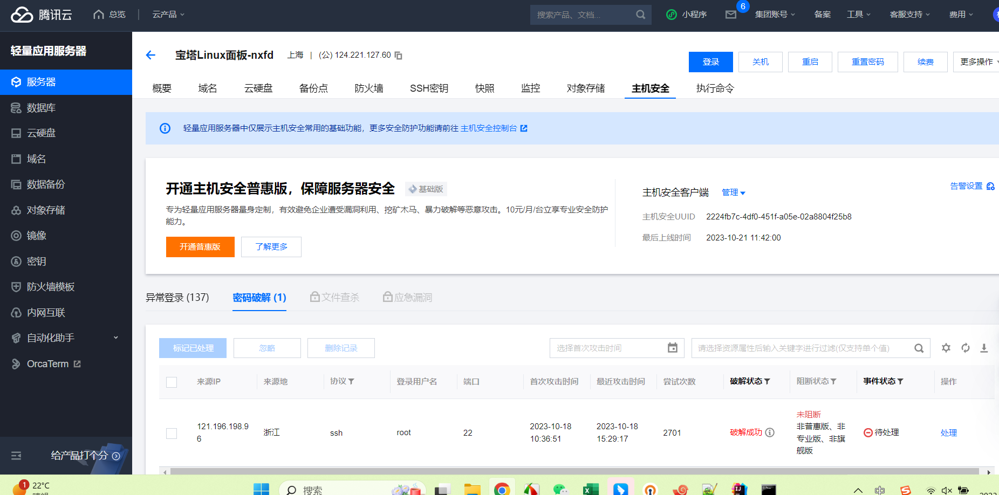
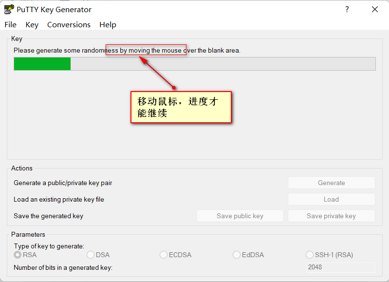
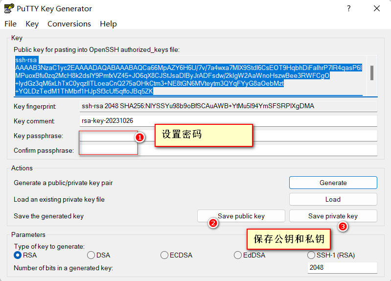
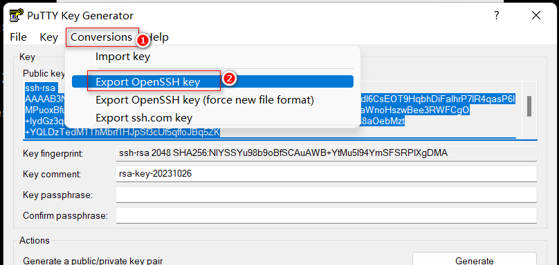
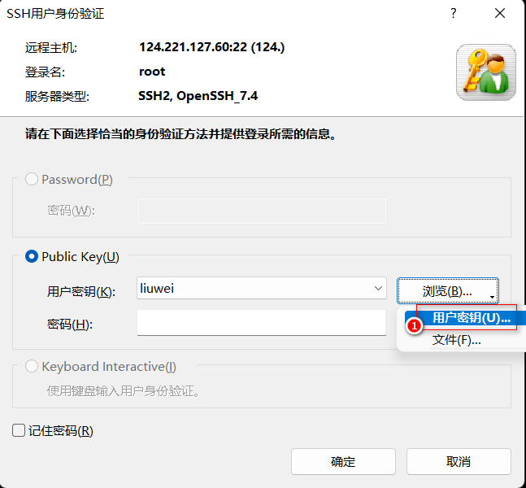
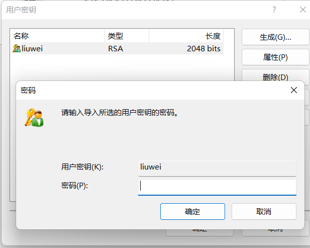

## 服务器备案

[whois查询](https://whois.aliyun.com/?spm=5176.wh51mylove.10.4.184e1d41iNYxTG)

2017年来到杭州，开始从事互联网开发工作。对服务器域名很感兴趣，就在阿里云上花了6元买了一个域名**51mylove.top**寓意是希望在杭州找到我的最爱的人。真正购买以后才知道，如果想使用这个域名，需要进行备案。随即做了备案

 
2022年1月6日，结婚已经找到了最爱。个人的网页分享别人。这个域名不太好了，又买一个以我的命名的域名 

 

!> 【华为云】恭喜您！您的网站备案已经通过省管局审核。备案通过后的注意事项请登录备案系统或邮箱进行查看。如需咨询欢迎拨打4000-955-988或950808 转5。
温馨提示：网站备案通过后，工信部备案官网（https://beian.miit.gov.cn）公示的查询结果是唯一权威证明，没有线下通知或者文件寄送，请不要签收号称网站备案的快递，请您知晓。
域名：liuwei.store

备案成功信息

## 服务设置登录方式

我第一台服务器，是在2014年时候购买的，总感觉从云运营上那里购买的服务器是安全的。从没有遇到过攻击问题。破解服务器的问题

但是，就在2023年10月12日出现第一次被攻击。很快密码就被破解了，服务器被植入病毒，占用大量的内存。开始并没有什么感觉。只是发觉启动服务后，服务器卡死。内存占用量非常大。只能无奈的选择重启。重启后，再次启动服务依然是服务器卡死，经过几次后，我发觉服务器有问题，`top `命令查询服务器，无法找到占用大量内存的应用。无奈下重装系统

一周后（10月18日），服务器又一次被攻击。服务器密码被攻破，这一次，我意识到了密码是不安全的，必须要采用其他的方式进行登录

## 安装过程

[腾讯云](https://cloud.tencent.com/document/product/1207/44578)有介绍

下载`puttygen.exe`服务。打开后点击`Generate`

设置密码，保存公钥和私钥

导出xshell 使用的openSsh key

### 使用xshell 登录

- 创建一个链接，和以前一样，不介绍

- 选择用户秘钥

使用上面生成的一个openssh

按照要求输入密码就可以了

