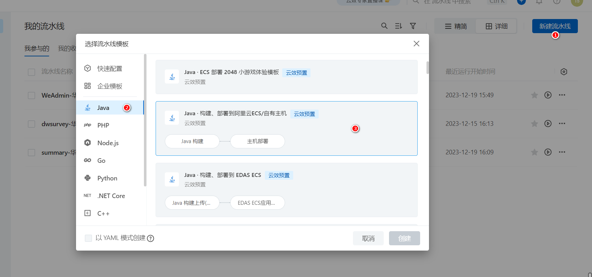
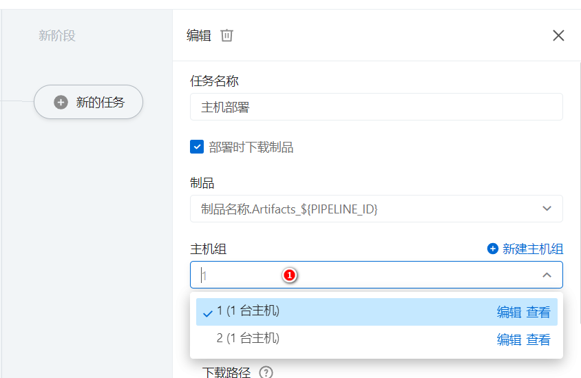

## 云效

### 介绍

2023年9月入职了四川文渊阁科技有限公司，在公司里只做了一个月，虽说这个公司恶心排行榜。可以名列前茅，但是公司确实出现过高人，确实存在可取的地方

推荐使用[云效](https://www.aliyun.com/product/yunxiao?channel=yy_sem_key_yunxiao&utm_content=se_1009966124)集成代码，文档，流水线，，，等功能


## 流水线的使用

新建一个流水线



- 选择代码，指定打包的命令（默认就可以了）


- 选择自己的服务器

  

  新增一个服务器也比较容易，这里不介绍

  

- 1.选择服务器上传文件的路径
- root使用的权限
- 表示执行的命令

```shell
tar -zxvf /usr/local/summary/app/package.tgz -C /usr/local/summary/app
rm -f /usr/local/summary/app/package.tgz
sh /usr/local/summary/bin/stop.sh
rm -f /usr/local/summary/summary-0.0.1-SNAPSHOT.jar
mv /usr/local/summary/app/summary-0.0.1-SNAPSHOT.jar /usr/local/summary
sh /usr/local/summary/bin/start.sh
echo start time is :$(date "+%Y-%m-%d %H:%M:%S") >> /usr/local/summary/log.txt
```

这里我运行的命令还是比较多

解压，删除上传的包，停止，删除老的包，复制包，启动包命令你，记录日志

- start.sh

```shell
cd /usr/local/summary
nohup /usr/java/jdk1.8.0_91/bin/java -agentlib:jdwp=transport=dt_socket,server=y,suspend=n,address=5005  -Dspring.profiles.active=pro -jar /usr/local/sum
mary/summary-0.0.1-SNAPSHOT.jar >/dev/null 2>&1 &
```

- stop.sh

```shell
PID=$(ps -ef | grep summary-0.0.1-SNAPSHOT.jar  | grep -v grep | awk '{ print $2 }')
if [ -z "$PID" ]
then
    echo Application is already stopped
else
    echo kill $PID
    kill $PID
fi
```

这里使用强制杀死

`echo start time is :$(date "+%Y-%m-%d %H:%M:%S") >> /usr/local/summary/log.txt`

指定位置记录日志