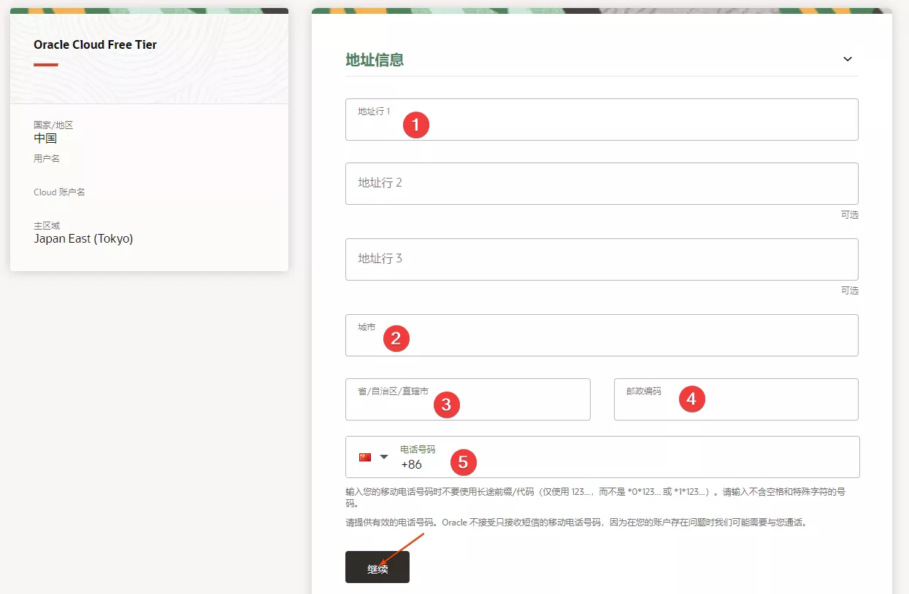

## 白嫖甲骨文服务器

白嫖成功


但是白嫖的过程很不容易，想搞一台四核24G的arm服务器，但是无法开通成功。也就搞台单核的服务器也就先玩着

服务器的效果


## 注册过程

注册过程，很多人说是玄学。也差不多，注册好久没有卡通成功。经过很多次失败，才注册成功


2.输入注册信息及电子邮件并验证。


3.进入邮箱验证。


4.填写地址/手机号及相关信息，我这边填写个人真实信息。



5.设置密码及 Cloud 账户名，选择账户类型并选择主区域。【主区域一旦选择，后期无法变更。】。


6.添加付款验证方式。


7.点击Credit Card。


8.根据自身情况选择 Visa 或 MasterCard，此处我选择招行 Visa 全币卡。输入卡号信息、有效期月份/年份及安全码。


9.验证成功。


10.勾选协议并点击开始我的免费试用


## 创建vps

5.左上角点击计算-实例配置。


6.创建实例配置。


7.可用性示免费。域显

8.根据需求选择镜像。


9.创建新虚拟云网络。

备注：这个位置卡了我好几天，原因是没有创建一个新的，配置完成后，无法访问


10.保存 SSH 私有秘钥并点击创建。


## 甲骨文 [VPS](https://www.manwuji.com/tag/vps/) 无法 SSH 连接及 Ping 通

1.在服务器实例中，点击子网进入。


12.点击安全列表。


13.入站规则删除所有并添加入站规则：源 0.0.0.0/0，协议选择所有协议。


## 保活

- 先运行保活脚本，防止被回收了

可以配合保活脚本【**[开源脚本](https://github.com/spiritLHLS/Oracle-server-keep-alive-script)**】：
```
bash <(wget -qO- --no-check-certificate https://gitlab.com/spiritysdx/Oracle-server-keep-alive-script/-/raw/main/oalive.sh)
```

资料来源：[甲骨文云服务器 (Oracle Cloud) 终极防封、防回收的教程](https://www.freedidi.com/10167.html#google_vignette)


打开top命令看到，上面一直在运行