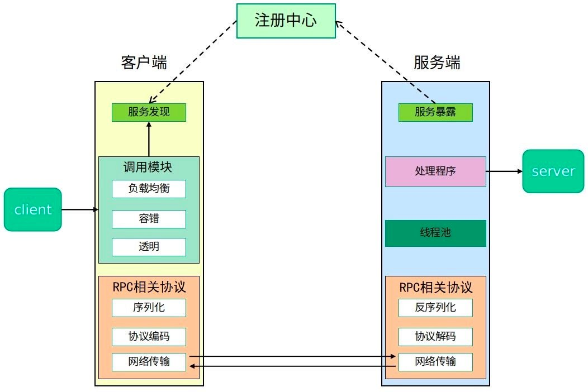
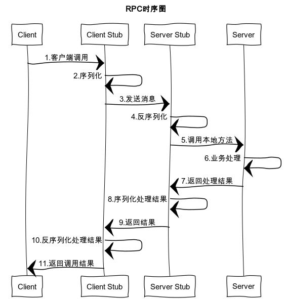

资料来源： 

[RPC 框架 Dubbo 从理解到使用](https://mrhelloworld.com/dubbo/#%E6%8A%80%E6%9C%AF%E6%9E%B6%E6%9E%84%E6%BC%94%E5%8F%98)

## 微服务架构

学习 Dubbo 之前我们有必要先来了解一下互联网技术架构的演变过程及通信方式，方便我们搞清楚为什么需要使用基于 RPC 思想的系列框架。

### 单一应用架构

特点：

> - 所有的功能集成在一个项目工程中；
> - 所有的功能打一个 war 包部署到服务器；
> - 应用与数据库分开部署；
> - 通过部署应用集群和数据库集群来提高系统的性

优点：

> - **开发简单**：一个 IDE 就可以快速构建单体应用；
> - **便于共享**：单个归档文件包含所有功能，便于在团队之间以及不同的部署阶段之间共享；
> - **易于测试**：单体应用一旦部署，所有的服务或特性就都可以使用了，这简化了测试过程，因为没有额外的依赖，每项测试都可以在部署完成后立刻开始；
> - **容易部署**：整个项目就一个 war 包，Tomcat 安装好之后，应用扔上去就行了。群化部署也很容易，多个 Tomcat + 一个 Nginx 分分钟搞定。

 缺点：

> - **妨碍持续交付**：随着时间的推移，单体应用可能会变得比较大，构建和部署时间也相应地延长，不利于频繁部署，阻碍持续交付。在移动应用开发中，这个问题会显得尤为严重；
> - **不够灵活**：随着项目的逐渐变大，整个开发流程的时间也会变得很长，即使在仅仅更改了一行代码的情况下，软件开发人员需要花费几十分钟甚至超过一个小时的时间对所有代码进行编译，并接下来花费大量的时间重新部署刚刚生成的产品，以验证自己的更改是否正确。如果多个开发人员共同开发一个应用程序，那么还要等待其他开发人员完成了各自的开发。这降低了团队的灵活性和功能交付频率；
> - **受技术栈限制**：项目变得越来越大的同时，我们的应用所使用的技术也会变得越来越多。这些技术有些是不兼容的，就比如在一个项目中大范围地混合使用 C++ 和 Java 几乎是不可能的事情。在这种情况下，我们就需要抛弃对某些不兼容技术的使用，而选择一种不是那么适合的技术来实现特定的功能。
> - **可靠性差**：某个环节出现了死循环，导致内存溢出，会影响整个项目挂掉。
> - **伸缩性差**：系统的扩容只能针对应用进行扩容，不能做到对某个功能进行扩容，扩容后必然带来资源浪费的问题。
> - **技术债务**：假设我的代码库中有一个混乱的模块结构。此时，我需要添加一个新功能。如果这个模块结构清晰，可能我只需要2天时间就可以添加好这个功能，但是如今这个模块的结构很混乱，所以我需要4天时间。多出来的这两天就是债务利息。随着时间推移、人员变动，技术债务必然也会随之增多。

### 垂直应用架构

　当访问量逐渐增大，单一应用增加机器带来的加速度越来越小，将应用拆成互不相干的几个应用，以提升效率。

  特点

> - 以单体结构规模的项目为单位进行垂直划分，就是将一个大项目拆分成一个一个单体结构项目。
> - 项目与项目之间存在数据冗余，耦合性较大，比如上图中三个项目都存在用户信息。
> - 项目之间的接口多为数据同步功能，如：数据库之间的数据库，通过网络接口进行数据库同步。

 优点

> - 开发成本低，架构简单；
> - 避免单体应用的无限扩大；
> - 系统拆分实现了流量分担，解决了并发问题；
> - 可以针对不同系统进行扩容、优化；
> - 方便水平扩展，负载均衡，容错率提高；
> - 不同的项目可采用不同的技术；
> - 系统间相互独立。

 缺点

> - 系统之间相互调用，如果某个系统的端口或者 IP 地址发生改变，调用系统需要手动变更；
> - 垂直架构中相同逻辑代码需要不断的复制，不能复用。
> - 系统性能扩展只能通过扩展集群结点，成本高、有瓶颈。

###  SOA 面向服务架构

当垂直应用越来越多，应用之间交互不可避免，将核心业务抽取出来，作为独立的服务，逐渐形成稳定的服务中心。当服务越来越多，容量的评估，小服务资源的浪费等问题逐渐显现，此时需增加一个调度中心基于访问压力实时管理集群容量，提高集群利用率。

?> P.S. 从软件设计的角度上来说，ESB 是一个抽象的间接层，提取了服务调用过程中调用与被调用动态交互中的一些共同的东西，减轻了服务调用者的负担。Java 编程思想里提到：“所有的软件设计的问题都可以通过增加一个抽象的间接层而得到解决或者得到简化！”简单来说 ESB 就是一根管道，用来连接各个服务节点。为了集成不同系统，不同协议的服务，ESB 做了消息的转化解释和路由工作，让不同的服务互联互通。

 特点

> - 基于 SOA 的架构思想将重复公用的功能抽取为组件，以服务的形式给各系统提供服务。
> - 各项目（系统）与服务之间采用 WebService、RPC 等方式进行通信。
> - 使用 ESB 企业服务总线作为项目与服务之间通信的桥梁。

优点

> - 将重复的功能抽取为服务，提高开发效率，提高系统的可重用性、可维护性。
> - 可以针对不同服务的特点制定集群及优化方案；
> - 采用 ESB 减少系统中的接口耦合。

缺点

> - 系统与服务的界限模糊，不利于开发及维护。
> - 虽然使用了 ESB，但是服务的接口协议不固定，种类繁多，不利于系统维护。
> - 抽取的服务的粒度过大，系统与服务之间耦合性高。
> - 涉及多种中间件，对开发人员技术栈要求高。
> - 服务关系复杂，运维、测试部署困难

###   微服务架构

  特点

> - 将系统服务层完全独立出来，并将服务层抽取为一个一个的微服务。
> - 微服务中每一个服务都对应唯一的业务能力，遵循单一原则。
> - 微服务之间采用 RESTful 等轻量协议传输。

优点

> - 团队独立：每个服务都是一个独立的开发团队，这个小团队可以是 2 到 5 人的开发人员组成；
> - 技术独立：采用去中心化思想，服务之间采用 RESTful 等轻量协议通信，使用什么技术什么语言开发，别人无需干涉；
> - 前后端分离：采用前后端分离开发，提供统一 Rest 接口，后端不用再为 PC、移动端开发不同接口；
> - 数据库分离：每个微服务都有自己的存储能力，可以有自己的数据库。也可以有统一数据库；
> - 服务拆分粒度更细，有利于资源重复利用，提高开发效率；
> - 一个团队的新成员能够更快投入生产；
> - 微服务易于被一个开发人员理解，修改和维护，这样小团队能够更关注自己的工作成果。无需通过合作才能体现价值；
> - 可以更加精准的制定每个服务的优化方案（比如扩展），提高系统可维护性；
> - 适用于互联网时代，产品迭代周期更短。

 缺点

> - 微服务过多，服务治理成本高，不利于系统维护；
> - 分布式系统开发的技术成本高（网络问题、容错问题、调用关系、分布式事务等），对团队挑战大；
> - 微服务将原来的函数式调用改为服务调用，不管是用 rpc，还是 http rest 方式，都会增大系统整体延迟。这个是再所难免的，这个就需要我们将原来的串行编程改为并发编程甚至异步编程，增加了技术门槛；
> - 多服务运维难度，随着服务的增加，运维的压力也在增大；
> - 测试的难度提升。服务和服务之间通过接口来交互，当接口有改变的时候，对所有的调用方都是有影响的，这时自动化测试就显得非常重要了，如果要靠人工一个个接口去测试，那工作量就太大了，所以 API 文档的管理尤为重要

## 通讯方式

随着互联网的发展，应用程序从单机走向分布式，通信方式也产生了很多的变化。

### TCP/UDP

都是传输协议，主要区别是 TCP 协议连接需要 3 次握手，断开需要四次挥手，是通过流来传输的，就是确定连接后，一直发送信息，传完后断开。UDP 不需要进行连接，直接把信息封装成多个报文，直接发送。所以 UDP 的速度更快，但是不保证数据的完整性。

?> 一句话总结：最古老且最有效，永不过时，学习成本高。所有通信方式归根结底都是 TCP/UDP。

### WebService

WebService（SOA，SOAP，WSDL，UDDI，XML）技术， 能使得运行在不同机器上的不同应用无须借助附加的、专门的第三方软件或硬件， 就可相互交换数据或集成。依据 WebService 规范实施的应用之间， 无论它们所使用的语言、 平台或内部协议是什么， 都可以相互交换数据。

　　WebService 就是一种跨编程语言和跨操作系统平台的远程调用技术。WebService 交互的过程就是遵循 SOAP 协议通过 XML 封装数据，然后由 Http 协议来传输数据。

?> 一句话总结：基于 HTTP + XML 的标准化 Web API。

### RESTful

Representational State Transfer，表现层状态转移。互联网通信协议 HTTP 协议，是一个无状态协议。这意味着，所有的状态都保存在服务器端。因此，如果客户端想要操作服务器，必须通过某种手段，让服务器端发生"状态转化”（State Transfer）。而这种转化是建立在表现层之上的，所以就是"表现层状态转移”。

　　客户端用到的手段，只能是 HTTP 协议。具体来说，就是 HTTP 协议里面，四个表示操作方式的动词：GET、POST、PUT、DELETE。它们分别对应四种基本操作：GET 用来获取资源，POST 用来新建资源（也可以用于更新资源），PUT 用来更新资源，DELETE 用来删除资源。

- 无状态协议 HTTP，具备先天优势，扩展能力很强。例如需要安全加密时，有现成的成熟方案 HTTPS 可用。
- JSON 报文序列化，轻量简单，人与机器均可读，学习成本低，搜索引擎友好。
- 语言无关，各大热门语言都提供成熟的 Restful API 框架。

?> 一句话总结：基于 HTTP + JSON 的标准化 Web API。

### RMI

　Remote Method Invocation，远程方法调用。Java 中实现的分布式通信协议，它大大增强了 Java 开发分布式应用的能力。通过 RMI 技术，某一个本地的 JVM 可以调用存在于另外一个 JVM 中的对象方法，就好像它仅仅是在调用本地 JVM 中某个对象方法一

?>  一句话总结：基于 Java 语言的分布式通信协议。

### JMS

　　Java Message Service，Java 消息服务应用程序接口，是一个 Java 平台中关于面向消息中间件的 API，用于在两个应用程序之间，或分布式系统中发送消息，进行异步通信。绝大多数 MQ 都对 JMS 提供支持，如 RabbitMQ、ActiveMQ、Kafka、RocketMQ 以及 Redis 等。

?>  一句话总结：JavaEE 消息框架标准。

### RPC

Remont Proceduce Call，远程过程调用。它是一种通过网络从远程计算机程序上请求服务，而不需要了解底层网络技术的思想。RPC 只是一个概念，它不是一个协议也不是一个框架。

　　RPC 的具体实现可以使用 RMI 或 RESTful 等，但一般不用，因为 RMI 不能跨语言，RESTful 效率太低。

　　RPC 多用于服务器集群内部通信，因此常使用更加高效、短小精悍的传输模式以提高效率。RPC 框架有很多：Apache Thrift、Apache Dubbo、Google Grpc 等。

?>  一句话总结：解决分布式系统中，服务之间的调用问题。远程调用时，要能够像本地调用一样方便，让调用者感知不到远程调用的逻辑。

一个典型 RPC 框架使用场景中，包含了服务注册与发现(注册中心)、负载均衡、容错、网络传输、序列化等组件，其中“RPC 相关协议”就指明了程序如何进行网络传输和序列化。RPC 框架有很多：Apache Thrift、Apache Dubbo、Google Grpc 等。下图为完整的 RPC 框架架构图：

##  RPC 实现原理

### 介绍

一次完整的 RPC 调用流程包含了四个核心部分，分别是 `Client`，`Server`，`Client Stub` 以及 `Server Stub`，这个 Stub 大家可以理解为存根。分别说说这几个部分：

**客户端（Client）**：服务的调用方。

**服务端（Server）**：服务的提供方。

**客户端存根**：存放服务端的地址消息，再将客户端的请求参数打包成网络消息，然后通过网络远程发送给服务方。

**服务端存根**：接收客户端发送过来的消息，将消息解包，并调用本地的方法。

>1. 客户端（Client）以本地调用方式（即以接口的方式）调用服务；
>2. 客户端存根（Client Stub）接收到调用后，负责将方法、参数等组装成能够进行网络传输的消息体（将消息体对象序列化为二进制）；
>3. 客户端通过 Socket 将消息发送到服务端；
>4. 服务端存根（Server Stub）收到消息后进行解码（将消息对象反序列化）；
>5. 服务端存根（Server Stub）根据解码结果调用本地的服务；
>6. 本地服务进行业务逻辑处理；
>7. 本地服务将业务逻辑处理后的结果返回给服务端存根（Server Stub）；
>8. 服务端存根（Server Stub）将返回结果打包成消息（将结果消息对象序列化）；
>9. 服务端（Server）通过 Socket 将消息发送到客户端；
>10. 客户端存根（Client Stub）接收到结果消息，并进行解码（将结果消息反序列化）；
>11. 客户端（Client）得到最终结果。

?> RPC 的目标是要把 2、3、4、5、7、8、9、10 这些步骤都封装起来。

### 建立通信

　　解决通讯的问题，主要是通过在客户端和服务器之间建立 TCP 连接，远程过程调用的所有交换的数据都在这个连接里传输。连接可以是按需连接，调用结束后就断掉，也可以是长连接，多个远程过程调用共享同一个连接。

### 服务寻址

　　A 服务器上的应用怎么告诉底层的 RPC 框架，如何连接到 B 服务器（如主机或 IP 地址）以及特定的端口，方法的名称是什么，这样才能完成调用。比如基于 Web 服务协议栈的 RPC，就要提供一个 endpoint URI，或者是从 UDDI（一种目录服务，通过该目录服务进行服务注册与搜索）服务上查找。如果是 RMI 调用的话，还需要一个 RMI Registry 来注册服务的地址。

### 网络传输

#### 序列化

　　A 服务器上的应用发起远程过程调用时，方法的参数需要通过底层的网络协议如 TCP 传递到 B 服务器，由于网络协议是基于二进制的，内存中的参数的值要序列化成二进制的形式，也就是序列化（Serialize）或编组（marshal），通过寻址和传输将序列化的二进制发送给 B 服务器。

#### 反序列化

　　B 服务器收到请求后，需要对参数进行反序列化（序列化的逆操作），恢复为内存中的表达方式，然后再找到对应的方法（寻址的一部分）进行本地调用（一般是通过生成代理 Proxy 去调用，通常会有 JDK 动态代理、CGLIB 动态代理、Javassist 生成字节码技术等），之后得到调用的返回值。

### 服务调用

　　B 机器进行本地调用（通过代理 Proxy）之后得到了返回值，此时还需要再把返回值发送回 A 机器，同样也需要经过序列化操作，然后再经过网络传输将二进制数据发送回 A 机器，而当 A 机器接收到这些返回值之后，则再次进行反序列化操作，恢复为内存中的表达方式，最后再交给 A 机器上的应用进行相关处理（一般是业务逻辑处理操作）。

