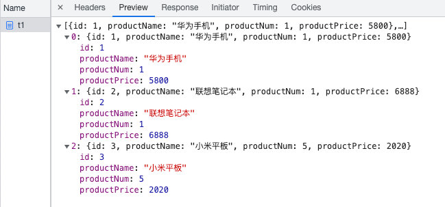

资料来源：<br/>
[dubbo @service注解 过时](https://blog.csdn.net/m0_67393686/article/details/123876691)<br/>
[SpringBoot集成Dubbo实践](https://www.cnblogs.com/linlf03/p/12837062.html)<br/>
[dubbo-spring-boot-starter【github】](https://github.com/alibaba/dubbo-spring-boot-starter )<br/>


## dubbo

Apache Dubbo 是一款高性能、轻量级的开源服务框架

Apache Dubbo |ˈdʌbəʊ| 提供了六大核心能力：面向接口代理的高性能RPC调用，智能容错和负载均衡，服务自动注册和发现，高度可扩展能力，运行期流量调度，可视化的服务治理与运维。


### dubbo 介绍


　官网：<http://dubbo.apache.org/zh-cn/>

　　Github：<https://github.com/apache/dubbo>

　　2018 年 2 月 15 日，阿里巴巴的服务治理框架 dubbo 通过投票，顺利成为 Apache 基金会孵化项目。

　　Apache Dubbo 是一款高性能、轻量级的开源 Java RPC 框架，它提供了三大核心能力：`面向接口的远程方法调用`，`智能容错和负载均衡`，以及`服务自动注册和发现`

### dubbo架构

　Dubbo 提供三个核心功能：`面向接口的远程方法调用`、`智能容错和负载均衡`，以及`服务自动注册和发现`。Dubbo 框架广泛的在阿里巴巴内部使用，以及当当、去哪儿、网易考拉、滴滴等都在使用。


### 节点说明

| 节点          | 角色说明                |
| ----------- | ------------------- |
| `Provider`  | 暴露服务的服务提供方          |
| `Consumer`  | 调用远程服务的服务消费方        |
| `Registry`  | 服务注册与发现的注册中心        |
| `Monitor`   | 统计服务的调用次数和调用时间的监控中心 |
| `Container` | 服务运行容器              |

### 调用关系

1. 服务容器负责启动，加载，运行服务提供者。
2. 服务提供者在启动时，向注册中心注册自己提供的服务。
3. 服务消费者在启动时，向注册中心订阅自己所需的服务。
4. 注册中心返回服务提供者地址列表给消费者，如果有变更，注册中心将基于长连接推送变更数据给消费者。
5. 服务消费者，从提供者地址列表中，基于软负载均衡算法，选一台提供者进行调用，如果调用失败，再选另一台调用。
6. 服务消费者和提供者，在内存中累计调用次数和调用时间，定时每分钟发送一次统计数据到监控中心。

## dubbo 入门案例（无注册中心版本）

　　下面我们基于 SpringBoot 环境整合 Dubbo 完成一个入门案例。

### 搭建开发环境


+ 整体架构<br/>

?> dubbo-common: 公共的依赖的接口，pojo<br/>
dubbo-provider:  服务提供者<br/>
dubbo-consumer： 服务消费者<br/>


### 父工程pom

```java
<?xml version="1.0" encoding="UTF-8"?>
<project xmlns="http://maven.apache.org/POM/4.0.0" xmlns:xsi="http://www.w3.org/2001/XMLSchema-instance"
       xsi:schemaLocation="http://maven.apache.org/POM/4.0.0 https://maven.apache.org/xsd/maven-4.0.0.xsd">
   <modelVersion>4.0.0</modelVersion>
   <packaging>pom</packaging>

   <modules>
      <module>dubbo-common</module>
      <module>dubbo-provider</module>
      <module>dubbo-consumer</module>
   </modules>
   <parent>
      <groupId>org.springframework.boot</groupId>
      <artifactId>spring-boot-starter-parent</artifactId>
      <version>2.3.0.RELEASE</version>
      <!-- <version>2.2.6.RELEASE</version> -->
      <relativePath/> <!-- lookup parent from repository -->
   </parent>

   <groupId>xyz.guqing</groupId>
   <artifactId>project</artifactId>
   <version>0.0.1-SNAPSHOT</version>
   <name>project</name>
   <description>Demo project for Spring Boot</description>


   <!-- 统计版本管理 -->
   <properties>
      <java.version>8</java.version>
      <mybatis-plus.version>3.3.1.tmp</mybatis-plus.version>
      <!-- Spring Cloud Hoxton.SR5 依赖 -->
      <spring-cloud.version>Hoxton.SR5</spring-cloud.version>
      <!-- spring cloud alibaba 依赖 -->
      <spring-cloud-alibaba.version>2.1.0.RELEASE</spring-cloud-alibaba.version>
      <project.version>0.0.1-SNAPSHOT</project.version>
   </properties>

   <!-- 项目依赖管理 父项目只是声明依赖，子项目需要写明需要的依赖(可以省略版本信息) -->
   <dependencyManagement>
      <dependencies>
         <!-- Dubbo Spring Boot Starter -->
         <dependency>
            <groupId>org.apache.dubbo</groupId>
            <artifactId>dubbo-spring-boot-starter</artifactId>
            <version>3.0.7</version>
         </dependency>

         <!--fastjson -->
         <dependency>
            <groupId>com.alibaba</groupId>
            <artifactId>fastjson</artifactId>
            <version>1.1.41</version>
         </dependency>

         <!-- 工具类 -->
         <dependency>
            <groupId>cn.hutool</groupId>
            <artifactId>hutool-all</artifactId>
            <version>5.0.5</version>
         </dependency>
      </dependencies>
   </dependencyManagement>

</project>
```


### common 子工程

**pom**

```java
<?xml version="1.0" encoding="UTF-8"?>
<project xmlns="http://maven.apache.org/POM/4.0.0"
         xmlns:xsi="http://www.w3.org/2001/XMLSchema-instance"
         xsi:schemaLocation="http://maven.apache.org/POM/4.0.0 http://maven.apache.org/xsd/maven-4.0.0.xsd">
    <parent>
        <artifactId>project</artifactId>
        <groupId>xyz.guqing</groupId>
        <version>0.0.1-SNAPSHOT</version>
    </parent>
    <modelVersion>4.0.0</modelVersion>

    <artifactId>dubbo-common</artifactId>

    <dependencies>
        <!--lombok -->
        <dependency>
            <groupId>org.projectlombok</groupId>
            <artifactId>lombok</artifactId>
            <scope>provided</scope>
        </dependency>

        <dependency>
            <groupId>ch.qos.logback</groupId>
            <artifactId>logback-classic</artifactId>
        </dependency>

        <!--fastjson -->
        <dependency>
            <groupId>com.alibaba</groupId>
            <artifactId>fastjson</artifactId>
        </dependency>

        <!--工具类文档地址： https://hutool.cn/docs/#/ -->
        <dependency>
            <groupId>cn.hutool</groupId>
            <artifactId>hutool-all</artifactId>
        </dependency>

        <!--常用工具类 -->
        <dependency>
            <groupId>org.apache.commons</groupId>
            <artifactId>commons-lang3</artifactId>
        </dependency>

        <dependency>
            <groupId>junit</groupId>
            <artifactId>junit</artifactId>
            <scope>test</scope>
        </dependency>
    </dependencies>

</project>
```

**pojo**

```java
@Data
@NoArgsConstructor
@AllArgsConstructor
public class Product implements Serializable {

    private Integer id;
    private String productName;
    private Integer productNum;
    private Double productPrice;

}
```

**接口**

```java
/**
 * 商品服务
 */
public interface ProductService {

    /**
     * 查询商品列表
     *
     * @return
     */
    List<Product> selectProductList();

}
```

### provider 子工程

**pom**

```
<?xml version="1.0" encoding="UTF-8"?>
<project xmlns="http://maven.apache.org/POM/4.0.0"
         xmlns:xsi="http://www.w3.org/2001/XMLSchema-instance"
         xsi:schemaLocation="http://maven.apache.org/POM/4.0.0 http://maven.apache.org/xsd/maven-4.0.0.xsd">
    <parent>
        <artifactId>project</artifactId>
        <groupId>xyz.guqing</groupId>
        <version>0.0.1-SNAPSHOT</version>
    </parent>
    <modelVersion>4.0.0</modelVersion>

    <artifactId>dubbo-provider</artifactId>

    <dependencies>
        <!-- 公共模块  -->
        <dependency>
            <groupId>xyz.guqing</groupId>
            <artifactId>dubbo-common</artifactId>
            <version>${project.version}</version>
        </dependency>

        <dependency>
            <groupId>org.apache.dubbo</groupId>
            <artifactId>dubbo-spring-boot-starter</artifactId>
        </dependency>

        <!-- spring boot web 依赖 -->
        <dependency>
            <groupId>org.springframework.boot</groupId>
            <artifactId>spring-boot-starter-web</artifactId>
        </dependency>

        <!-- spring boot test 依赖 -->
        <dependency>
            <groupId>org.springframework.boot</groupId>
            <artifactId>spring-boot-starter-test</artifactId>
            <scope>test</scope>
            <exclusions>
                <exclusion>
                    <groupId>org.junit.vintage</groupId>
                    <artifactId>junit-vintage-engine</artifactId>
                </exclusion>
            </exclusions>
        </dependency>
    </dependencies>

    <!-- 打包配置 -->
    <build>
        <plugins>
            <plugin>
                <groupId>org.springframework.boot</groupId>
                <artifactId>spring-boot-maven-plugin</artifactId>
            </plugin>
        </plugins>
    </build>
</project>
```

**配置文件applicaiton.yml**

```java
server:
  port: 9090 # 端口


spring:
  application:
    name: dubbo-provider # 应用名称

dubbo:
  registry:
    address: N/A
  protocol:
    port: 12345
    name: dubbo
  scan:
    base-packages: xyz.guqing.dubbo.service
```

**启动类**

```java
import org.springframework.boot.SpringApplication;
import org.springframework.boot.autoconfigure.SpringBootApplication;

@SpringBootApplication
// @EnableDubbo(scanBasePackages = "xyz.guqing.dubbo.service")
public class DubboProviderApplication {

    public static void main(String[] args) {
        SpringApplication.run(DubboProviderApplication.class, args);
    }
}
```

@EnableDubbo注解，扫描需要暴露的服务，如果配置文件中已声明则无需添加该注解

配置文件中，已经有了，所以不需要配置

**接口实现类**

```java
import java.util.Arrays;
import java.util.List;

@Slf4j
@DubboService(version = "1.0.0")
public class ProductServiceImpl implements ProductService{

    @Override
    public List<Product> selectProductList() {
        log.info("商品服务查询商品信息...");
        return Arrays.asList(
                new Product(1, "华为手机", 1, 5800D),
                new Product(2, "联想笔记本", 1, 6888D),
                new Product(3, "小米平板", 5, 2020D)
        );
    }
}
```

在dubbo 2.7.8中注解<br/>
@Service被@DubboService 取代。<br/>
@Reference被@DubboReference取代。<br/>
估计是dubbo的开发团队考虑到，原来的注解和spring的原生注解重名了，为了在语言层面和spring的原生注解，有所以区别减少出错概率。<br/>

+ 注解常用的参数

~~~~java
/**
 * 用户管理服务
 * 		timeout 调用该服务的超时时间
 * 		version 为版本号
 * 		group 为分组
 * 	    interface、group、version 三者可确定一个服务
 * 	    parameters = {"unicast", "false"}
 * 	        建议服务提供者和服务消费者在不同机器上运行，
 * 	        如果在同一机器上，需设置 unicast = false 禁用单播订阅，只有 multicast 注册中心有此问题。
 */
@DubboService(timeout = 5000, version = "1.0", group = "user-provider", parameters = {"unicast", "false"})
~~~~

注意：`parameters = {"unicast", "false"}`：建议服务提供者和服务消费者在不同机器上运行，如果在同一机器上，需设置 unicast = false 禁用单播订阅，只有 multicast 注册中心有此问题。

### consumer子工程

**pom**

```java
<?xml version="1.0" encoding="UTF-8"?>
<project xmlns="http://maven.apache.org/POM/4.0.0"
         xmlns:xsi="http://www.w3.org/2001/XMLSchema-instance"
         xsi:schemaLocation="http://maven.apache.org/POM/4.0.0 http://maven.apache.org/xsd/maven-4.0.0.xsd">
    <parent>
        <artifactId>project</artifactId>
        <groupId>xyz.guqing</groupId>
        <version>0.0.1-SNAPSHOT</version>
    </parent>
    <modelVersion>4.0.0</modelVersion>

    <artifactId>dubbo-consumer</artifactId>

    <dependencies>
        <!-- 公共模块  -->
        <dependency>
            <groupId>xyz.guqing</groupId>
            <artifactId>dubbo-common</artifactId>
            <version>${project.version}</version>
        </dependency>

        <dependency>
            <groupId>org.apache.dubbo</groupId>
            <artifactId>dubbo-spring-boot-starter</artifactId>
        </dependency>

        <!-- spring boot web 依赖 -->
        <dependency>
            <groupId>org.springframework.boot</groupId>
            <artifactId>spring-boot-starter-web</artifactId>
        </dependency>

        <!--lombok -->
        <dependency>
            <groupId>org.projectlombok</groupId>
            <artifactId>lombok</artifactId>
            <scope>provided</scope>
        </dependency>

        <!-- spring boot test 依赖 -->
        <dependency>
            <groupId>org.springframework.boot</groupId>
            <artifactId>spring-boot-starter-test</artifactId>
            <scope>test</scope>
            <exclusions>
                <exclusion>
                    <groupId>org.junit.vintage</groupId>
                    <artifactId>junit-vintage-engine</artifactId>
                </exclusion>
            </exclusions>
        </dependency>
    </dependencies>

    <!-- 打包配置 -->
    <build>
        <plugins>
            <plugin>
                <groupId>org.springframework.boot</groupId>
                <artifactId>spring-boot-maven-plugin</artifactId>
            </plugin>
        </plugins>
    </build>

</project>
```

**配置文件applicaiton.yml**

```java
server:
  port: 9091 # 端口

spring:
  application:
    name: dubbo-consumer # 应用名称
```

**controller调用者**

```java
import org.apache.dubbo.config.annotation.DubboReference;
import org.springframework.web.bind.annotation.GetMapping;
import org.springframework.web.bind.annotation.RestController;
import xyz.guqing.dubbo.pojo.Product;
import xyz.guqing.dubbo.service.ProductService;

import java.util.List;

@RestController
public class MyController {

    @DubboReference(version = "1.0.0", url = "dubbo://127.0.0.1:12345")
    private ProductService productService;

    @GetMapping("/t1")
    public List<Product> getList() {
        List<Product> products = productService.selectProductList();
        products.forEach(System.out::println);
        return products;
    }

}
```

**启动类**

```java
import org.springframework.boot.SpringApplication;
import org.springframework.boot.autoconfigure.SpringBootApplication;

@SpringBootApplication
public class ConsumerApplication {

    public static void main(String[] args) {
        SpringApplication.run(ConsumerApplication.class, args);
    }
}
```

### 测试

先启动provide再启动consumer

访问：`http://127.0.0.1:9091/t1` 



### dubbo 常用的标签

- `dubbo:application`：应用程序名称

- `dubbo:registry`：连接注册中心信息（配置注册中心）

- `dubbo:protocol`：服务提供者注册服务采用的协议
  - Dubbo 协议，默认
  - RMI 协议
  - Hessian 协议
  - HTTP 协议
  - WebService 协议
  - Thrift 协议
  - Memcached 协议
  - Redis 协议
  - Rest 协议（RESTful）
  - Grpc 协议
  - 更多协议信息请参考：<http://dubbo.apache.org/zh-cn/docs/user/references/protocol/introduction.html>

- `dubbo:service`：声明需要暴露的服务接口

- `dubbo:reference`：配置订阅的服务（生成远程服务代理）