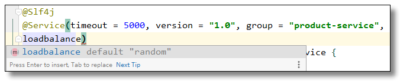
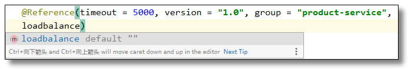

资料来源：<br/>
[rpc框架dubbo从原理到使用](https://mrhelloworld.com/dubbo/#dubbo-%E5%BF%AB%E9%80%9F%E5%85%A5%E9%97%A8)<br/>

[Dubbo整合Nacos](https://blog.csdn.net/weixin_40990818/article/details/107901417)

## 注册中心

　注册中心我们已经学习了不少，例如：ZooKeeper、Eureka、Consul、Nacos 等等，注册中心可以更高效的管理系统的服务：比如服务接口的发布、自动剔除无效的服务、自动恢复服务等。

　　Dubbo 支持五种注册中心：Multicast、Nacos(推荐)、ZooKeeper(推荐) 、Redis、Simple。本文重点介绍前两个，更多注册中心的信息请参考：http://dubbo.apache.org/zh-cn/docs/user/references/registry/introduction.html

## ZooKeeper

　　Apache ZooKeeper 是一个开放源码的分布式应用程序协调组件，是 Hadoop 和 Hbase 的重要组件。它是一个为分布式应用提供一致性服务的软件，提供的功能包括：配置维护、域名服务、分布式同步、组服务等。适合作为 Dubbo 服务的注册中心，工业强度较高，可用于生产环境，推荐使用。

　　在微服务项目开发中 ZooKeeper 主要的角色是当做服务注册中心存在，我们将编写好的服务注册至 ZooKeeper 即可。


流程说明：

- 服务提供者启动时: 向 `/dubbo/com.foo.BarService/providers` 目录下写入自己的 URL 地址。
- 服务消费者启动时: 订阅 `/dubbo/com.foo.BarService/providers` 目录下的提供者 URL 地址。并向 `/dubbo/com.foo.BarService/consumers` 目录下写入自己的 URL 地址。
- 监控中心启动时: 订阅 `/dubbo/com.foo.BarService` 目录下的所有提供者和消费者 URL 地址。


　　支持以下功能：

- 当提供者出现断电等异常停机时，注册中心能自动删除提供者信息；
- 当注册中心重启时，能自动恢复注册数据，以及订阅请求；
- 当会话过期时，能自动恢复注册数据，以及订阅请求；
- 当设置 `<dubbo:registry check="false" />` 时，记录失败注册和订阅请求，后台定时重试；
- 可通过 `<dubbo:registry username="admin" password="1234" />` 设置 zookeeper 登录信息；
- 可通过 `<dubbo:registry group="dubbo" />` 设置 zookeeper 的根节点，不配置将使用默认的根节点；
- 支持 `*` 号通配符 `<dubbo:reference group="*" version="*" />`，可订阅服务的所有分组和所有版本的提供者。

　当您将 ZooKeeper 整合到您的 Dubbo 工程之前，请确保后台已经启动 ZooKeeper 服务。

### 依赖的jar包

　　在 provider 和 consumer 中增加 zookeeper 客户端 jar 包依赖：

~~~~xml
<dependency>
    <groupId>org.apache.zookeeper</groupId>
    <artifactId>zookeeper</artifactId>
    <version>3.6.1</version>
</dependency>

<dependency>
    <groupId>org.apache.curator</groupId>
    <artifactId>curator-framework</artifactId>
    <version>5.1.0</version>
</dependency>
~~~~

> Dubbo 支持 zkclient 和 curator 两种 Zookeeper 客户端实现：
>
> **注意：**<br/>
> **1.在 2.7.x 的版本中已经移除了 zkclient 的实现，如果要使用 zkclient 客户端，需要自行拓展。**<br/>
> **2. 单独添加 zookeeper 和 curator 依赖需要注意版本之间是否有冲突，较为麻烦。**

所以，一劳永逸的办法就是添加 Apache Dubbo 给定的一个已关联好的依赖：
~~~~xml
<dependency>
    <groupId>org.apache.dubbo</groupId>
    <artifactId>dubbo-dependencies-zookeeper</artifactId>
    <version>${dubbo.version}</version>
    <type>pom</type>
</dependency>
~~~~
!> zookeeper和dubbo版本号一致，否则会报版本冲突问题

### 配置

**ZooKeeper 单机配置**

~~~~xml
<dubbo:registry address="zookeeper://191.168.10.101:2181" />
~~~~

或者

```xml
<dubbo:registry protocol="zookeeper" address="191.168.10.101:2181" />
```

或者

```properties
dubbo.register.address=zookeeper://192.168.10.101:2181
```

或者

~~~properties
dubbo.register.protocol=zookeeper
dubbo.register.address=192.168.10.101:2181
~~~

**集群的配置**

~~~xml
<dubbo:registry address="zookeeper://191.168.10.101:2181?backup=191.168.10.102:2181,191.168.10.103:2181" />
~~~

或者

~~~xml
<dubbo:registry protocol="zookeeper" address="191.168.10.101:2181,191.168.10.102:2181,191.168.10.103:2181" />
~~~

或者

~~~~properties
dubbo.register.address=zookeeper://192.168.10.101:2181?backup=192.168.10.102:2181,192.168.10.103:2181
~~~~

或者

~~~~properties
dubbo.register.protocol=zookeeper
dubbo.register.address=192.168.10.101:2181,192.168.10.102:2181,192.168.10.103:2181
~~~~

### 父工程pom

```Xml
<?xml version="1.0" encoding="UTF-8"?>
<project xmlns="http://maven.apache.org/POM/4.0.0" xmlns:xsi="http://www.w3.org/2001/XMLSchema-instance"
       xsi:schemaLocation="http://maven.apache.org/POM/4.0.0 https://maven.apache.org/xsd/maven-4.0.0.xsd">
   <modelVersion>4.0.0</modelVersion>
   <packaging>pom</packaging>

   <modules>
      <module>dubbo-common</module>
      <module>dubbo-provider</module>
      <module>dubbo-consumer</module>
   </modules>
   <parent>
      <groupId>org.springframework.boot</groupId>
      <artifactId>spring-boot-starter-parent</artifactId>
      <version>2.3.0.RELEASE</version>
      <!-- <version>2.2.6.RELEASE</version> -->
      <relativePath/> <!-- lookup parent from repository -->
   </parent>

   <groupId>xyz.guqing</groupId>
   <artifactId>project</artifactId>
   <version>0.0.1-SNAPSHOT</version>
   <name>project</name>
   <description>Demo project for Spring Boot</description>


   <!-- 统计版本管理 -->
   <properties>
      <java.version>8</java.version>
      <mybatis-plus.version>3.3.1.tmp</mybatis-plus.version>
      <!-- Spring Cloud Hoxton.SR5 依赖 -->
      <spring-cloud.version>Hoxton.SR5</spring-cloud.version>
      <!-- spring cloud alibaba 依赖 -->
      <spring-cloud-alibaba.version>2.1.0.RELEASE</spring-cloud-alibaba.version>
      <project.version>0.0.1-SNAPSHOT</project.version>
      <dubbo.version>3.0.7</dubbo.version>
   </properties>

   <!-- 项目依赖管理 父项目只是声明依赖，子项目需要写明需要的依赖(可以省略版本信息) -->
   <dependencyManagement>
      <dependencies>
         <!-- Dubbo Spring Boot Starter -->
         <dependency>
            <groupId>org.apache.dubbo</groupId>
            <artifactId>dubbo-spring-boot-starter</artifactId>
            <version>${dubbo.version}</version>
         </dependency>

         <!--fastjson -->
         <dependency>
            <groupId>com.alibaba</groupId>
            <artifactId>fastjson</artifactId>
            <version>1.1.41</version>
         </dependency>

         <!-- 工具类 -->
         <dependency>
            <groupId>cn.hutool</groupId>
            <artifactId>hutool-all</artifactId>
            <version>5.0.5</version>
         </dependency>

         <!-- zookeeper start -->
         <dependency>
            <groupId>org.apache.dubbo</groupId>
            <artifactId>dubbo-dependencies-zookeeper</artifactId>
            <version>${dubbo.version}</version>
            <type>pom</type>
         </dependency>
         <!-- zookeeper end -->

      </dependencies>
   </dependencyManagement>
</project>
```

和无注册中心版本相比增加了

```Xml
<!-- zookeeper start -->
<dependency>
   <groupId>org.apache.dubbo</groupId>
   <artifactId>dubbo-dependencies-zookeeper</artifactId>
   <version>${dubbo.version}</version>
   <type>pom</type>
</dependency>
<!-- zookeeper end -->
```

### provider 子工程

增加了zookeeper依赖

```Xml
<!-- zookeeper start -->
<dependency>
    <groupId>org.apache.dubbo</groupId>
    <artifactId>dubbo-dependencies-zookeeper</artifactId>
    <type>pom</type>
</dependency>
<!-- zookeeper end -->
```

**配置文件applicaiton.yml**

```Java
server:
  port: 9091 # 端口

spring:
  application:
    name: dubbo-consumer # 应用名称

dubbo:
  registry:
    address: zookeeper://121.36.8.180:2181

# 版本信息，放到配置中
project:
  version: 1.0.0
```

修改点：增加了`dubbo.registry.address`的配置

### consumer子工程

依赖的jar包和provide相同

**配置文件applicaiton.yml**

```Java
server:
  port: 9091 # 端口


spring:
  application:
    name: dubbo-consumer # 应用名称

dubbo:
  registry:
    #address: N/A
    address: zookeeper://121.36.8.180:2181

# 版本信息，放到配置中
project:
  version: 1.0.0
```

修改点：`dubbo.registry.address`地址

**controller调用者**

```java
import org.apache.dubbo.config.annotation.DubboReference;
import org.springframework.web.bind.annotation.GetMapping;
import org.springframework.web.bind.annotation.RestController;
import xyz.guqing.dubbo.pojo.Product;
import xyz.guqing.dubbo.service.ProductService;

import java.util.List;

@RestController
public class MyController {

//    @DubboReference(version = "1.0.0", url = "dubbo://127.0.0.1:12345")
    @DubboReference(version = "${project.version}")
    private ProductService productService;

    @GetMapping("/t1")
    public List<Product> getList() {
        List<Product> products = productService.selectProductList();
        products.forEach(System.out::println);
        return products;
    }

}
```

修改点：`@DubboReference`注解不需要，不需要指定url地址

!> 到此，zookeeper 版本的配置修改完成，启动测试

[代码地址](https://gitee.com/L10052108/springboot_project/tree/dubbo-zookeeper/)

## nacos 

Nacos 是 Alibaba 公司推出的开源工具，用于实现分布式系统的服务发现与配置管理。Nacos 是 Dubbo 生态系统中重要的注册中心实现，其中 dubbo-registry-nacos 则是 Dubbo 融合 Nacos 注册中心的实现，推荐使用。

　　Nacos 官网：https://nacos.io/zh-cn/

　　Github：https://github.com/alibaba/nacos

**准备工作**

当您将 Nacos 整合到您的 Dubbo 工程之前，请确保后台已经[启动 Nacos 服务](springCloud/springCloudAlibaba/nacos/nacos安装.md)。

### 依赖的jar包


```Xml
<!-- zookeeper 依赖 -->
<!-- zookeeper start -->
<dependency>
    <groupId>org.apache.dubbo</groupId>
    <artifactId>dubbo-dependencies-zookeeper</artifactId>
    <type>pom</type>
</dependency>
<!-- zookeeper end -->

<dependency>
    <groupId>com.alibaba.nacos</groupId>
    <artifactId>nacos-client</artifactId>
</dependency>
<dependency>
    <groupId>org.apache.dubbo</groupId>
    <artifactId>dubbo-registry-nacos</artifactId>
</dependency>
```

- `nacos-client`：Nacos 提供的 Java 客户端，一般需要显式指定版本，推荐使用和 nacos-server 配套的客户端版本，以确保没有兼容性问题

- `dubbo-registry-nacos`：注册到nacos


!> 还是需要引入 zookeeper 的依赖的jar包。如果不引用总是会报错


测试很多种办法都无法实现引入jar包后，可以正常运行

### 配置

服务提供者和服务消费者只需要调整 `address` 属性配置即可。

　**单机配置：**

~~~~xml
<!-- 使用 Nacos 注册中心，单机版 -->
<dubbo:registry address="nacos://127.0.0.1:8848"/>
<!-- 或 -->
<dubbo:registry protocol="nacos" address="127.0.0.1:2181"/>
~~~~

或者

~~~~properties
dubbo.register.address=nacos://192.168.10.101:8848
~~~~

或者

```properties
dubbo.register.protocol=nacos
dubbo.register.address=192.168.10.101:8848
```

　　**集群配置：**

~~~~xml
<!-- 使用 Nacos 注册中心，集群版 -->
<dubbo:registry address="nacos://192.168.10.101:8848?backup=192.168.10.102:8848,192.168.10.103:8848"/>
<!-- 或 -->
<dubbo:registry protocol="nacos" address="192.168.10.101:8848,192.168.10.102:8848,192.168.10.103:8848"/>
~~~~

或：
```properties
dubbo.register.address=nacos://192.168.10.101:8848
```
或：
```properties
dubbo.register.protocol=nacos
dubbo.register.address=192.168.10.101:8848,192.168.10.102:8848,192.168.10.103:8848
```
**本地的配置**

### 父工程pom

```Xml
<?xml version="1.0" encoding="UTF-8"?>
<project xmlns="http://maven.apache.org/POM/4.0.0" xmlns:xsi="http://www.w3.org/2001/XMLSchema-instance"
       xsi:schemaLocation="http://maven.apache.org/POM/4.0.0 https://maven.apache.org/xsd/maven-4.0.0.xsd">
   <modelVersion>4.0.0</modelVersion>
   <packaging>pom</packaging>

   <modules>
      <module>dubbo-common</module>
      <module>dubbo-provider</module>
      <module>dubbo-consumer</module>
   </modules>
   <parent>
      <groupId>org.springframework.boot</groupId>
      <artifactId>spring-boot-starter-parent</artifactId>
      <version>2.3.0.RELEASE</version>
      <!-- <version>2.2.6.RELEASE</version> -->
      <relativePath/> <!-- lookup parent from repository -->
   </parent>

   <groupId>xyz.guqing</groupId>
   <artifactId>project</artifactId>
   <version>0.0.1-SNAPSHOT</version>
   <name>project</name>
   <description>Demo project for Spring Boot</description>


   <!-- 统计版本管理 -->
   <properties>
      <java.version>8</java.version>
      <mybatis-plus.version>3.3.1.tmp</mybatis-plus.version>
      <!-- Spring Cloud Hoxton.SR5 依赖 -->
      <spring-cloud.version>Hoxton.SR5</spring-cloud.version>
      <!-- spring cloud alibaba 依赖 -->
      <spring-cloud-alibaba.version>2.1.0.RELEASE</spring-cloud-alibaba.version>
      <project.version>0.0.1-SNAPSHOT</project.version>
      <dubbo.version>3.0.7</dubbo.version>
      <nacos-client.version>2.1.0</nacos-client.version>
   </properties>

   <!-- 项目依赖管理 父项目只是声明依赖，子项目需要写明需要的依赖(可以省略版本信息) -->
   <dependencyManagement>
      <dependencies>
         <!-- Dubbo Spring Boot Starter -->
         <dependency>
            <groupId>org.apache.dubbo</groupId>
            <artifactId>dubbo-spring-boot-starter</artifactId>
            <version>${dubbo.version}</version>
         </dependency>

         <!--fastjson -->
         <dependency>
            <groupId>com.alibaba</groupId>
            <artifactId>fastjson</artifactId>
            <version>1.1.41</version>
         </dependency>

         <!-- 工具类 -->
         <dependency>
            <groupId>cn.hutool</groupId>
            <artifactId>hutool-all</artifactId>
            <version>5.0.5</version>
         </dependency>

         <!-- zookeeper start -->
         <dependency>
            <groupId>org.apache.dubbo</groupId>
            <artifactId>dubbo-dependencies-zookeeper</artifactId>
            <version>${dubbo.version}</version>
            <type>pom</type>
         </dependency>
         <dependency>
            <groupId>com.alibaba.nacos</groupId>
            <artifactId>nacos-client</artifactId>
            <version>${nacos-client.version}</version>
         </dependency>
         <dependency>
            <groupId>org.apache.dubbo</groupId>
            <artifactId>dubbo-registry-nacos</artifactId>
            <version>${dubbo.version}</version>
         </dependency>
         <!-- zookeeper end -->

      </dependencies>
   </dependencyManagement>
</project>
```

和`zookeeper`版本相比增加了

```Xml
<dependency>
   <groupId>com.alibaba.nacos</groupId>
   <artifactId>nacos-client</artifactId>
   <version>${nacos-client.version}</version>
</dependency>
<dependency>
   <groupId>org.apache.dubbo</groupId>
   <artifactId>dubbo-registry-nacos</artifactId>
   <version>${dubbo.version}</version>
</dependency>
```

!> nacos-client:版本信息和nacos服务端一致

### provider 子工程

**依赖的jar包（略）**

**配置文件applicaiton.yml**

```Java
server:
  port: 9090 # 端口


spring:
  application:
    name: dubbo-provider # 应用名称

dubbo:
  registry:
#    address: N/A
    address: nacos://121.36.8.180:8848
  protocol:
    port: 12345
    name: dubbo
    # 版本信息，放到配置中
  service:
    version: 1.0.0
  scan:
    base-packages: xyz.guqing.dubbo.service
```

> 修改了dubbo.registry.addr地址修改成nacos

**启动服务**


### consumer子工程

依赖的jar包和provide相同

**配置文件applicaiton.yml**

```Java
server:
  port: 9091 # 端口


spring:
  application:
    name: dubbo-consumer # 应用名称

dubbo:
  registry:
    #address: N/A
    address: nacos://121.36.8.180:8848
  # 版本信息，放到配置中
  service:
    version: 1.0.0
```

> 启动服务即可

## Multicast

　　Multicast 注册中心不需要启动任何中心节点，只要广播地址一样，就可以互相发现。


1. 提供方启动时广播自己的地址
2. 消费方启动时广播订阅请求
3. 提供方收到订阅请求时，单播自己的地址给订阅者，如果设置了 `unicast=false`，则广播给订阅者
4. 消费方收到提供方地址时，连接该地址进行 RPC 调用。

　　组播受网络结构限制，只适合小规模应用或开发阶段使用。组播地址段:` 224.0.0.0 - 239.255.255.255`

### 配置

~~~~xml
<dubbo:registry address="multicast://224.5.6.7:1234" />
~~~~

或者

~~~~xml
<dubbo:registry protocol="multicast" address="224.5.6.7:1234" />
~~~~

或者

~~~properties
dubbo.register.address=multicast://224.5.6.7:1234
~~~

为了减少广播量，Dubbo 缺省使用单播发送提供者地址信息给消费者，如果一个机器上同时启了多个消费者进程，消费者需声明 `unicast=false`，否则只会有一个消费者能收到消息。

　　当服务者和消费者运行在同一台机器上，消费者同样需要声明`unicast=false`，否则消费者无法收到消息，导致 No provider available for the service 异常。

~~~~xml
<dubbo:registry address="multicast://224.5.6.7:1234?unicast=false" />
~~~~

或者

~~~~xml
<dubbo:registry protocol="multicast" address="224.5.6.7:1234">
    <dubbo:parameter key="unicast" value="false" />
</dubbo:registry>
~~~~

### provider 子工程

**配置文件applicaiton.yml**

```yaml
server:
  port: 9090 # 端口


spring:
  application:
    name: dubbo-provider # 应用名称

dubbo:
  registry:
#    address: N/A
    address: multicast://224.5.6.7:1234?unicast=false
  protocol:
    port: 12345
    name: dubbo
    # 版本信息，放到配置中
  service:
    version: 1.0.0
  scan:
    base-packages: xyz.guqing.dubbo.service
```

修改了`dubbo.registry.address`的配置

如果

`dubbo.registry.address = multicast://224.5.6.7:1234 `

```Java
@DubboService(version = "${dubbo.service.version}" ,parameters = {"unicast", "false"})
```


为了减少广播量，Dubbo 缺省使用单播发送提供者地址信息给消费者，如果一个机器上同时启了多个消费者进程，消费者需声明 `unicast=false`，否则只会有一个消费者能收到消息。

　当服务者和消费者运行在同一台机器上，消费者同样需要声明`unicast=false`，否则消费者无法收到消息，导致 No provider available for the service 异常。

### consumer子工程

修改配置

```Yaml
server:
  port: 9091 # 端口


spring:
  application:
    name: dubbo-consumer # 应用名称

dubbo:
  registry:
    #address: N/A
    address: multicast://224.5.6.7:1234?unicast=false
  # 版本信息，放到配置中
  service:
    version: 1.0.0
```

启动服务运行，测试了

## 负载均衡策略

在集群负载均衡时，Dubbo 提供了多种均衡策略，缺省为 `random` 随机调用，也可以自行扩展负载均衡策略。

-  Random LoadBalance(**随机**)
-  RoundRobin LoadBalance(**轮询**)
-  LeastActive LoadBalance(**最少活跃调用数**)
-  ConsistentHash LoadBalance(**一致性 Hash**)


### 配置

### xml

服务端服务级别

~~~~xml
<dubbo:service interface="..." loadbalance="roundrobin" weight="100" />
~~~~

客户端服务级别

```Xml
<dubbo:service interface="..." loadbalance="roundrobin" weight="100" />
```

服务端方法级别

~~~~xml
<dubbo:service interface="..." weight="100">
    <dubbo:method name="..." loadbalance="roundrobin"/>
</dubbo:service>
~~~~

客户端方法级别

~~~~xml
<dubbo:reference interface="...">
    <dubbo:method name="..." loadbalance="roundrobin"/>
</dubbo:reference>
~~~~

### yaml

~~~~yaml
dubbo:
  provider:
    loadbalance: roundrobin
    weight: 100
  consumer:
    loadbalance: roundrobin
~~~~

### 注解

~~~~java
dubbo:
  provider:
    loadbalance: roundrobin
    weight: 100
  consumer:
    loadbalance: roundrobin

~~~~






### Random LoadBalance


- **随机**，按权重设置随机概率。
- 在一个截面上碰撞的概率高，但调用量越大分布越均匀，而且按概率使用权重后也比较均匀，有利于动态调整提供者权重。

### RoundRobin LoadBalance

- **轮询**，按公约后的权重设置轮询比率。
- 存在慢的提供者累积请求的问题，比如：第二台机器很慢，但没挂，当请求调到第二台时就卡在那，久而久之，所有请求都卡在调到第二台上。

### LeastActive LoadBalance


- **最少活跃调用数**，ping 值（延迟低）的调用，相同延迟的情况下随机。
- 使慢的提供者收到更少请求，因为越慢的提供者的调用前后计数差会越大。

### ConsistentHash LoadBalance

- **一致性 Hash**，相同参数的请求总是发到同一提供者。
- 当某一台提供者挂时，原本发往该提供者的请求，基于虚拟节点，平摊到其它提供者，不会引起剧烈变动。
- 算法参见：http://en.wikipedia.org/wiki/Consistent_hashing
- 缺省只对第一个参数 Hash，如果要修改，请配置 `<dubbo:parameter key="hash.arguments" value="0,1" />`
- 缺省用 160 份虚拟节点，如果要修改，请配置 `<dubbo:parameter key="hash.nodes" value="320" />`