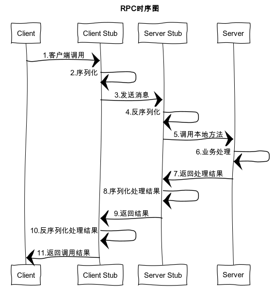

资料来源： 
[技术架构演变](https://mrhelloworld.com/dubbo/#%E6%8A%80%E6%9C%AF%E6%9E%B6%E6%9E%84%E6%BC%94%E5%8F%98)

## RPC
### 为什么需要 RPC？

主要就是因为在几个进程内（应用分布在不同的机器上），无法共用内存空间，比如不同的系统之间的通讯，甚至不同组织之间的通讯。此外由于机器的横向扩展，需要在多台机器组成的集群上部署应用等等。

　　比如现在有两台机器：A 机器和 B 机器，并且分别部署了应用 A 和应用 B。假设此时位于 A 机器上的 A 应用想要调用位于 B 机器上的 B 应用提供的函数或是方法，由于 A 应用和 B 应用不在一个内存空间里面，所以不能直接调用，此时就需要通过网络来表达调用的方式和传输调用的数据。也即所谓的远程调用。

### RPC 实现原理

　　一次完整的 RPC 调用流程包含了四个核心部分，分别是 `Client`，`Server`，`Client Stub` 以及 `Server Stub`，这个 Stub 大家可以理解为存根。分别说说这几个部分：

**客户端（Client）**：服务的调用方。

**服务端（Server）**：服务的提供方。

**客户端存根**：存放服务端的地址消息，再将客户端的请求参数打包成网络消息，然后通过网络远程发送给服务方。

**服务端存根**：接收客户端发送过来的消息，将消息解包，并调用本地的方法。

1. 客户端（Client）以本地调用方式（即以接口的方式）调用服务；
2. 客户端存根（Client Stub）接收到调用后，负责将方法、参数等组装成能够进行网络传输的消息体（将消息体对象序列化为二进制）；
3. 客户端通过 Socket 将消息发送到服务端；
4. 服务端存根（Server Stub）收到消息后进行解码（将消息对象反序列化）；
5. 服务端存根（Server Stub）根据解码结果调用本地的服务；
6. 本地服务进行业务逻辑处理；
7. 本地服务将业务逻辑处理后的结果返回给服务端存根（Server Stub）；
8. 服务端存根（Server Stub）将返回结果打包成消息（将结果消息对象序列化）；
9. 服务端（Server）通过 Socket 将消息发送到客户端；
10. 客户端存根（Client Stub）接收到结果消息，并进行解码（将结果消息反序列化）；
11. 客户端（Client）得到最终结果。

> RPC 的目标是要把 2、3、4、5、7、8、9、10 这些步骤都封装起来。

### 建立通信

解决通讯的问题，主要是通过在客户端和服务器之间建立 TCP 连接，远程过程调用的所有交换的数据都在这个连接里传输。连接可以是按需连接，调用结束后就断掉，也可以是长连接，多个远程过程调用共享同一个连接。

### 服务寻址

A 服务器上的应用怎么告诉底层的 RPC 框架，如何连接到 B 服务器（如主机或 IP 地址）以及特定的端口，方法的名称是什么，这样才能完成调用。比如基于 Web 服务协议栈的 RPC，就要提供一个 endpoint URI，或者是从 UDDI（一种目录服务，通过该目录服务进行服务注册与搜索）服务上查找。如果是 RMI 调用的话，还需要一个 RMI Registry 来注册服务的地址。

### 网络传输

#### 序列化

　　A 服务器上的应用发起远程过程调用时，方法的参数需要通过底层的网络协议如 TCP 传递到 B 服务器，由于网络协议是基于二进制的，内存中的参数的值要序列化成二进制的形式，也就是序列化（Serialize）或编组（marshal），通过寻址和传输将序列化的二进制发送给 B 服务器。

#### 反序列化

　　B 服务器收到请求后，需要对参数进行反序列化（序列化的逆操作），恢复为内存中的表达方式，然后再找到对应的方法（寻址的一部分）进行本地调用（一般是通过生成代理 Proxy 去调用，通常会有 JDK 动态代理、CGLIB 动态代理、Javassist 生成字节码技术等），之后得到调用的返回值。

#### 服务调用

　B 机器进行本地调用（通过代理 Proxy）之后得到了返回值，此时还需要再把返回值发送回 A 机器，同样也需要经过序列化操作，然后再经过网络传输将二进制数据发送回 A 机器，而当 A 机器接收到这些返回值之后，则再次进行反序列化操作，恢复为内存中的表达方式，最后再交给 A 机器上的应用进行相关处理（一般是业务逻辑处理操作）。