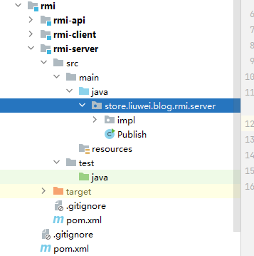
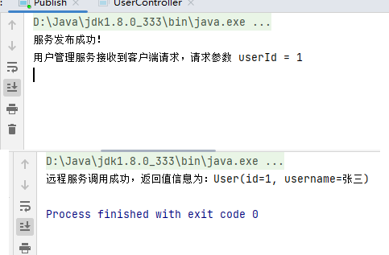

资料来源：<br/>
[RPC 框架 Dubbo 从理解到使用](https://mrhelloworld.com/dubbo/#%E6%8A%80%E6%9C%AF%E6%9E%B6%E6%9E%84%E6%BC%94%E5%8F%98)<br/>
[参考代码](https://gitee.com/L10052108/store/tree/master/rmi)

## rmi

### 项目结构

　　这个工程主要是存放 client 和 server 都会用到的公共接口。



### rmi-api

定义接口和实体列

实体类

　　由于网络协议是基于二进制的，内存中的参数的值要序列化成二进制的形式，所以实体类需要实现 `Serializable` 接口。

```java
import lombok.AllArgsConstructor;
import lombok.Data;
import lombok.NoArgsConstructor;

import java.io.Serializable;

@Data
@AllArgsConstructor
@NoArgsConstructor
public class User implements Serializable {

    private static final long serialVersionUID = 2159427410483687648L;
    private Integer id;
    private String username;

}
```

接口

```java
import store.liuwei.blog.rmi.pojo.User;

import java.rmi.Remote;
import java.rmi.RemoteException;

/**
 * 用户管理服务
 */
public interface UserService extends Remote {

    User selectUserById(Integer userId) throws RemoteException;

}
```

### 服务提供者

　　服务接口实现必须继承 `java.rmi.server.UnicastRemoteObject` 类。

```java
import store.liuwei.blog.rmi.pojo.User;
import store.liuwei.blog.rmi.server.UserService;

import java.rmi.RemoteException;
import java.rmi.server.UnicastRemoteObject;

public class UserServiceImpl extends UnicastRemoteObject implements UserService {

    public UserServiceImpl() throws RemoteException {
    }

    @Override
    public User selectUserById(Integer userId) throws RemoteException {
        System.out.println("用户管理服务接收到客户端请求，请求参数 userId = " + userId);
        // 模拟假数据返回
        return new User(userId, "张三");
    }

}
```

　　将服务发布在指定的 IP + 端口上。

```java
import java.net.MalformedURLException;
import java.rmi.AlreadyBoundException;
import java.rmi.Naming;
import java.rmi.RemoteException;
import java.rmi.registry.LocateRegistry;

/**
 * 发布服务
 */
public class Publish {

    public static void main(String[] args) throws RemoteException {
        UserService userService = new UserServiceImpl();
        try {
            // 对外暴露的服务端口
            LocateRegistry.createRegistry(8888);
            // 对外暴露的服务地址
            Naming.bind("rmi://localhost:8888/userService", userService);
            System.out.println("服务发布成功！");
        } catch (AlreadyBoundException e) {
            e.printStackTrace();
        } catch (MalformedURLException e) {
            e.printStackTrace();
        }
    }

}
```

### 服务消费者

```java
import store.liuwei.blog.rmi.pojo.User;
import store.liuwei.blog.rmi.server.UserService;

import java.net.MalformedURLException;
import java.rmi.Naming;
import java.rmi.NotBoundException;
import java.rmi.RemoteException;

public class UserController {

    public static void main(String[] args) {
        try {
            UserService userService = (UserService) Naming.lookup("rmi://localhost:8888/userService");
            User user = userService.selectUserById(1);
            System.out.println("远程服务调用成功，返回值信息为：" + user);
        } catch (NotBoundException e) {
            e.printStackTrace();
        } catch (MalformedURLException e) {
            e.printStackTrace();
        } catch (RemoteException e) {
            e.printStackTrace();
        }
    }

}
```

### 测试

　　通过测试可以看到 RPC 基于 RMI 的远程服务调用已经完成，接下来我们一起学习一下如何使用 RPC 框架 Dubbo 来完成远程服务调用。

