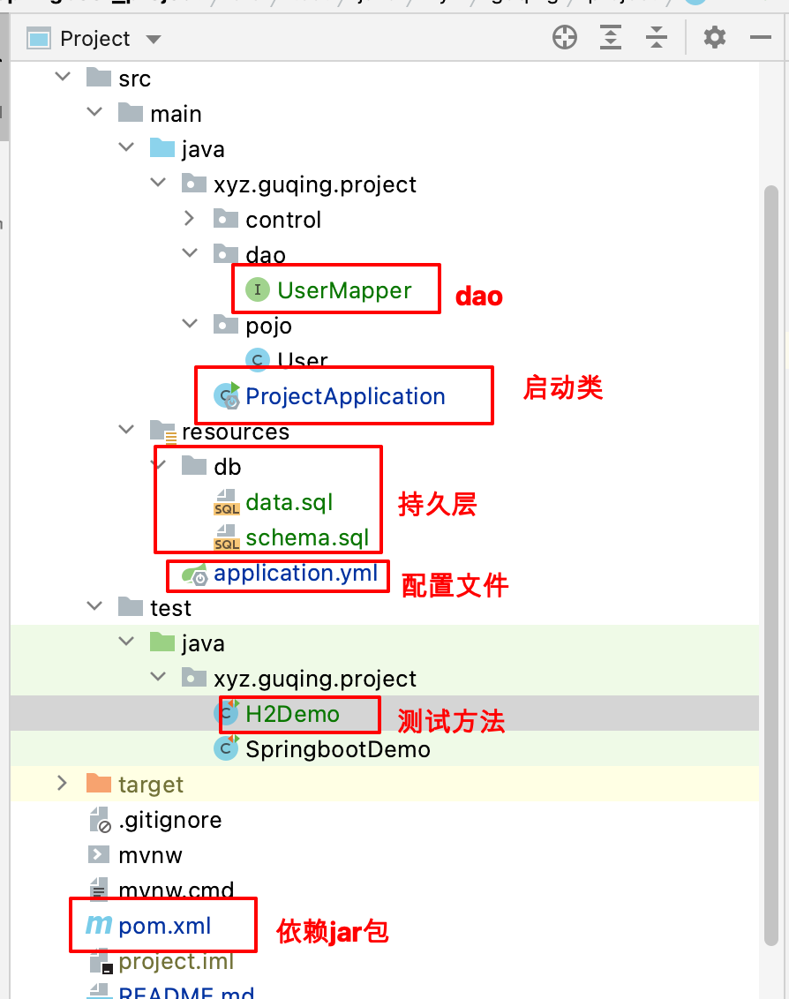

# H2项目介绍

资料来源：https://www.jianshu.com/p/81705f8c7da0 

[码云代码](https://gitee.com/L10052108/springboot_project.git)

##  项目的介绍

> H2是基于java的内存型的数据库，可以选择以内存模式或者文件形式存储，内存形式每次程序关闭数据库则销毁

文件目录结构



## 添加依赖的jar包

使用的springboot+ mybatis_puls

```
<!-- h2 依赖start-->
<dependency>
   <groupId>com.h2database</groupId>
   <artifactId>h2</artifactId>
</dependency>
<!-- h2依赖 end -->

<!-- mp 依赖start-->
<dependency>
   <groupId>com.baomidou</groupId>
   <artifactId>mybatis-plus-boot-starter</artifactId>
   <version>${mybatis-plus.version}</version>
</dependency>
<!-- mp 依赖 end -->
```

包括两个依赖，数据库h2和mybatis_plus持久层框架


配置applicatio.yml文件

```
# local环境jdbc配置
spring:
  datasource:
    platform: h2
    url: jdbc:h2:mem:spring-boot-dss
    username: root
    password: root
    driver-class-name: org.h2.Driver
    # 每次启动程序,都会执行该SQL脚本
    schema: classpath:db/schema.sql
    # 每次启动程序,都会执行该SQL脚本
    data: classpath:db/data.sql
    sql-script-encoding: utf-8

  h2:
    console:
      enabled: true
      path: /h2

# Logger Config
logging:
  level:
    xyz.guqing.project: debug
```

上面提到scheme和data两个配置文件

scheme是建表语句

```
-- ----------------------------
-- Table structure for sys_user
-- ----------------------------
DROP TABLE IF EXISTS user;
CREATE TABLE user
(
    id BIGINT(20) NOT NULL  COMMENT '主键ID',
    name VARCHAR(30) NULL DEFAULT NULL COMMENT '姓名',
    age INT(11) NULL DEFAULT NULL COMMENT '年龄',
    email VARCHAR(50) NULL DEFAULT NULL COMMENT '邮箱',
    PRIMARY KEY (id)
);
```

data是写入的数据

```
-- ----------------------------
-- Records of sys_user
-- ----------------------------
DELETE FROM user;
INSERT INTO user (id, name, age, email) VALUES
(1, 'Jone', 18, 'test1@baomidou.com'),
(2, 'Jack', 20, 'test2@baomidou.com'),
(3, 'Tom', 28, 'test3@baomidou.com'),
(4, 'Sandy', 21, 'test4@baomidou.com'),
(5, 'Billie', 24, 'test5@baomidou.com');
```

备注：后面都是按照mybatis_plus的相同

## 配置mybatis测试方法

启动类添加mapper扫描路径

```
@SpringBootApplication
@MapperScan(basePackages = {"xyz.guqing.project.dao"})
public class ProjectApplication {

   public static void main(String[] args) {
      SpringApplication.run(ProjectApplication.class, args);
   }

}
```

添加实体类

```
@Data
public class User {
    private Long id;
    private String name;
    private Integer age;
    private String email;
}
```

配置dao

```
public interface UserMapper extends BaseMapper<User> {

}
```

测试类

```
@RunWith(SpringRunner.class)
@SpringBootTest(classes = ProjectApplication.class,webEnvironment = SpringBootTest.WebEnvironment.RANDOM_PORT)
public class H2Demo {

    @Autowired
    private UserMapper userMapper;

    @Test
    public void test01(){
        User user = this.userMapper.selectById(1L);
        System.out.println(user);
    }
}
```


