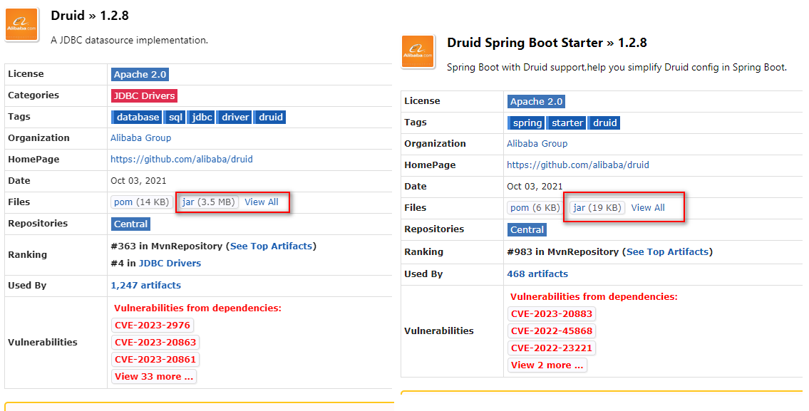
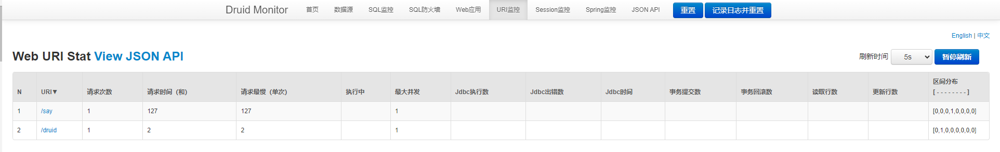
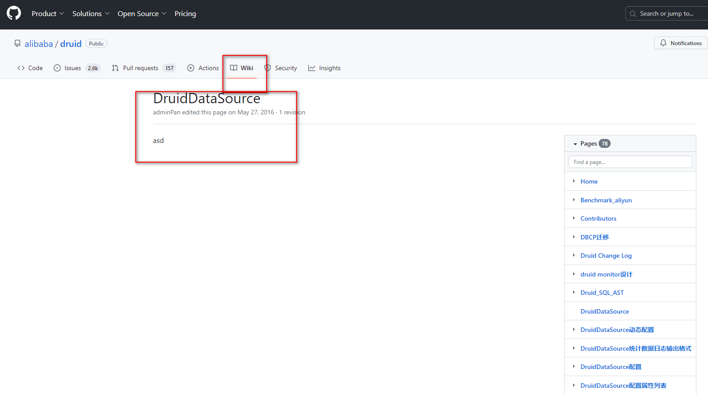

资料来源：
[Springboot 集成Druid](https://blog.csdn.net/m0_69057918/article/details/131169602)<br/>
[SpringBoot集成连接池 - 集成数据库Druid连接池](https://juejin.cn/post/6844903583129796621)<br/>
[Druid数据库连接池就这么简单](https://juejin.cn/post/6844903583129796621)


## 修改（h2）数据库

在这个项目[00_springboot集成mybatis_plus](数据库/mybatis_puls/00_springboot集成mybatis_plus.md)中，使用的是mysql数据库，修改成h2

把mysql 连接器换成h2的

```xml
   <!-- <dependency>
            <groupId>mysql</groupId>
            <artifactId>mysql-connector-java</artifactId>
        </dependency>-->
        <dependency>
            <groupId>com.h2database</groupId>
            <artifactId>h2</artifactId>
        </dependency>
        <!-- h2依赖 end -->
```

修改连接信息

```yaml
spring:
  datasource:
    platform: h2
    url: jdbc:h2:mem:spring-boot-dss
    username: root
    password: root
    driver-class-name: org.h2.Driver
    # 每次启动程序,都会执行该SQL脚本
    schema: classpath:db/schema.sql
    # 每次启动程序,都会执行该SQL脚本
    data: classpath:db/data.sql
    sql-script-encoding: utf-8

  h2:
    console:
      enabled: true
      path: /h2-console
      #  开启h2 console 跟踪，方便调试默认 false
      trace: true
      # 允许console 远程访问 默认false
      web-allow-others: true
```

需要用到两个文件


`data.sql`用来保存sql数据

```sql
INSERT INTO `user` VALUES ('1', 'zhangsan', 'e10adc3949ba59abbe56e057f20f883e', '13488888888', 'aa@a.cn', '2015-04-06 17:03:55', '2015-04-06 17:03:55');
INSERT INTO `user` VALUES ('2', 'lisi', '202cb962ac59075b964b07152d234b70', '12344444444', null, '2015-06-19 10:02:11', '2015-06-19 10:02:11');
INSERT INTO `user` VALUES ('3', 'tidy', '202cb962ac59075b964b07152d234b70', '13600112243', null, '2015-07-30 17:26:25', '2015-07-30 17:26:25');
INSERT INTO `user` VALUES ('4', 'niuniu', '202cb962ac59075b964b07152d234b70', '15866777744', '', '2015-08-01 11:48:42', '2015-08-01 11:48:42');
```

`schema.sql`用来保存建表语句的

```sql
DROP TABLE IF EXISTS `user`;
CREATE TABLE `user`
(
    `id`       bigint(20) NOT NULL ,
    `username` varchar(50) NOT NULL COMMENT '用户名',
    `password` varchar(32) NOT NULL COMMENT '密码，加密存储',
    `phone`    varchar(20) DEFAULT NULL COMMENT '注册手机号',
    `email`    varchar(50) DEFAULT NULL COMMENT '注册邮箱',
    `created`  datetime    NOT NULL,
    `updated`  datetime    NOT NULL,
    PRIMARY KEY (`id`)
) ;
```


## 集成druid
在项目[00_springboot集成mybatis_plus](数据库/mybatis_puls/00_springboot集成mybatis_plus.md)中使用的是HikariCP

```xml
<dependency>
    <groupId>com.alibaba</groupId>
    <artifactId>druid-spring-boot-starter</artifactId>
    <version>1.2.8</version>
</dependency>
```
有不少教程建议的依赖是

```xml
<dependency>
    <groupId>com.alibaba</groupId>
    <artifactId>druid</artifactId>
    <version>1.2.8</version>
</dependency>
```
其实Druid和Springboot官方已经提供了很好的集成，虽然二者都可以使用，但是druid-spring-boot-starter不需要编写配置类，简化了配置。 

在实际中测试，发现



一个是3.5M，另外一个仅仅才19K。文件大小差了差不多200倍

配置中发现大的可以正常使用

**springboot 配置**

```yaml

spring:
  datasource:
#    username: root
#    password: ws123D4dsd565@51
#    driver-class-name: com.mysql.cj.jdbc.Driver
#    url: jdbc:mysql://124.221.127.60:3306/store?useUnicode=true&characterEncoding=utf8&serverTimezone=Asia/Shanghai&useSSL=false
    type: com.alibaba.druid.pool.DruidDataSource
    # 数据源连接池配置
    druid:
      #   数据源其他配置
      initialSize: 5
      minIdle: 5
      maxActive: 20
      maxWait: 60000
      timeBetweenEvictionRunsMillis: 60000
      minEvictableIdleTimeMillis: 300000
      validationQuery: SELECT 1 FROM DUAL
      testWhileIdle: true
      testOnBorrow: false
      testOnReturn: false
      poolPreparedStatements: true
      maxPoolPreparedStatementPerConnectionSize: 20
      useGlobalDataSourceStat: true
      connectionProperties: druid.stat.mergeSql=true;druid.stat.logSlowSql=true;druid.stat.slowSqlMillis=1000;
      # 配置监控统计拦截的filters，去掉后监控界面sql无法统计，'wall'用于防火墙
      filters: stat,wall,slf4j

```

进行配合

```java

import com.alibaba.druid.support.http.StatViewServlet;
import com.alibaba.druid.support.http.WebStatFilter;
import org.springframework.boot.web.servlet.FilterRegistrationBean;
import org.springframework.boot.web.servlet.ServletRegistrationBean;
import org.springframework.context.annotation.Bean;
import org.springframework.context.annotation.Configuration;

/**
 * druid 配置.
 * <p>
 * 这样的方式不需要添加注解：@ServletComponentScan
 *
 * @author Administrator
 */
@Configuration
public class DruidConfiguration {

    /**
     * 注册一个StatViewServlet
     *
     * @return
     */
    @Bean
    public ServletRegistrationBean DruidStatViewServle2() {
        //org.springframework.boot.context.embedded.ServletRegistrationBean提供类的进行注册.
        ServletRegistrationBean servletRegistrationBean = new ServletRegistrationBean(new StatViewServlet(), "/druid/*");

        //添加初始化参数：initParams

        //白名单：
        servletRegistrationBean.addInitParameter("allow", "127.0.0.1");
        //IP黑名单 (存在共同时，deny优先于allow) : 如果满足deny的话提示:Sorry, you are not permitted to view this page.
        servletRegistrationBean.addInitParameter("deny", "192.168.1.73");
        //登录查看信息的账号密码.
        servletRegistrationBean.addInitParameter("loginUsername", "admin");
        servletRegistrationBean.addInitParameter("loginPassword", "123456");
        //是否能够重置数据.
        servletRegistrationBean.addInitParameter("resetEnable", "false");
        return servletRegistrationBean;
    }

    /**
     * 注册一个：filterRegistrationBean
     *
     * @return
     */
    @Bean
    public FilterRegistrationBean druidStatFilter2() {

        FilterRegistrationBean filterRegistrationBean = new FilterRegistrationBean(new WebStatFilter());

        //添加过滤规则.
        filterRegistrationBean.addUrlPatterns("/*");

        //添加不需要忽略的格式信息.
        filterRegistrationBean.addInitParameter("exclusions", "*.js,*.gif,*.jpg,*.png,*.css,*.ico,/druid/*");
        return filterRegistrationBean;
    }

}
```

启动项目

`http://127.0.0.1:8003/druid/index.html`可以看到监控页面



## 吐槽

https://github.com/alibaba/druid/wiki/DruidDataSource

阿里的文档做的太敷衍，开玩笑了

