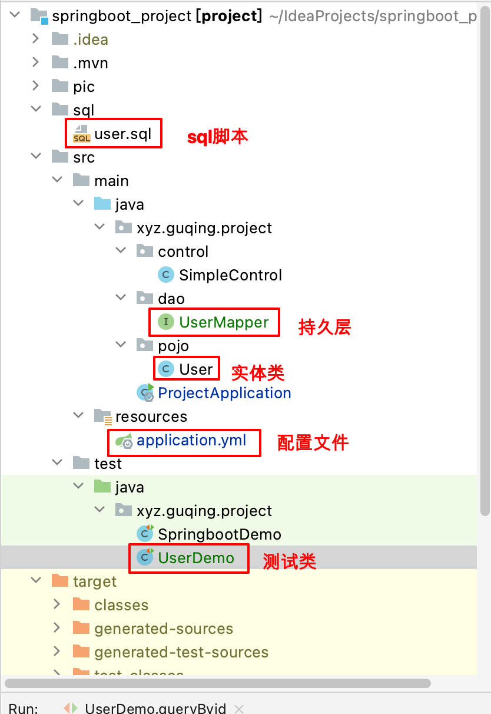

# springboot集成mybatis_plus

- [官方文档](https://baomidou.com/)

Mybatise_plus 项目的介绍(省，可以查看官方文档)


- 码云地址：https://gitee.com/L10052108/springboot_project/tree/mybatis%E2%80%94mysql/

[跳转到码云](https://gitee.com/L10052108/springboot_project/tree/mybatis%E2%80%94mysql/)

 ##  Spring Boot整合Mybatis Plus

### 配置spring环境
文件结构  <br/>


1.通过maven坐标引入依赖

~~~~
		<!-- mysql 依赖start-->
		<dependency>
			<groupId>mysql</groupId>
			<artifactId>mysql-connector-java</artifactId>
		</dependency>
		<!-- mysql 依赖 end -->

		<!-- mp 依赖start-->
		<dependency>
			<groupId>com.baomidou</groupId>
			<artifactId>mybatis-plus-boot-starter</artifactId>
			<version>${mybatis-plus.version}</version>
		</dependency>
		<!-- mp 依赖 end -->
~~~~

2.配置数据源和日志输出

~~~~
spring:
  datasource:
    driver-class-name: com.mysql.cj.jdbc.Driver
    url: jdbc:mysql://121.36.8.180:3306/demo01?useUnicode=true&characterEncoding=utf8&serverTimezone=Asia/Shanghai&useSSL=false
    username: root
    password: 123456
    hikari:
      minimum-idle: 10
      maximum-pool-size: 30
      auto-commit: true
      idle-timeout: 30000
      pool-name: HikariCP
      max-lifetime: 900000
      connection-timeout: 10000
      connection-test-query: SELECT 1


# 增加支持xml配置
mybatis-plus:
  mapper-locations: classpath*:/mapper/*Mapper.xml
# Logger Config
logging:
  level:
    xyz.guqing.project: debug
~~~~

3.配置Mybatis的Mapper类文件的包扫描路径

> 增加@MapperScan注解，以及指定的扫描包的路径

````
@SpringBootApplication
@MapperScan(basePackages = {"xyz.guqing.project.dao"})
public class ProjectApplication {

	public static void main(String[] args) {
		SpringApplication.run(ProjectApplication.class, args);
	}

}
````

### 配置测试对象

官网： `https://baomidou.com/`

官方文档地址： https://baomidou.com/pages/24112f/#%E7%89%B9%E6%80%A7 

数据库执行的sql

~~~~
-- 创建表
DROP TABLE IF EXISTS user;
CREATE TABLE user
(
    id BIGINT(20) NOT NULL  COMMENT '主键ID',
    name VARCHAR(30) NULL DEFAULT NULL COMMENT '姓名',
    age INT(11) NULL DEFAULT NULL COMMENT '年龄',
    email VARCHAR(50) NULL DEFAULT NULL COMMENT '邮箱',
    PRIMARY KEY (id)
);

-- 增加数据
DELETE FROM user;
INSERT INTO user (id, name, age, email) VALUES
(1, 'Jone', 18, 'test1@baomidou.com'),
(2, 'Jack', 20, 'test2@baomidou.com'),
(3, 'Tom', 28, 'test3@baomidou.com'),
(4, 'Sandy', 21, 'test4@baomidou.com'),
(5, 'Billie', 24, 'test5@baomidou.com');
~~~~

创建实体类

```
@Data
public class User {
    private Long id;
    private String name;
    private Integer age;
    private String email;
}
```

- 创建mapper文件

```
public interface UserMapper extends BaseMapper<User> {

}
```

### CRUD基础使用案例

#### 新增

> 注意，主键没有采用自动增长，新增的时候。数据库中不能已经存在

```
@RunWith(SpringRunner.class)
@SpringBootTest(classes = ProjectApplication.class, webEnvironment = SpringBootTest.WebEnvironment.RANDOM_PORT)
public class UserDemo {

    @Autowired
    private UserMapper userMapper;

    // 测试新增
    @Test
    public void testInsert() {
        User user = new User();
        user.setName("字母哥");
        user.setAge(18);

        // 主键ID注意修改
        user.setId(8L);
        int row = userMapper.insert(user);

        System.out.println("影响记录数：" + row);
        System.out.println("记录的id: " + user.getId());
    }
}
```

#### 查询

- 根据主键进行查询

```
// 通过主键进行查询
@Test
public void queryByid(){
    Long id = 1L;
    // 通过主键进行查询
    User user = this.userMapper.selectById(id);
    System.out.println(user);
    // 通过主键进行删除
    int i = this.userMapper.deleteById(id);
    System.out.println("通过主键成功删除" + i + "条记录");
}
```
- 通过多个id查询

```
@Test
public void query2() {
    List<Long> ids = Arrays.asList(
            1L,
            2L,
            3L
    );
    List<User> list = userMapper.selectBatchIds(ids);
    list.forEach(System.out::println);
}
```

- 通过字段进行查询

```
    @Test
    public void testquery3(){
        Map<String, Object> map = new HashMap<>();
//map的key指代的是mysql表中的列名，并非java实体的属性名
        map.put("name", "Jone");

        List<User> list = userMapper.selectByMap(map);
        list.forEach(System.out::println);
    }
```

- 通过条件进行查询

```
@Test
public void testquery4(){
    QueryWrapper<User> query = new QueryWrapper<>();
    query.select("name", "age")   //指定查询结果字段
            .in("age", Arrays.asList(18, 20, 21))
            .last("limit 1");
    List<User> list = userMapper.selectList(query);
    list.forEach(System.out::println);
}
```

执行的sql
>
>   SELECT name,age FROM user  WHERE (age IN (18,20,21))   LIMIT 1;

- 模糊查询

```java
@Test
public void testquery5(){
    QueryWrapper<User> query = new QueryWrapper<>();
    query.like("name", "J")    //like是MP的条件构造器，表示"模糊查询"
            .lt("age", 40)     //lt是MP的条件构造器，表示"小于"关系
            .select("name", "age");
    List<Map<String, Object>> maps = userMapper.selectMaps(query);
    maps.forEach(System.out::println);
}
```
执行的sql


> SELECT name,age  FROM user  WHERE (name LIKE '%J%' AND age < 40);

#### 删除

- 通过ID删除

```
@Test
public void delByid(){
    Long id = 1L;
    // 通过主键进行删除
    int i = this.userMapper.deleteById(id);
    System.out.println("通过主键成功删除" + i + "条记录");
}
```

#### 修改

- 通过ID更新（略）


- 通过条件修改

```
@Test
public void testUpdate(){
    UpdateWrapper<User> update = new UpdateWrapper<>();
    update.eq("name", "Jack").eq("age", 28);    //eq是MP的条件构造器，表示"等于"关系

    User user = new User();
    user.setAge(29);
    user.setEmail("hadoopcn2@163.com");
    int rows = userMapper.update(user, update);
    System.out.println("影响记录数：" + rows);
}
```

执行的sql
> UPDATE user SET age=29, email='hadoopcn2@163.com'  WHERE (name = 'Jack' AND age = 28);

#### 聚合函数


