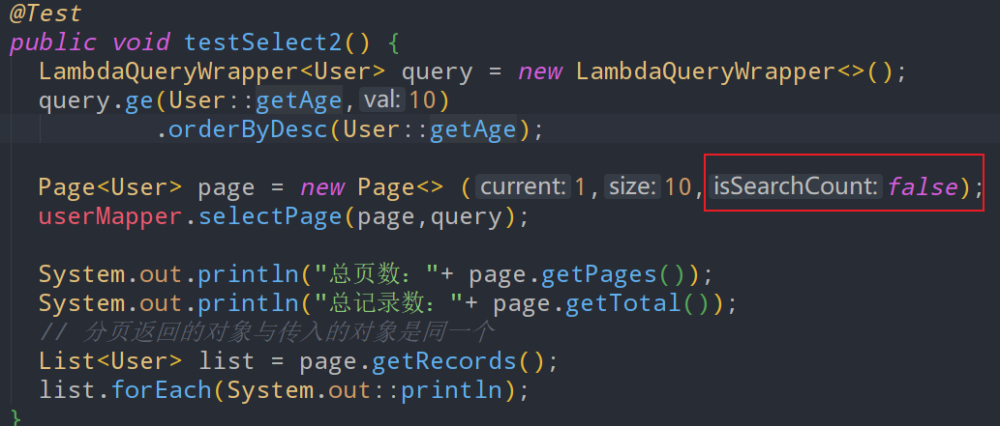

# 分页

本文为mybatis系列文档的第4篇，前三篇请访问上面的网址。

## 一、让Spring Boot-MybatisPlus支持分页

在已经集成了Mybatis Plus的Spring项目中加入如下分页拦截器的配置，让MybatisPlus支持分页

```
@Configuration
public class MybatisPlusConfiguration {
    //配置分页拦截器
    @Bean
    public PaginationInterceptor paginationInterceptor() {
        return new PaginationInterceptor();
    }
}

```

## 二、单表查询分页-表格分页

```
@Test
public void testSelect() {
  LambdaQueryWrapper<User> query = new LambdaQueryWrapper<>();
  query.ge(User::getAge,10)      //查询条件：年龄大于10
       .orderByDesc(User::getAge);   //按照年龄的倒序排序

  Page<User> page = new Page<> (1,10);   //查询第1页，每页10条数据
  userMapper.selectPage(page,query);   //page分页信息，query查询条件

  System.out.println("总页数："+ page.getPages());
  System.out.println("总记录数："+ page.getTotal());

  // 分页返回的对象与传入的对象是同一个
  List<User> list = page.getRecords();
  list.forEach(System.out::println);
}

```

查询输出结果如下：

```
总页数：1
总记录数：6
User(id=3, name=Tom, age=28, email=test3@baomidou.com)
User(id=5, name=Billie, age=24, email=test5@baomidou.com)
User(id=4, name=Sandy, age=21, email=test4@baomidou.com)
User(id=2, name=Jack, age=20, email=test2@baomidou.com)
User(id=1, name=Jone, age=18, email=test1@baomidou.com)
User(id=1280261858003038209, name=字母哥, age=18, email=null)

```

在分页查询过程中，一共执行了两条SQL

```
# 第一条SQL用于查询在query条件下的总条数
SELECT COUNT(1) FROM user WHERE age >= ? 

# 第二条SQL用于查询具体的数据
SELECT id,name,age,email 
FROM user 
WHERE age >= ? 
ORDER BY age DESC 
LIMIT ?,? 

```

这种分页方式比较适合于传统应用中，表格分页的开发。需要给出总条数，以及每页多少条。


## 三、不查询总记录数的分页-下拉分页

在一些现代的互联网资讯网站，或者应用app。通常不会给出数据的总条数，而是通过鼠标或者手势，每次下拉都加载n条数据。

这种情况下的分页通常就不需要查询总条数了，如果查询总条数浪费数据库的计算资源，使响应时间变长。所以我们应该只做分页数据查询，不查询总条数。设置page分页的第三个参数为false。

输出结果总页数和总条数都是0，但是分页数据正常查询回来了。

```
总页数：0
总记录数：0
User(id=3, name=Tom, age=28, email=test3@baomidou.com)
User(id=5, name=Billie, age=24, email=test5@baomidou.com)
User(id=4, name=Sandy, age=21, email=test4@baomidou.com)
User(id=2, name=Jack, age=20, email=test2@baomidou.com)
User(id=1, name=Jone, age=18, email=test1@baomidou.com)
User(id=1280261858003038209, name=字母哥, age=18, email=null)

```

只执行了这样一个SQL

```
ELECT id,name,age,email 
FROM user 
WHERE age >= ? 
ORDER BY age DESC 
LIMIT ?,? 

```

## 四、自定义多表联查并分页

```
UserVo userVo = new UserVo();
userVo.setAgeStart(25);
userVo.setHobby("看书");

Page<User> page = new Page<>(1, 10);
userMapper.selectUserPage(page, userVo);

System.out.println("总页数：" + page.getPages());
System.out.println("总记录数：" + page.getTotal());
List<User> list = page.getRecords();
list.forEach(System.out::println);

SELECT COUNT(1) FROM `user` 
WHERE age >= ? AND EXISTS (
  SELECT 1 FROM `user_hobby` AS ho 
  WHERE ho.user_id = `user`.id AND ho.hobby LIKE CONCAT('%', ?, '%')
)

select * from `user` 
where age >= ? and EXISTS (
  SELECT 1 FROM `user_hobby` as ho 
  where ho.user_id=`user`.id and ho.hobby like CONCAT('%',?,'%')
) LIMIT ?,?
```