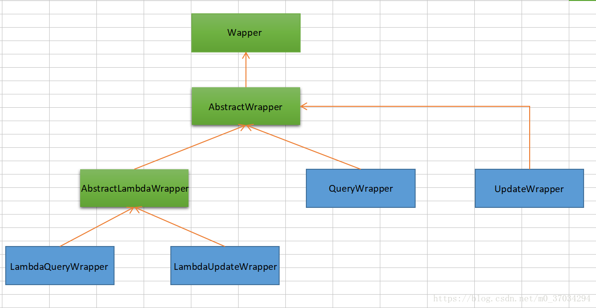
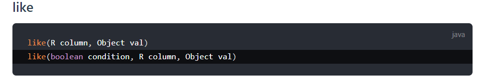
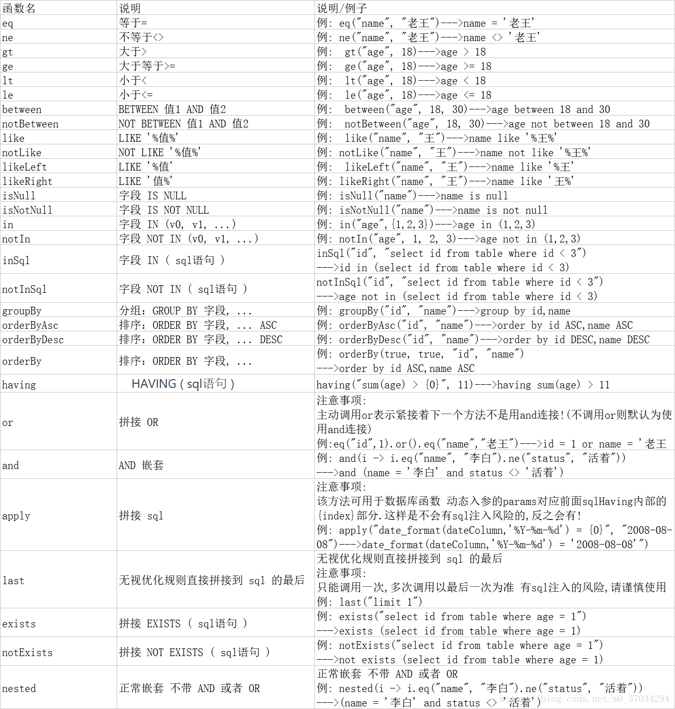

## 一、条件构造器Wrapper

Mybatis Plus为我们提供了如下的一些条件构造器，我们可以利用它们实现查询条件、删除条件、更新条件的构造。



条件构造器用于给如下的Mapper方法传参，通常情况下：

- updateWrapper用于给update方法传条件参数
- queryWrapper用于给delete和select方法传参

```
public interface BaseMapper<T> extends Mapper<T> {

  int delete(@Param("ew") Wrapper<T> wrapper);

  int update(@Param("et") T entity, @Param("ew") Wrapper<T> updateWrapper);

  T selectOne(@Param("ew") Wrapper<T> queryWrapper);

  Integer selectCount(@Param("ew") Wrapper<T> queryWrapper);

  List<T> selectList(@Param("ew") Wrapper<T> queryWrapper);

  List<Map<String, Object>> selectMaps(@Param("ew") Wrapper<T> queryWrapper);

  List<Object> selectObjs(@Param("ew") Wrapper<T> queryWrapper);

  IPage<T> selectPage(IPage<T> page, @Param("ew") Wrapper<T> queryWrapper);

  IPage<Map<String, Object>> selectMapsPage(IPage<T> page, @Param("ew") Wrapper<T> queryWrapper);
}

```

### 举例一：like 条件构造

```
String name = "字母";  //name不为空
String email = "";   //email为空串
QueryWrapper<User> query = new QueryWrapper<>();
query.like(StringUtils.isNotEmpty(name), "name", name)
      //因为email为空串，该条件未生效
     .like(StringUtils.isNotEmpty(email), "email", email);    

List<User> list = userMapper.selectList(query);
list.forEach(System.out::println);

```

- QueryWrapper是查询条件构造器，like是一种条件构造函数，还有很多的条件构造函数。请参考：[条件构造器](https://mp.baomidou.com/guide/wrapper.html#abstractwrapper)



- 几乎所有的条件构造函数，都提供了condition参数实现动态SQL。也就是参数判断是否返回true，如果返回false，该条件不成立。如`email=“”`，所以`.like(StringUtils.isNotEmpty(email), "email", email);` 的条件不成立。
- 所以最终的执行SQL，如下(只有name LIKE条件，没有email LIKE 条件)：

```
SELECT id,name,age,email
FROM user 
WHERE name LIKE %字母%

```

### 举例二：allEq条件构造器

- all表示所有
- Eq是equal的缩写表示相等关系

```
//构造条件
QueryWrapper<User> query = new QueryWrapper<>();
Map<String, Object> params = new HashMap<>();
params.put("name", "字母哥");
params.put("age", 18);
params.put("email", null);

// query.allEq(params,false);
query.allEq((k, v) -> !k.equals("name"), params, false);
List<User> list = userMapper.selectList(query);
list.forEach(System.out::println);

```

- 第一个参数是过滤器（可选参数），lambda表达式表示(k, v) -> !k.equals("name")，参数的Key不能是name，所以`params.put("name", "字母哥");`这个查询条件被过滤掉
- 第二个参数表示传入所有的params查询参数
- 第三个参数（可选参数），表示如果值为null是否按IS NULL查询，false则忽略null列的查询，所以`params.put("email", null);`这个查询条件被过滤掉

最终执行的SQL如下：

```
SELECT id,name,age,email
FROM user 
WHERE age = ?

```

### 更多构造器使用方法总结

请参考：[官方文档：条件构造器](https://mp.baomidou.com/guide/wrapper.html#abstractwrapper)


## 二、lambda条件构造器

### 举例一：

```
// LambdaQueryWrapper<User> lambdaQ = new QueryWrapper<User>().lambda();
// LambdaQueryWrapper<User> lambdaQ = new LambdaQueryWrapper<>();
LambdaQueryWrapper<User> lambdaQ = Wrappers.lambdaQuery();
lambdaQ.like(User::getName, "字母")
       .lt(User::getAge, 18);
List<User> list = userMapper.selectList(lambdaQ);

```

lambda条件构造器，最终执行SQL如下：

```
SELECT id,name,age,email
FROM user 
WHERE name LIKE %字母%
AND age < 18

```

### 举例二：

```
List<User> list = new LambdaQueryChainWrapper<User>(userMapper)
        .likeRight(User::getName, "字母")
        .and(q -> q.lt(User::getAge, 40)
                  .or()
                  .isNotNull(User::getEmail)
        )
        .list();
list.forEach(System.out::println);

```

lambda条件构造器，最终执行SQL如下：

```
SELECT id,name,age,email
FROM user 
WHERE name LIKE '字母%'
AND ( age < 18 OR email IS NOT NULL )
```