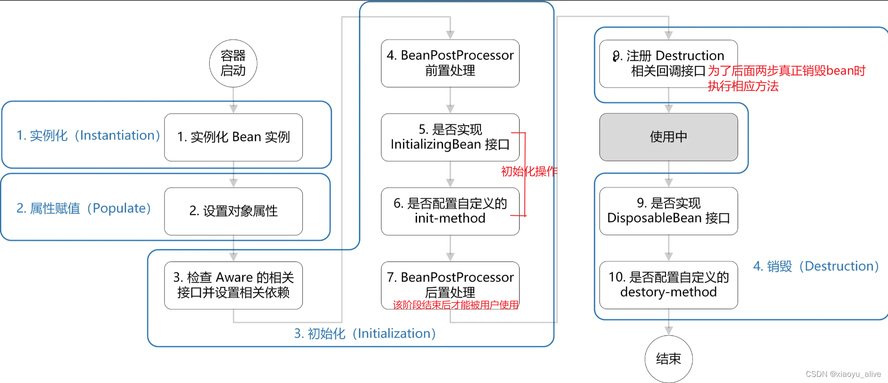
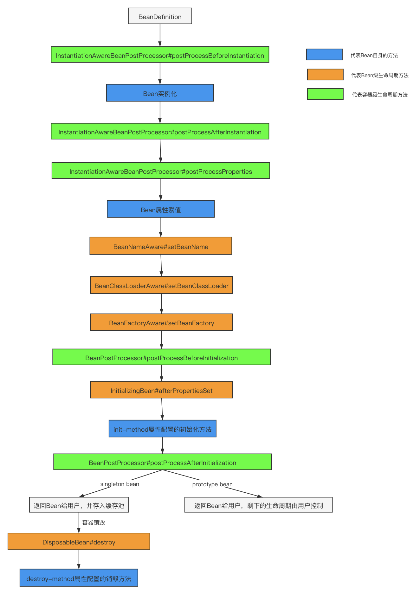
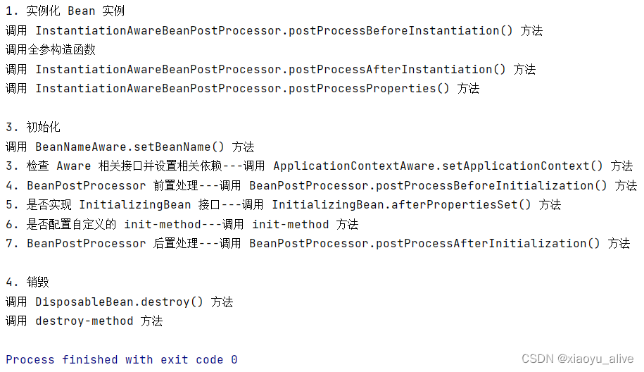
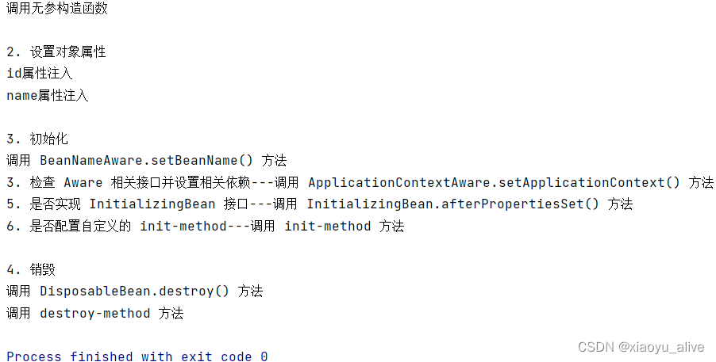

资料来源：<br/>
[Spring Bean的生命周期](https://blog.csdn.net/xiaoyu_alive/article/details/135740524)<br/>


## springbean的生命周期

### 介绍

Spring Bean 的生命周期,小伙伴们应该在面试中经常遇到，这是正常现象。因为 Spring Bean 的生命周期是除了 IoC、AOP 几个核心概念之外最重要概念，大家务必拿下。可 Spring 源代码又比较复杂，跟着跟着就不知道跟到哪里去了，不太好拿下呀。这倒是真的，而且网上一上来就各种贴流程源码，对初学者来说是真的一脸懵逼，就像字都看的懂，但连在一块就不知道意思了，太绕了。


#### 什么是bean

我们来看下 Spring Framework 的官方文档：

> In Spring, the objects that form the backbone of your application and that are managed by the Spring IoC container are called beans. A bean is an object that is instantiated, assembled, and otherwise managed by a Spring IoC container. Otherwise, a bean is simply one of many objects in your application. Beans, and the dependencies among them, are reflected in the configuration metadata used by a container.
>

简而言之，bean 是由 Spring IoC 容器实例化、组装和管理的对象。

####  Spring Bean 的生命周期

对于普通的 Java 对象，当 new 的时候创建对象，然后该对象就能够使用了。一旦该对象不再被使用，则由 Java 自动进行垃圾回收。

而 Spring 中的对象是 bean，bean 和普通的 Java 对象没啥大的区别，只不过 Spring 不再自己去 new 对象了，而是由 IoC 容器去帮助我们实例化对象并且管理它，我们需要哪个对象，去问 IoC 容器要即可。IoC 其实就是解决对象之间的耦合问题，Spring Bean 的生命周期完全由容器控制。

这里我们说的 Spring Bean 的生命周期主要指的是 singleton bean，对于 prototype 的 bean ，Spring 在创建好交给使用者之后则不会再管理后续的生命周期。

我们也来复习下 Spring 中的 bean 的作用域有哪些?

- `singleton` : 唯一 bean 实例，Spring 中的 bean 默认都是单例的。

- `prototype` : 每次请求都会创建一个新的 bean 实例。

- `request` : 每一次 HTTP 请求都会产生一个新的 bean，该 bean 仅在当前 HTTP request 内有效。

- `session` : 每一次 HTTP 请求都会产生一个新的 bean，该 bean 仅在当前 HTTP session 内有效。
- `global-session`： 全局 session 作用域，仅仅在基于 Portlet 的 web 应用中才有意义，Spring5 已经没有了。Portlet 是能够生成语义代码（例如：HTML）片段的小型 Java Web 插件。它们基于 portlet 容器，可以像 servlet 一样处理 HTTP 请求。但是，与 servlet 不同，每个 portlet 都有不同的会话。

我们知道对于普通的 Java 对象来说，它们的生命周期就是：

- 实例化

- 该对象不再被使用时通过垃圾回收机制进行回收

而对于 Spring Bean 的生命周期来说：

- 实例化 Instantiation
- 属性赋值 Populate
- 初始化 Initialization
- 销毁 Destruction

实例化 -> 属性赋值 -> 初始化 -> 销毁

#### 四个阶段

> 实例化（Instantiation）<br/>
> 属性赋值（Populate）：set方法（bean标签的property子标签）、@Autowired等注入功能的注解<br/>
> 初始化（Initialization）<br/>
> 销毁（Destruction）<br/>





### 源码分析

```java
// AbstractAutowireCapableBeanFactory.java
protected Object doCreateBean(final String beanName, final RootBeanDefinition mbd, final @Nullable Object[] args) throws BeanCreationException {

    // 1. 实例化
    BeanWrapper instanceWrapper = null;
    if (instanceWrapper == null) {
        instanceWrapper = createBeanInstance(beanName, mbd, args);
    }
    
    Object exposedObject = bean;
    try {
        // 2. 属性赋值
        populateBean(beanName, mbd, instanceWrapper);
        // 3. 初始化
        exposedObject = initializeBean(beanName, exposedObject, mbd);
    }

    // 4. 销毁-注册回调接口
    try {
        registerDisposableBeanIfNecessary(beanName, bean, mbd);
    }

    return exposedObject;
}

```

```java
// AbstractAutowireCapableBeanFactory.java
protected Object initializeBean(final String beanName, final Object bean, @Nullable RootBeanDefinition mbd) {
    // 3. 检查 Aware 相关接口并设置相关依赖
    if (System.getSecurityManager() != null) {
        AccessController.doPrivileged((PrivilegedAction<Object>) () -> {
            invokeAwareMethods(beanName, bean);
            return null;
        }, getAccessControlContext());
    }
    else {
        invokeAwareMethods(beanName, bean);
    }

    // 4. BeanPostProcessor 前置处理
    Object wrappedBean = bean;
    if (mbd == null || !mbd.isSynthetic()) {
        wrappedBean = applyBeanPostProcessorsBeforeInitialization(wrappedBean, beanName);
    }

    // 5. 若实现 InitializingBean 接口，则调用 afterPropertiesSet() 方法，在属性注入完成后调用
    // 6. 若配置自定义的 init-method方法，则执行
    try {
        invokeInitMethods(beanName, wrappedBean, mbd);
    }
    catch (Throwable ex) {
        throw new BeanCreationException(
            (mbd != null ? mbd.getResourceDescription() : null),
            beanName, "Invocation of init method failed", ex);
    }
    // 7. BeanPostProceesor 后置处理
    if (mbd == null || !mbd.isSynthetic()) {
        wrappedBean = applyBeanPostProcessorsAfterInitialization(wrappedBean, beanName);
    }

    return wrappedBean;
}

```

```java
// DisposableBeanAdapter.java
public void destroy() {
    // 9. 若实现 DisposableBean 接口，则执行 destory()方法
    if (this.invokeDisposableBean) {
        try {
            if (System.getSecurityManager() != null) {
                AccessController.doPrivileged((PrivilegedExceptionAction<Object>) () -> {
                    ((DisposableBean) this.bean).destroy();
                    return null;
                }, this.acc);
            }
            else {
                ((DisposableBean) this.bean).destroy();
            }
        }
    }
    
	// 10. 若配置自定义的 detory-method 方法，则执行
    if (this.destroyMethod != null) {
        invokeCustomDestroyMethod(this.destroyMethod);
    }
    else if (this.destroyMethodName != null) {
        Method methodToInvoke = determineDestroyMethod(this.destroyMethodName);
        if (methodToInvoke != null) {
            invokeCustomDestroyMethod(ClassUtils.getInterfaceMethodIfPossible(methodToInvoke));
        }
    }
}

```

## 扩展

这些接口的实现类是独立于 Bean 的，并且会注册到 Spring 容器中。在 Spring 容器创建任何 Bean 的时候，这些后处理器都会发生作用。

### 1、InstantiationAwareBeanPostProcessor

> 该类是 BeanPostProcessor 的子接口，常用的有如下三个方法：<br/>
> postProcessBeforeInstantiation(Class beanClass, String beanName)：在bean实例化之前调用<br/>
> postProcessProperties(PropertyValues pvs, Object bean, String beanName)：在bean实例化之后、构造方法前调用<br/>
> postProcessAfterInstantiation(Class beanClass, String beanName)：在实例化 Bean 之后、构造方法之后调用<br/>

```java
public interface InstantiationAwareBeanPostProcessor extends BeanPostProcessor {
    @Nullable
    default Object postProcessBeforeInstantiation(Class<?> beanClass, String beanName) throws BeansException {
        return null;
    }

    default boolean postProcessAfterInstantiation(Object bean, String beanName) throws BeansException {
        return true;
    }

    @Nullable
    default PropertyValues postProcessProperties(PropertyValues pvs, Object bean, String beanName) throws BeansException {
        return pvs;
    }
}

```

### 2、Aware

> 组件的“觉醒”
> Aware 之前的名字就是可以拿到什么资源，例如 BeanNameAware 可以拿到 BeanName，以此类推。<br/>
> 调用时机：所有的 Aware 方法都是在初始化阶段之前调用的<br/>
>
>若 Spring 检测到 bean 实现了 Aware 接口，则会为其注入相应的依赖。<br/>
> –> 通过让 bean 实现 Aware 接口，则能在 bean 中获得相应的 Spring 容器资源。<br/>
> 
>当组件实现Aware接口的时候，会实现Aware接口里提供的 setXXX方法<br/>
> 这些 setXXX方法可以让组件对象获取一些信息，形参中会包含对应的信息，比如组件在容器中的组件id等<br/>

#### BeanFactory 类型的容器

> Spring 中提供的 Aware 接口：<br/>
> BeanNameAware：该接口只有一个方法 setBeanName(String name)，用来获取 bean 的 id 或者 name。<br/>
> BeanClassLoaderAware：该接口只有一个方法 setBeanClassLoader(ClassLoader bc1)，用来获取 bean 的 ClassLoader。<br/>
> BeanFactoryAware：该接口只有一个方法 setBeanFactory(BeanFactory beanFactory)，用来获取当前环境中的 BeanFactory。<br/>

```java
// AbstractAutowireCapableBeanFactory.java
private void invokeAwareMethods(final String beanName, final Object bean) {
    if (bean instanceof Aware) {
        if (bean instanceof BeanNameAware) {
            ((BeanNameAware) bean).setBeanName(beanName);
        }
        if (bean instanceof BeanClassLoaderAware) {
            ((BeanClassLoaderAware) bean).setBeanClassLoader(bcl);
            
        }
        if (bean instanceof BeanFactoryAware) {
            ((BeanFactoryAware) bean).setBeanFactory(AbstractAutowireCapableBeanFactory.this);
        }
    }
}

```

#### ApplicationContext 类型的容器

> Spring 中提供的 Aware 接口：常用：<br/>
> ApplicationContextAware：该接口只有一个方法 setApplicationContext(ApplicationContext applicationContext)，用来获取当前环境中的 ApplicationContext。<br/>

```java
// ApplicationContextAwareProcessor.java
private void invokeAwareInterfaces(Object bean) {
    if (bean instanceof EnvironmentAware) { // 注入 Enviroment，一般用于获取配置属性
        ((EnvironmentAware)bean).setEnvironment(this.applicationContext.getEnvironment());
    }
    if (bean instanceof EmbeddedValueResolverAware) { // 注入 EmbeddedValueResolver（Spring EL解析器），一般用于参数解析
        ((EmbeddedValueResolverAware)bean).setEmbeddedValueResolver(this.embeddedValueResolver);
    }
    if (bean instanceof ResourceLoaderAware) {
        ((ResourceLoaderAware)bean).setResourceLoader(this.applicationContext);
    }
    if (bean instanceof ApplicationEventPublisherAware) {
        ((ApplicationEventPublisherAware)bean).setApplicationEventPublisher(this.applicationContext);
    }
    if (bean instanceof MessageSourceAware) {
        ((MessageSourceAware)bean).setMessageSource(this.applicationContext);
    }
    if (bean instanceof ApplicationContextAware) {
        ((ApplicationContextAware)bean).setApplicationContext(this.applicationContext);
    }
}

```

### 3、BeanPostProcessor

> BeanPostProcessor 是 Spring 为修改 bean 提供的强大扩展点，其可作用于容器中除它本身外所有 bean<br/>
> 常用于：为当前对象提供代理实现。例如 Spring AOP 功能，生成对象的代理类，然后返回<br/>

> 该接口有两个方法：<br/>
> postProcessBeforeInitialization(Object bean, String beanName)：初始化前置处理，在初始化之前调用此方法<br/>
> postProcessAfterInitialization(Object bean, String beanName)：初始化后置处理，在初始化之后调用此方法<br/>

```java
public interface BeanPostProcessor {
    @Nullable
    default Object postProcessBeforeInitialization(Object bean, String beanName) throws BeansException {
        return bean;
    }

    @Nullable
    default Object postProcessAfterInitialization(Object bean, String beanName) throws BeansException {
        return bean;
    }
}

```

```java
// AbstractAutoProxyCreator.java
public Object postProcessBeforeInstantiation(Class<?> beanClass, String beanName) {
    TargetSource targetSource = getCustomTargetSource(beanClass, beanName);
    if (targetSource != null) {
        if (StringUtils.hasLength(beanName)) {
            this.targetSourcedBeans.add(beanName);
        }
        Object[] specificInterceptors = getAdvicesAndAdvisorsForBean(beanClass, beanName, targetSource);
        Object proxy = createProxy(beanClass, beanName, specificInterceptors, targetSource);
        this.proxyTypes.put(cacheKey, proxy.getClass());
        // 返回代理类
        return proxy;
    }
    return null;
}

```

### 4、@PostConstruct(初始化逻辑)和@PreDestroy(销毁逻辑)注解

> 从Java EE 5规范开始，Servlet 中增加了两个影响 Servlet 生命周期的注解：@PostConstruct和@PreDestroy。<br/>
>
> 被 @PostConstruct 修饰的方法会在服务器加载 Servlet 的时候运行，并且只会被服务器调用一次，类似于 Servlet 的 init() 方法。<br/>
> 被 @PostConstruct 修饰的方法会在构造函数之后，init() 方法之前运行。<br/>
>
>被 @PreDestroy 修饰的方法会在服务器卸载 Servlet 的时候运行，并且只会被服务器调用一次，类似于 Servlet 的 destroy() 方法。<br/>
>被 @PreDestroy 修饰的方法会在 destroy() 方法之后运行，在 Servlet 被彻底卸载之前。<br/>

## 四、实例

### 1、注解方式

dao层：

```java
@Getter
@ToString
@Repository
public class UserDao implements InitializingBean, BeanNameAware, DisposableBean, ApplicationContextAware {

    private Integer id;
    private String name;

    // 1-1. 实例化 Bean 实例：调用构造方法
    public UserDao(Integer id, String name) {
        this.id = id;
        this.name = name;
        System.out.println("调用全参构造函数");
    }

    // 1-1. 实例化 Bean 实例：调用构造方法
    // 具体使用哪一个构造方式看 new 对象
    public UserDao() {
        System.out.println("调用无参构造函数");
    }

    // 2. 设置对象属性 属性注入
    public void setId(Integer id) {
        this.id = id;
        System.out.println("\n2. 设置对象属性");
        System.out.println("id属性注入");
    }

    // 2. 设置对象属性 属性注入
    public void setName(String name) {
        this.name = name;
        System.out.println("name属性注入");
    }

    // 3. 初始化--检查 Aware 相关接口并设置相关依赖
    // BeanNameAware 下的 setBeanName 方法
    @Override
    public void setBeanName(String name) {
        System.out.println("\n3. 初始化");
        System.out.println("调用 BeanNameAware.setBeanName() 方法");
    }

    // 3。 初始化--检查 Aware 相关接口并设置相关依赖
    // ApplicationContextAware 下的 setApplicationContext 方法
    // if (bean instanceof ApplicationContextAware) {
    //        ((ApplicationContextAware)bean).setApplicationContext(this.applicationContext);
    //    }
    @Override
    public void setApplicationContext(ApplicationContext applicationContext) throws BeansException {
        UserDao userDao = (UserDao) applicationContext.getBean("userDao");
        System.out.println("3. 检查 Aware 相关接口并设置相关依赖---调用 ApplicationContextAware.setApplicationContext() 方法");
    }

    // 4. BeanPostProcessor 前置处理 见 MyBeanPostProcessor类

    // 5. 初始化--是否实现 InitializingBean 接口
    // InitializingBean 下的 afterPropertiesSet 方法
    @Override
    public void afterPropertiesSet() throws Exception {
        System.out.println("5. 是否实现 InitializingBean 接口---调用 InitializingBean.afterPropertiesSet() 方法");
    }

    // 6. 初始化--是否配置自定义的 init-method
  	@PostConstruct
    public void myInit() {
        System.out.println("6. 是否配置自定义的 init-method---调用 init-method 方法");
    }

    // 7. BeanPostProcessor 后置处理 见 MyBeanPostProcessor类

    // 8. 注册 Destruction 相关回调接口 略

    // 9. 销毁--是否实现 DisposableBean 接口
    // DisposableBean 下的 destroy 方法
    @Override
    public void destroy() throws Exception {
        System.out.println("\n4. 销毁");
        System.out.println("调用 DisposableBean.destroy() 方法");
    }

    // 10. 销毁--是否配置自定义的 destroy-method
    @PreDestroy
    public void myDestroy() throws Exception {
        System.out.println("调用 destroy-method 方法");
    }
}

```

```java
@Repository
public class MyInstantiationAwareBeanPostProcessor implements InstantiationAwareBeanPostProcessor {

    // 1-0. 实例化 Bean 实例
    // InstantiationAwareBeanPostProcessor.postProcessBeforeInstantiation() 方法 在实例化 Bean 之前调用
    @Override
    public Object postProcessBeforeInstantiation(Class<?> beanClass, String beanName) throws BeansException {
        if ("userDao".equals(beanName)) {
            System.out.println("1. 实例化 Bean 实例");
            System.out.println("调用 InstantiationAwareBeanPostProcessor.postProcessBeforeInstantiation() 方法");
        }
        return null;
    }

    // 1-1. 实例化 Bean 实例：调用全参构造方法 见 UserDao

    // 1-2. 实例化 Bean 实例
    // InstantiationAwareBeanPostProcessor.postProcessAfterInstantiation() 方法 在实例化 Bean 之后、构造方法之前调用
    @Override
    public boolean postProcessAfterInstantiation(Object bean, String beanName) throws BeansException {
        if ("userDao".equals(beanName)) {
            UserDao userDao = (UserDao) bean;
            System.out.println("调用 InstantiationAwareBeanPostProcessor.postProcessAfterInstantiation() 方法");
        }
        return true;
    }

    // 1-3. 实例化 Bean 实例
    // InstantiationAwareBeanPostProcessor.postProcessProperties() 方法 在实例化 Bean 之后、构造方法之后调用
    @Override
    public PropertyValues postProcessProperties(PropertyValues pvs, Object bean, String beanName) throws BeansException {
        if ("userDao".equals(beanName)) {
            System.out.println("调用 InstantiationAwareBeanPostProcessor.postProcessProperties() 方法");
        }
        return null;
    }
}

```

```java
@Repository
public class MyBeanPostProcessor implements BeanPostProcessor {

    // 4. 初始化--BeanPostProcessor 前置处理
    @Override
    public Object postProcessBeforeInitialization(Object bean, String beanName) throws BeansException {
        if ("userDao".equals(beanName)) {
            System.out.println("4. BeanPostProcessor 前置处理---调用 BeanPostProcessor.postProcessBeforeInitialization() 方法");
        }
        return bean;
    }

    // 7.初始化--BeanPostProcessor 后置处理
    @Override
    public Object postProcessAfterInitialization(Object bean, String beanName) throws BeansException {
        if ("userDao".equals(beanName)) {
            System.out.println("7. BeanPostProcessor 后置处理---调用 BeanPostProcessor.postProcessAfterInitialization() 方法");
        }
        return bean;
    }
}

```

配置类：

```java
@Configuration
public class MyConfig {

    // @Bean(initMethod = "myInit", destroyMethod = "destroy") // 不执行 myDestroy
    @Bean(initMethod = "myInit", destroyMethod = "myDestroy") // 执行 myDestroy 和 destroy
    public UserDao userDao() {
        return  new UserDao(23, "xiaoyu-alive");
    }

    @Bean
    public MyInstantiationAwareBeanPostProcessor myInstantiationAwareBeanPostProcessor() {
        return  new MyInstantiationAwareBeanPostProcessor();
    }

    @Bean
    public MyBeanPostProcessor myBeanPostProcessor() {
        return  new MyBeanPostProcessor();
    }
}

```

测试类：

```java
@SpringBootTest
public class SpringbootdemoApplicationTests {

    @Test
    public void test() throws Exception {
        AnnotationConfigApplicationContext applicationContext = new AnnotationConfigApplicationContext(MyConfig.class);
        Object userDao = applicationContext.getBean("userDao");
        // 销毁方法只有在IOC容器关闭的时候才调用，所以在测试代码中关闭IOC容器
        //关闭ioc容器
        applicationContext.close();
    }
}

```



### 2、xml配置文件方式

```xml
<?xml version="1.0" encoding="UTF-8"?>
<beans xmlns="http://www.springframework.org/schema/beans"
       xmlns:xsi="http://www.w3.org/2001/XMLSchema-instance"
       xmlns:context="http://www.springframework.org/schema/context"
       xsi:schemaLocation="
        http://www.springframework.org/schema/beans https://www.springframework.org/schema/beans/spring-beans.xsd
        http://www.springframework.org/schema/context https://www.springframework.org/schema/context/spring-context.xsd">

    <bean class="com.test.springbootdemo.dao.MyInstantiationAwareBeanPostProcessor"></bean>

    <bean id="userDao" class="com.test.springbootdemo.dao.UserDao">
        <property name="id" value="23"/>
        <property name="name" value="xiaoyu-alive"></property>
    </bean>

    <bean class="com.test.springbootdemo.dao.MyBeanPostProcessor"></bean>
</beans>

```

```java
@Test
public void mytest() {
    ApplicationContext applicationContext = new ClassPathXmlApplicationContext("application.xml"); // 也可以使用绝对路径
    UserDao userDao = (UserDao) applicationContext.getBean("userDao");
    ((AbstractApplicationContext) applicationContext).close();
}

```

测试结果同上

注：取消 MyInstantiationAwareBeanPostProcessor 和 MyBeanPostProcessor 的注入的测试结果：

