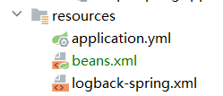
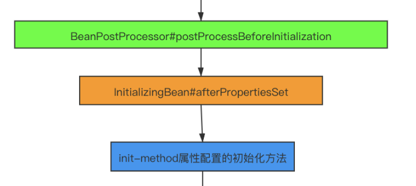

资料来源：<br/>
[Spring中bean工厂后置处理器（BeanFactoryPostProcessor）使用](https://www.jianshu.com/p/b45efc018bcc)<br/>


## 后置处理器

Spring中bean工厂后置处理器也就是BeanFactoryPostProcessor接口，是用来干什么的呢？我们都知道**一个好的框架必备的特性至少得有开闭原则，可扩展性**。<br/>
 在前面的文章里[SpringIOC源码阅读—BeanDefinitionDocumentReader](https://www.jianshu.com/p/339c87aae174)我们了解到Spring对bean定义的载入有很多种方式，读取的过程是可插拔的，不论何种形式，spring的IOC容器只要获得了bean定义信息，都可以正常工作。而我们熟知的配置读取方式就是XML文件，**如果你希望，可以自己定制配置信息的读取过程，这就是Spring的特性体现之一。**<br/>
 同样`BeanFactoryPostProcessor`也是Spring可扩展性的一个体现，**我们读一下这个接口的源码**<br/>

```java
public interface BeanFactoryPostProcessor {

    /**
     * Modify the application context's internal bean factory after its standard
     * initialization. All bean definitions will have been loaded, but no beans
     * will have been instantiated yet. This allows for overriding or adding
     * properties even to eager-initializing beans.
     * @param beanFactory the bean factory used by the application context
     * @throws org.springframework.beans.BeansException in case of errors
     */
    void postProcessBeanFactory(ConfigurableListableBeanFactory beanFactory) throws BeansException;

}
```

注释的意思是**允许我们在工厂里所有的bean被加载进来后但是还没初始化前，对所有bean的属性进行修改也可以add属性值。**

### 传统的xml配置

**创建pojo**

```java
package store.liuwei.simple.pojo;

public class User {
    String name;
    String age;

    void init(){
        name = "zx-init";
        age = "zx-init";
        System.out.println("name:"+name+",age:"+age);
    }

    public User() {
        System.out.println("construtor");
        name = "zx-construtor";
        age = "zx-construtor";
        System.out.println("name:"+name+",age:"+age);
    }

    public void go(){
        System.out.println("最终age的值:"+age);
    }
    public String getName() {
        return name;
    }
    public void setName(String name) {
        this.name = name;
    }
    public String getAge() {
        return age;
    }
    public void setAge(String age) {
        this.age = age;
    }
}
```

在classpath下创建beans.xml



```xml
<?xml version="1.0" encoding="UTF-8"?>
<beans xmlns="http://www.springframework.org/schema/beans"
       xmlns:xsi="http://www.w3.org/2001/XMLSchema-instance"
       xsi:schemaLocation="http://www.springframework.org/schema/beans http://www.springframework.org/schema/beans/spring-beans-2.5.xsd">
    <!-- 普通的bean -->
    <bean id="myUser" init-method="init" class="store.liuwei.simple.pojo.User"></bean>
    <!-- BeanFactroy后置处理器 -->
    <bean id="beanfactorypostpro" class="store.liuwei.simple.bean.MyBeanFactoryPostProcessor"></bean>
</beans>
```

 **BeanFactroy后置处理器**

```java
package store.liuwei.simple.bean;

import org.springframework.beans.BeansException;
import org.springframework.beans.factory.config.BeanDefinition;
import org.springframework.beans.factory.config.BeanFactoryPostProcessor;
import org.springframework.beans.factory.config.ConfigurableListableBeanFactory;

public class MyBeanFactoryPostProcessor implements BeanFactoryPostProcessor {
    @Override
    public void postProcessBeanFactory(ConfigurableListableBeanFactory beanFactory) throws BeansException {

        System.out.println("******调用BeanFactoryPostProcessor开始");
        //获取到Spring中所有的beanName
        String[] beanStr = beanFactory.getBeanDefinitionNames();
        //循环bean做出自定义的操作
        for (String beanName : beanStr) {
//            System.out.println("bean name:"+beanName);
            if ("myUser".equals(beanName)) {
                BeanDefinition beanDefinition = beanFactory.getBeanDefinition(beanName);
                System.out.println("修改user的age值");
                beanDefinition.getPropertyValues().add("age", "20");
            }
        }
        System.out.println("******调用BeanFactoryPostProcessor结束");

    }

}
```

**进行测试**

```java
package store.liuwei.simple.bean;

import org.junit.Test;
import org.junit.runner.RunWith;
import org.springframework.boot.test.context.SpringBootTest;
import org.springframework.context.ApplicationContext;
import org.springframework.context.support.ClassPathXmlApplicationContext;
import org.springframework.test.context.junit4.SpringRunner;
import store.liuwei.simple.pojo.User;

@SpringBootTest
@RunWith(SpringRunner.class)
public class SpringBeanDemo {


    @Test
    public void test021(){
        ApplicationContext applicationContext = new ClassPathXmlApplicationContext("classpath:beans.xml");
        System.out.println("获取到User实例 ");
        ((User)applicationContext.getBean("myUser")).go();
    }

}
```

运行结果

```shell
******调用BeanFactoryPostProcessor开始
修改user的age值
******调用BeanFactoryPostProcessor结束
construtor
name:zx-construtor,age:zx-construtor
name:zx-init,age:zx-init
获取到User实例 
最终age的值:zx-init
```

上面是博客中找到的，我想说springboot自动化配置都好多年。还用这种xml配置，太lower了。我先改造成常用的配置

### 注解方式

pojo

```java
package store.liuwei.simple.pojo;

import javax.annotation.PostConstruct;

public class User {
    String name;
    String age;


    @PostConstruct
    void init(){
        name = "zx-init";
        age = "zx-init";
        System.out.println("name:"+name+",age:"+age);
    }

    public User() {
        System.out.println("construtor");
        name = "zx-construtor";
        age = "zx-construtor";
        System.out.println("name:"+name+",age:"+age);
    }

    public void go(){
        System.out.println("最终age的值:"+age);
    }
    public String getName() {
        return name;
    }
    public void setName(String name) {
        this.name = name;
    }
    public String getAge() {
        return age;
    }
    public void setAge(String age) {
        this.age = age;
    }
}
```

使用`@PostConstruct`指定初始化方法

**spring方式创建bean**

之前是使用xml配置，这里使用@bean注解

```java
package store.liuwei.simple.config;

import org.springframework.context.annotation.Bean;
import org.springframework.context.annotation.Configuration;
import store.liuwei.simple.pojo.User;

@Configuration
public class MyUserConfig {

    @Bean
    public User myUser(){
        return new User();
    }
}
```

spring需要加在后置处理器

```java
package store.liuwei.simple.bean;

import lombok.extern.slf4j.Slf4j;
import org.springframework.beans.BeansException;
import org.springframework.beans.factory.config.BeanDefinition;
import org.springframework.beans.factory.config.BeanFactoryPostProcessor;
import org.springframework.beans.factory.config.ConfigurableListableBeanFactory;
import org.springframework.stereotype.Component;

@Slf4j
@Component
public class MyBeanFactoryPostProcessor implements BeanFactoryPostProcessor {
    @Override
    public void postProcessBeanFactory(ConfigurableListableBeanFactory beanFactory) throws BeansException {

        System.out.println("******调用BeanFactoryPostProcessor开始");
        //获取到Spring中所有的beanName
        String[] beanStr = beanFactory.getBeanDefinitionNames();
        //循环bean做出自定义的操作
        for (String beanName : beanStr) {
//            System.out.println("bean name:"+beanName);
            if ("myUser".equals(beanName)) {
                BeanDefinition beanDefinition = beanFactory.getBeanDefinition(beanName);
                System.out.println("修改user的age值");
                beanDefinition.getPropertyValues().add("age", "20");
            }
        }
        System.out.println("******调用BeanFactoryPostProcessor结束");

    }

}
```

使用的是`@Component`注解，就可以加在了

进行测试

```java
package store.liuwei.simple.bean;

import org.junit.Test;
import org.junit.runner.RunWith;
import org.springframework.beans.factory.annotation.Autowired;
import org.springframework.boot.test.context.SpringBootTest;
import org.springframework.test.context.junit4.SpringRunner;
import store.liuwei.simple.pojo.User;

@SpringBootTest
@RunWith(SpringRunner.class)
public class SpringBeanDemo {

    @Autowired
    private User user;

    @Test
    public void test021(){
        user.go();
    }

}
```

直接使用Autowired注入方式

运行结果

```
******调用BeanFactoryPostProcessor开始
修改user的age值
******调用BeanFactoryPostProcessor结束
construtor
name:zx-construtor,age:zx-construtor
name:zx-init,age:zx-init
最终age的值:zx-init
```

最终结果是：`zx-init`

### 分析

执行的顺序

!> **bean工厂后置处理器—>构造方法—>init-method。**

和上篇文章中生命周期，是一致的



这个没什么疑问，但是把pojo中`@PostConstruct`先去掉，不使用init方法运行的结果

```
******调用BeanFactoryPostProcessor开始
修改user的age值
******调用BeanFactoryPostProcessor结束
construtor
最终age的值:20
```

结果是：20，说明调用BeanFactoryPostProcessor 这个是生效的

可以看到程序**先执行后置器**将值改为`20`，**然后执行的构造方法**，改为`zx-construtor`，但是最终age的值为`20`，到这里疑问就来了，为什么后执行的赋值没起作用呢？

**构造器是无法修改后置工厂的设置的值**