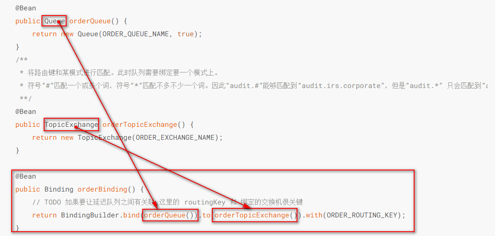
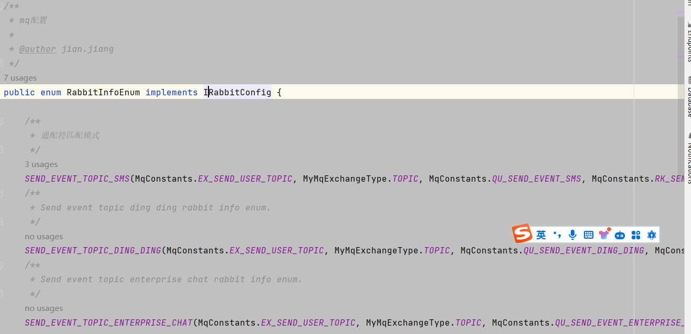
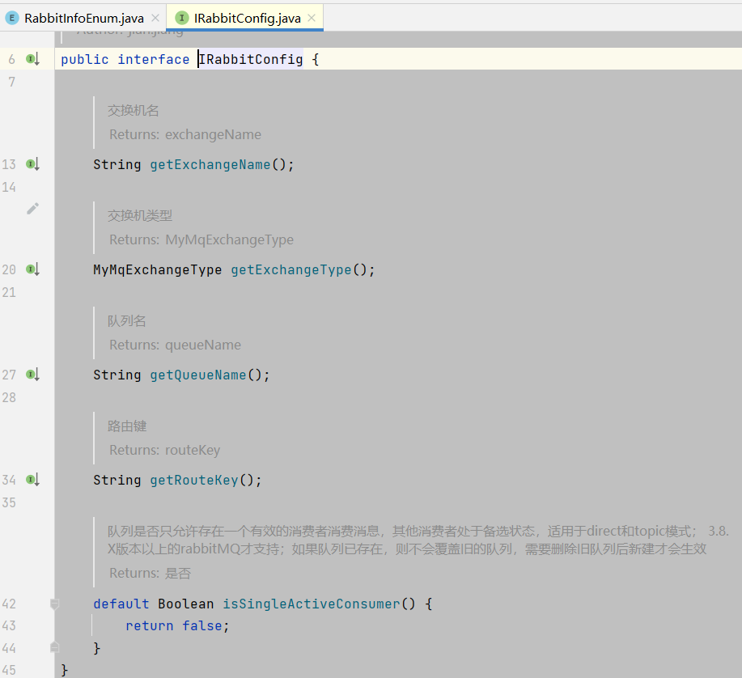
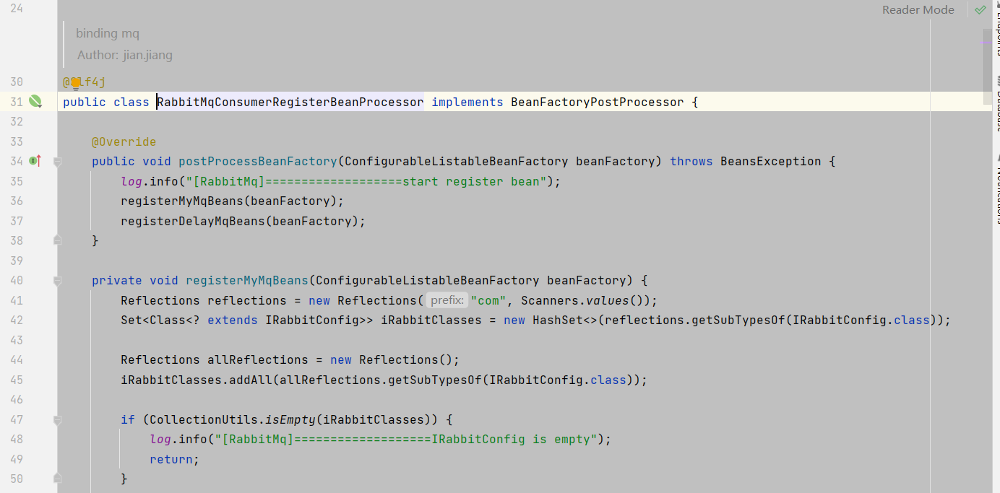
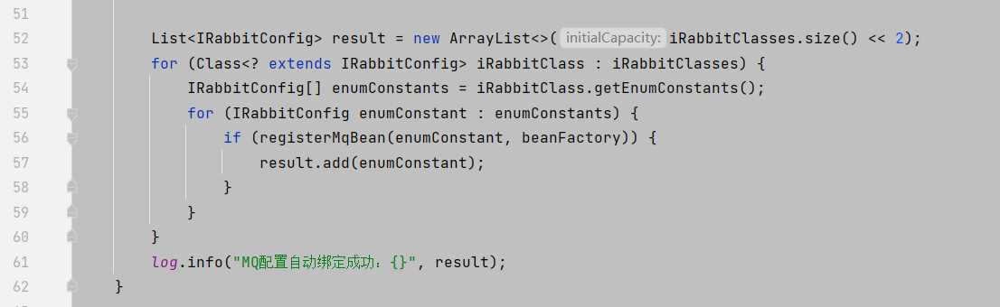
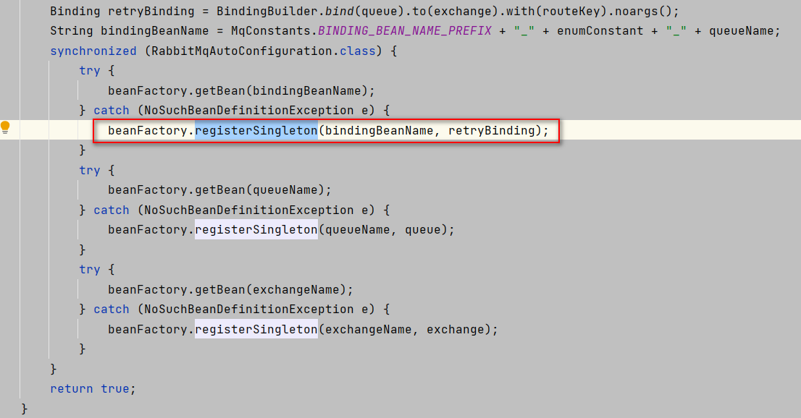
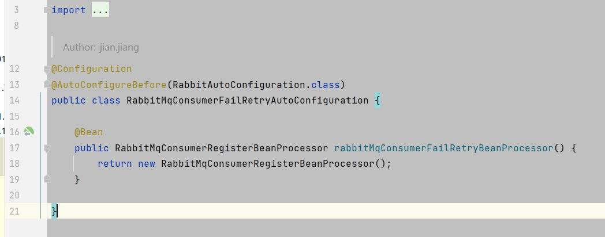
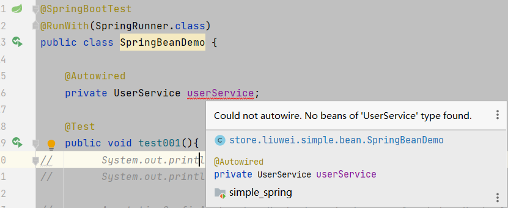

## 使用案例

### 介绍

在四川文渊阁科技有限公司中，很多功能使用了二次的封装。其中`rabbitMQ`封装的过程十分有意思，之前需要配置[02_RabbitMQ简单使用](应用/mq/RabbitMQ/02_RabbitMQ简单使用.md)



配置MQ 最重要的是创建`Binding `对象。但是在项目中没有找到`@Bean`这样的注解，只能找到一个枚举类型。

下面是部分截图



居然用枚举类型实现了一个



我很惊奇发现，居然是使用了一个枚举类型实现接口。还能这样写

### 后置工厂创建bean






从上面的代码可以看出，先通过反射的方式找到所有的`IRabbitConfig`接口的实现类。找到所有的实现类，把每个实现类进行创建对象，加载到spring中。

通过调用`beanFactory.registerSingleton(bindingBeanName, retryBinding);`方法。放到spring容器中



可以看到spring使用无法加载上面的后期处理器，又是怎么实现的呢？原来是在下面又这段代码



通过配置，创建一个bean 。至此配置也就清晰了

### 后置创建bean

从上面的例子可以看到，通过后置工厂创建bean

我想试试看，我先**创建一个接口**

```java
package store.liuwei.simple.service;

public interface UserService {

    String getNameByid(long id);
}

```

**再做一个实现类**

```java
package store.liuwei.simple.service;

public class UserServeiceImpl implements UserService{


    @Override
    public String getNameByid(long id) {
        return "张三";
    }
}

```

**后置工厂配置**

```java
@Slf4j
@Component
public class MyBeanFactoryPostProcessor implements BeanFactoryPostProcessor {
    @Override
    public void postProcessBeanFactory(ConfigurableListableBeanFactory beanFactory) throws BeansException {

        beanFactory.registerSingleton("userService", new UserServeiceImpl());
    }

}
```

**进行测试**

```java
@SpringBootTest
@RunWith(SpringRunner.class)
public class SpringBeanDemo {

    @Resource
    private UserService userService;

    @Test
    public void test001(){
        System.out.println(userService);
        String nameByid = userService.getNameByid(1L);
        System.out.println(nameByid);

    }

}
```



编译提示报错，但是运行时正常

不使用注入的方式

```java
    @Test
    public void test001(){

        UserServeiceImpl userService = SpringUtil.getBean("userService");
        System.out.println(userService);

        String nameByid = userService.getNameByid(1L);
        System.out.println(nameByid);

    }
```

也是可以获取到的,SpringUtil代码

```java
//
// Source code recreated from a .class file by IntelliJ IDEA
// (powered by FernFlower decompiler)
//

package cn.hutool.extra.spring;

import cn.hutool.core.exceptions.UtilException;
import cn.hutool.core.lang.TypeReference;
import cn.hutool.core.util.ArrayUtil;
import java.lang.reflect.ParameterizedType;
import java.util.Arrays;
import java.util.Map;
import org.springframework.beans.BeansException;
import org.springframework.beans.factory.ListableBeanFactory;
import org.springframework.beans.factory.config.BeanFactoryPostProcessor;
import org.springframework.beans.factory.config.ConfigurableListableBeanFactory;
import org.springframework.beans.factory.support.DefaultSingletonBeanRegistry;
import org.springframework.context.ApplicationContext;
import org.springframework.context.ApplicationContextAware;
import org.springframework.context.ApplicationEvent;
import org.springframework.context.ConfigurableApplicationContext;
import org.springframework.core.ResolvableType;
import org.springframework.stereotype.Component;

@Component
public class SpringUtil implements BeanFactoryPostProcessor, ApplicationContextAware {
    private static ConfigurableListableBeanFactory beanFactory;
    private static ApplicationContext applicationContext;

    public SpringUtil() {
    }

    public void postProcessBeanFactory(ConfigurableListableBeanFactory beanFactory) throws BeansException {
        SpringUtil.beanFactory = beanFactory;
    }

    public void setApplicationContext(ApplicationContext applicationContext) {
        SpringUtil.applicationContext = applicationContext;
    }

    public static ApplicationContext getApplicationContext() {
        return applicationContext;
    }

    public static ListableBeanFactory getBeanFactory() {
        return (ListableBeanFactory)(null == beanFactory ? applicationContext : beanFactory);
    }

    public static ConfigurableListableBeanFactory getConfigurableBeanFactory() throws UtilException {
        ConfigurableListableBeanFactory factory;
        if (null != beanFactory) {
            factory = beanFactory;
        } else {
            if (!(applicationContext instanceof ConfigurableApplicationContext)) {
                throw new UtilException("No ConfigurableListableBeanFactory from context!");
            }

            factory = ((ConfigurableApplicationContext)applicationContext).getBeanFactory();
        }

        return factory;
    }

    public static <T> T getBean(String name) {
        return getBeanFactory().getBean(name);
    }

    public static <T> T getBean(Class<T> clazz) {
        return getBeanFactory().getBean(clazz);
    }

    public static <T> T getBean(String name, Class<T> clazz) {
        return getBeanFactory().getBean(name, clazz);
    }

    public static <T> T getBean(TypeReference<T> reference) {
        ParameterizedType parameterizedType = (ParameterizedType)reference.getType();
        Class<T> rawType = (Class)parameterizedType.getRawType();
        Class<?>[] genericTypes = (Class[])Arrays.stream(parameterizedType.getActualTypeArguments()).map((type) -> {
            return (Class)type;
        }).toArray((x$0) -> {
            return new Class[x$0];
        });
        String[] beanNames = getBeanFactory().getBeanNamesForType(ResolvableType.forClassWithGenerics(rawType, genericTypes));
        return getBean(beanNames[0], rawType);
    }

    public static <T> Map<String, T> getBeansOfType(Class<T> type) {
        return getBeanFactory().getBeansOfType(type);
    }

    public static String[] getBeanNamesForType(Class<?> type) {
        return getBeanFactory().getBeanNamesForType(type);
    }

    public static String getProperty(String key) {
        return null == applicationContext ? null : applicationContext.getEnvironment().getProperty(key);
    }

    public static String getApplicationName() {
        return getProperty("spring.application.name");
    }

    public static String[] getActiveProfiles() {
        return null == applicationContext ? null : applicationContext.getEnvironment().getActiveProfiles();
    }

    public static String getActiveProfile() {
        String[] activeProfiles = getActiveProfiles();
        return ArrayUtil.isNotEmpty(activeProfiles) ? activeProfiles[0] : null;
    }

    public static <T> void registerBean(String beanName, T bean) {
        ConfigurableListableBeanFactory factory = getConfigurableBeanFactory();
        factory.autowireBean(bean);
        factory.registerSingleton(beanName, bean);
    }

    public static void unregisterBean(String beanName) {
        ConfigurableListableBeanFactory factory = getConfigurableBeanFactory();
        if (factory instanceof DefaultSingletonBeanRegistry) {
            DefaultSingletonBeanRegistry registry = (DefaultSingletonBeanRegistry)factory;
            registry.destroySingleton(beanName);
        } else {
            throw new UtilException("Can not unregister bean, the factory is not a DefaultSingletonBeanRegistry!");
        }
    }

    public static void publishEvent(ApplicationEvent event) {
        if (null != applicationContext) {
            applicationContext.publishEvent(event);
        }

    }

    public static void publishEvent(Object event) {
        if (null != applicationContext) {
            applicationContext.publishEvent(event);
        }

    }
}

```

