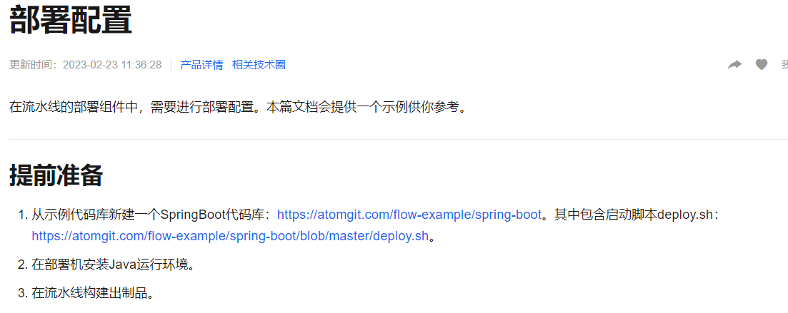

## springboot启动

资料来源：[【SpringBoot】在 linux 下利用 nohup 后台运行 jar 包](https://blog.csdn.net/AV_woaijava/article/details/96278287?utm_medium=distribute.pc_relevant.none-task-blog-2~default~baidujs_title~default-4.pc_relevant_paycolumn_v3&spm=1001.2101.3001.4242.3&utm_relevant_index=7)

### 方式一

`java -jar XXX.jar`

特点：当前[ssh](https://so.csdn.net/so/search?q=ssh&spm=1001.2101.3001.7020)窗口被锁定，可按CTRL + C打断程序运行，或直接关闭窗口，程序退出

### 方式二

`java -jar XXX.jar & `

`&`代表在后台运行。

特定：当前ssh窗口不被锁定，但是当窗口关闭时，程序中止运行。

### 方式三

方式三
`nohup java -jar XXX.jar & `
nohup:意思是不挂断运行命令,当账户退出或终端关闭时,程序仍然运行

当用 nohup 命令执行作业时，缺省情况下该作业的所有输出被重定向到nohup.out的文件中，除非另外指定了输出文件。

### 方式四
`nohup java -jar XXX.jar >temp.txt &`

> 日志输入出到temp.txt

### 方式五

`nohup java -jar xxx.jar >/dev/null &`

如果不需要输出日志

### 方式六

`nohup java -jar xxx.jar >/dev/null 2>&1 &`

shell上:
0表示标准输入
1表示标准输出
2表示标准错误输出

\> 默认为标准输出重定向，与 1> 相同 <br/>
2>&1 意思是把 标准错误输出 重定向到 标准输出.<br/>
&>file 意思是把 标准输出 和 标准错误输出 都重定向到文件file中<br/>

## 启动脚本

### 四川文渊阁

```shell
#!/bin/bash
cd /root/wygtech-im/wygtech-im/wygtech-im-service
if [ ! -f "*.jar" ];then
  echo "文件不存在"
  else
  rm *.jar
fi

mv target/wygtech-im-service-*.jar wygtech-im-service.jar
DEPLOY_PID=$(ps -ef|grep wygtech-im-service.jar|grep -v grep|awk '{print $2}')
TARGET_PID=0
if [ $DEPLOY_PID ]
then
   echo "进程 $DEPLOY_PID 正在运行中,现在给你停掉它"
   kill $DEPLOY_PID

   until [ ! -n "$DEPLOY_PID" ];
   do
      echo "waiting 进程 $DEPLOY_PID stop...1(s)"
      sleep 1
      DEPLOY_PID=$(ps -ef|grep wygtech-im-service.jar|grep -v grep|awk '{print $2}')
   done
   echo "已停止,现在开始重新部署"
else
   echo "当前进程没有运行,现在给你启动~~"
fi
# --spring.profiles.active=test
#nohup java -javaagent:../lib/transmittable-thread-local-2.14.2.jar -jar -Duser.timezone=GMT+08  wygtech-shangyun-service.jar >/dev/null 2>&1 &   echo $! >pid&
nohup java -Xms1g -Xmx2g -javaagent:../lib/transmittable-thread-local-2.14.2.jar -jar -Duser.timezone=GMT+08 wygtech-im-service.jar >/dev/null 2>&1 & echo $! >pid&
```

文渊阁的脚本的使用的脚本，使用的通过流水线，所以他的脚本，杀死运行的线程，如果有正在运行的会等待。完成后执行启动命令

### 脚本

```shell
#!/bin/sh
## java env
#export JAVA_HOME=/usr/local/jdk/jdk1.8.0_101
#export JRE_HOME=$JAVA_HOME/jre

API_NAME=xyb-pay-control-0.0.1-SNAPSHOT
API_PORT=8080
API_ACTIVE=prod
JAR_NAME=$API_NAME\.jar
#PID  代表是PID文件
PID=$API_NAME\.pid

#使用说明，用来提示输入参数
usage() {
    echo "Usage: sh 执行脚本.sh [start|stop|restart|status]"
    exit 1
}

#检查程序是否在运行
is_exist(){
  pid=`ps -ef | grep ${JAR_NAME} | grep ${API_PORT} | grep -v grep | awk '{ print $2 }' `
  #如果不存在返回1，存在返回0     
  if [ -z "${pid}" ]; then
   return 1
  else
    return 0
  fi
}

#启动方法
start(){
  is_exist
  if [ $? -eq "0" ]; then 
    echo ">>> ${JAR_NAME} is already running PID=${pid} <<<" 
  else 
    nohup java -jar ${API_NAME}.jar --spring.profiles.active=${API_ACTIVE}  --server.port=${API_PORT}  >/dev/null 2>&1 &
    echo $! > $PID
    echo ">>> start $JAR_NAME successed PID=$! <<<" 
   fi
  }

#停止方法
stop(){
  #is_exist
  pidf=$(cat $PID)
  echo "$pidf"  
 # echo ">>> api PID = $pidf begin kill $pidf <<<"
 # kill $pidf
  rm -rf $PID
  sleep 2
  is_exist
  if [ $? -eq "0" ]; then 
    echo ">>> api PID = $pid begin kill -9 $pid  <<<"
    kill -9  $pid
    sleep 2
    echo ">>> $JAR_NAME process stopped <<<"  
  else
    echo ">>> ${JAR_NAME} is not running <<<"
  fi  
}

#输出运行状态
status(){
  is_exist
  if [ $? -eq "0" ]; then
    echo ">>> ${JAR_NAME} is running PID is ${pid} <<<"
  else
    echo ">>> ${JAR_NAME} is not running <<<"
  fi
}

#重启
restart(){
  stop
  start
}

#根据输入参数，选择执行对应方法，不输入则执行使用说明
case "$1" in
  "start")
    start
    ;;
  "stop")
    stop
    ;;
  "status")
    status
    ;;
  "restart")
    restart
    ;;
  *)
    usage
    ;;
esac
exit 0

```

### 单独脚本

- start

```shell
#!/bin/bash
PID=$(ps -ef | grep xyb-pay-control-0.0.1-SNAPSHOT.jar | grep 8080 | grep -v grep | awk '{ print $2 }')
if [ -z "$PID" ]
then
    echo Starting application
    nohup java -jar xyb-pay-control-0.0.1-SNAPSHOT.jar --spring.profiles.active=prod  --server.port=8080  &
else
    echo Applicatioechon is already running
fi
```

- status

```shell
#!/bin/bash
PID=$(ps -ef | grep xyb-pay-control-0.0.1-SNAPSHOT.jar | grep 8080 | grep -v grep | awk '{ print $2 }')
if [ -z "$PID" ]
then
    echo Application is already stopped
else
    echo Application is running
fi
```

- stop

```shell
#!/bin/bash
PID=$(ps -ef | grep xyb-pay-control-0.0.1-SNAPSHOT.jar | grep 8080 | grep -v grep | awk '{ print $2 }')
if [ -z "$PID" ]
then
    echo Application is already stopped
else
    echo kill $PID
    kill $PID
fi
```

### 版本3

```shell
#!/bin/bash
echo $1
echo $2

application=$2
PID=`ps -ef | grep ${application} | grep -v grep | grep -v app.sh |awk '{print $2}'` #pid

# 2.判断输入命令 执行对应的动作
if [[ $1 == "start" ]]  #2.1启动脚本
then
        if [[ -z "$PID" ]] #如果pid 长度为0 表示程序没有启动
        then
                nohup java -jar ${application} > /dev/null  2>&1 &
        else # pid存在，说明程序已经启动，输出提示
                echo "${application} is already running"
        fi
elif [[ $1 == "stop" ]] #2.2关闭脚本
then
        if [[ -n "$PID" ]] #如果pid不为空值，说明程序在运行
        then
                kill -15 $PID # kill -9 强制关闭  -15柔和关闭
                #> config-pid # clean pid
        else
                echo "${application} is not running"
        fi
else # 其他命令 没有对应动作
        echo 'no this commond'

fi
```


### 云效脚本

```shell
#!/bin/bash

# 修改APP_NAME为云效上的应用名
APP_NAME=application


PROG_NAME=$0
ACTION=$1
APP_START_TIMEOUT=20    # 等待应用启动的时间
APP_PORT=8080          # 应用端口
HEALTH_CHECK_URL=http://127.0.0.1:${APP_PORT}  # 应用健康检查URL
APP_HOME=/home/admin/${APP_NAME} # 从package.tgz中解压出来的jar包放到这个目录下
JAR_NAME=${APP_HOME}/target/${APP_NAME}.jar # jar包的名字
JAVA_OUT=${APP_HOME}/logs/start.log  #应用的启动日志

# 创建出相关目录
mkdir -p ${APP_HOME}
mkdir -p ${APP_HOME}/logs
usage() {
    echo "Usage: $PROG_NAME {start|stop|restart}"
    exit 2
}

health_check() {
    exptime=0
    echo "checking ${HEALTH_CHECK_URL}"
    while true
        do
            status_code=`/usr/bin/curl -L -o /dev/null --connect-timeout 5 -s -w %{http_code}  ${HEALTH_CHECK_URL}`
            if [ "$?" != "0" ]; then
               echo -n -e "\rapplication not started"
            else
                echo "code is $status_code"
                if [ "$status_code" == "200" ];then
                    break
                fi
            fi
            sleep 1
            ((exptime++))

            echo -e "\rWait app to pass health check: $exptime..."

            if [ $exptime -gt ${APP_START_TIMEOUT} ]; then
                echo 'app start failed'
               exit 1
            fi
        done
    echo "check ${HEALTH_CHECK_URL} success"
}
start_application() {
    echo "starting java process"
    nohup java -jar ${JAR_NAME} > ${JAVA_OUT} 2>&1 &
    echo "started java process"
}

stop_application() {
   checkjavapid=`ps -ef | grep java | grep ${APP_NAME} | grep -v grep |grep -v 'deploy.sh'| awk '{print$2}'`
   
   if [[ ! $checkjavapid ]];then
      echo -e "\rno java process"
      return
   fi

   echo "stop java process"
   times=60
   for e in $(seq 60)
   do
        sleep 1
        COSTTIME=$(($times - $e ))
        checkjavapid=`ps -ef | grep java | grep ${APP_NAME} | grep -v grep |grep -v 'deploy.sh'| awk '{print$2}'`
        if [[ $checkjavapid ]];then
            kill -9 $checkjavapid
            echo -e  "\r        -- stopping java lasts `expr $COSTTIME` seconds."
        else
            echo -e "\rjava process has exited"
            break;
        fi
   done
   echo ""
}
start() {
    start_application
    health_check
}
stop() {
    stop_application
}
case "$ACTION" in
    start)
        start
    ;;
    stop)
        stop
    ;;
    restart)
        stop
        start
    ;;
    *)
        usage
    ;;
esac
```

在[云效帮助文档中](https://help.aliyun.com/document_detail/153848.html)中有介绍，[链接地址](https://atomgit.com/flow-example/spring-boot/blob/master/deploy.sh)针对流水线自动部署场景



