资料来源：<br/>
[美团太细了：Springcloud 微服务优雅停机，如何实现？](https://www.xjx100.cn/news/713439.html?action=onClick)<br/>


## 介绍

在四川文渊阁科技有限公司，在公司文档中看到这样一句话

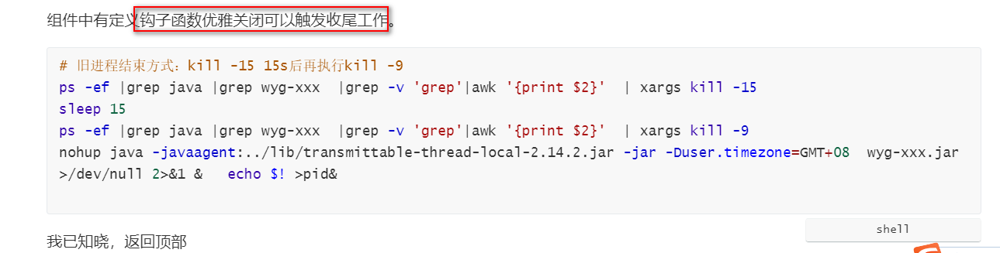

在加上在工作中，发现通过流水线重启服务的时候，每次需要进行重试多次。直到处理完成所有的请求，才能进行重启

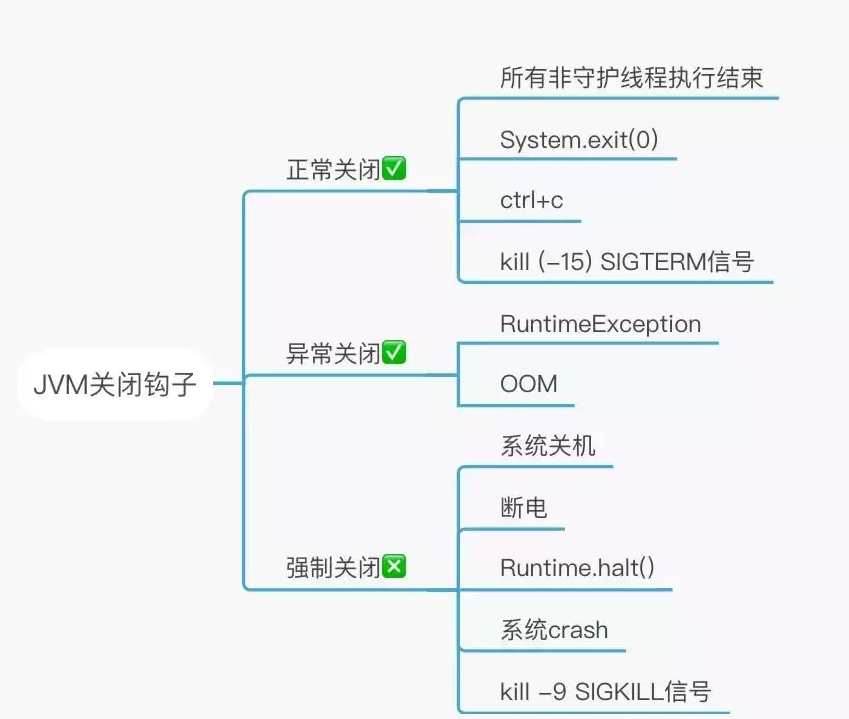

### Spring如何添加钩子函数？

Spring/SpringBoot应用，如何手动添加钩子函数呢？

Spring/SpringBoot 提供了一个方法：

```java
// 通过这种方式来添加钩子函数
ApplicationContext.registerShutdownHook();
```

`ApplicationContext.registerShutdownHook()` 方法是 Spring 框架中的一个方法，用于注册一个 JVM 关闭的钩子（shutdown hook）。

当 JVM 关闭时，Spring 容器可以优雅地关闭并释放资源，从而避免了可能的资源泄漏或其他问题。

`ApplicationContext.registerShutdownHook()` 方法应该在 Spring 应用程序的 `main` 方法中调用，以确保在 JVM 关闭时 Spring 容器能够正确地关闭。

下面是 Spring 官方的原文介绍：

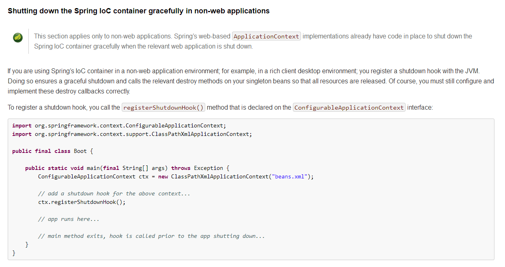

#### registerShutdownHook()源码分析

spring通过JVM实现注册退出钩子的源码如下：

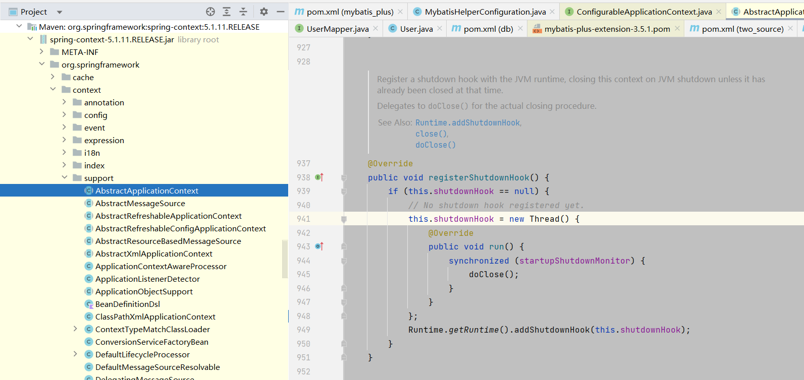

spring里`registerShutdownHook`的源码所示，就是注册一个jvm的`shutdownHook`钩子函数。jvm退出前会执行这个钩子函数。

通过源码，可以看到：`doClose()`方法会执行`bean的destroy()`，也会执行`SmartLifeCycle`的`stop()`方法，我们就可以通过重写这些方法来实现对象的关闭，生命周期的管理，实现平滑shutdown、优雅关闭。

spring 为何在容器销毁时自动 调用destroy()等方法？ 就是这里的 `destroyBeans()` 方法的执行。 所以，这里特别关注的是 `destroyBeans()` 方法。

`destroyBeans()` 是 Spring 框架中的一个方法，它是在 Spring 容器关闭时调用的方法，用于销毁所有的单例 bean。

在 Spring 容器关闭时，会依次调用所有单例 bean 的 `destroy()` 方法，而 `destroyBeans()` 方法就是用于触发这个过程的。

在 `destroy()` 方法中，我们可以释放资源、关闭连接等操作，以确保应用程序正确地关闭。

#### destroy() 方法如何使用

两个方式：

- 方式一： 实现了 `DisposableBean` 接口，并重写了其中的 `destroy()` 方法
- 方式二：使用 `@PreDestroy` 注解来指定销毁方法

`destroy()` 方法是在 Spring 容器销毁时调用的方法，用于释放资源或执行清理操作。

方式一： 实现了 `DisposableBean` 接口，并重写了其中的 `destroy()` 方法

下面是`destroy()` 方法如何使用的一个示例：

```java
public class MyBean implements DisposableBean {private Resource resource;public void setResource(Resource resource) {this.resource = resource;}// 实现 DisposableBean 接口中的 destroy() 方法@Overridepublic void destroy() throws Exception {// 释放资源if (this.resource != null) {this.resource.release();}}
}
```

在这个示例中，`MyBean` 实现了 `DisposableBean` 接口，并重写了其中的 `destroy()` 方法。

在 `destroy()` 方法中，我们释放了 `resource` 资源。

当 Spring 容器销毁时，会自动调用 `MyBean` 的 `destroy()` 方法，从而释放资源。

方式二：使用 `@PreDestroy` 注解来指定销毁方法

除了实现 `DisposableBean` 接口，还可以使用 `@PreDestroy` 注解来指定销毁方法。例如：

```java
public class MyBean {private Resource resource;public void setResource(Resource resource) {this.resource = resource;}// 使用 @PreDestroy 注解指定销毁方法@PreDestroypublic void releaseResource() {if (this.resource != null) {this.resource.release();}}
}
```

在这个示例中，`MyBean` 没有实现 `DisposableBean` 接口，而是使用 `@PreDestroy` 注解指定了销毁方法 `releaseResource()`。当 Spring 容器销毁时，会自动调用这个方法。

#### Springboot 如何自动注册的钩子函数的

实际上， `registerShutdownHook()` 钩子方法，在新的Springboot 版本中，不需要手动调用，已经被自动的执行了。

看一个简单的应用， 尼恩带大家，一步一步的翻翻源码：


顺着run的调用链路，继续往里翻看，会看到`refreshContext` 方法的执行

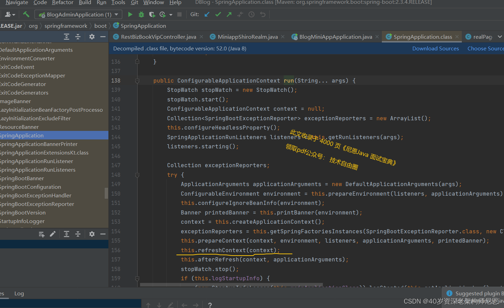

关键就在于这个 `refreshContext` 方法

继续往里翻看，发现一个秘密： 自动调用了`registerShutdownHook()` 方法

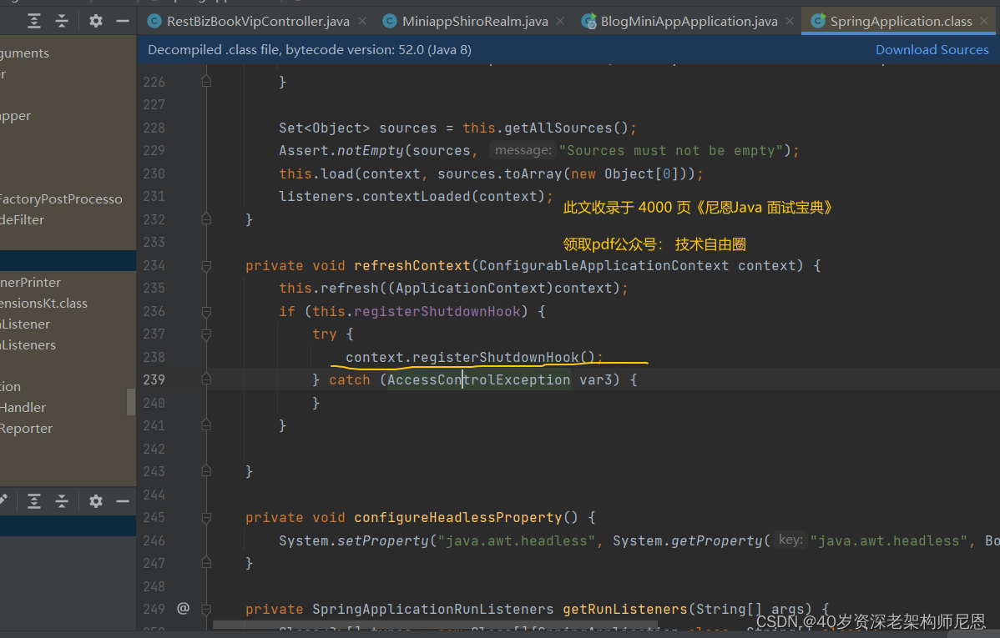

好吧，终于回到了 registerShutdownHook()源码 ，这个上面详细介绍了的

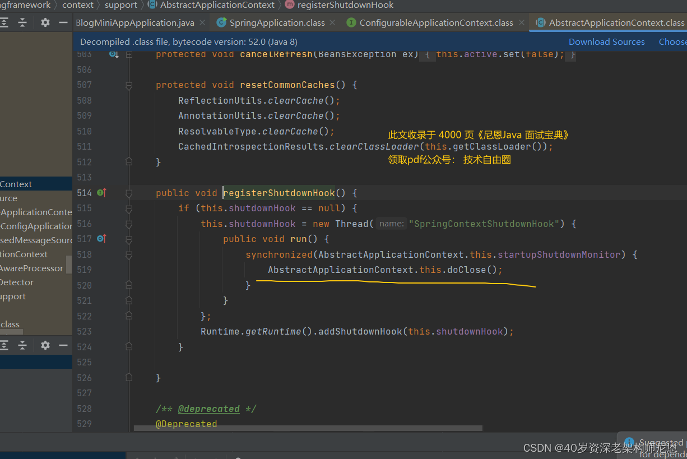

细心的小伙伴，可能发现那儿有个条件，如果条件不满足，基本上就跳过去了。

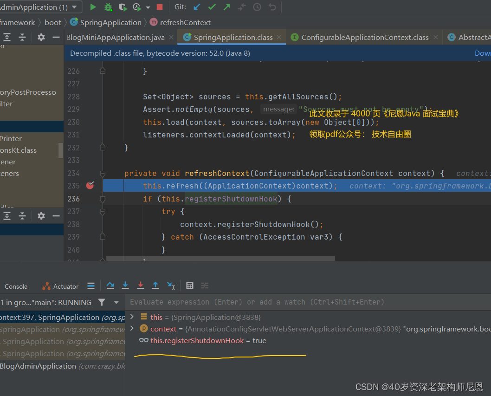

咱们单步执行一下，发现一个秘密：条件默认就是true


### SpringBoot应用的优雅停机

除了 微服务的无损下线，作为 SpringBoot应用， 还有 单体服务优雅停机的需求：

- 处理没有完成的请求，注意，不再接收新的请求
- 池化资源的释放：数据库连接池，HTTP 连接池
- 处理线程的释放：已经被连接的HTTP请求

这些前面介绍到 ，咱们就先用放在 JVM 处理钩子方法里边去了。

SpringBoot应用的优雅停机，实际上指的是内嵌WEB服务器的优雅停机。

目前Spring Boot已经发展到了2.3.4.RELEASE，伴随着2.3版本的到来，优雅停机机制也更加完善了。

### 什么是Web 容器优雅停机行为

Web 容器优雅停机行为指的是在关闭容器时，让当前正在处理的请求处理完成或者等待一段时间，让正在处理的请求完成后再关闭容器，而不是直接强制终止正在处理的请求。这样可以避免正在处理的请求被中断，从而提高系统的可用性和稳定性。

一般来说，Web 容器的优雅停机行为需要满足以下几个条件：

1. 等待正在处理的请求完成，不再接受新的请求。
2. 如果等待时间超过了一定阈值，容器可以强制关闭。
3. 在容器关闭之前，需要给客户端一个响应，告知他们当前正在关闭容器，不再接受新的请求

### 优雅停机的目的：

如果没有优雅停机，服务器此时直接直接关闭(kill -9)，那么就会导致当前正在容器内运行的业务直接失败，在某些特殊的场景下产生脏数据。

### 优雅停机具体行为：

在服务器执行关闭（kill -2）时，会预留一点时间使容器内部业务线程执行完毕，

增加了优雅停机配置后, 此时容器也不允许新的请求进入。

目前版本的Spring Boot 优雅停机支持Jetty, Reactor Netty, Tomcat和 Undertow 以及反应式和基于 Servlet 的 web 应用程序都支持优雅停机功能。

新请求的处理方式跟web服务器有关，Reactor Netty、 Tomcat将停止接入请求，Undertow的处理方式是返回503。

具体行为，如下表所示：

| web 容器名称   | 行为说明                                 |
| -------------- | ---------------------------------------- |
| tomcat 9.0.33+ | 停止接收请求，客户端新请求等待超时。     |
| Reactor Netty  | 停止接收请求，客户端新请求等待超时。     |
| Undertow       | 停止接收请求，客户端新请求直接返回 503。 |

不同的 Web 容器实现优雅停机的方式可能会有所不同，但是一般都会提供相关的配置选项或者 API 接口来实现这个功能。

另外，和SpringBoot内嵌的WEB服务器类似，其他的非SpringBoot内嵌WEB服务器，也可以进行设置。

下面是 Nginx 和 Apache 的优雅停机配置：

- Nginx 可以通过配置文件中的 `worker_shutdown_timeout` 选项来设置等待时间
- Apache 可以通过 `graceful-stop` 命令来实现优雅停机。

### 优雅停机的使用和配置

新版本配置非常简单，`server.shutdown=graceful` 就搞定了（注意，优雅停机配置需要配合Tomcat 9.0.33（含）以上版本）

```yaml
server:port: 6080
shutdown: graceful #开启优雅停机
spring:lifecycle:timeout-per-shutdown-phase: 20s #设置缓冲时间 默认30s
```

在设置了缓冲参数`timeout-per-shutdown-phase` 后，在规定时间内如果线程无法执行完毕则会被强制停机。

下面我们来看下停机时，加了优雅停日志和不加的区别：

```java
//未加优雅停机配置
Disconnected from the target VM, address: '127.0.0.1:49754', transport: 'socket'
Process finished with exit code 130 (interrupted by signal 2: SIGINT)
```

加了优雅停机配置后，

日志可明显发现的 **Waiting for active requests to cpmplete**, 此时容器将在ShutdownHook执行完毕后停止。

### 优雅退出原理

前面讲到，SpringBoot 的优雅退出，最终在 Java 程序中可以通过添加钩子，在程序退出时会执行钩子方法，从而实现关闭资源、平滑退出、优雅退出等功能。

SpringBoot 在启动过程中，则会默认注册一个JVM Shutdown Hook，在应用被关闭的时候，会触发钩子调用 doClose()方法，去关闭容器。

这部分代码，前面介绍了，具体在 `org.springframework.boot.SpringApplication#refreshContext` 方法中


#### 注册实现smartLifecycle的Bean

在创建 webserver 的时候，会创建一个实现`smartLifecycle`的 bean，用来支撑 server 的优雅关闭。

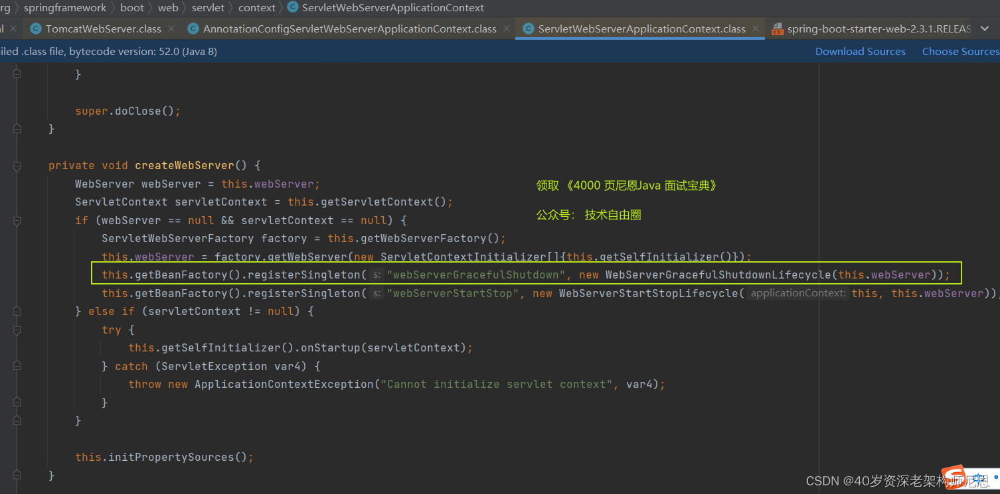

```java
// 注册webServerGracefulShutdown用来实现server优雅关闭
this.getBeanFactory().registerSingleton("webServerGracefulShutdown", new WebServerGracefulShutdownLifecycle(this.webServer));
}
```

可以看到 WebServerGracefulShutdownLifecycle 类实现`SmartLifecycle`接口，重写了 stop 方法，stop 方法会触发 webserver 的优雅关闭方法(取决于具体使用的 webserver 如 tomcatWebServer)。

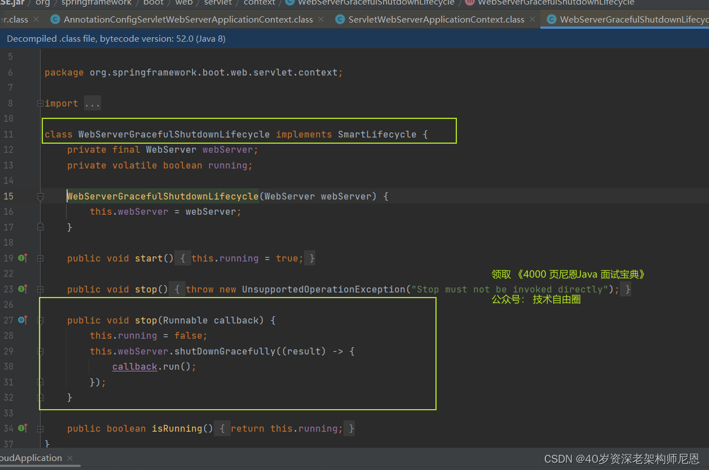

```java
 // 优雅关闭server
this.webServer.shutDownGracefully((result) -> callback.run());
```

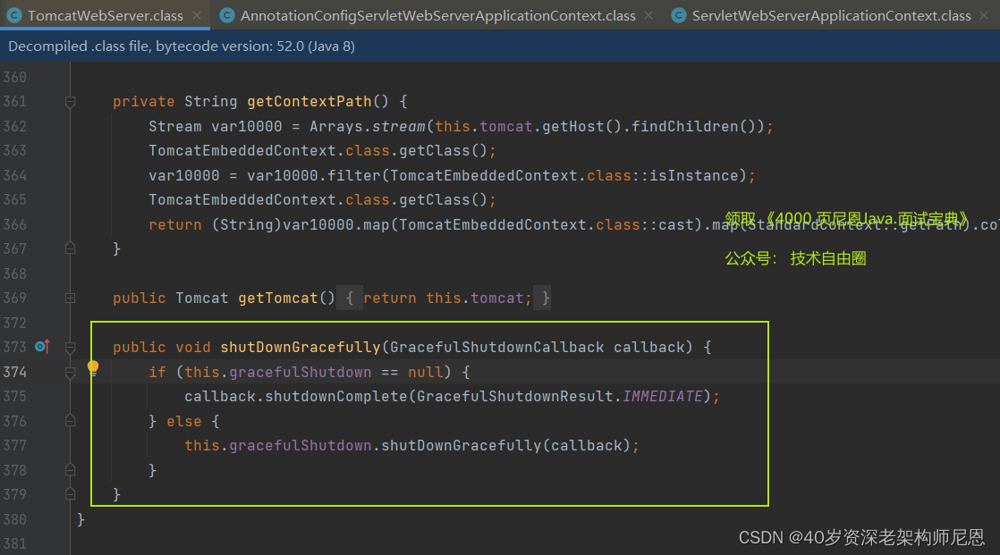

```java
@Override
public void shutDownGracefully(GracefulShutdownCallback callback) {if (this.gracefulShutdown == null) {// 如果没有开启优雅停机，会立即关闭tomcat服务器callback.shutdownComplete(GracefulShutdownResult.IMMEDIATE);return;}// 优雅关闭服务器this.gracefulShutdown.shutDownGracefully(callback);
}
```

至此，优雅退出的代码，通过smartLifecycle的Bean 的stop 方法实现退出的回调注册。

#### smartLifecycle回调执行的流程和时机

smartLifecycle的Bean 的stop 方法什么时候被执行呢?

上文提到JVM钩子方法被调用后，会执行 doColse()方法，

而这个 doColse()方法， 在关闭容器之前，会通过 lifecycleProcessor 调用 lifecycle 的方法。

```java
protected void doClose() {if (this.active.get() && this.closed.compareAndSet(false, true)) {LiveBeansView.unregisterApplicationContext(this);// 发布 ContextClosedEvent 事件publishEvent(new ContextClosedEvent(this));// 回调所有实现Lifecycle 接口的Bean的stop方法if (this.lifecycleProcessor != null) {this.lifecycleProcessor.onClose();}// 销毁bean, 关闭容器destroyBeans();closeBeanFactory();onClose();if (this.earlyApplicationListeners != null) {this.applicationListeners.clear();this.applicationListeners.addAll(this.earlyApplicationListeners);}// Switch to inactive.this.active.set(false);}
}
```

关闭 Lifecycle Bean 的入口：

```java
org.springframework.context.support.DefaultLifecycleProcessor
```

具体的代码如下：

```java
public class DefaultLifecycleProcessor implements LifecycleProcessor, BeanFactoryAware {@Overridepublic void onClose() {stopBeans();this.running = false;}private void stopBeans() {//获取所有的 Lifecycle beanMap<String, Lifecycle> lifecycleBeans = getLifecycleBeans();//按Phase值对bean分组, 如果没有实现 Phased 接口则认为 Phase 是 0Map<Integer, LifecycleGroup> phases = new HashMap<>();lifecycleBeans.forEach((beanName, bean) -> {int shutdownPhase = getPhase(bean);LifecycleGroup group = phases.get(shutdownPhase);if (group == null) {group = new LifecycleGroup(shutdownPhase, this.timeoutPerShutdownPhase, lifecycleBeans, false);phases.put(shutdownPhase, group);}group.add(beanName, bean);});if (!phases.isEmpty()) {List<Integer> keys = new ArrayList<>(phases.keySet());//按照 Phase 值倒序keys.sort(Collections.reverseOrder());// Phase值越大优先级越高，先执行for (Integer key : keys) {phases.get(key).stop();}}}
```

`DefaultLifecycleProcessor` 的 stop 方法执行流程:

- 获取容器中的所有实现了 Lifecycle 接口的 Bean。
  由于 smartLifecycle 接口继承了 Lifecycle， 在这里被获取到了。
- 再对包含所有 bean 的 List 分组按 phase 值倒序排序，值大的排前面。 (没有实现 Phased 接口, Phase 默认为0)
- 依次调用各分组的里 bean 的 stop 方法 （ Phase 越大 stop 方法优先执行）

stop 方法的实现，在这里就终于被执行了。

完成 tomcat的优雅退出行为，执行完之前接收到的请求，实现优雅退出。

#### SpringBoot 优雅停机的执行流程总结:

- SpringBoot 通过 Shutdown Hook 来注册 doclose() 回调方法，在应用关闭的时候触发执行。
- SpringBoot 在创建 webserver的时候，会注册实现 smartLifecycel 接口的 bean,用来优雅关闭 tomcat
- doClose()在销毁 bean, 关闭容器之前会执行所有实现 Lifecycel 接口 bean 的 stop方法，并且会按 Phase 值分组, phase 大的优先执行。
- `WebServerGracefulShutdownLifecycle`，`Phase=Inter.MAX_VALUE`，处于最优先执行序列，所以会先触发优雅关闭 tomcat ，并且tomcat 关闭方法是异步执行的，主线会继续调用执行本组其他 bean 的关闭方法，然后等待所有 bean 关闭完毕，超过等待时间，会执行下一组 Lifecycle bean 的关闭。

### SpringBoot应用的优雅停机如何触发

通过源码分析，大家也发现了，SpringBoot应用的优雅停机，是注册了 JVM 优雅退出的钩子方法

JVM 优雅退出的钩子方法如何触发的呢？

常见的触发方式有：

- 方式一：kill PID
- 方式二：shutdown端点

#### 方式一：kill PID

使用方式：kill java进程ID

kill命令的格式是 `kill -Signal pid`，其中 pid 就是进程的编号，signal是发送给进程的信号，默认参数下，kill 发送 SIGTERM（15）信号给进程，告诉进程，你需要被关闭，请自行停止运行并退出。

**kill、kill -9、kill -3的区别**

kill 会默认传15代表的信号为SIGTERM，这是告诉进程你需要被关闭，请自行停止运行并退出，进程可以清理缓存自行结束，也可以拒绝结束。

`kill -9`代表的信号是SIGKILL，表示进程被终止，需要立即退出，强制杀死该进程，这个信号不能被捕获也不能被忽略。

`kill -3`可以打印进程各个线程的堆栈信息，`kill -3 pid` 后文件的保存路径为：`/proc/${pid}/cwd`，文件名为：antBuilderOutput.log

其他的Kill信号清单如下：

| 信号      | 取值     | 默认动作                             | 含义（发出信号的原因）                 |
| --------- | -------- | ------------------------------------ | -------------------------------------- |
| SIGHUP    | 1        | Term                                 | 终端的挂断或进程死亡                   |
| SIGINT    | 2        | Term                                 | 来自键盘的中断信号                     |
| SIGQUIT   | 3        | Core                                 | 来自键盘的离开信号                     |
| SIGILL    | 4        | Core                                 | 非法指令                               |
| SIGABRT   | 6        | Core                                 | 来自abort的异常信号                    |
| SIGFPE    | 8        | Core                                 | 浮点例外                               |
| SIGKILL   | 9        | Term                                 | 杀死                                   |
| SIGSEGV   | 11       | Core                                 | 段非法错误(内存引用无效)               |
| SIGPIPE   | 13       | Term                                 | 管道损坏：向一个没有读进程的管道写数据 |
| SIGALRM   | 14       | Term                                 | 来自alarm的计时器到时信号              |
| SIGTERM   | 15       | Term                                 | 终止                                   |
| SIGUSR1   | 30,10,16 | Term                                 | 用户自定义信号1                        |
| SIGUSR2   | 31,12,17 | Term                                 | 用户自定义信号2                        |
| SIGCHLD   | 20,17,18 | Ign                                  | 子进程停止或终止                       |
| SIGCONT   | 19,18,25 | Cont                                 | 如果停止，继续执行                     |
| SIGSTOP   | 17,19,23 | Stop                                 | 非来自终端的停止信号                   |
| SIGTSTP   | 18,20,24 | Stop                                 | 来自终端的停止信号                     |
| SIGTTIN   | 21,21,26 | Stop                                 | 后台进程读终端                         |
| SIGTTOU   | 22,22,27 | Stop                                 | 后台进程写终端                         |
| SIGBUS    | 10,7,10  | Core                                 | 总线错误（内存访问错误）               |
| SIGPOLL   | Term     | Pollable事件发生(Sys V)，与SIGIO同义 |                                        |
| SIGPROF   | 27,27,29 | Term                                 | 统计分布图用计时器到时                 |
| SIGSYS    | 12,-,12  | Core                                 | 非法系统调用(SVr4)                     |
| SIGTRAP   | 5        | Core                                 | 跟踪/断点自陷                          |
| SIGURG    | 16,23,21 | Ign                                  | socket紧急信号(4.2BSD)                 |
| SIGVTALRM | 26,26,28 | Term                                 | 虚拟计时器到时(4.2BSD)                 |
| SIGXCPU   | 24,24,30 | Core                                 | 超过CPU时限(4.2BSD)                    |
| SIGXFSZ   | 25,25,31 | Core                                 | 超过文件长度限制(4.2BSD)               |
| SIGIOT    | 6        | Core                                 | IOT自陷，与SIGABRT同义                 |
| SIGEMT    | 7,-,7    | Term                                 |                                        |
| SIGSTKFLT | -,16,-   | Term                                 | 协处理器堆栈错误(不使用)               |
| SIGIO     | 23,29,22 | Term                                 | 描述符上可以进行I/O操作                |
| SIGCLD    | -,-,18   | Ign                                  | 与SIGCHLD同义                          |
| SIGPWR    | 29,30,19 | Term                                 | 电力故障(System V)                     |
| SIGINFO   | 29,-,-   | 与SIGPWR同义                         |                                        |
| SIGLOST   | -,-,-    | Term                                 | 文件锁丢失                             |
| SIGWINCH  | 28,28,20 | Ign                                  | 窗口大小改变(4.3BSD, Sun)              |
| SIGUNUSED | -,31,-   | Term                                 | 未使用信号(will be SIGSYS)             |

#### 方式二：shutdown端点

Spring Boot 提供了/shutdown端点，可以借助它实现优雅停机。

使用方式：在想下线应用的application.yml中添加如下配置，从而启用并暴露/shutdown端点：

```yaml
management:endpoint:shutdown:enabled: trueendpoints:web:exposure:include: shutdown
```

发送 POST 请求到/shutdown端点

```bash
curl -X http://ip:port/actuator/shutdown
```

该方式本质和方式一是一样的，也是借助 Spring Boot 应用的 Shutdown hook 去实现的。

#### shutdown端点的源码分析

actuator 都使用了SPI的扩展方式，

先看下AutoConfiguration，可以看到关键点就是ShutdownEndpoint

```java
@Configuration(proxyBeanMethods = false
)
@ConditionalOnAvailableEndpoint(endpoint = ShutdownEndpoint.class
)
public class ShutdownEndpointAutoConfiguration {public ShutdownEndpointAutoConfiguration() {}@Bean(destroyMethod = "")@ConditionalOnMissingBeanpublic ShutdownEndpoint shutdownEndpoint() {return new ShutdownEndpoint();}
}
```

**ShutdownEndpoint**,的核心代码如下：

```java
@Endpoint(id = "shutdown",enableByDefault = false
)
public class ShutdownEndpoint implements ApplicationContextAware {@WriteOperationpublic Map<String, String> shutdown() {if (this.context == null) {return NO_CONTEXT_MESSAGE;} else {boolean var6 = false;Map var1;try {var6 = true;var1 = SHUTDOWN_MESSAGE;var6 = false;} finally {if (var6) {Thread thread = new Thread(this::performShutdown);thread.setContextClassLoader(this.getClass().getClassLoader());thread.start();}}Thread thread = new Thread(this::performShutdown);thread.setContextClassLoader(this.getClass().getClassLoader());thread.start();return var1;}}private void performShutdown() {try {Thread.sleep(500L);} catch (InterruptedException var2) {Thread.currentThread().interrupt();}this.context.close();  //这里才是核心}
}
```

在调用了 `this.context.close()` ，其实就是`AbstractApplicationContext` 的`close()` 方法 （重点是其中的`doClose()`）

```java
/*** Close this application context, destroying all beans in its bean factory.* <p>Delegates to {@code doClose()} for the actual closing procedure.* Also removes a JVM shutdown hook, if registered, as it's not needed anymore.* @see #doClose()* @see #registerShutdownHook()*/
@Override
public void close() {synchronized (this.startupShutdownMonitor) {doClose(); //重点：销毁bean 并执行jvm shutdown hook// If we registered a JVM shutdown hook, we don't need it anymore now:// We've already explicitly closed the context.if (this.shutdownHook != null) {try {Runtime.getRuntime().removeShutdownHook(this.shutdownHook);}catch (IllegalStateException ex) {// ignore - VM is already shutting down}}}
}
```

doClose() 方法，又回到了前面的 Spring 的核心关闭方法。

doClose()在销毁 bean, 关闭容器之前会执行所有实现 Lifecycel 接口 bean 的 stop方法，并且会按 Phase 值分组, phase 大的优先执行。

### SpringCloud + SpringBoot优雅退出总结

Spring Boot、Spring Cloud应用的优雅停机，平时经常会被问到，这也是实际应用过程中，必须要掌握的点，

这里简单总结下以前我们一般在实现的时候要把握的几个要点：

1. 关闭命令方面，一定要杜绝 kill -9 操作
2. 多线程采用线程池实现，并且线程池要优雅关闭，从而保证每个异步线程都可以随Spring的生命周期完成正常关闭操作
3. 有服务注册与发现机制下的时候，优先通过自定义K8S的POD的preStop钩子接口，来保障实例的主动下线。