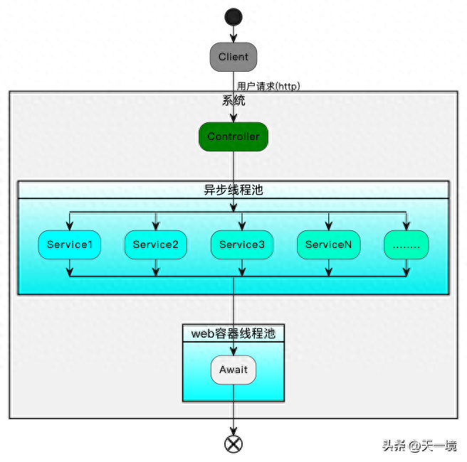

参考资料<br/>
[Springboot中使用线程池](https://juejin.cn/post/7087526683430879240)<br/>
[SpringBoot线程池的创建、@Async配置步骤及注意事项](https://blog.csdn.net/Muscleheng/article/details/81409672)<br/>
[新来了个技术总监：谁再用 @Async 创建线程以后就不用来了！！](https://mp.weixin.qq.com/s/J6BImcPxVFlG_qECgXDKrw)

[Springboot中如何让@Async的执行线程池可监控，可控制](https://www.toutiao.com/article/7304648903486472744/?app=news_article&timestamp=1700790480&use_new_style=1&req_id=202311240947598862EF6E689B0049EE01&group_id=7304648903486472744&wxshare_count=1&tt_from=weixin&utm_source=weixin&utm_medium=toutiao_android&utm_campaign=client_share&share_token=915c3f6e-02e3-4a1a-9fe4-e39eedbb7276&source=m_redirect)

## springboot多线程

充分利用Springboo的@Async在带来的系统性能提升上让人欲罢不能，咱们小白都能通过增加并发量快速实现系统的性能提升。不过线程虽好，却不能贪杯，过多的线程可能让我们的系统浪费太多的时间在处理线程上下文切换上（边际成本变高），而没有把力气放在真正的业务逻辑上，因此在系统运行期间对线程池的**监控**和**动态控制**显得尤为重要，不能太多也不能太少。



### 介绍

Java多线程的使用很多，这里介绍一下springboot中的多线程的使用，使用线程连接池

举例：用户购买服务类产品之后，需要进行预约，预约成功之后分别给商家和用户发送提醒短信。考虑发短信耗时的情况所以我想用异步的方法去执行

###  启动类开启异步

在Spring Boot的主程序中配置@EnableAsync，如下所示：

```java
@EnableAsync // 开启@Async注解
@SpringBootApplication
public class ProjectApplication {

   public static void main(String[] args) {
      SpringApplication.run(ProjectApplication.class, args);
   }
}
```

### springboot创建线程池

```Java
import org.springframework.context.annotation.Bean;
import org.springframework.context.annotation.Configuration;
import org.springframework.scheduling.annotation.EnableAsync;
import org.springframework.scheduling.concurrent.ThreadPoolTaskExecutor;

import java.util.concurrent.ThreadPoolExecutor;

/**
 * 线程池配置
 *
 * @author zhh
 */
@Configuration
public class ThreadPoolTaskConfig {

/**
 *   默认情况下，在创建了线程池后，线程池中的线程数为0，当有任务来之后，就会创建一个线程去执行任务，
 * 当线程池中的线程数目达到corePoolSize后，就会把到达的任务放到缓存队列当中；
 *  当队列满了，就继续创建线程，当线程数量大于等于maxPoolSize后，开始使用拒绝策略拒绝
 */

    /**
     * 核心线程数（默认线程数）
     */
    private static final int corePoolSize = 20;
    /**
     * 最大线程数
     */
    private static final int maxPoolSize = 100;
    /**
     * 允许线程空闲时间（单位：默认为秒）
     */
    private static final int keepAliveTime = 10;
    /**
     * 缓冲队列大小
     */
    private static final int queueCapacity = 200;
    /**
     * 线程池名前缀
     */
    private static final String threadNamePrefix = "Async-Service-";

    @Bean("taskExecutor") // bean的名称，默认为首字母小写的方法名
    public ThreadPoolTaskExecutor taskExecutor() {
        ThreadPoolTaskExecutor executor = new ThreadPoolTaskExecutor();
        executor.setCorePoolSize(corePoolSize);
        executor.setMaxPoolSize(maxPoolSize);
        executor.setQueueCapacity(queueCapacity);
        executor.setKeepAliveSeconds(keepAliveTime);
        executor.setThreadNamePrefix(threadNamePrefix);

        // 线程池对拒绝任务的处理策略
        // CallerRunsPolicy：由调用线程（提交任务的线程）处理该任务
        executor.setRejectedExecutionHandler(new ThreadPoolExecutor.CallerRunsPolicy());
        // 初始化
        executor.initialize();
        return executor;
    }
}

```

### 实现类

第一个类（这里模拟取消订单后发短信，有两个发送短信的方法）：

```java
@Service
public class TranTest2Service {
    Logger log = LoggerFactory.getLogger(TranTest2Service.class);

    // 发送提醒短信 1
    @Async("taskExecutor")// 指定线程池，也可以直接写@Async
    public void sendMessage1() throws InterruptedException {
        log.info("发送短信方法---- 1   执行开始");
        Thread.sleep(5000); // 模拟耗时
        log.info("发送短信方法---- 1   执行结束");
    }

    // 发送提醒短信 2
    @Async("taskExecutor") // 指定线程池，也可以直接写@Async
    public void sendMessage2() throws InterruptedException {

        log.info("发送短信方法---- 2   执行开始");
        Thread.sleep(2000); // 模拟耗时
        log.info("发送短信方法---- 2   执行结束");
    }

}
```

第二个类。调用发短信的方法 （异步方法不能与被调用的异步方法在同一个类中，否则无效）：

```java
import org.slf4j.Logger;
import org.slf4j.LoggerFactory;
import org.springframework.beans.factory.annotation.Autowired;
import org.springframework.stereotype.Service;

@Service
public class OrderTaskService2 {
    Logger log = LoggerFactory.getLogger(OrderTaskService.class);

    @Autowired
    private TranTest2Service tranTest2Service;

    // 订单处理任务
    public void orderTask2() throws InterruptedException {
        this.cancelOrder(); // 取消订单
        tranTest2Service.sendMessage1(); // 发短信的方法   1
        tranTest2Service.sendMessage2(); // 发短信的方法  2
    }

    // 取消订单
    public void cancelOrder() throws InterruptedException {
        log.info("取消订单的方法执行------开始");
        log.info("取消订单的方法执行------结束 ");
    }
}
```

测试结果

```Java
import org.junit.Test;
import org.junit.runner.RunWith;
import org.springframework.beans.factory.annotation.Autowired;
import org.springframework.boot.test.context.SpringBootTest;
import org.springframework.test.context.junit4.SpringRunner;
import xyz.guqing.project.ProjectApplication;
import xyz.guqing.project.server.OrderTaskService2;

@RunWith(SpringRunner.class)
@SpringBootTest(classes = ProjectApplication.class, webEnvironment = SpringBootTest.WebEnvironment.RANDOM_PORT)
public class SyncDemo2 {

    @Autowired
    private OrderTaskService2 orderTaskService;

    @Test
    public void orderTask2() throws Exception{
        orderTaskService.orderTask2();
        Thread.currentThread().join();  // 防止异步结束程序
    }
}
```

运行结果


从运行的结果可以看出，总共有三个线程可以执行。调用两次异步，这两次的异步，是从线程池获取新的线程

### 获取异步的结果

- 执行类

```
public class TranTestService {

    Logger log = LoggerFactory.getLogger(TranTestService.class);

    // 发送提醒短信 1
    @Async("taskExecutor")// 指定线程池，也可以直接写@Async
    public Future<String> sendMessage1() throws InterruptedException {
        log.info("发送短信方法---- 1   执行开始");
        Thread.sleep(5000); // 模拟耗时
        log.info("发送短信方法---- 1   执行结束");
        return new AsyncResult<>("1");
    }

}
```

- 调用者

```java
@Service
public class OrderTaskService {

    Logger log = LoggerFactory.getLogger(OrderTaskService.class);

    @Autowired
    private TranTestService tranTestService;

    public void orderTask() throws ExecutionException, InterruptedException {
        Future<String> future = tranTestService.sendMessage1();
        String s = future.get();
        log.info("返回的结果是：" + s);
    }
}
```

- 测试类

```java
@RunWith(SpringRunner.class)
@SpringBootTest(classes = ProjectApplication.class, webEnvironment = SpringBootTest.WebEnvironment.RANDOM_PORT)
public class SyncDemo {

    @Autowired
    private OrderTaskService orderTaskService;

    @Test
    public void test01() throws ExecutionException, InterruptedException {
        orderTaskService.orderTask();
    }
}
```

- 运行结果


### 注意

如下方式会使@Async失效

> 一、异步方法使用static修饰<br/>
> 二、异步类没有使用@Component注解（或其他注解）导致spring无法扫描到异步类<br/>
> 三、异步方法不能与被调用的异步方法在同一个类中<br/>
> 四、类中需要使用@Autowired或@Resource等注解自动注入，不能自己手动new对象<br/>
> 五、如果使用SpringBoot框架必须在启动类中增加@EnableAsync注解<br/>

## 如何监控@Async线程池的使用情况

> 当然如果我们想监控线程池的运行状况，完全可以自己实现一个线程池。不过我们一般不会去重复造轮子啦~~，因此这里我们要引入一个非常牛的线程池框架：dynamic-tp，这个线程池框架不仅能让我们有动态配置线程池大小的能力，也有很强的告警、日志等能力。

- 引入**dynamic-tp**的依赖

```xml
<dependency>
  <groupId>org.dromara.dynamictp</groupId>
  <artifactId>dynamic-tp-spring-boot-starter-common</artifactId>
  <version>1.1.5</version>
</dependency>
```

- 打开启动类开关

```java
@EnableDynamicTp
@SpringBootApplication
@EnableAsync
public class Application {
    public static void main(String[] args) {
        // springboot启动
        SpringApplication.run(Application.class, args);
        System.out.println("服务启动了");
    }
}
```

- 配置文件

```yaml
spring.dynamic:
  tp:
    enabled: true
    enabledCollect: true # 是否开启监控指标采集，默认false
    collectorTypes: micrometer,logging # 监控数据采集器类型（logging | micrometer | internal_logging），默认micrometer
    logPath: /home/logs # 监控日志数据路径，默认 ${user.home}/logs，采集类型非logging不用配置
    monitorInterval: 5 # 监控时间间隔（报警检测、指标采集），默认5s
    executors: # 动态线程池配置，都有默认值，采用默认值的可以不配置该项，减少配置量
      - threadPoolName: tyj-executor-tp
        threadPoolAliasName: 测试线程池 # 线程池别名
        executorType: common # 线程池类型common、eager：适用于io密集型
        corePoolSize: 6
        maximumPoolSize: 8
        queueCapacity: 200
        queueType: VariableLinkedBlockingQueue # 任务队列，查看源码QueueTypeEnum枚举类
        rejectedHandlerType: CallerRunsPolicy # 拒绝策略，查看RejectedTypeEnum枚举类
        keepAliveTime: 50
        allowCoreThreadTimeOut: false # 是否允许核心线程池超时
        threadNamePrefix: dynamic-tp- # 线程名前缀
        waitForTasksToCompleteOnShutdown: false # 参考spring线程池设计，优雅关闭线程池
        awaitTerminationSeconds: 5 # 单位（s）
        preStartAllCoreThreads: false # 是否预热所有核心线程，默认false
        runTimeout: 200 # 任务执行超时阈值，目前只做告警用，单位（ms）
        queueTimeout: 100 # 任务在队列等待超时阈值，目前只做告警用，单位（ms）
        taskWrapperNames: ["ttl", "mdc"] # 任务包装器名称，继承TaskWrapper接口
        notifyEnabled: true # 是否开启报警，默认true
```

- 指定Async注解的参数为**tyj-executor-tp**就能将@Async的执行线程切换到dynamic-tp为我们管理的线程池咯。通过dynamictp线程池的管理能力我们就能实现类似【线程变动通知】、【日志打印】、【动态管理】等丰富的功能了。

## 写在最后

- 线程池的恰到好处的使用能为我们带来很多性能提升。
- dynamictp是一款非常好的线程池管理包，除了文中介绍的管理一步执行线程池之外，它还能替换很多中间件的线程池，比如tomcat、dubbo等。
- 我们所谓的**架构能力**，无非就是**懂底层之理**，**行站巨肩之事**。
- 本文实验代码地址，持续更新，又猛又持久！！欢迎关注。

```curl
https://gitee.com/slackwareer/tyj-springboot
```