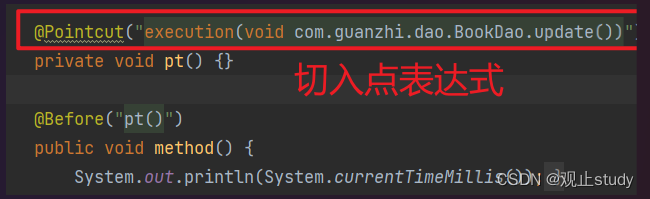
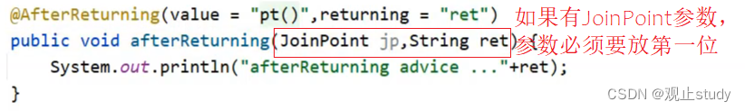

参考资料<br/>
[【Spring】AOP切入点表达式&通知类型&数据获取(二)](https://blog.csdn.net/m0_66570338/article/details/129906767)<br/>
[spring boot切面execution表达式添加多个包路径](https://blog.csdn.net/u011974797/article/details/136815442)<br/>


## AOP 详细介绍

## 一.切入点表达式

在上一篇的案例中我们发现**切面表达式负责描述我们需要增强的方法**有着重要的作用，接下来便让我们来认识并学习一下切入点表达式~


### (1) 语法格式

首先我们先要明确两个概念:

- `切入点`:要进行增强的方法
- `切入点表达式`:**描述**切入点方法的一种**表达式**

切入点表达式有众多书写形式，我们学习如下两种常见的形式~

#### (1.1) 根据方法签名匹配

对于切入点方法签名的描述，我们其实也是有两种方式的，先来看下前面的例子


**描述方式一**：执行com.guanzhi.dao包下的BookDao接口中的无参数update方法

```java
execution(void com.guanzhi.dao.BookDao.update())
```

**描述方式二**：执行com.guanzhi.dao.impl包下的BookDaoImpl类中的无参数update方法

```java
execution(void com.guanzhi.dao.impl.BookDaoImpl.update())
```

因为调用接口方法的时候最终运行的还是其实现类的方法，所以上面两种描述方式都是可以的，但是为了减少耦合，我们通常都是描述接口类。

由此我们可发现切入点表达式为方法的具体描述，其**语法**为:

- **切入点表达式标准格式**：`动作关键字(访问修饰符 返回值 包名.类/接口名.方法名(参数) throw 异常名）`

对于这个格式，我们不需要硬记，通过一个例子，理解它:

```java
execution(public User com.guanzhi.service.UserService.findById(int))
```

- execution：动作关键字，描述切入点的行为动作，例如execution表示执行到指定切入点
- public:访问修饰符,还可以是public，private等，public可以省略
- User：返回值，写返回值类型
- com.guanzhi.service：包名，多级包使用点连接
- UserService:类/接口名称
- findById：方法名
-  int:参数，直接写参数的类型，多个类型用逗号隔开
-  异常名：注意是方法声明上抛出的指定异常，不是实际运行时抛出的异常！！！可以省略

**概述**：执行com.guanzhi.service包下的UserService接口中的参数类型为int返回值为User的findById方法。也就是说我们要能通过给定的描述找到对应的方法~

#### (1.2) 根据注解匹配

我们除了可以通过描述具体的方法来编写切入点表达式外，还可以通过**匹配标识有特定注解的方法**的形式来描述切入点。这通常可用于[自定义注解](https://so.csdn.net/so/search?q=自定义注解&spm=1001.2101.3001.7020)进行方法的权限管理。

**语法**：`@annotation(注解的全类名)`

1. 例如我们简单创建一个用于标识管理员权限允许操作方法的注解

```java
@Target(ElementType.METHOD)
@Retention(RetentionPolicy.RUNTIME)
public @interface Admin {
}
```

2. 给update方法写上管理员注解

```java
    @Admin
    public void update(){
        System.out.println("book dao update ...");
    }
```

3. 编写切入点表达式描述切入点

```java
   // 描述我们使用的注解
    @Pointcut("@annotation(com.guanzhi.annotation.Admin)")
    private void admin() {
    }

	// 绑定
    @Before("admin()")
    public void control() {
        System.out.println("管理员权限操作");
    }
```

我们调用一下update方法，可以看到成功的进行了匹配


#### (1.3) 简写

我们发现上述都是将切入点表达式写在一个空方法上，再进行使用，其实这样做是为了**更好的维护与复用**切入点表达式。但在我们平时使用时，如果用法极其简单，我们也可以选择不写空方法而是直接写在通知上。

```java
   // 通过特定标签进行匹配
	@Before("@annotation(com.guanzhi.annotation.Admin)")
    public void control() {
        System.out.println("管理员权限操作");
    }

	// 通过方法签名进行匹配
    @Before("execution(void com.guanzhi.dao.BookDao.update())")
    public void method() {
        System.out.println(System.currentTimeMillis());
    }

```

**总结一下**：切入点表达式就是要找到需要增强的方法，所以它就是对一个具体方法的描述，但是在我们的项目中定义的方法通常会有很多，如果每一个方法对应写一个切入点表达式，想想这块就会觉得将来编写起来会比较麻烦，有没有更简单的方式呢?

这时就需要用到下面所学习的通配符。

### (2) 通配符

当我们的方法有很多时，我们可以使用通配符描述切入点，主要的目的就是简化大量切入点表达式的书写，例如：

- `*`:**单个独立的任意符号，可以独立出现，也可以作为前缀或者后缀的匹配符出现**

```java
execution（public * com.guanzhi.*.UserService.find*(*))
```

- 匹配com.guanzhi包下的**任意包**中的UserService类中所有**find开头**的**带有一个参数**的**任意返回值**的方法
- `..`：**多个连续的任意符号，可以独立出现，常用于简化包名与参数的书写**

```java
execution（public User com..UserService.findById(..))
```

- 匹配com包下的任意包中的UserService类中所有名称为findById返回值为User的方法
- `+`：专用于匹配**子类**类型

```java
execution(* *..*Service+.*(..))
```

- 这个使用率较低，描述子类的，咱们做JavaEE开发，继承机会就一次，使用都很慎重，所以很少用它。*Service+，表示所有以Service结尾的接口的子类。

接下来，我们把案例中使用到的切入点表达式来分析下:


```java
execution(void com.guanzhi.dao.BookDao.update())
√ 匹配接口，能匹配到
   
execution(void com.guanzhi.dao.impl.BookDaoImpl.update())
√ 匹配实现类，能匹配到
    
execution(* com.guanzhi.dao.impl.BookDaoImpl.update())
√ 返回值任意，能匹配到
    
execution(* com.guanzhi.dao.impl.BookDaoImpl.update(*))
× 返回值任意，但是update方法必须要有一个参数，无法匹配，要想匹配需要在update接口和实现类添加参数
    
execution(void com.*.*.*.*.update())
√ 返回值为void,com包下的任意包三层包下的任意类的update方法，匹配到的是实现类，能匹配
    
execution(void com.*.*.*.update())
√ 返回值为void,com包下的任意两层包下的任意类的update方法，匹配到的是接口，能匹配
    
execution(void *..update())
√ 返回值为void，方法名是update的任意包下的任意类，能匹配
    
execution(* *..*(..))
√ 匹配项目中任意类的任意方法，能匹配，但是不建议使用这种方式，影响范围广
    
execution(* *..u*(..))
√ 匹配项目中任意包任意类下只要以u开头的方法，update方法能满足，能匹配
    
execution(* *..*e(..))
√ 匹配项目中任意包任意类下只要以e结尾的方法，update和save方法能满足，能匹配
    
execution(void com..*())
√ 返回值为void，com包下的任意包任意类任意方法，能匹配，*代表的是方法
    
execution(* com.guanzhi.*.*Service.find*(..))
√ 将项目中所有业务层方法的以find开头的方法匹配
    
execution(* com.guanzhi.*.*Service.save*(..))
√ 将项目中所有业务层方法的以save开头的方法匹配
```

#### 多个切点

在Spring Boot中，如果你想为多个包中的方法创建一个切面，你可以在@Pointcut注解中使用||操作符来指定多个包。

```java
// 定义切入点为两个包中的任意方法
@Pointcut("execution(* com.example.package1..*.*(..)) || execution(* com.example.package2..*.*(..))")
public void myPointcut() {
}
```

排除某个接口

```
// 定义切点，包括所有接口的方法，除了login接口
@Pointcut("execution(* com.example.package1..*.*(..)) && !execution(* com.example.controller.testController.login(..))")
public void myPointcut() {
}
```

整个表达式可以分为五个部分：

```
1、execution(): 表达式主体，可以扫描控制层的接口、某个注解、或者其他需要扫描的类。
2、第一个*号：表示返回类型，*号表示所有的类型，比如public,protect,private等。
3、包名：表示需要拦截的包名，后面的两个句点表示当前包和当前包的所有子包，com.demo.service.impl包、子孙包下所有类的方法。
4、第二个*号：表示子包名，*号表示所有子包。
5、第三个*号：表示类名，*号表示所有子包下的类。*
6、*(..):最后这个星号表示方法名， *号表示所有的方法，后面括弧里面表示方法的参数，两个句点表示任何参数。
```

### (3) 书写技巧

对于切入点表达式的编写其实是很灵活的，如果**所有代码按照标准规范开发命名，我们将获得非常愉快的体验，否则以下技巧全部失效**

- 描述切入点通**常描述接口**，而不描述实现类,如果描述到实现类，就出现紧耦合了

- 访问控制修饰符针对接口开发均采用public描述（**可省略访问控制修饰符描述**）

- 返回值类型对于**增删改类使用精准类型加速匹配**，对于**查询类**使用`*`通配快速描述

- 包名书写尽量不使用..匹配，效率过低，常用*做单个包描述匹配，或精准匹配

- 接口名/类名书写名称与模块相关的采用*匹配，例如UserService书写成*Service，绑定业务层接口名

- 方法名书写以动词进行精准匹配，名词采用*匹配，例如getById书写成getBy*,selectAll书写成selectAll

- 参数规则较为复杂，根据业务方法灵活调整

- 通常不使用异常作为匹配规则

## 二.通知类型

前面的案例中，有涉及到如下内容:

它所代表的含义是将`通知`添加到`切入点`方法执行的**前面**。Spring不可能就提供这么一个功能单一的注解给我们吧？当然，他给我们提供了五种不同类型足以供我们以对几乎所有情况。

### (1) 类型介绍

我们先来回顾下AOP通知:

- AOP通知描述了抽取的共性功能，根据共性功能抽取的位置不同，最终运行代码时要将其加入到合理的位置

根据通知具体要**添加到切入点哪个位置**，Spring给我们提供了5种通知类型:

- 前置通知
- 后置通知
- **环绕通知(重点)**
- 返回后通知(了解)
- 抛出异常后通知(了解)

为了更好的理解这几种通知类型，我们来看一张图


- `前置通知`，追加功能到方法执行前,类似于在代码1或者代码2添加内容

- `后置通知`,追加功能到方法执行后,不**管方法执行的过程中有没有抛出异常都会执行**，类似于在代码5添加内容

- `返回后通知`,追加功能到方法执行后，**只有方法正常执行结束后才进行**,类似于在代码3添加内容，如果方法执行抛出异常，返回后通知将不会被添加

- `抛出异常后通知`,追加功能到方法抛出异常后，**只有方法执行出异常才进行**,类似于在代码4添加内容，只有方法抛出异常后才会被添加
- **√**`环绕通知`,环绕通知功能比较强大，它可以**追加功能到方法执行的前后**，这也是比较常用的方式，**它可以实现其他四种通知类型的功能**。

### 准备测试环境

在学习通知类型之前，我们先来搭建一下环境以便测试使用它们。

- 创建一个Maven项目，在pom.xml添加Spring相关依赖

```xml
<dependencies>
    <dependency>
        <groupId>org.springframework</groupId>
        <artifactId>spring-context</artifactId>
        <version>5.2.10.RELEASE</version>
    </dependency>
    <dependency>
      <groupId>org.aspectj</groupId>
      <artifactId>aspectjweaver</artifactId>
      <version>1.9.4</version>
    </dependency>
</dependencies>
```

添加BookDao和BookDaoImpl类

```java
public interface BookDao {
    public void update();
    public int select();
}

@Repository
public class BookDaoImpl implements BookDao {
    public void update(){
        System.out.println("book dao update ...");
    }
    public int select() {
        System.out.println("book dao select is running ...");
        return 100;
    }
}
```

创建Spring的配置类

```java
@Configuration
@ComponentScan("com.guanzhi")
@EnableAspectJAutoProxy
public class SpringConfig {
}
```

创建通知类

```java
@Component
@Aspect
public class MyAdvice {
    @Pointcut("execution(void com.guanzhi.dao.BookDao.update())")
    private void pt(){}

    public void beforeTest() {
        System.out.println("before advice ...");
    }

    public void afterTest() {
        System.out.println("after advice ...");
    }

    public void aroundTest(){
        System.out.println("around before advice ...");
        System.out.println("around after advice ...");
    }

    public void afterReturningTest() {
        System.out.println("afterReturning advice ...");
    }
    
    public void afterThrowingTest() {
        System.out.println("afterThrowing advice ...");
    }
}
```

###  前置通知

语法：`@Before()`,在原始功能执行**前**执行

```java
@Component
@Aspect
public class MyAdvice {
    @Pointcut("execution(void com.guanzhi.dao.BookDao.update())")
    private void pt(){}
    
    @Before("pt()")
    public void beforeTest() {
        System.out.println("before advice ...");
    }
}

```

### (4) 后置通知

语法：`@After()`,在原始功能执行**后**执行

```java
@Component
@Aspect
public class MyAdvice {
    @Pointcut("execution(void com.guanzhi.dao.BookDao.update())")
    private void pt(){}
    
    @Before("pt()")
    public void beforeTest() {
        System.out.println("before advice ...");
    }
    
    // 后置通知
    @After("pt()")
    public void afterTest() {
        System.out.println("after advice ...");
    }
}

```

### (5) 返回后通知

语法：` @AfterReturning()`,原始方法正常执行完返回值后执行

```java
@Component
@Aspect
public class MyAdvice {
    
    @Pointcut("execution(int com.guanzhi.dao.BookDao.select())")
    private void pt(){}
    
    @AfterReturning("pt()")
    public void afterReturningTest() {
        System.out.println("afterReturning advice ...");
    }
}
```

注意：返回后通知是需要在原始方法select正常执行后才会被执行，如果select()方法执行的过程中出现了异常，那么返回后通知是不会被执行。而后置通知是不管原始方法有没有抛出异常都会被执行。

### (6) 异常后通知


语法： @AfterThrowing(),原始方法抛出异常后执行语法：` @AfterThrowing()`,原始方法抛出异常后执行

```java
@Component
@Aspect
public class MyAdvice {

    @Pointcut("execution(int com.guanzhi.dao.BookDao.select())")
    private void pt(){}
    
    @AfterThrowing("pt()")
    public void afterThrowingTest() {
        System.out.println("afterThrowing advice ...");
    }
}

```

**注意**：异常后通知是需要原始方法抛出异常，可以在`select()`方法中添加一行代码`int i = 1/0`进行测试。如果没有抛异常，异常后通知将不会被执行。

### (7) 环绕通知(重点)

#### (7.1) 基本使用

**语法**： `@Around()`,可环绕原始方法执行，也模拟上述四种用法，非常灵活，不过在用法稍微复杂需要**多多注意**，如下：

```java
@Component
@Aspect
public class MyAdvice {
    @Pointcut("execution(void com.guanzhi.dao.BookDao.update())")
    private void pt(){}
    
    @Around("pt()")
    public void aroundTest(){
        System.out.println("around before advice ...");
        System.out.println("around after advice ...");
    }
}
```

运行结果中，通知的内容打印出来，但是**原始方法的内容却没有被执行**。

**注意**：因为环绕通知需要在原始方法的前后进行增强，所以就**必须使用`ProceedingJoinPoint`对原始操作进行调用**，不然程序不知道从哪里开始哪里结束便会覆盖原始方法。

```java
@Component
@Aspect
public class MyAdvice {
    @Pointcut("execution(void com.guanzhi.dao.BookDao.update())")
    private void pt(){}
    
    @Around("pt()")
    public void around(ProceedingJoinPoint pjp) throws Throwable{
        System.out.println("around before advice ...");
        //表示对原始操作的调用
        pjp.proceed();
        System.out.println("around after advice ...");
    }
}

```

#### 模拟其他四种

学习完这5种通知类型，我们来思考下环绕通知是如何实现其他通知类型的功能的?

因为环绕通知是可以控制原始方法执行的，所以我们把增强的代码写在调用原始方法的不同位置就可以实现不同的通知类型的功能，如:


注意：

**@Around： 返回的就是void 。执行后，返回的结果就会变成null**


### 8) 通知类型总结

| 名称 | `@After`                               | `@AfterReturning`                                  | `@AfterThrowing`                                   | `@Around`                                | `@Before`                              |
| ---- | -------------------------------------- | -------------------------------------------------- | -------------------------------------------------- | ---------------------------------------- | -------------------------------------- |
| 类型 | 方法注解                               | 方法注解                                           | 方法注解                                           | 方法注解                                 | 方法注解                               |
| 位置 | 通知方法定义上方                       | 通知方法定义上方                                   | 通知方法定义上方                                   | 通知方法定义上方                         | 通知方法定义上方                       |
| 作用 | 当前通知方法在原始切入点方法**后**运行 | 当前通知方法在原始切入点方法**正常执行完毕后**执行 | 当前通知方法在原始切入点方法运行**抛出异常后**执行 | 当前通知方法在原始切入点**方法前后**运行 | 当前通知方法在原始切入点**方法前**运行 |

**环绕通知使用注意事项**

- 环绕通知必须依赖形参`ProceedingJoinPoint`才能**实现对原始方法的调用**，进而实现原始方法调用前后同时添加通知
- 通知中如果**未使用**ProceedingJoinPoint对原始方法进行调用将**跳过原始方法**的执行

- 对原始方法的调用**可以不接收返回值，通知方法设置成void即可，如果接收返回值，最好设定为Object类型**
- 原始方法的返回值如果是void类型，通知方法的返回值类型可以设置成void,也可以设置成Object

- 由于无法预知原始方法运行后是否会抛出异常，因此环绕通知方法**必须要处理Throwable异常**

## 三.获取切入点数据

### (1) 概述

目前我们写的AOP**仅仅是在原始方法前后追加一些操作**，它当然没这么简单，不然也不能叫做核心概念，它还能**获取所绑定切入点的相关信息**，例如`获取参数`、`获取返回值`和`获取异常`，方法名称，类型等众多信息。


接下来我们讲解其中三种，前面我们介绍通知类型的时候总共讲了五种，那么对于这五种类型都会有参数，返回值和异常吗?

接下来我们讲解其中三种，前面我们介绍通知类型的时候总共讲了五种，那么对于这五种类型都会有参数，返回值和异常吗?

 `获取切入点方法的参数`，所有的通知类型都可以获取参数

- `JoinPoint`：用于在**前置、后置、返回后、抛出异常后通知中**获取参数
- `ProceedingJoinPoint`：用于**环绕通知**中获取参数

`获取切入点方法返回值`，前置和抛出异常后通知是没有返回值，后置通知可有可无，所以不做研究

- 返回后通知
- 环绕通知

`获取切入点方法运行异常信息`，前置和返回后通知是不会有，后置通知可有可无，所以不做研究

- 抛出异常后通知
- 环绕通知

### (2) 准备测试环境

接下来我们仍然使用上述案例环境进行测试，只不过需要进行稍微修改~

- 添加一个带参数的findName方法

```java
public interface BookDao {
    public String findName(int id);
}
@Repository
public class BookDaoImpl implements BookDao {

    public String findName(int id) {
        System.out.println("id:"+id);
        return "itcast";
    }
}

```

编写切入点表达式

```java
@Component
@Aspect
public class MyAdvice {
    @Pointcut("execution(* com.guanzhi.dao.BookDao.findName(..))")
    private void pt(){}

}

```

调用方法

```java
public class App {
    public static void main(String[] args) {
        ApplicationContext ctx = new AnnotationConfigApplicationContext(SpringConfig.class);
        BookDao bookDao = ctx.getBean(BookDao.class);
        String name = bookDao.findName(100);
        System.out.println(name);
    }
}
```

### 3) 获取参数

#### (3.1) 非环绕通知获取

在方法参数上添加`JoinPoint`,通过`JoinPoint`中的`getArgs()`来获取参数。

```java
@Component
@Aspect
public class MyAdvice {
    @Pointcut("execution(* com.guanzhi.dao.BookDao.findName(..))")
    private void pt(){}

    @Before("pt()")
    public void before(JoinPoint jp) 
        // 获取参数列表
        Object[] args = jp.getArgs();
        System.out.println(Arrays.toString(args));
        System.out.println("before advice ..." );
    }
	//...其他的略
}

```

运行App类，可以获取如下内容，说明参数100已经被获取


**思考:方法的参数只有一个，为什么获取的返回值是一个数组?**

这是因为参数的个数是不固定的，所以使用数组更通配些。

如果将参数改成两个会是什么效果呢?

(1) 我们为findName方法多增加一个参数

```java
public interface BookDao {
    public String findName(int id,String password);
}
@Repository
public class BookDaoImpl implements BookDao {

    public String findName(int id,String password) {
        System.out.println("id:"+id);
        return "itcast";
    }
}
```

(2) 调用方法传入多个参数，运行App，查看结果,说明两个参数都已经被获取到


**说明**:使用`JoinPoint`的方式获取参数适用于`前置`、`后置`、`返回后`、`抛出异常后`通知，**用法都是一致的**。

#### (3.2) 环绕通知获取

环绕通知使用的是`ProceedingJoinPoint`，因为ProceedingJoinPoint是JoinPoint类的**子类**，所以对于ProceedingJoinPoint类中应该也会有对应的`getArgs()`方法，我们去验证下:

```java
@Component
@Aspect
public class MyAdvice {
    @Pointcut("execution(* com.guanzhi.dao.BookDao.findName(..))")
    private void pt(){}

    @Around("pt()")
    public Object around(ProceedingJoinPoint pjp)throws Throwable {
        Object[] args = pjp.getArgs();
        System.out.println(Arrays.toString(args));
        Object ret = pjp.proceed();
        return ret;
    }
	//其他的略
}

```

运行App后查看运行结果，说明ProceedingJoinPoint也是可以通过getArgs()获取参数


**注意:**

pjp.proceed()方法是有两个构造方法，分别是:<br/>


- **调用无参数的proceed**，当原始方法有参数，会在调用的过程中**自动传入参数**
- 所以调用这两个方法的任意一个都可以完成功能
- 但是当需要**修改原始方法的参数时**，**就只能采用带有参数的方法**,如下:

```java
@Component
@Aspect
public class MyAdvice {
    @Pointcut("execution(* com.itheima.dao.BookDao.findName(..))")
    private void pt(){}

    @Around("pt()")
    public Object around(ProceedingJoinPoint pjp) throws Throwable{
        Object[] args = pjp.getArgs();
        System.out.println(Arrays.toString(args));
        args[0] = 666;
        Object ret = pjp.proceed(args);
        return ret;
    }
	//其他的略
}
```

运行可以发现我们传入的参数已经被修改了：


有了这个特性后，我们就可以在环绕通知中**对原始方法的参数进行拦截过滤**，避免由于参数的问题导致程序无法正确运行，保证代码的健壮性。

### (4) 获取返回值

对于返回值，只有返回后`AfterReturing`和环绕`Around`这两个通知类型可以获取，具体如何获取?

#### (4.1) 环绕通知获取

```java
@Component
@Aspect
public class MyAdvice {
    @Pointcut("execution(* com.guanzhi.dao.BookDao.findName(..))")
    private void pt(){}

    @Around("pt()")
    public Object around(ProceedingJoinPoint pjp) throws Throwable{
        // 返回值获取
        Object ret = pjp.proceed();
        return ret;
    }
	//其他的略
}
```

上述代码中，`ret`就是方法的返回值，我们是可以直接获取，不但可以获取，如果需要**还可以进行修改。**

#### (4.2) 返回后通知获取

返回后通知获取返回值便稍稍麻烦许多

```java
@Component
@Aspect
public class MyAdvice {
    @Pointcut("execution(* com.guanzhi.dao.BookDao.findName(..))")
    private void pt(){}

    @AfterReturning(value = "pt()",returning = "ret")
    public void afterReturning(Object ret) {
        System.out.println("afterReturning advice ..."+ret);
    }
	//其他的略
}
```

**注意**:

- 参数名的问题
  
- afterReturning方法参数类型的问题

参数类型可以写成String，但是为了能匹配更多的参数类型，建议写成Object类型

- afterReturning方法参数的顺序问题

- 

运行App后查看运行结果，说明返回值已经被获取到


### (5) 获取异常

对于获取抛出的异常，只有抛出异常后`AfterThrowing`和环绕`Around`这两个通知类型可以获取，具体如何获取?

#### (5.1) 环绕通知获取

这块比较简单，以前我们是抛出异常，现在只需要将异常捕获，就可以获取到原始方法的异常信息了

```java
@Component
@Aspect
public class MyAdvice {
    @Pointcut("execution(* com.gaunzhi.dao.BookDao.findName(..))")
    private void pt(){}

    @Around("pt()")
    public Object around(ProceedingJoinPoint pjp){
        Object ret = null;
        try{
            ret = pjp.proceed();
        }catch(Throwable throwable){
            t.printStackTrace();
        }
        return ret;
    }
	//其他的略
}

```

在catch方法中就可以获取到异常，至于获取到异常以后该如何处理，这个就和你的业务需求有关了。

#### (5.2) 抛出异常后通知获取

```java
@Component
@Aspect
public class MyAdvice {
    @Pointcut("execution(* com.guanzhi.dao.BookDao.findName(..))")
    private void pt(){}

    @AfterThrowing(value = "pt()",throwing = "t")
    public void afterThrowing(Throwable t) {
        System.out.println("afterThrowing advice ..."+t);
    }
	//其他的略
}

```

**注意**:


制作异常，运行App后，查看控制台，就能看的异常信息被打印到控制台


获取请求头

```java
package com.app.business.openapi.aopcheck;

import com.app.common.util.Assert;
import org.aspectj.lang.ProceedingJoinPoint;
import org.aspectj.lang.annotation.Around;
import org.aspectj.lang.annotation.Aspect;
import org.springframework.stereotype.Component;
import org.springframework.web.context.request.RequestContextHolder;
import org.springframework.web.context.request.ServletRequestAttributes;

import javax.servlet.http.HttpServletRequest;

@Aspect
@Component
public class GreetingAspect {

    @Around("@annotation(InterfaceCheck)")
    public Object around(ProceedingJoinPoint pjp) throws Throwable {
        ServletRequestAttributes requestAttributes = (ServletRequestAttributes) RequestContextHolder.getRequestAttributes();
        HttpServletRequest request = requestAttributes.getRequest();
        //request.getHeader("")来获取请求头

		//判断
        if (...){
           //进行断言操作
        }

        Object result = pjp.proceed();
        return result;
    }
}

```


## 四.AOP总结

- 概念：AOP(Aspect Oriented Programming)面向切面编程，一种编程范式
- 作用：在不惊动原始设计的基础上为方法进行功能**增强**
- 核心概念
  - 代理（Proxy）：SpringAOP的核心本质是采用代理模式实现的
  - 连接点（JoinPoint）：在SpringAOP中，理解为任意方法的执行
  - 切入点（Pointcut）：匹配连接点的式子，也是具有共性功能的方法描述
  - 通知（Advice）：若干个方法的共性功能，在切入点处执行，最终体现为一个方法
  - 切面（Aspect）：描述通知与切入点的对应关系
  - 目标对象（Target）：被代理的原始对象成为目标对象

### (2) 切入点表达式

- 切入点表达式标准格式：动作关键字(访问修饰符 返回值 包名.类/接口名.方法名（参数）异常名)

```java
execution(* com.guanzhi.service.*Service.*(..))
```

- 切入点表达式描述通配符：
  - 作用：用于快速描述，范围描述
  - `*`：匹配任意符号（常用）
  - `..` ：匹配多个连续的任意符号（常用）
  - `+`：匹配子类类型

切入点表达式书写技巧

1.按**标准规范**开发<br/>
2.查询操作的返回值建议使用*匹配<br/>
3.减少使用…的形式描述包<br/>
4.**对接口进行描述**，使用*表示模块名，例如UserService的匹配描述为*Service<br/>
5.方法名书写保留动词，例如get，使用*表示名词，例如getById匹配描述为getBy*<br/>
6.参数根据实际情况灵活调整<br/>

### (3) 五种通知类型

- 前置通知
- 后置通知
- 环绕通知（重点）
  - 环绕通知依赖形参ProceedingJoinPoint才能实现对原始方法的调用
  - 环绕通知可以隔离原始方法的调用执行
  - 环绕通知返回值设置为Object类型
  - 环绕通知中可以对原始方法调用过程中出现的异常进行处理

- 返回后通知
- 抛出异常后通知

### (4) 通知中获取参数

- 获取切入点方法的参数，所有的通知类型都可以获取参数
  - JoinPoint：适用于前置、后置、返回后、抛出异常后通知
  - ProceedingJoinPoint：适用于环绕通知

- 获取切入点方法返回值，前置和抛出异常后通知是没有返回值，后置通知可有可无，所以不做研究
  - 返回后通知
  - 环绕通知

- 获取切入点方法运行异常信息，前置和返回后通知是不会有，后置通知可有可无，所以不做研究
  - 抛出异常后通知
  - 环绕通知