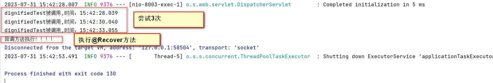

资料来源：<br/>
[Springboot 整合Retry 实现重试机制](https://blog.csdn.net/qq_35387940/article/details/99676114)


## Retry这个重试框架

### 介绍
重试，在项目需求中是非常常见的，例如遇到网络波动等，要求某个接口或者是方法可以最多/最少调用几次；
实现重试机制，非得用Retry这个重试框架吗？那肯定不是，相信很多伙伴手写一下控制流程的逻辑也可以达到重试的目的。

那么用Retry的好处是什么？ 简单来说，就是优雅。

Retry重试框架，支持AOP切入的方式使用，而且能使用注解；想想，重试次数、重试延迟、重试触发条件、重试的回调方法等等我们都能很轻松结合注解以一种类似配置参数的方式去实现，优雅无疑。

### 引入jar

那么，我们接下来就来一起使用Springboot整合这个Retry重试框架：

```xml
  <!--重试框架-->
        <dependency>
            <groupId>org.springframework.retry</groupId>
            <artifactId>spring-retry</artifactId>
        </dependency>
        <dependency>
            <groupId>org.aspectj</groupId >
            <artifactId>aspectjweaver</artifactId >
            <version>1.6.11</version >
        </dependency>
        <!--重试框架-->
```

### 启动类加上开启重试注解

在启动类上加上`@EnableRetry`注解

```java
@EnableRetry
@SpringBootApplication
public class SimpleSpringApplication {
    public static void main(String[] args) {
        SpringApplication.run(SimpleSpringApplication.class, args);
    }
}
```

### 测试接口和实现类

定义一个接口

```java
 
/**
 * @Author : JCccc
 * @CreateTime : 2019/8/16
 * @Description :
 **/
public interface TestRetryService {
 
 
    int dignifiedTest(int code) throws Exception;
}
```

实现类

```java
import com.mail.elegant.service.TestRetryService;
import org.springframework.retry.annotation.Backoff;
import org.springframework.retry.annotation.Recover;
import org.springframework.retry.annotation.Retryable;
import org.springframework.stereotype.Service;
import java.time.LocalTime;
 
/**
 * @Author : JCccc
 * @CreateTime : 2019/8/16
 * @Description :
 **/
@Service
public class TestRetryServiceImpl implements TestRetryService {
 
 
    @Override
    @Retryable(value = Exception.class,maxAttempts = 3,backoff = @Backoff(delay = 2000,multiplier = 1.5))
    public int dignifiedTest(int code) throws Exception{
        System.out.println("dignifiedTest被调用,时间："+LocalTime.now());
          if (code==0){
              throw new Exception("情况不对头！");
          }
        System.out.println("dignifiedTest被调用,情况对头了！");
 
        return 200;
    }
 
    @Recover
    public int recover(Exception e){
        System.out.println("回调方法执行！！！！");
        //记日志到数据库 或者调用其余的方法
        return 400;
    }
 
}
```

我们这个测试模拟的场景是，传值code，一直是0；然后业务方法判断如果是0，代表业务不通，失败（网络波动了或者是等等），然后就是触发重试，最后如果重试几次都不成功，然后调用回调方法（可以进行日志记录或者调用其他业务方法等等）。 

@Retryable ： 注解方式标记当前方法会使用重试机制
里面的 value： 重试的触发机制，当遇到Exception异常的时候，触发；

>@Retryable ： 注解方式标记当前方法会使用重试机制里面的 value： 重试的触发机制，当遇到Exception异常的时候，触发；<br/>
>maxAttempts： 重试的次数（包括第一次调用，也就是说如果设置3次，调用一次后，如果一直失败触发重试，那么还当前方法还会调用2次）；<br/>
> delay：重试的延迟时间，也就是距离上一次重试方法调用的间隔，单位毫秒<br/>
> multiplier： delay间隔时间的倍数，也就是说，第一次重试间隔如果是2000ms，那第二次重试的时候就是2000ms 乘以这个倍数1.5，就是3000ms；<br/>
> 
>maxDelay:重试次数之间的最大时间间隔,默认为0,即忽略,如果小于delay的设置,则默认为30000L；<br/>

这个方法用到了`@Recover`，也就是用注解方式标记当期方法为回调方法，可以看到传参里面写的是 Exception e，这个是作为回调的接头暗号（重试次数用完了，还是失败，我们抛出这个Exception e通知触发这个回调方法）。

```java
@Recover
    public int recover(Exception e){
        System.out.println("回调方法执行！！！！");
        //记日志到数据库 或者调用其余的方法
        return 400;
    }
```

### 测试接口

生成一个`controller`

```java
import com.mail.elegant.service.TestRetryService;
import org.springframework.beans.factory.annotation.Autowired;
import org.springframework.web.bind.annotation.GetMapping;
import org.springframework.web.bind.annotation.RestController;
 
/**
 * @Author : JCccc
 * @CreateTime : 2019/8/16
 * @Description :
 **/
@RestController
public class TestController {
 
    @Autowired
    TestRetryService testRetryServiceImpl;
 
    @GetMapping("/testRetry")
    public String testRetry() throws Exception {
        int code=0;
 
        int result = testRetryServiceImpl.dignifiedTest(code);
        return "result："+result;
    }
 
}
```

运行结果



