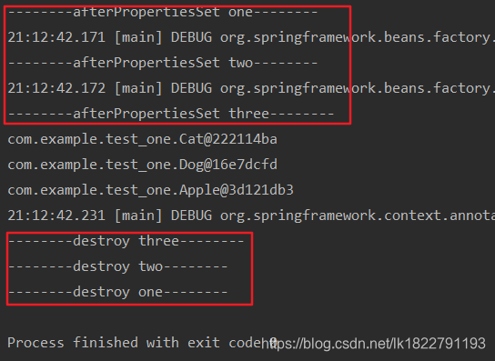

资料来源：
[spring boot 生成初始和销毁对象方法的三种方式](https://blog.csdn.net/lk1822791193/article/details/89607526)

## 配置文件

```java
//注解类
@Configuration
public class Config { 
 
    //初始化提示和销毁提示 one ：通过实现接口方法  
    @Bean
    public Cat createCat(){
        return new Cat();
    }
    
    //初始化提示和销毁提示 two ：通过对bean对象进行注解的方式
    @Bean(initMethod ="init", destroyMethod = "destroy")
    public Dog createDog(){
        return new Dog();
    }
 
    //初始化提示和销毁提示 three ： 通过对原对象进行注解的方式
    @Bean
    public Apple createApple(){
        return new Apple();
    }
}

```

## one

```java
//实现InitializingBean, DisposableBean 接口
public class Cat implements InitializingBean, DisposableBean {
    //初始化
    @Override
    public void afterPropertiesSet() throws Exception {
            System.out.println("--------afterPropertiesSet one--------");
    }
    //销毁
    @Override
    public void destroy() throws Exception {
        System.out.println("--------destroy one--------");
    }
}
```

## two

```java
public class Dog {
    public void init() {
        System.out.println("--------afterPropertiesSet two--------");
    }
 
    public void destroy() {
        System.out.println("--------destroy two--------");
    }
}
```

## three

```java
public class Apple {
    //初始化注解
    @PostConstruct
    public void start(){
        System.out.println("--------afterPropertiesSet three--------");
    }
    //销毁注解
    @PreDestroy
    public void end(){
        System.out.println("--------destroy three--------");
    }
}
```

## 系统调用

```java
public class Main {
    public static void main(String[] args){
        AnnotationConfigApplicationContext context =new AnnotationConfigApplicationContext(Config.class);
     
        System.out.println(context.getBean(Cat.class));
        System.out.println(context.getBean(Dog.class));
        System.out.println(context.getBean(Apple.class));
 
        context.close();
    }
}
```

运行截图：

