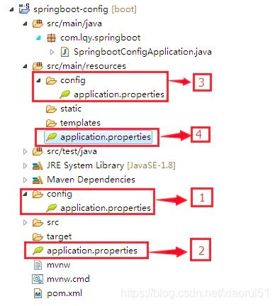

资料来源：

[Spring Boot - 多环境配置](https://www.jianshu.com/p/1b195b2f9a2a)

[springboot多环境配置文件，如何包含多个yml配置文件？看这一篇就够了](https://blog.csdn.net/xiaorui51/article/details/108452181)

在项目开发时，我们经常需要在不同的运行环境中进行切换，典型的场景包括：**开发环境dev**，**测试环境test** 以及 **发布环境prod**。

不同的环境可能会对应不同的配置内容，如果手动更改运行环境配置，会显得非常繁琐与低效。

因此，Spring Boot 提供了一套机制可以很容易地让我们进行多环境配置。

## 方式一

**在spring中多环境配置文件名需要满足application-{profile}.properties的格式**

~~~~java
application-dev.properties:开发环境
application-test.properties:测试环境
application-prod.properties:生产环境
~~~~

### 配置

假设现在我们需要往返于两个运行环境：**开发环境dev** 和 **测试环境test**。

Spring Boot 提供了一套多环境配置机制，称为：**Profile-specific Properties**，可以将其理解为 **环境相关配置文件**。

**Profile-specific Properties** 多环境配置的具体步骤如下所示：

1. 首先，为不同的运行环境创建不同的配置文件，其命名规范格式为：`application-{profile}.yml`。

   对应我们的例子，就是需要创建如下两个配置文件：

   - **application-dev.yml**：开发环境配置文件，假设其配置内容如下：

     ```Java
     server:
         port: 8081
     ```

   - **application-test.yml**：测试环境配置文件，假设其配置内容如下：

     ```Java
     server:
         port: 8082
     ```

2. 然后，在全局配置文件`application.yml`文件中，通过属性`spring.profiles.active`来指定应用运行的具体环境：

   ```java
   # 使用环境 dev
   spring:
       profiles:
         active: dev
   ```

以上，我们就完成了多环境配置，运行程序，结果如下：


run

可以看到，成功运行在开发环境`dev`中，并且相应的配置选项也生效了。

**注**：如果没有指定具体环境配置文件，那么 Spring Boot 默认加载`application-default.properties`配置文件，相当于`application.yml`默认配置选项：

```
spring:
    profiles:
      active: default
```

### 多文件配置

**如果同一个环境有多个配置文件，可以通过spirng.profiles.include实现多配置文件**


?> **如果想在某个配置文件中引用其他配置文件的内容，可以使用${}符号实现**


### 多环境的优先级

~~~~shell
#application.properties 优先级从高到低，application.yml文件优先级也一样  
#级别高的会覆盖级别低的，级别高没有的，级别低有的配置项会同样生效  
   
#1、-- 项目根目录config文件夹里面（优先级最高）  
#./config/  
   
#2、--项目根目录  
#./    
   
#3、-- src/main/resources/config/文件夹里面  
#classpath:/config    
   
#4、-- src/main/resources/  
#classpath:/     
   
#1-4优先级从高到低，优先级高的配置内容会覆盖优先级低的配置内容  
server.port=8081 
~~~~



运行时，使用cmd命令行指定特定的配置文件（优化级最高），cmd命令如下：
这种情况可以加载打包后需要修改配置文件的运行，可以使用项目外的配置，如D盘的配置

~~~~shell
java -jar lqyspringboot-0.0.1-SNAPSHOT.jar --spring.config.location=D:/application.properties
~~~~

!> 这是方法二的，主要原理

注意：

> 级别高的配置会覆盖级别低的相同配置，级别高的配置没有的项，级别低有的项会同样生效。
>
> 也就是说，无论级别高低，配置都会生效，只是相同的配置被级别高的配置覆盖。  

- Spring Boot 还提供了许多其他方式进行配置，下面简单介绍几种：

### pom 文件中配置

在application.yml 中

~~~yml
spring:
  profiles:
    active: '@build.profile@'
~~~

在pom中配置

~~~xml
 <profiles>
        <profile>
            <id>dev</id>
            <activation>
                <activeByDefault>true</activeByDefault>
            </activation>
            <properties>
                <build.profile>dev</build.profile>
            </properties>
        </profile>
        <profile>
            <id>pro</id>
            <properties>
                <build.profile>pro</build.profile>
            </properties>
        </profile>
    </profiles>
~~~

其中`<id>`标签下面 `<activation>`表示生效

### 代码动态配置

**代码动态配置**：

可以通过[`SpringApplication.setAdditionalProfiles(..)`](https://links.jianshu.com/go?to=https%3A%2F%2Fdocs.spring.io%2Fspring-boot%2Fdocs%2F2.3.1.RELEASE%2Fapi%2Forg%2Fspringframework%2Fboot%2FSpringApplication.html)方法设置/添加运行环境，如下所示：

~~~~java
@SpringBootApplication
public class Application {
    public static void main(String[] args) {
        SpringApplication app = new SpringApplication(Application.class);
        app.setAdditionalProfiles("dev");
        app.run(args);
    }
}
~~~~

**Maven 配置运行环境**：

可以使用 *spring-boot-maven-plugin* 来指定应用的运行环境，如下所示：

~~~~java
<plugins>
    <plugin>
        <groupId>org.springframework.boot</groupId>
        <artifactId>spring-boot-maven-plugin</artifactId>
        <configuration>
            <profiles>
                <profile>dev</profile>
            </profiles>
        </configuration>
    </plugin>
</plugins>
~~~~

然后执行命令：`mvn spring-boot:run`，启动应用。

## 方式二

  `—spring.config.location`命令主要是为了加载springBoot jar 外部的配置文档，比如我们可以将日志的级别控制放在jar外面的配置文档中，可以方便线上调试，不用改动jar中的配置文档，再打包这样比较麻烦的操作。

注意：当使用了这个命令后外面的配置文档级别要高于里面的文档，所以外面的属性会覆盖里面的，当然所有文档都是互补的，没有的话就相互补充

- 创建bootstrap.yml配置文件

~~~~java
spring:
  config:
    location: classpath:/dev/
~~~~

这样加在`dev`下面的`application.yml`配置文件

## 指定环境运行

以通过`@Profile`等注解指定具体环境配置，当应用运行于该环境时，组件就会被激活加载。

比如，当应用运行在开发环境`dev`时，加载组件，如下所示：

~~~~java
@Component
@Profile("dev") //  dev 环境时，加载组件
public class ProfileBean{...}
~~~~

如果想实现的是在特定环境未激活时，进行组件加载，那么可如下操作：

~~~~java
@Component
@Profile("!dev") // 不是 dev 环境时，加载组件
public class ProfileBean{...}
~~~~

结合`@Profile`和`@ConfigurationProperties`还可以实现对环境变量的获取，比如：

现在我们在不同的环境配置文件中自定义一个变量，如下

~~~~java
# application-dev.yml
com:
  yn:
    mode: development
    msg: You are in development mode
    
# application-test.yml
com:
  yn:
    mode: test
    msg: You are in test mode
~~~~

然后在代码中，指定使用开发环境`dev`，如下所示：

~~~~java
@RestController
@RequestMapping("profile")
public class ProfilesController {

    @Autowired
    private ProfileBean profile;

    @GetMapping("/")
    public String index() {
        return String.format("%s: %s", this.profile.mode, this.profile.msg);
    }


    @ConfigurationProperties(prefix = "com.yn")
    @Profile("dev") // 指定加载环境
    @Setter         // lombok
    public static class ProfileBean {
        private String mode;
        private String msg;
    }
}
~~~~

最后，由于上述中`@ConfigurationProperties`注解的类是静态内部类，无法被直接扫描得到，因此可通过`@EnableConfigurationProperties`注解手动注册该 Bean，如下代码所示：

~~~java
@SpringBootApplication
@EnableConfigurationProperties({ProfilesController.ProfileBean.class})
public class Application {
    public static void main(String[] args) {
        SpringApplication.run(Application.class, args);
    }
}
~~~

以上，就完成指定加载具体环境配置文件读取功能了。


