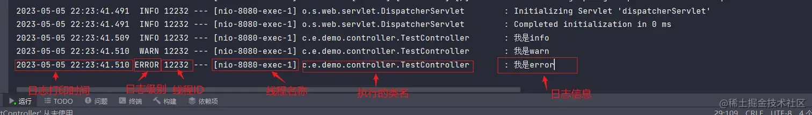
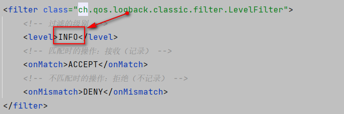
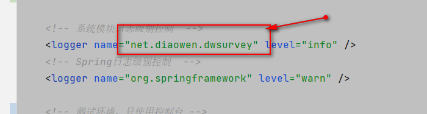

资料来源： 
[Logback 配置文件这样优化，TPS提高 10 倍](https://mp.weixin.qq.com/s/4ID2urNQ8GNpu66kHEwpZg) 
[Spring Boot 进阶-SpringBoot日志配置详解](https://www.toutiao.com/article/7161613536169591300/?app=news_article&timestamp=1667833144&use_new_style=1&req_id=20221107225904010208100130060E8A74&group_id=7161613536169591300&share_token=0AAC5173-D5CE-41DE-8AA3-10F161620582&tt_from=weixin&utm_source=weixin&utm_medium=toutiao_ios&utm_campaign=client_share&wxshare_count=1&source=m_redirect) 
[Spring Boot 进阶- Spring Boot日志框架介绍](https://www.toutiao.com/article/7161582664892334592/) 
[Spring Boot 进阶-如何自定义SpringBoot日志配置？](https://www.toutiao.com/article/7161596789697970718/?app=news_article&timestamp=1667833168&use_new_style=1&req_id=202211072259280102080160670E0EE5C6&group_id=7161596789697970718&share_token=F290A407-6EB3-414C-852F-D828706442DB&tt_from=weixin&utm_source=weixin&utm_medium=toutiao_ios&utm_campaign=client_share&wxshare_count=1&source=m_redirect) 
[logback](https://github.com/L316476844/springbootexample/blob/master/src/main/resources/logback.xml) 
[教你如何使用 SpringBoot 日志](https://www.toutiao.com/article/7230986210762916389/?app=news_article&timestamp=1685233646&use_new_style=1&req_id=2023052808272510B493444499BF21F6E2&group_id=7230986210762916389&wxshare_count=1&tt_from=weixin&utm_source=weixin&utm_medium=toutiao_android&utm_campaign=client_share&share_token=64ba6ebb-a7f4-4f1f-8791-7d3857bfc733&source=m_redirect)

## 日志输出

### 什么是日志？

 Spring Boot的日志是指在Spring Boot应用程序中记录事件和信息的机制。就是用来查 BUG 的，可以帮助我们快速定位和解决应用程序中的问题。

它的作用：

- 帮助开发人员进行调试：当应用程序出现问题时，开发人员可以根据日志信息来追踪和定位问题。
- 了解应用程序的运行情况：日志可以记录应用程序的各种事件和信息，例如应用程序启动和关闭、HTTP请求和响应、数据库操作等。
- 维护应用程序的稳定性：通过设置适当的日志级别，可以避免过多的日志信息影响应用程序的性能。
- 遵循安全和合规要求：根据应用程序的安全和合规要求，需要记录一些特定的日志信息，例如用户登录信息、敏感操作记录等。

### 日志框架有那些？
在开发中我们经常用到的日志框架有log4j、logback、log4j2等等。其中log4j是又是我们在开发过程中经常听到的一个日志框架。因为在Spring 框架中使用的就是log4j框架，但是现在log4j官方已经不太维护了，在性能方面相比于logback、log4j2也略有逊色。

logback是log4j的开发者重新设计开发的另外的一套开源的日志框架，相比于log4j来说性能也提升了很多。作为Spring Boot框架的默认日志框架在各种性能上有着不小的优势。

log4j2相当于logback来说出现较晚，在官方的性能介绍中要比logback好，但是没有再具体的高级项目中大面积的使用过。log4j2在很多的设计理念上与logback是类似的。虽然作为Apache的官方项目，但在Spring等相关框架中也没有得到太多的使用。

那么既然日志框架有很多，如何能在项目中选择适合项目开发的框架也就无可厚非了。对于普通开发者来讲虽然不需要掌握太多的关于日志框架底层的东西，但是只是我们需要了解日志框架都有哪些，这样有利于在开发中更好的选择合适的日志框架。

 有几个注意点:

> 第一个是日志对象Logger的包是 slf4j，Spring Boot 中内置了日志框架 Slf4j，可以让开发人员使用一致的API来调用不同的日志记录框架； 
> 第二个，一般每个类都有自己的日志文件，getLogger方法参数推荐为当前这个类，并且这个日志文件不能轻易修改，所以是private static final。

### logback框架介绍

在Spring Boot中 默认使用的日志框架是logback。使用logback作为Spring Boot框架的默认日志框架，一定是因为logback是经受住了很多项目开发的考验的，所以建议在一般的开发中不要随意的更换日志框架。由于是默认引入的日志框架，所以这里我们不需要在POM文件中添加对应的依赖。

下面我们来看一下在IDEA中输出的日志，默认是INFO级别的日志。

如图所示，在Console日志中输出的内容有如下一些

- 日期时间：精确到了毫秒级别
- 日志的级别：ERROR、WARN、INFO、DEBUG、TRACE
- 所属进程ID号
- 日志分割符：通常是中划线表示日志的开始
- 日志所属线程名：使用中括号括起来
- 日志名：一般是类名路径
- 输出日志内容

#### Spring Boot项目中如何使用日志
在实际业务开发中，为了能获取到各种代码执行信息，就需要使用到日志追溯对应的操作。在代码中使用日志的方式有两种

一种是比较传统的日志注入方式，就是在每个类中引入私有的日志输出的入口代码。如下所示
~~~
private final Logger log = LoggerFactory.getLogger(PropertiesController.class);
~~~
这种方式在之前的开发中，是经常会被使用到的，比较麻烦，需要在每个类中添加这样一段代码。

#### 使用lombok

首先需要在pom文件中引入对应的依赖。

~~~xml
    <dependency>
            <groupId>org.projectlombok</groupId>
            <artifactId>lombok</artifactId>
     </dependency>
~~~
在使用的时候只需要在类上加上一个@Slf4j 的注解就可以了，代码如下 
~~~java
@Slf4j
public class LogFramework {

    public void testLog(){
        log.info("输出INFO日志");
    }
}
~~~
在实际开发中我们经常会用到的几种日志级别从低到高分别是：
~~~c
TRACE<DEBUG<INFO<WARN<ERROR<FATAL。
~~~
Spring Boot中默认日志级别是INFO级别的日志，
那么我们怎么控制日志级别的输出呢？在之前我们提到过Spring Boot是允许通过配置来修改自动配置项的，所以我们只需要在配置文件中添加如下的内容就可以调整日志级别了。
~~~yaml
logging:
  level:
    root: debug
~~~

通过上面的配置可以将所有的日志级别都调整成了DEBUG，当然Spring Boot 也支持修改package级别的日志调整，格式如下，
~~~yaml
logging:
  level:
    com.example.demo: debug
~~~
#### 如何定制日志格式呢？
在之前的文章中我们介绍了关于日志默认格式都有哪些内容，那么我们如何利用Spring Boot默认的日志配置来自定义自己的日志输出格式呢？
~~~yaml
logging:
  level:
    com.example.demo: debug
  file:
    path: H:\demo\log
    name: test.log
  pattern:
    console: '%d{yyyy-MM-dd --- HH:mm:ss} [%thread] %-5level %logger -%msg%n'
    file: '%d{yyyy-MM-dd} [%thread] %-5level %logger -%msg%n'
~~~

其中console是用来配置控制台日志的输出，而file是用来控制日志文件中日志格式，这里需要注意一点，就是再基于YML文件配置的时候，由于YML配置文件不支持SPEL表达式，所以需要将其用单引号引起来。

如图所示，整个的日志格式都发生了变化。进行了对应的调整显示。这里我们来说明一下日志配置中各种配置项的含义

%d{HH:mm:ss SSS} 标识日志输出的时间 
%thread 标识输出日志进程号，整个在异步多线程中会很有用 
%-5level 标识日志级别，使用5个字符并且左对齐 
%logger 输出日志的名称 
%msg--日志消息内容 
%n--日志换行符 

### 使用不同的日志框架来实现自定义日志配置？
在Spring Boot的官方文档中，对于不同的日志系统，指定了不同的日志配置文件的格式，只需要按照对应的日志配置文件进行配置，那么一定就可以被SpringBoot框架加载内容。

LogBack ：支持 logback-spring.xml，logback-spring.groovy，logback.xml，logback.groovy。这里需要说明一下的是groovy有点类似于JVM，有兴趣的读者可以了解一下。
Log4j：支持log4j-spring.propreties，log4j-spring.xml，log4j.properties ，log4j.xml
Log4j2：支持log4j2-spring.xml，log4j2.xml
JDK :支持logging.properties
在Spring Boot官方中推荐使用的是含有spring的文件名的配置。所以只需要在src/resource文件夹下创建logback-spring.xml文件就可以进行自定的配置了。注意，下面的配置只是用来演示，不推荐直接使用

默认是`logback-spring.xml`
也可以通过

~~~properties
#logback配置
logging.config=classpath:logback.xml
~~~
首先需要在src/resource/路径下创建一个logback-spring.xml的配置文件。加入如下的内容。内容来源于开源框架，这里仅做说明使用

#### 配置文件介绍
~~~xml
<?xml version="1.0" encoding="UTF-8"?>
<configuration scan="true" scanPeriod="60 seconds" debug="false">
    <!-- 日志存放路径 -->
    <property name="log.path" value="./logs" />
    <property name="log.projectName" value="dwsurey" />
    <!-- 日志输出格式 -->
    <property name="log.pattern" value="%d{HH:mm:ss.SSS} [%thread] %-5level %logger{20} - [%method,%line] - %msg%n" />

    <!-- 彩色日志依赖的渲染类 -->
    <!-- 定义了一个名为clr的转换规则，它使用org.springframework.boot.logging.logback.ColorConverter类进行转换，这个元素通常用于将日志输出中的文本着色，以便更容易地区分不同的日志级别或其他信息 -->
    <conversionRule conversionWord="clr" converterClass="org.springframework.boot.logging.logback.ColorConverter"/>
    <!-- WhitespaceThrowableProxyConverter和ExtendedWhitespaceThrowableProxyConverter都是用于将异常信息转换为字符串，并将其中的换行符替换为空格，以便更容易地在日志输出中显示的类。它们之间的区别在于，ExtendedWhitespaceThrowableProxyConverter在输出异常信息时会包含更多的详细信息，例如异常的类名、方法名和行号等 -->
    <!-- 定义了一个名为wex的转换规则，它使用org.springframework.boot.logging.logback.WhitespaceThrowableProxyConverter类进行转换，这个元素通常用于将异常信息转换为字符串，并将其中的换行符替换为空格，以便更容易地在日志输出中显示 -->
    <conversionRule conversionWord="wex"
                    converterClass="org.springframework.boot.logging.logback.WhitespaceThrowableProxyConverter"/>
    <!-- 定义了一个名为wEx的转换规则，它使用org.springframework.boot.logging.logback.ExtendedWhitespaceThrowableProxyConverter类进行转换，这个元素通常用于将异常信息转换为字符串，并将其中的换行符替换为空格，以便更容易地在日志输出中显示 -->
    <conversionRule conversionWord="wEx"
                    converterClass="org.springframework.boot.logging.logback.ExtendedWhitespaceThrowableProxyConverter"/>

    <!-- 彩色日志格式 -->
    <!-- value值是日志输出模板， :-是属性名和其默认值之间的分隔符，作用与:相同 -->
    <!-- 定义日志输出格式的转换规则，%d{yyyy-MM-dd HH:mm:ss.SSS}表示日期和时间，%clr表示将输出文本着色，{faint}表示使用淡色 -->
    <!-- %5p表示日志级别输出右对齐，左边以空格填充 -->
    <!-- ${PID:- }表示进程ID，%clr表示将输出文本着色，{magenta}表示使用洋红色 -->
    <!---表示一个分隔符 -->
    <!-- %t：显示产生该日志的线程名；%15：若字符长度小于15，则左边用空格填充；%.15：若字符长度超过15，截去多余字符 -->
    <!-- %-40：若字符长度小于40，则右边用空格填充；%.40：若字符长度超过40，截去多余字符；logger{39}对应的是“logging.WARNING”级别。具体来说，Python的logging模块定义了以下几个级别（从低到高）：NOTSET、DEBUG、INFO、WARNING、ERROR、CRITICAL。因此，logger{39}表示的是WARNING级别，即日志记录器会记录所有WARNING级别及以上的日志信息 -->
    <!-- %m表示日志消息；%n表示换行符；${LOG_EXCEPTION_CONVERSION_WORD:-%wEx}表示异常信息。如果日志输出中包含异常信息，这个规则将会将其转换为字符串，并将其中的换行符替换为空格，以便更容易地在日志输出中显示 -->
    <property name="CONSOLE_LOG_PATTERN"
              value="${CONSOLE_LOG_PATTERN:-%clr(%d{yyyy-MM-dd HH:mm:ss.SSS}){faint} %clr(${LOG_LEVEL_PATTERN:-%5p}) %clr(${PID:- }){magenta} %clr(---){faint} %clr([%15.15t]){faint} %clr(%-40.40logger{39}){cyan} %clr(:){faint} %m%n${LOG_EXCEPTION_CONVERSION_WORD:-%wEx}}"/>

    <!-- 控制台输出 -->
    <appender name="console" class="ch.qos.logback.core.ConsoleAppender">
        <encoder>
            <pattern>${CONSOLE_LOG_PATTERN}</pattern>
        </encoder>
    </appender>

    <!-- 系统日志输出 -->
    <appender name="file_info" class="ch.qos.logback.core.rolling.RollingFileAppender">
        <file>${log.path}/${log.projectName}-info.log</file>
        <!-- 循环政策：基于时间创建日志文件 -->
        <rollingPolicy class="ch.qos.logback.core.rolling.TimeBasedRollingPolicy">
            <!-- 日志文件名格式 -->
            <fileNamePattern>${log.path}/${log.projectName}-info.%d{yyyy-MM-dd}.%i.log</fileNamePattern>
            <!-- 定义日志文件滚动策略的标签，class="ch.qos.logback.core.rolling.SizeAndTimeBasedFNATP"表示使用Logback框架提供的SizeAndTimeBasedFNATP类来定义日志文件的滚动策略，<maxFileSize>100MB</maxFileSize>表示日志文件的最大大小为100MB。这个滚动策略通常用于按照时间和文件大小滚动日志文件，以便更好地管理日志文件的大小和数量 -->
            <timeBasedFileNamingAndTriggeringPolicy class="ch.qos.logback.core.rolling.SizeAndTimeBasedFNATP">
                <maxFileSize>100MB</maxFileSize>
            </timeBasedFileNamingAndTriggeringPolicy>
            <!--日志文档保留天数-->
            <maxHistory>15</maxHistory>
        </rollingPolicy>
        <encoder>
            <pattern>${log.pattern}</pattern>
        </encoder>
        <filter class="ch.qos.logback.classic.filter.LevelFilter">
            <!-- 过滤的级别 -->
            <level>INFO</level>
            <!-- 匹配时的操作：接收（记录） -->
            <onMatch>ACCEPT</onMatch>
            <!-- 不匹配时的操作：拒绝（不记录） -->
            <onMismatch>DENY</onMismatch>
        </filter>
    </appender>

    <appender name="file_error" class="ch.qos.logback.core.rolling.RollingFileAppender">
        <file>${log.path}/${log.projectName}-error.log</file>
        <!-- 循环政策：基于时间创建日志文件 -->
        <rollingPolicy class="ch.qos.logback.core.rolling.TimeBasedRollingPolicy">
            <!-- 日志文件名格式 -->
            <fileNamePattern>${log.path}/${log.projectName}-error.%d{yyyy-MM-dd}.%i.log</fileNamePattern>
            <timeBasedFileNamingAndTriggeringPolicy class="ch.qos.logback.core.rolling.SizeAndTimeBasedFNATP">
                <maxFileSize>100MB</maxFileSize>
            </timeBasedFileNamingAndTriggeringPolicy>
            <!--日志文档保留天数-->
            <maxHistory>15</maxHistory>
        </rollingPolicy>
        <encoder>
            <pattern>${log.pattern}</pattern>
        </encoder>
        <filter class="ch.qos.logback.classic.filter.LevelFilter">
            <!-- 过滤的级别 -->
            <level>ERROR</level>
            <!-- 匹配时的操作：接收（记录） -->
            <onMatch>ACCEPT</onMatch>
            <!-- 不匹配时的操作：拒绝（不记录） -->
            <onMismatch>DENY</onMismatch>
        </filter>
    </appender>

    <!-- 用户访问日志输出  -->
    <appender name="file_warn" class="ch.qos.logback.core.rolling.RollingFileAppender">
        <file>${log.path}/${log.projectName}-warn.log</file>
        <!-- 循环政策：基于时间创建日志文件 -->
        <rollingPolicy class="ch.qos.logback.core.rolling.TimeBasedRollingPolicy">
            <!-- 日志文件名格式 -->
            <fileNamePattern>${log.path}/${log.projectName}-warn.%d{yyyy-MM-dd}.%i.log</fileNamePattern>
            <timeBasedFileNamingAndTriggeringPolicy class="ch.qos.logback.core.rolling.SizeAndTimeBasedFNATP">
                <maxFileSize>100MB</maxFileSize>
            </timeBasedFileNamingAndTriggeringPolicy>
            <!--日志文档保留天数-->
            <maxHistory>15</maxHistory>
        </rollingPolicy>
        <encoder>
            <pattern>${log.pattern}</pattern>
        </encoder>
        <filter class="ch.qos.logback.classic.filter.LevelFilter">
            <!-- 过滤的级别 -->
            <level>WARN</level>
            <!-- 匹配时的操作：接收（记录） -->
            <onMatch>ACCEPT</onMatch>
            <!-- 不匹配时的操作：拒绝（不记录） -->
            <onMismatch>DENY</onMismatch>
        </filter>
    </appender>

    <!-- 系统模块日志级别控制  -->
    <logger name="net.diaowen.dwsurvey" level="info" />
    <!-- Spring日志级别控制  -->
    <logger name="org.springframework" level="warn" />

    <!-- 测试环境，只使用控制台 -->
    <springProfile name="dev">
        <root level="info">
            <appender-ref ref="console" />
        </root>
    </springProfile>

    <!-- 正式环境，写入到文件中 -->
    <springProfile name="prod">
        <!--系统操作日志-->
        <root level="info">
            <appender-ref ref="file_info" />
            <appender-ref ref="file_error" />
            <appender-ref ref="file_warn" />
        </root>
    </springProfile>

</configuration>
~~~

### 注意

决定日志级别

修改成当前项目的

#### configuration 节点

这个是日志配置的根节点，它包含有三个属性

- scan：这个属性设置为ture的时候，配置文件如果发生了变化，就会被重新加载，默认是ture。
- scanPeriod：设置监控配置文件是否配置修改时间的间隔，如果没有给定单位，则默认是毫秒，但scan的属性为ture的时候，这个属性配置就会生效，默认的时间间隔是1分钟。
- debug：这个属性默认是false，当这个属性为ture的时候，就会打印出logback的内部日志信息，并且支持实时查看logback运行状态。
#### root节点
这个节点是必填节点用来指定基础日志级别，只有一个level属性，用来设置日志等级，默认值是DEBUG。这个节点可以包含零个或者是多个节点。

#### contextName节点
标识一个上下文的名称，默认是default，一般开发设置中不需要对其进行设置

#### property节点
标记上下文的变量，属性是name和value，在其中定义好变量之后可以通过SPEL表达式来进行获取。如上代码中展示的${log.path} 用来获取自己设置的日志路径。

#### appender节点
用来格式化日志输出节点，有name和class两个属性，class用来指定输出策略，也就是是使用控制台输出还是使用文件输出，name来配置一个标识。

这个节点在配置中是一个比较重要的节点，一般的配置文件中需要定义三个这样的节点，一个是控制台输出，一个是常规日志输出，一个是异常文件输出，这个节点有如下几个子节点。

- filter：日志输出的拦截器配置节点，如果没有特殊设置，都是采用系统自带的拦截器，如果需要将日志进行拦截过滤的场景中使用，则需要对这个节点进行设置。
- encoder：与pattern节点组合用来设置日志的编码方式和日志的输出格式。
- file：这个节点用来设置日志的输出路径，可以指定相对路径也可以指定绝对路径。
- rollingPolicy：日志回滚策略设置，常用的日志策略就是TimeBasedRollingPolicy，基于事件的回滚策略，下设fileNamePattern用来指定日志归档策略
- maxHistory：设置文档最大保留时间。
- totalSizeCap：用来设置日志文件保留上限大小，到达指定大小之后日志就会被删除。
- logger节点
这个节点主要用来指定包的日志级别设置。如果设置了这个节点，则会覆盖root节点的日志级别设置

- name：用来设置指定包路径
- level：用来设置日志级别
- addtivity：可选，默认传值true，将logger的信息向上传递到root，如果设置为false则不会上传。就需要设置一个appender-ref的节点配置才会有日志输出。
#### 总结
整个的日志配置文件介绍到这里就结束了，在日志配置文件中，基础的配置就这些，我们可以根据自己的需求来设置不同的策略将不同的日志输出到不同的文件中，方便后续的日志采集与系统维护，也希望能够帮助大家更好的理解SpringBoot日志文件配置。