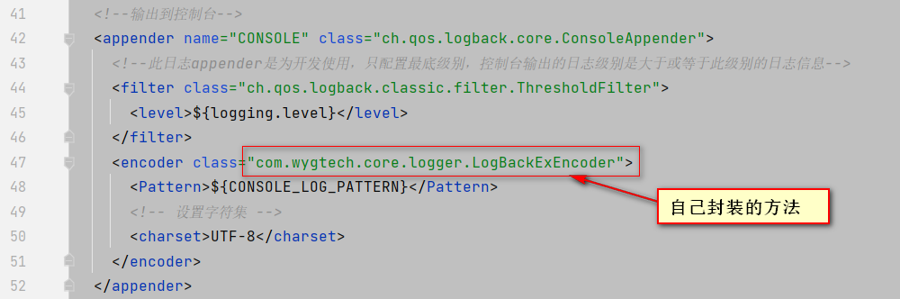
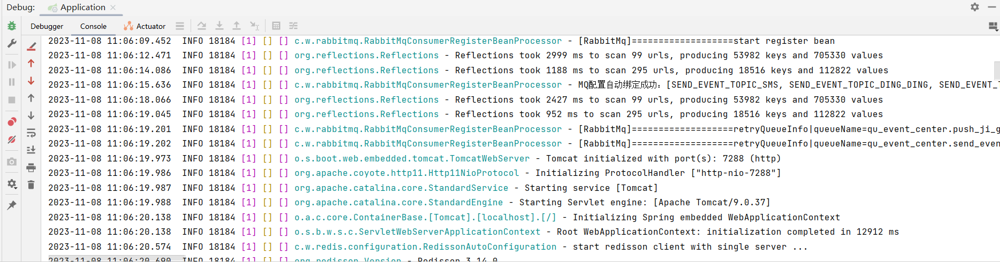
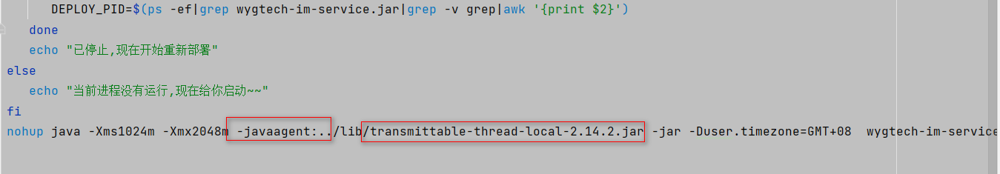
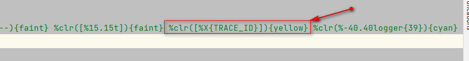
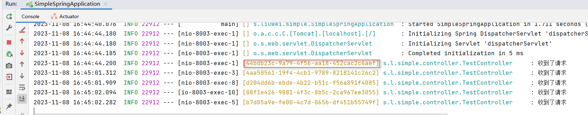

资料来源：<br/>
[logback-spring.xml 的配置及详解](https://blog.csdn.net/qq_45256357/article/details/132490315)

[logback配置文件报Failed to create converter for [%clr] keyword](https://blog.csdn.net/u013078871/article/details/116707747)

[springboot项目自定义日志输出，logback.xml使用自定义变量](https://blog.csdn.net/weixin_47032054/article/details/130631745)

[自实现分布式链路追踪 方案&实践](https://zhuanlan.zhihu.com/p/636251902)


## 介绍

在[13_springboot日志](springboot/功能/13日志.md)中已经介绍了`lagback-spring.xml`，但是在开发中经历了不通的公司，每个公司的配置都不一样，因而我进一步学习和研究，列举了一些典型的配置

### application.yml 配置

```yaml
#日志配置
logging:
  config: classpath:logback-spring.xml
```

`springboot`默认的是上面的配置

### 网上案例

```xml
<?xml version="1.0" encoding="UTF-8"?>
<configuration scan="true" scanPeriod="10 seconds">
    <!-- logger上下文名称（根据业务修改） -->
    <contextName>MyContextName</contextName>
    
    <!-- 定义了一个名为serverName的属性，它的值来自于logging.file.name，如果没有找到该属性默认为MyServerName（根据业务修改） -->
    <springProperty name="serverName" source="logging.file.name" defaultValue="MyServerName"/>
    <springProperty name="logging.path" source="logging.file.path" defaultValue="././logs/"/>
    
    <!-- 彩色日志依赖的渲染类 -->
    <!-- 定义了一个名为clr的转换规则，它使用org.springframework.boot.logging.logback.ColorConverter类进行转换，这个元素通常用于将日志输出中的文本着色，以便更容易地区分不同的日志级别或其他信息 -->
    <conversionRule conversionWord="clr" converterClass="org.springframework.boot.logging.logback.ColorConverter"/>
    <!-- WhitespaceThrowableProxyConverter和ExtendedWhitespaceThrowableProxyConverter都是用于将异常信息转换为字符串，并将其中的换行符替换为空格，以便更容易地在日志输出中显示的类。它们之间的区别在于，ExtendedWhitespaceThrowableProxyConverter在输出异常信息时会包含更多的详细信息，例如异常的类名、方法名和行号等 -->
    <!-- 定义了一个名为wex的转换规则，它使用org.springframework.boot.logging.logback.WhitespaceThrowableProxyConverter类进行转换，这个元素通常用于将异常信息转换为字符串，并将其中的换行符替换为空格，以便更容易地在日志输出中显示 -->
    <conversionRule conversionWord="wex"
                    converterClass="org.springframework.boot.logging.logback.WhitespaceThrowableProxyConverter"/>
    <!-- 定义了一个名为wEx的转换规则，它使用org.springframework.boot.logging.logback.ExtendedWhitespaceThrowableProxyConverter类进行转换，这个元素通常用于将异常信息转换为字符串，并将其中的换行符替换为空格，以便更容易地在日志输出中显示 -->
    <conversionRule conversionWord="wEx"
                    converterClass="org.springframework.boot.logging.logback.ExtendedWhitespaceThrowableProxyConverter"/>
    
    <!-- 彩色日志格式 -->
    <!-- value值是日志输出模板， :-是属性名和其默认值之间的分隔符，作用与:相同 -->
    <!-- 定义日志输出格式的转换规则，%d{yyyy-MM-dd HH:mm:ss.SSS}表示日期和时间，%clr表示将输出文本着色，{faint}表示使用淡色 -->
    <!-- %5p表示日志级别输出右对齐，左边以空格填充 -->
    <!-- ${PID:- }表示进程ID，%clr表示将输出文本着色，{magenta}表示使用洋红色 -->
    <!-- ---表示一个分隔符 -->
    <!-- %t：显示产生该日志的线程名；%15：若字符长度小于15，则左边用空格填充；%.15：若字符长度超过15，截去多余字符 -->
	<!-- %-40：若字符长度小于40，则右边用空格填充；%.40：若字符长度超过40，截去多余字符；logger{39}对应的是“logging.WARNING”级别。具体来说，Python的logging模块定义了以下几个级别（从低到高）：NOTSET、DEBUG、INFO、WARNING、ERROR、CRITICAL。因此，logger{39}表示的是WARNING级别，即日志记录器会记录所有WARNING级别及以上的日志信息 -->
    <!-- %m表示日志消息；%n表示换行符；${LOG_EXCEPTION_CONVERSION_WORD:-%wEx}表示异常信息。如果日志输出中包含异常信息，这个规则将会将其转换为字符串，并将其中的换行符替换为空格，以便更容易地在日志输出中显示 -->
    <property name="CONSOLE_LOG_PATTERN"
              value="${CONSOLE_LOG_PATTERN:-%clr(%d{yyyy-MM-dd HH:mm:ss.SSS}){faint} %clr(${LOG_LEVEL_PATTERN:-%5p}) %clr(${PID:- }){magenta} %clr(---){faint} %clr([%15.15t]){faint} %clr(%-40.40logger{39}){cyan} %clr(:){faint} %m%n${LOG_EXCEPTION_CONVERSION_WORD:-%wEx}}"/>
    
    <!--1. 输出到控制台-->
    <!-- 定义控制台日志输出的appender，class="ch.qos.logback.core.ConsoleAppender"表示使用Logback框架提供的ConsoleAppender类来输出日志到控制台 -->
    <appender name="CONSOLE" class="ch.qos.logback.core.ConsoleAppender">
        <!--此日志appender是为开发使用，只配置最底级别，控制台输出的日志级别是大于或等于此级别的日志信息-->
        <!-- 定义日志输出级别的过滤器，class="ch.qos.logback.classic.filter.ThresholdFilter"表示使用Logback框架提供的ThresholdFilter类来过滤日志输出，<level>debug</level>表示只输出debug级别及以上的日志 -->
        <filter class="ch.qos.logback.classic.filter.ThresholdFilter">
            <level>debug</level>
        </filter>
        <encoder>
            <!-- ${CONSOLE_LOG_PATTERN}表示控制台日志输出格式，UTF-8表示编码格式 -->
            <Pattern>${CONSOLE_LOG_PATTERN}</Pattern>
            <!-- 设置字符集 -->
            <charset>UTF-8</charset>
        </encoder>
    </appender>
    <!--2. 输出到文档-->
    <!-- 2.1 level为 DEBUG 日志，时间滚动输出  -->
    <!-- 定义文件日志输出的appender，class="ch.qos.logback.core.rolling.RollingFileAppender"表示使用Logback框架提供的RollingFileAppender类来输出日志到文件 -->
    <appender name="DEBUG_FILE" class="ch.qos.logback.core.rolling.RollingFileAppender">
        <!-- 正在记录的日志文档的路径及文档名 -->
        <file>${logging.path}/web_debug.log</file>
        <!--日志文档输出格式-->
        <encoder>
            <pattern>%d{yyyy-MM-dd HH:mm:ss.SSS} [%thread] %-5level %logger{50} - %msg%n</pattern>
            <charset>UTF-8</charset> <!-- 设置字符集 -->
        </encoder>
        <!-- 日志记录器的滚动策略，按日期，按大小记录 -->
        <!-- 定义日志文件滚动策略的标签，class="ch.qos.logback.core.rolling.TimeBasedRollingPolicy"表示使用Logback框架提供的TimeBasedRollingPolicy类来定义日志文件的滚动策略 -->
        <rollingPolicy class="ch.qos.logback.core.rolling.TimeBasedRollingPolicy">
            <!-- 日志归档 -->
            <!-- 定义日志文件名的模式。在这个模式中，${logging.path}表示日志文件的路径，%d{yyyy-MM-dd}表示日期格式，%i表示文件索引 -->
            <fileNamePattern>${logging.path}/web-debug-%d{yyyy-MM-dd}.%i.log</fileNamePattern>
            <!-- 定义日志文件滚动策略的标签，class="ch.qos.logback.core.rolling.SizeAndTimeBasedFNATP"表示使用Logback框架提供的SizeAndTimeBasedFNATP类来定义日志文件的滚动策略，<maxFileSize>100MB</maxFileSize>表示日志文件的最大大小为100MB。这个滚动策略通常用于按照时间和文件大小滚动日志文件，以便更好地管理日志文件的大小和数量 -->
            <timeBasedFileNamingAndTriggeringPolicy class="ch.qos.logback.core.rolling.SizeAndTimeBasedFNATP">
                <maxFileSize>100MB</maxFileSize>
            </timeBasedFileNamingAndTriggeringPolicy>
            <!--日志文档保留天数-->
            <maxHistory>15</maxHistory>
        </rollingPolicy>
        <!-- 此日志文档只记录debug级别的 -->
        <!-- 定义日志输出级别的过滤器。在这个过滤器中，class="ch.qos.logback.classic.filter.LevelFilter"表示使用Logback框架提供的LevelFilter类来过滤日志输出，<level>debug</level>表示只输出debug级别及以上的日志 -->
        <filter class="ch.qos.logback.classic.filter.LevelFilter">
            <level>debug</level>
            <!-- <onMatch>ACCEPT</onMatch>表示如果日志事件与过滤器匹配，则接受该事件，<onMismatch>DENY</onMismatch>表示如果日志事件与过滤器不匹配，则拒绝该事件 -->
            <onMatch>ACCEPT</onMatch>
            <onMismatch>DENY</onMismatch>
        </filter>
    </appender>
    <!-- 2.2 level为 INFO 日志，时间滚动输出  -->
    <appender name="INFO_FILE" class="ch.qos.logback.core.rolling.RollingFileAppender">
        <!-- 正在记录的日志文档的路径及文档名 -->
        <file>${logging.path}/web_info.log</file>
        <!--日志文档输出格式-->
        <encoder>
            <pattern>%d{yyyy-MM-dd HH:mm:ss.SSS} [%thread] %-5level %logger{50} - %msg%n</pattern>
            <charset>UTF-8</charset>
        </encoder>
        <!-- 日志记录器的滚动策略，按日期，按大小记录 -->
        <rollingPolicy class="ch.qos.logback.core.rolling.TimeBasedRollingPolicy">
            <!-- 天天日志归档路径以及格式 -->
            <fileNamePattern>${logging.path}/web-info-%d{yyyy-MM-dd}.%i.log</fileNamePattern>
            <timeBasedFileNamingAndTriggeringPolicy class="ch.qos.logback.core.rolling.SizeAndTimeBasedFNATP">
                <maxFileSize>100MB</maxFileSize>
            </timeBasedFileNamingAndTriggeringPolicy>
            <!--日志文档保留天数-->
            <maxHistory>15</maxHistory>
        </rollingPolicy>
        <!-- 此日志文档只记录info级别的 -->
        <filter class="ch.qos.logback.classic.filter.LevelFilter">
            <level>info</level>
            <onMatch>ACCEPT</onMatch>
            <onMismatch>DENY</onMismatch>
        </filter>
    </appender>
    <!-- 2.3 level为 WARN 日志，时间滚动输出  -->
    <appender name="WARN_FILE" class="ch.qos.logback.core.rolling.RollingFileAppender">
        <!-- 正在记录的日志文档的路径及文档名 -->
        <file>${logging.path}/web_warn.log</file>
        <!--日志文档输出格式-->
        <encoder>
            <pattern>%d{yyyy-MM-dd HH:mm:ss.SSS} [%thread] %-5level %logger{50} - %msg%n</pattern>
            <charset>UTF-8</charset> <!-- 此处设置字符集 -->
        </encoder>
        <!-- 日志记录器的滚动策略，按日期，按大小记录 -->
        <rollingPolicy class="ch.qos.logback.core.rolling.TimeBasedRollingPolicy">
            <fileNamePattern>${logging.path}/web-warn-%d{yyyy-MM-dd}.%i.log</fileNamePattern>
            <timeBasedFileNamingAndTriggeringPolicy class="ch.qos.logback.core.rolling.SizeAndTimeBasedFNATP">
                <maxFileSize>100MB</maxFileSize>
            </timeBasedFileNamingAndTriggeringPolicy>
            <!--日志文档保留天数-->
            <maxHistory>15</maxHistory>
        </rollingPolicy>
        <!-- 此日志文档只记录warn级别的 -->
        <filter class="ch.qos.logback.classic.filter.LevelFilter">
            <level>warn</level>
            <onMatch>ACCEPT</onMatch>
            <onMismatch>DENY</onMismatch>
        </filter>
    </appender>
    <!-- 2.4 level为 ERROR 日志，时间滚动输出  -->
    <appender name="ERROR_FILE" class="ch.qos.logback.core.rolling.RollingFileAppender">
        <!-- 正在记录的日志文档的路径及文档名 -->
        <file>${logging.path}/web_error.log</file>
        <!--日志文档输出格式-->
        <encoder>
            <pattern>%d{yyyy-MM-dd HH:mm:ss.SSS} [%thread] %-5level %logger{50} - %msg%n</pattern>
            <charset>UTF-8</charset> <!-- 此处设置字符集 -->
        </encoder>
        <!-- 日志记录器的滚动策略，按日期，按大小记录 -->
        <rollingPolicy class="ch.qos.logback.core.rolling.TimeBasedRollingPolicy">
            <fileNamePattern>${logging.path}/web-error-%d{yyyy-MM-dd}.%i.log</fileNamePattern>
            <timeBasedFileNamingAndTriggeringPolicy class="ch.qos.logback.core.rolling.SizeAndTimeBasedFNATP">
                <maxFileSize>100MB</maxFileSize>
            </timeBasedFileNamingAndTriggeringPolicy>
            <!--日志文档保留天数-->
            <maxHistory>15</maxHistory>
        </rollingPolicy>
        <!-- 此日志文档只记录ERROR级别的 -->
        <filter class="ch.qos.logback.classic.filter.LevelFilter">
            <level>ERROR</level>
            <onMatch>ACCEPT</onMatch>
            <onMismatch>DENY</onMismatch>
        </filter>
    </appender>
<!--     4.1 开发环境:打印控制台-->
    <!-- 用于在Spring Boot应用程序中配置日志记录的标签。在这个标签中，name="dev"表示这个配置文件只在dev环境中生效，<logger name="com.myClass.controller" level="debug"/>表示为com.myClass.controller（根据业务修改）这个包下的类配置日志输出级别为debug -->
        <springProfile name="dev">
            <logger name="com.myClass.controller" level="debug"/>
        </springProfile>
    <!-- 用于配置日志输出的标签。在这个标签中，level="info"表示日志输出级别为info，<appender-ref ref="CONSOLE"/>、<appender-ref ref="DEBUG_FILE"/>、<appender-ref ref="INFO_FILE"/>、<appender-ref ref="WARN_FILE"/>、<appender-ref ref="ERROR_FILE"/>表示将日志输出到不同的appender中，分别为控制台、debug文件、info文件、warn文件和error文件 -->
    <root level="info">
        <appender-ref ref="CONSOLE"/>
        <appender-ref ref="DEBUG_FILE"/>
        <appender-ref ref="INFO_FILE"/>
        <appender-ref ref="WARN_FILE"/>
        <appender-ref ref="ERROR_FILE"/>
    </root>
</configuration>
```

**%clr**

使用方法：在日志配置文件中的pattern节点中，加上%clr即可，格式：%clr(日志内容){颜色}
支持的颜色：

> blue 蓝色
> cyan 蓝绿色
> faint 灰白色
> green 绿色
> magenta 洋红色
> red 红色
> yellow 黄色

### 谷庭故友

```xml
<?xml version="1.0" encoding="utf-8"?>
<configuration>
    <contextName>gohome-api</contextName>
    <property name="logHome" value="/var/log/applications/api"/>
    <property name="log.pattern" value="%d{HH:mm:ss.SSS} [%thread] %-5level %logger{36} - %msg%n"/>
    <property name="record.pattern" value="%d{HH:mm:ss.SSS}\t%msg%n"/>

    <!--输出到控制台-->
    <appender name="console" class="ch.qos.logback.core.ConsoleAppender">
        <encoder class="ch.qos.logback.classic.encoder.PatternLayoutEncoder">
            <pattern>${log.pattern}</pattern>
        </encoder>
    </appender>

    <!--输出到文件-->
    <appender name="file" class="ch.qos.logback.core.rolling.RollingFileAppender">
        <encoder class="ch.qos.logback.classic.encoder.PatternLayoutEncoder">
            <pattern>${log.pattern}</pattern>
        </encoder>
        <file>${logHome}/api.log</file>
        <!--滚动策略-->
        <rollingPolicy class="ch.qos.logback.core.rolling.SizeAndTimeBasedRollingPolicy">
            <!--路径-->
            <FileNamePattern>${logHome}/api.%d{yyyy-MM-dd}.%i.log.gz</FileNamePattern>
            <!-- 文件大小触发重写新文件 -->
            <maxFileSize>100MB</maxFileSize>
            <!-- 日志文件保留天数 -->
            <MaxHistory>30</MaxHistory>
        </rollingPolicy>
    </appender>

    <appender name="errorfile" class="ch.qos.logback.core.rolling.RollingFileAppender">
        <encoder class="ch.qos.logback.classic.encoder.PatternLayoutEncoder">
            <pattern>${log.pattern}</pattern>
        </encoder>
        <file>${logHome}/error.log</file>
        <filter class="ch.qos.logback.classic.filter.LevelFilter">
            <level>ERROR</level>
            <onMatch>ACCEPT</onMatch>
            <onMismatch>DENY</onMismatch>
        </filter>
        <!--滚动策略-->
        <rollingPolicy class="ch.qos.logback.core.rolling.SizeAndTimeBasedRollingPolicy">
            <!--路径-->
            <FileNamePattern>${logHome}/error.%d{yyyy-MM-dd}.%i.log.gz</FileNamePattern>
            <!-- 文件大小触发重写新文件 -->
            <maxFileSize>100MB</maxFileSize>
            <!-- 日志文件保留天数 -->
            <MaxHistory>30</MaxHistory>
        </rollingPolicy>
    </appender>

    <appender name="jobfile" class="ch.qos.logback.core.rolling.RollingFileAppender">
        <encoder class="ch.qos.logback.classic.encoder.PatternLayoutEncoder">
            <pattern>${log.pattern}</pattern>
        </encoder>
        <file>${logHome}/job.log</file>
        <!--滚动策略-->
        <rollingPolicy class="ch.qos.logback.core.rolling.SizeAndTimeBasedRollingPolicy">
            <!--路径-->
            <FileNamePattern>${logHome}/job.%d{yyyy-MM-dd}.%i.log.gz</FileNamePattern>
            <!-- 文件大小触发重写新文件 -->
            <maxFileSize>100MB</maxFileSize>
            <!-- 日志文件保留天数 -->
            <MaxHistory>30</MaxHistory>
        </rollingPolicy>
    </appender>

    <appender name="imfile" class="ch.qos.logback.core.rolling.RollingFileAppender">
        <encoder class="ch.qos.logback.classic.encoder.PatternLayoutEncoder">
            <pattern>${log.pattern}</pattern>
        </encoder>
        <file>${logHome}/im.log</file>
        <!--滚动策略-->
        <rollingPolicy class="ch.qos.logback.core.rolling.SizeAndTimeBasedRollingPolicy">
            <!--路径-->
            <FileNamePattern>${logHome}/im.%d{yyyy-MM-dd}.%i.log.gz</FileNamePattern>
            <!-- 文件大小触发重写新文件 -->
            <maxFileSize>100MB</maxFileSize>
            <!-- 日志文件保留天数 -->
            <MaxHistory>30</MaxHistory>
        </rollingPolicy>
    </appender>

    <appender name="adCollectfile" class="ch.qos.logback.core.rolling.RollingFileAppender">
        <encoder class="ch.qos.logback.classic.encoder.PatternLayoutEncoder">
            <pattern>${record.pattern}</pattern>
        </encoder>
        <file>${logHome}/adCollect.log</file>
        <!--滚动策略-->
        <rollingPolicy class="ch.qos.logback.core.rolling.SizeAndTimeBasedRollingPolicy">
            <!--路径-->
            <FileNamePattern>${logHome}/adCollect.%d{yyyy-MM-dd}.%i.log.gz</FileNamePattern>
            <!-- 文件大小触发重写新文件 -->
            <maxFileSize>100MB</maxFileSize>
            <!-- 日志文件保留天数 -->
            <MaxHistory>30</MaxHistory>
        </rollingPolicy>
    </appender>

    <root level="INFO">
        <appender-ref ref="console"/>
        <appender-ref ref="file"/>
        <appender-ref ref="errorfile"/>
    </root>

    <logger name="xyz.guqing.creek.task" level="INFO">
        <appender-ref ref="jobfile"/>
    </logger>


    <logger name="xyz.guqing.creek.controller.app_v1_7.AdCollectController" level="INFO">
        <appender-ref ref="adCollectfile"/>
    </logger>
    <!--<logger name="org.springframework.web.servlet" level="DEBUG"></logger>-->

</configuration>
```

### 四川文渊阁

```xml
<?xml version="1.0" encoding="UTF-8"?>
<!-- 日志级别从低到高分为TRACE < DEBUG < INFO < WARN < ERROR < FATAL，如果设置为WARN，则低于WARN的信息都不会输出 -->
<!-- scan:当此属性设置为true时，配置文件如果发生改变，将会被重新加载，默认值为true -->
<!-- scanPeriod:设置监测配置文件是否有修改的时间间隔，如果没有给出时间单位，默认单位是毫秒。当scan为true时，此属性生效。默认的时间间隔为1分钟。 -->
<!-- debug:当此属性设置为true时，将打印出logback内部日志信息，实时查看logback运行状态。默认值为false。 -->
<configuration scan="true" scanPeriod="10 seconds">

  <contextName>logback</contextName>
  <!-- name的值是变量的名称，value的值时变量定义的值。通过定义的值会被插入到logger上下文中。定义变量后，可以使“${}”来使用变量。 -->
  <springProperty scope="context" name="logging.path" source="logging.path" defaultValue="/data/run/logs/java"/>
  <springProperty scope="context" name="logging.name" source="spring.application.name" defaultValue="sfsj-order-center"/>
  <springProperty scope="context" name="logging.level" source="logging.level.root" defaultValue="info"/>


  <springProperty scope="context" name="logName" source="spring.application.name" defaultValue="logback"/>
  <springProperty scope="context" name="logEnv" source="spring.profiles.active" defaultValue="test"/>
  <springProperty scope="context" name="logTopic" source="log.kafka.topic" defaultValue="sfsj_log_topic" />
  <springProperty scope="context" name="kafkaServers" source="log.kafka.bootstrapServers" />
  <springProperty scope="context" name="kafkaRetries" source="log.kafka.retries" defaultValue="1"/>
  <springProperty scope="context" name="kafkaBatchSize" source="log.kafka.batchSize" defaultValue="16384"/>
  <springProperty scope="context" name="kafkaBufferMemory" source="log.kafka.bufferMemory" defaultValue="33554432"/>
  <springProperty scope="context" name="kafkaMaxBlockMs" source="log.kafka.maxBlockMs" defaultValue="0"/>


  <!-- 彩色日志 -->
  <!-- 彩色日志依赖的渲染类 -->
  <conversionRule conversionWord="clr"
    converterClass="org.springframework.boot.logging.logback.ColorConverter"/>
  <conversionRule conversionWord="wex"
    converterClass="org.springframework.boot.logging.logback.WhitespaceThrowableProxyConverter"/>
  <conversionRule conversionWord="wEx"
    converterClass="org.springframework.boot.logging.logback.ExtendedWhitespaceThrowableProxyConverter"/>

  <!-- 彩色日志格式 -->
  <property name="CONSOLE_LOG_PATTERN"
    value="${CONSOLE_LOG_PATTERN:-%clr(%d{yyyy-MM-dd HH:mm:ss.SSS}){faint} %clr(${LOG_LEVEL_PATTERN:-%5p}){faint} %clr(${PID:- }){faint} %clr([%T]){magenta} %clr([%X{TRACE_ID}]){yellow} %clr([%X{X-B3-TraceId}]){magenta} %clr(%logger{50}){cyan} - %msg%n}"/>

  <property name="FILE_LOG_PATTERN"
    value="${FILE_LOG_PATTERN:-%d{yyyy-MM-dd HH:mm:ss.SSS} ${LOG_LEVEL_PATTERN:-%5p} ${PID:- } [%T] [%X{TRACE_ID}] [%X{X-B3-TraceId}] %logger{50} - %msg%n}"/>

  <!--输出到控制台-->
  <appender name="CONSOLE" class="ch.qos.logback.core.ConsoleAppender">
    <!--此日志appender是为开发使用，只配置最底级别，控制台输出的日志级别是大于或等于此级别的日志信息-->
    <filter class="ch.qos.logback.classic.filter.ThresholdFilter">
      <level>${logging.level}</level>
    </filter>
    <encoder class="com.wygtech.core.logger.LogBackExEncoder">
      <Pattern>${CONSOLE_LOG_PATTERN}</Pattern>
      <!-- 设置字符集 -->
      <charset>UTF-8</charset>
    </encoder>
  </appender>

  <!--输出到文件-->

  <!-- 时间滚动输出 level为 INFO 日志 -->
  <appender name="INFO_FILE" class="ch.qos.logback.core.rolling.RollingFileAppender">
    <!-- 正在记录的日志文件的路径及文件名 -->
    <file>${logging.path}/${logging.name}/${logging.name}-info.log</file>
    <!--日志文件输出格式-->
    <encoder class="com.wygtech.core.logger.LogBackExEncoder">
      <Pattern>${FILE_LOG_PATTERN}</Pattern>
      <!-- 设置字符集 -->
      <charset>UTF-8</charset>
    </encoder>
    <!-- 日志记录器的滚动策略，按日期，按大小记录 -->
    <rollingPolicy class="ch.qos.logback.core.rolling.TimeBasedRollingPolicy">
      <!-- 每天日志归档路径以及格式 -->
      <fileNamePattern>${logging.path}/${logging.name}/${logging.name}-info-%d{yyyy-MM-dd}.log
      </fileNamePattern>
      <!--日志文件保留天数-->
      <maxHistory>3</maxHistory>
      <totalSizeCap>1GB</totalSizeCap>
    </rollingPolicy>
    <!-- 此日志文件只记录info级别的 -->
    <filter class="ch.qos.logback.classic.filter.LevelFilter">
      <level>info</level>
      <onMatch>ACCEPT</onMatch>
      <onMismatch>DENY</onMismatch>
    </filter>
  </appender>

  <!-- 时间滚动输出 level为 DEBUG 日志 -->
  <appender name="DEBUG_FILE" class="ch.qos.logback.core.rolling.RollingFileAppender">
    <!-- 正在记录的日志文件的路径及文件名 -->
    <file>${logging.path}/${logging.name}/${logging.name}-debug.log</file>
    <!--日志文件输出格式-->
    <encoder class="com.wygtech.core.logger.LogBackExEncoder">
      <Pattern>${FILE_LOG_PATTERN}</Pattern>
      <!-- 设置字符集 -->
      <charset>UTF-8</charset>
    </encoder>
    <!-- 日志记录器的滚动策略，按日期，按大小记录 -->
    <rollingPolicy class="ch.qos.logback.core.rolling.TimeBasedRollingPolicy">
      <!-- 日志归档 -->
      <fileNamePattern>${logging.path}/${logging.name}/${logging.name}-debug-%d{yyyy-MM-dd}.log
      </fileNamePattern>
      <!--日志文件保留天数-->
      <maxHistory>3</maxHistory>
      <totalSizeCap>1GB</totalSizeCap>
    </rollingPolicy>
    <!-- 此日志文件只记录debug级别的 -->
    <filter class="ch.qos.logback.classic.filter.LevelFilter">
      <level>debug</level>
      <onMatch>ACCEPT</onMatch>
      <onMismatch>DENY</onMismatch>
    </filter>
  </appender>

  <!-- 时间滚动输出 level为 WARN 日志 -->
  <appender name="WARN_FILE" class="ch.qos.logback.core.rolling.RollingFileAppender">
    <!-- 正在记录的日志文件的路径及文件名 -->
    <file>${logging.path}/${logging.name}/${logging.name}-warn.log</file>
    <!--日志文件输出格式-->
    <encoder class="com.wygtech.core.logger.LogBackExEncoder">
      <Pattern>${FILE_LOG_PATTERN}</Pattern>
      <!-- 设置字符集 -->
      <charset>UTF-8</charset>
    </encoder>
    <!-- 日志记录器的滚动策略，按日期，按大小记录 -->
    <rollingPolicy class="ch.qos.logback.core.rolling.TimeBasedRollingPolicy">
      <fileNamePattern>${logging.path}/${logging.name}/${logging.name}-warn-%d{yyyy-MM-dd}.log
      </fileNamePattern>
      <!--日志文件保留天数-->
      <maxHistory>3</maxHistory>
      <totalSizeCap>1GB</totalSizeCap>
    </rollingPolicy>
    <!-- 此日志文件只记录warn级别的 -->
    <filter class="ch.qos.logback.classic.filter.LevelFilter">
      <level>warn</level>
      <onMatch>ACCEPT</onMatch>
      <onMismatch>DENY</onMismatch>
    </filter>
  </appender>


  <!-- 时间滚动输出 level为 ERROR 日志 -->
  <appender name="ERROR_FILE" class="ch.qos.logback.core.rolling.RollingFileAppender">
    <!-- 正在记录的日志文件的路径及文件名 -->
    <file>${logging.path}/${logging.name}/${logging.name}-error.log</file>
    <!--日志文件输出格式-->
    <encoder class="com.wygtech.core.logger.LogBackExEncoder">
      <Pattern>${FILE_LOG_PATTERN}</Pattern>
      <!-- 设置字符集 -->
      <charset>UTF-8</charset>
    </encoder>
    <!-- 日志记录器的滚动策略，按日期，按大小记录 -->
    <rollingPolicy class="ch.qos.logback.core.rolling.TimeBasedRollingPolicy">
      <fileNamePattern>${logging.path}/${logging.name}/${logging.name}-error-%d{yyyy-MM-dd}.log
      </fileNamePattern>
      <!--日志文件保留天数-->
      <maxHistory>3</maxHistory>
      <totalSizeCap>1GB</totalSizeCap>
    </rollingPolicy>
    <!-- 此日志文件只记录ERROR级别的 -->
    <filter class="ch.qos.logback.classic.filter.LevelFilter">
      <level>ERROR</level>
      <onMatch>ACCEPT</onMatch>
      <onMismatch>DENY</onMismatch>
    </filter>
  </appender>


  <!--
      <logger>用来设置某一个包或者具体的某一个类的日志打印级别、
      以及指定<appender>。<logger>仅有一个name属性，
      一个可选的level和一个可选的addtivity属性。
      name:用来指定受此logger约束的某一个包或者具体的某一个类。
      level:用来设置打印级别，大小写无关：TRACE, DEBUG, INFO, WARN, ERROR, ALL 和 OFF，
            还有一个特俗值INHERITED或者同义词NULL，代表强制执行上级的级别。
            如果未设置此属性，那么当前logger将会继承上级的级别。
      addtivity:是否向上级logger传递打印信息。默认是true。
  -->
  <!--<logger name="org.springframework.web" level="info"/>-->
  <!--<logger name="org.springframework.scheduling.annotation.ScheduledAnnotationBeanPostProcessor" level="INFO"/>-->
  <!--
      使用mybatis的时候，sql语句是debug下才会打印，而这里我们只配置了info，所以想要查看sql语句的话，有以下两种操作：
      第一种把<root level="info">改成<root level="DEBUG">这样就会打印sql，不过这样日志那边会出现很多其他消息
      第二种就是单独给dao下目录配置debug模式，代码如下，这样配置sql语句会打印，其他还是正常info级别：
   -->


  <!--
      root节点是必选节点，用来指定最基础的日志输出级别，只有一个level属性
      level:用来设置打印级别，大小写无关：TRACE, DEBUG, INFO, WARN, ERROR, ALL 和 OFF，
      不能设置为INHERITED或者同义词NULL。默认是DEBUG
      可以包含零个或多个元素，标识这个appender将会添加到这个logger。
  -->

  <!-- 异步输出，异步的log片段必须在同步段后面，否则不起作用 -->
  <appender name="INFO_FILE_ASYNC" class="ch.qos.logback.classic.AsyncAppender">
    <!-- 保持所有的events，设置该值为0 -->
    <discardingThreshold>0</discardingThreshold>
    <queueSize>1024</queueSize>
    <!-- 队列满了也不卡线程 -->
    <neverBlock>true</neverBlock>
    <appender-ref ref="INFO_FILE"/>
  </appender>
  <appender name="WARN_FILE_ASYNC" class="ch.qos.logback.classic.AsyncAppender">
    <discardingThreshold>0</discardingThreshold>
    <queueSize>512</queueSize>
    <neverBlock>true</neverBlock>
    <appender-ref ref="WARN_FILE"/>
  </appender>
  <appender name="ERROR_FILE_ASYNC" class="ch.qos.logback.classic.AsyncAppender">
    <discardingThreshold>0</discardingThreshold>
    <queueSize>512</queueSize>
    <neverBlock>true</neverBlock>
    <appender-ref ref="ERROR_FILE"/>
  </appender>
  <appender name="DEBUG_FILE_ASYNC" class="ch.qos.logback.classic.AsyncAppender">
    <discardingThreshold>0</discardingThreshold>
    <queueSize>512</queueSize>
    <neverBlock>true</neverBlock>
    <appender-ref ref="DEBUG_FILE"/>
  </appender>

  <!--输出到kafka-->
  <appender name="KAFKA" class="com.wygtech.sfsj.hjh.log.SfsjKafkaAppender">
    <encoder class="com.wygtech.sfsj.hjh.log.KafkaEncoder">
      <pattern>0</pattern>
      <charset>utf8</charset>
    </encoder>
    <topic>${logTopic}</topic>
    <keyingStrategy class="com.github.danielwegener.logback.kafka.keying.NoKeyKeyingStrategy"/>
    <deliveryStrategy class="com.github.danielwegener.logback.kafka.delivery.AsynchronousDeliveryStrategy"/>
    <producerConfig>bootstrap.servers=${kafkaServers}</producerConfig>
    <producerConfig>retries=${kafkaRetries}</producerConfig>
    <producerConfig>batch.size=${kafkaBatchSize}</producerConfig>
    <producerConfig>buffer.memory=${kafkaBufferMemory}</producerConfig>
    <producerConfig>max.block.ms=${kafkaMaxBlockMs}</producerConfig>
  </appender>

  <!-- 正式环境-->
  <springProfile name="prd">
    <root level="info">
      <appender-ref ref="INFO_FILE_ASYNC"/>
      <appender-ref ref="WARN_FILE_ASYNC"/>
      <appender-ref ref="ERROR_FILE_ASYNC"/>
      <appender-ref ref="KAFKA"/>
    </root>
    <root level="error">
      <appender-ref ref="WARN_FILE_ASYNC"/>
      <appender-ref ref="ERROR_FILE_ASYNC"/>
    </root>
    <root level="debug">
      <appender-ref ref="DEBUG_FILE_ASYNC"/>
      <appender-ref ref="INFO_FILE_ASYNC"/>
      <appender-ref ref="WARN_FILE_ASYNC"/>
      <appender-ref ref="ERROR_FILE_ASYNC"/>
    </root>
  </springProfile>

  <!-- 预发布环境-->
  <springProfile name="uat">
    <root level="info">
      <appender-ref ref="INFO_FILE_ASYNC"/>
      <appender-ref ref="WARN_FILE_ASYNC"/>
      <appender-ref ref="ERROR_FILE_ASYNC"/>
      <appender-ref ref="KAFKA"/>
    </root>
    <root level="error">
      <appender-ref ref="WARN_FILE_ASYNC"/>
      <appender-ref ref="ERROR_FILE_ASYNC"/>
    </root>
    <root level="debug">
      <appender-ref ref="DEBUG_FILE_ASYNC"/>
      <appender-ref ref="INFO_FILE_ASYNC"/>
      <appender-ref ref="WARN_FILE_ASYNC"/>
      <appender-ref ref="ERROR_FILE_ASYNC"/>
    </root>
  </springProfile>

  <!-- 测试环境-->
<!--  <springProfile name="test">-->
<!--    <root level="info">-->
<!--      <appender-ref ref="INFO_FILE_ASYNC"/>-->
<!--      <appender-ref ref="WARN_FILE_ASYNC"/>-->
<!--      <appender-ref ref="ERROR_FILE_ASYNC"/>-->
<!--      <appender-ref ref="KAFKA"/>-->
<!--    </root>-->
<!--    <root level="error">-->
<!--      <appender-ref ref="WARN_FILE_ASYNC"/>-->
<!--      <appender-ref ref="ERROR_FILE_ASYNC"/>-->
<!--    </root>-->
<!--    <root level="debug">-->
<!--      <appender-ref ref="DEBUG_FILE_ASYNC"/>-->
<!--      <appender-ref ref="INFO_FILE_ASYNC"/>-->
<!--      <appender-ref ref="WARN_FILE_ASYNC"/>-->
<!--      <appender-ref ref="ERROR_FILE_ASYNC"/>-->
<!--    </root>-->
<!--  </springProfile>-->

  <!-- 开发环境-->
  <springProfile name="dev,mydev,test,loc">
    <root level="info">
      <appender-ref ref="CONSOLE"/>
      <appender-ref ref="KAFKA"/>
    </root>
    <!--<root level="error">
      <appender-ref ref="WARN_FILE_ASYNC"/>
      <appender-ref ref="ERROR_FILE_ASYNC"/>
    </root>
    <root level="debug">
      <appender-ref ref="CONSOLE"/>
      <appender-ref ref="DEBUG_FILE_ASYNC"/>
      <appender-ref ref="INFO_FILE_ASYNC"/>
      <appender-ref ref="WARN_FILE_ASYNC"/>
      <appender-ref ref="ERROR_FILE_ASYNC"/>
    </root>-->
  </springProfile>

  <!-- 本地环境-->
<!--  <springProfile name="loc">-->
<!--    <root level="info">-->
<!--      <appender-ref ref="CONSOLE"/>-->
<!--    </root>-->
<!--    <root level="error">-->
<!--      <appender-ref ref="WARN_FILE_ASYNC"/>-->
<!--      <appender-ref ref="ERROR_FILE_ASYNC"/>-->
<!--    </root>-->
<!--    <root level="debug">-->
<!--      <appender-ref ref="CONSOLE"/>-->
<!--      <appender-ref ref="DEBUG_FILE_ASYNC"/>-->
<!--      <appender-ref ref="INFO_FILE_ASYNC"/>-->
<!--      <appender-ref ref="WARN_FILE_ASYNC"/>-->
<!--      <appender-ref ref="ERROR_FILE_ASYNC"/>-->
<!--    </root>-->
<!--  </springProfile>-->

  <!-- 第三方日志系统 -->
  <logger name="org.springframework.core" level="warn"/>
  <logger name="org.springframework.beans" level="warn"/>
  <logger name="org.springframework.context" level="warn"/>
  <logger name="org.springframework.web" level="warn"/>
  <logger name="org.jboss.netty" level="warn"/>
  <logger name="org.apache.http" level="warn"/>

</configuration>

```

注意：里面有自己封装的方法



进入以后可以看到代码

```java

package com.wygtech.core.logger;

import ch.qos.logback.classic.PatternLayout;
import ch.qos.logback.classic.encoder.PatternLayoutEncoder;
import org.apache.skywalking.apm.toolkit.log.logback.v1.x.LogbackPatternConverter;

public class LogBackExEncoder extends PatternLayoutEncoder {
    public LogBackExEncoder() {
    }

    static {
        PatternLayout.defaultConverterMap.put("T", ThreadNumConverter.class.getName());
        PatternLayout.defaultConverterMap.put("tid", LogbackPatternConverter.class.getName());
    }
}

```

还用到了

```java
package com.wygtech.core.logger;

import ch.qos.logback.classic.pattern.ClassicConverter;
import ch.qos.logback.classic.spi.ILoggingEvent;

public class ThreadNumConverter extends ClassicConverter {
    public ThreadNumConverter() {
    }

    public String convert(ILoggingEvent event) {
        return String.valueOf(Thread.currentThread().getId());
    }
}
```

- 日志运行的效果

  

- 在启动的脚本可以看到



在里面使用`javaagent`，所以可以打印出更多内容

### 增加traceId使用案例

- application.yml配置

```yml
logging:
  config: classpath:logback-spring.xml
```

使用指定的`logback-spring.xml`配置

```xml
<?xml version="1.0" encoding="UTF-8"?>
<configuration >
    <!-- logger上下文名称（根据业务修改） -->
    <!--    <contextName>MyContextName</contextName>-->

    <!-- 定义了一个名为serverName的属性，它的值来自于logging.file.name，如果没有找到该属性默认为MyServerName（根据业务修改） -->
    <springProperty name="serverName" source="logging.file.name" defaultValue="MyServerName"/>
    <springProperty name="logging.path" source="logging.file.path" defaultValue="./logs/"/>

    <!-- 彩色日志 -->
    <!-- 彩色日志依赖的渲染类 -->
    <conversionRule conversionWord="clr"
                    converterClass="org.springframework.boot.logging.logback.ColorConverter"/>
    <conversionRule conversionWord="wex"
                    converterClass="org.springframework.boot.logging.logback.WhitespaceThrowableProxyConverter"/>
    <conversionRule conversionWord="wEx"
                    converterClass="org.springframework.boot.logging.logback.ExtendedWhitespaceThrowableProxyConverter"/>

    <!-- 系统模块日志级别控制  -->
    <!--  <logger name="store.liuwei.blog" level="debug" />-->

    <property name="CONSOLE_LOG_PATTERN"
              value="${CONSOLE_LOG_PATTERN:-%clr(%d{yyyy-MM-dd HH:mm:ss.SSS}){faint} %clr(${LOG_LEVEL_PATTERN:-%5p}) %clr(${PID:- }){magenta} %clr(---){faint} %clr([%15.15t]){faint} %clr([%X{TRACE_ID}]){yellow} %clr(%-40.40logger{39}){cyan} %clr(:){faint} %m%n${LOG_EXCEPTION_CONVERSION_WORD:-%wEx}}"/>

    <!--<property name="FILE_LOG_PATTERN"
              value="${FILE_LOG_PATTERN:-%{yyyy-MM-dd HH:mm:ss.SSS} ${LOG_LEVEL_PATTERN:-%5p} ${PID:- } -&#45;&#45; [%15.15t] [%X{TRACE_ID} %-40.40logger{39} : %m%n${LOG_EXCEPTION_CONVERSION_WORD:-%wEx}}"/>
-->
    <property name="FILE_LOG_PATTERN"
              value="${CONSOLE_LOG_PATTERN:-%d{yyyy-MM-dd HH:mm:ss.SSS} ${LOG_LEVEL_PATTERN:-%5p} ${PID:- } %--- [%15.15t] [%X{TRACE_ID}]  %logger{50} - %msg%n}"/>
    <!--1. 输出到控制台-->
    <!-- 定义控制台日志输出的appender，class="ch.qos.logback.core.ConsoleAppender"表示使用Logback框架提供的ConsoleAppender类来输出日志到控制台 -->
    <appender name="CONSOLE" class="ch.qos.logback.core.ConsoleAppender">
        <!--此日志appender是为开发使用，只配置最底级别，控制台输出的日志级别是大于或等于此级别的日志信息-->
        <!-- 定义日志输出级别的过滤器，class="ch.qos.logback.classic.filter.ThresholdFilter"表示使用Logback框架提供的ThresholdFilter类来过滤日志输出，<level>debug</level>表示只输出debug级别及以上的日志 -->
        <filter class="ch.qos.logback.classic.filter.ThresholdFilter">
            <level>debug</level>
        </filter>
        <encoder>
            <!-- ${CONSOLE_LOG_PATTERN}表示控制台日志输出格式，UTF-8表示编码格式 -->
            <Pattern>${CONSOLE_LOG_PATTERN}</Pattern>
            <!-- 设置字符集 -->
            <charset>UTF-8</charset>
        </encoder>
    </appender>

    <!--2. 输出到文档-->
    <!-- 2.1 level为 DEBUG 日志，时间滚动输出  -->
    <!-- 定义文件日志输出的appender，class="ch.qos.logback.core.rolling.RollingFileAppender"表示使用Logback框架提供的RollingFileAppender类来输出日志到文件 -->
    <appender name="DEBUG_FILE" class="ch.qos.logback.core.rolling.RollingFileAppender">
        <!-- 正在记录的日志文档的路径及文档名 -->
        <file>${logging.path}/web_debug.log</file>
        <!--日志文档输出格式-->
        <encoder>
            <Pattern>${FILE_LOG_PATTERN}</Pattern>
            <charset>UTF-8</charset> <!-- 设置字符集 -->
        </encoder>
        <!-- 日志记录器的滚动策略，按日期，按大小记录 -->
        <!-- 定义日志文件滚动策略的标签，class="ch.qos.logback.core.rolling.TimeBasedRollingPolicy"表示使用Logback框架提供的TimeBasedRollingPolicy类来定义日志文件的滚动策略 -->
        <rollingPolicy class="ch.qos.logback.core.rolling.TimeBasedRollingPolicy">
            <!-- 日志归档 -->
            <!-- 定义日志文件名的模式。在这个模式中，${logging.path}表示日志文件的路径，%d{yyyy-MM-dd}表示日期格式，%i表示文件索引 -->
            <fileNamePattern>${logging.path}/web-debug-%d{yyyy-MM-dd}.%i.log</fileNamePattern>
            <!-- 定义日志文件滚动策略的标签，class="ch.qos.logback.core.rolling.SizeAndTimeBasedFNATP"表示使用Logback框架提供的SizeAndTimeBasedFNATP类来定义日志文件的滚动策略，<maxFileSize>100MB</maxFileSize>表示日志文件的最大大小为100MB。这个滚动策略通常用于按照时间和文件大小滚动日志文件，以便更好地管理日志文件的大小和数量 -->
            <timeBasedFileNamingAndTriggeringPolicy class="ch.qos.logback.core.rolling.SizeAndTimeBasedFNATP">
                <maxFileSize>100MB</maxFileSize>
            </timeBasedFileNamingAndTriggeringPolicy>
            <!--日志文档保留天数-->
            <maxHistory>15</maxHistory>
        </rollingPolicy>
        <!-- 此日志文档只记录debug级别的 -->
        <!-- 定义日志输出级别的过滤器。在这个过滤器中，class="ch.qos.logback.classic.filter.LevelFilter"表示使用Logback框架提供的LevelFilter类来过滤日志输出，<level>debug</level>表示只输出debug级别及以上的日志 -->
        <filter class="ch.qos.logback.classic.filter.LevelFilter">
            <level>debug</level>
            <!-- <onMatch>ACCEPT</onMatch>表示如果日志事件与过滤器匹配，则接受该事件，<onMismatch>DENY</onMismatch>表示如果日志事件与过滤器不匹配，则拒绝该事件 -->
            <onMatch>ACCEPT</onMatch>
            <onMismatch>DENY</onMismatch>
        </filter>
    </appender>
    <!-- 2.2 level为 INFO 日志，时间滚动输出  -->
    <appender name="INFO_FILE" class="ch.qos.logback.core.rolling.RollingFileAppender">
        <!-- 正在记录的日志文档的路径及文档名 -->
        <file>${logging.path}/web_info.log</file>
        <!--日志文档输出格式-->
        <encoder>
            <Pattern>${FILE_LOG_PATTERN}</Pattern>
            <charset>UTF-8</charset>
        </encoder>
        <!-- 日志记录器的滚动策略，按日期，按大小记录 -->
        <rollingPolicy class="ch.qos.logback.core.rolling.TimeBasedRollingPolicy">
            <!-- 天天日志归档路径以及格式 -->
            <fileNamePattern>${logging.path}/web-info-%d{yyyy-MM-dd}.%i.log</fileNamePattern>
            <timeBasedFileNamingAndTriggeringPolicy class="ch.qos.logback.core.rolling.SizeAndTimeBasedFNATP">
                <maxFileSize>100MB</maxFileSize>
            </timeBasedFileNamingAndTriggeringPolicy>
            <!--日志文档保留天数-->
            <maxHistory>15</maxHistory>
        </rollingPolicy>
        <!-- 此日志文档只记录info级别的 -->
        <filter class="ch.qos.logback.classic.filter.LevelFilter">
            <level>info</level>
            <onMatch>ACCEPT</onMatch>
            <onMismatch>DENY</onMismatch>
        </filter>
    </appender>
    <!-- 2.3 level为 WARN 日志，时间滚动输出  -->
    <appender name="WARN_FILE" class="ch.qos.logback.core.rolling.RollingFileAppender">
        <!-- 正在记录的日志文档的路径及文档名 -->
        <file>${logging.path}/web_warn.log</file>
        <!--日志文档输出格式-->
        <encoder>
            <Pattern>${FILE_LOG_PATTERN}</Pattern>
            <charset>UTF-8</charset> <!-- 此处设置字符集 -->
        </encoder>
        <!-- 日志记录器的滚动策略，按日期，按大小记录 -->
        <rollingPolicy class="ch.qos.logback.core.rolling.TimeBasedRollingPolicy">
            <fileNamePattern>${logging.path}/web-warn-%d{yyyy-MM-dd}.%i.log</fileNamePattern>
            <timeBasedFileNamingAndTriggeringPolicy class="ch.qos.logback.core.rolling.SizeAndTimeBasedFNATP">
                <maxFileSize>100MB</maxFileSize>
            </timeBasedFileNamingAndTriggeringPolicy>
            <!--日志文档保留天数-->
            <maxHistory>15</maxHistory>
        </rollingPolicy>
        <!-- 此日志文档只记录warn级别的 -->
        <filter class="ch.qos.logback.classic.filter.LevelFilter">
            <level>warn</level>
            <onMatch>ACCEPT</onMatch>
            <onMismatch>DENY</onMismatch>
        </filter>
    </appender>
    <!-- 2.4 level为 ERROR 日志，时间滚动输出  -->
    <appender name="ERROR_FILE" class="ch.qos.logback.core.rolling.RollingFileAppender">
        <!-- 正在记录的日志文档的路径及文档名 -->
        <file>${logging.path}/web_error.log</file>
        <!--日志文档输出格式-->
        <encoder>
            <Pattern>${FILE_LOG_PATTERN}</Pattern>
            <charset>UTF-8</charset> <!-- 此处设置字符集 -->
        </encoder>
        <!-- 日志记录器的滚动策略，按日期，按大小记录 -->
        <rollingPolicy class="ch.qos.logback.core.rolling.TimeBasedRollingPolicy">
            <fileNamePattern>${logging.path}/web-error-%d{yyyy-MM-dd}.%i.log</fileNamePattern>
            <timeBasedFileNamingAndTriggeringPolicy class="ch.qos.logback.core.rolling.SizeAndTimeBasedFNATP">
                <maxFileSize>100MB</maxFileSize>
            </timeBasedFileNamingAndTriggeringPolicy>
            <!--日志文档保留天数-->
            <maxHistory>15</maxHistory>
        </rollingPolicy>
        <!-- 此日志文档只记录ERROR级别的 -->
        <filter class="ch.qos.logback.classic.filter.LevelFilter">
            <level>ERROR</level>
            <onMatch>ACCEPT</onMatch>
            <onMismatch>DENY</onMismatch>
        </filter>
    </appender>

    <!-- 本地测试控制台 -->
    <springProfile name="dev">
        <root level="info">
            <appender-ref ref="CONSOLE" />
        </root>
    </springProfile>

    <!-- 正式环境 -->
    <springProfile name="pro">
        <root level="info">
            <appender-ref ref="CONSOLE"/>
            <appender-ref ref="DEBUG_FILE"/>
            <appender-ref ref="INFO_FILE"/>
            <appender-ref ref="WARN_FILE"/>
            <appender-ref ref="ERROR_FILE"/>
        </root>
    </springProfile>


</configuration>
```

其中



**MDC**

的MDC（Mapped Diagnostic Context）提供了一种在多线程环境中跟踪特定信息的方法。 MDC用于在日志中存储上下文信息，并使该信息可用于整个请求处理的所有阶段，从而更好地诊断和调试问题。MDC使用一个映射表（类似于Java中的Map）来存储键值对，这些键值对可以是任何类型的数据，例如请求ID、用户ID、IP地址等。

当一个线程启动时，它可以将一个或多个键值对存储在MDC中。然后，在同一线程上运行的任何代码都可以轻松地访问这些键值对。例如，当处理Web请求时，可以将请求ID存储在MDC中，并在处理请求的每个阶段将其添加到日志记录中。这样，在日志中查看请求的整个处理过程时，可以很容易地跟踪请求ID。

在Logback中，可以使用MDC.put(key, value)方法向MDC添加键值对，使用MDC.get(key)方法获取键值对，使用MDC.remove(key)方法删除键值对。MDC的典型用法是在应用程序的入口点设置一些上下文信息，如请求ID、用户ID等，然后在应用程序中的任何地方记录这些信息。

**加入traceId**

使用过滤器在MDC中放入自定义变量traceId即可
也可以放入请求的IP地址，登陆认证后的用户Id等

这里我使用的`filter`过滤器

```java
import org.springframework.boot.web.servlet.FilterRegistrationBean;
import org.springframework.context.annotation.Bean;
import org.springframework.context.annotation.Configuration;

@Configuration
public class FilterConfig {

    @Bean
    public FilterRegistrationBean registrationBean() {
       FilterRegistrationBean filterRegistrationBean = new FilterRegistrationBean(new MyTraceIdFilter());
        filterRegistrationBean.addUrlPatterns("/*");
        return filterRegistrationBean;
    }
}
```

```java
import org.slf4j.MDC;
import org.springframework.stereotype.Component;

import javax.servlet.*;
import java.io.IOException;
import java.util.UUID;

/**
 * @author shuizhao
 */
@Component
public class MyTraceIdFilter implements Filter {

    @Override
    public void doFilter(ServletRequest request, ServletResponse response, FilterChain chain) throws IOException, ServletException {
        // 生成一个 traceId
        String traceId = (String) request.getAttribute("traceId");
        if (traceId == null || traceId.length() == 0) {
            traceId = UUID.randomUUID().toString();
            request.setAttribute("TRACE_ID", traceId);
        }
        // 设置到 MDC 中
        MDC.put("TRACE_ID", traceId);
        try {
            // 继续处理请求
            chain.doFilter(request, response);
        } finally {
            // 清空 MDC
            MDC.clear();
        }
    }
}
```

- 测试Controller非常简单了

```java

    @GetMapping("/get")
    public String get() throws Exception {
        log.info("收到了请求");
        return "result：";
    }
```



`linux` 下搜索

```shell
cat tiny.log | grep `61f03cb1-8bb6-43e9-bc27-a0e705f9b3b4’
```


