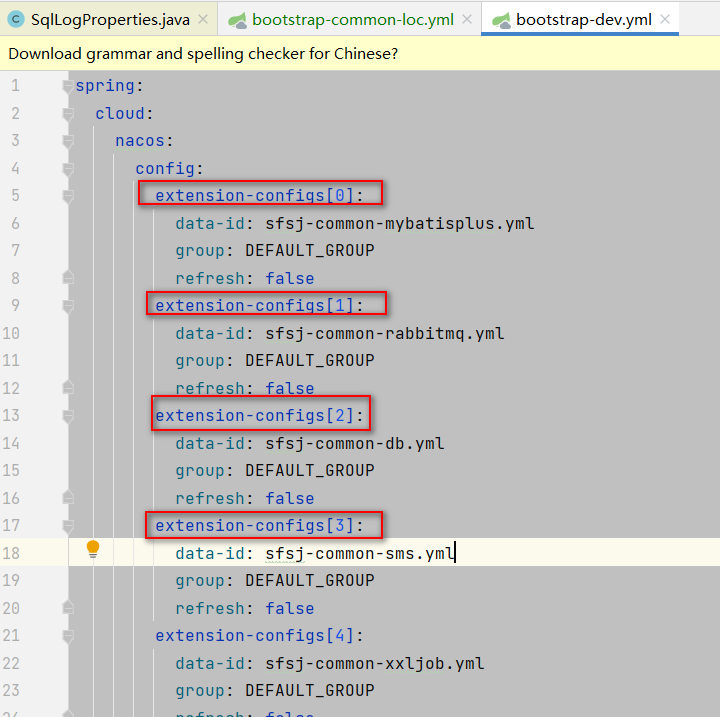

资料来源：
[SpringBoot properties配置Map、List](https://blog.csdn.net/u010735988/article/details/129991364)


## properties高级用法

开始觉的在[18_获取properties](springboot/功能/18获取properties.md)中是properites的用法，在`四川文渊阁科技有限公司`公司发现，有些用法没有见过。故而继续增加用法

### list 用法



使用`nacos`作为注册中心，因而会出现`nacos`的配置

明显上面表示一个list

### 配置文件

```properties
#list
pcp.link.attrs[0].tenantId=A
pcp.link.attrs[0].layoutId=1,2
pcp.link.attrs[1].tenantId=B
pcp.link.attrs[1].layoutId=3,4

#map
pcp.link.attrMap.A=1,2
pcp.link.attrMap.B=3,4
```

### 二、读取配置类

```java
package store.liuwei.basic.demo.common.proper;

import lombok.Data;
import org.springframework.boot.context.properties.ConfigurationProperties;
import org.springframework.context.annotation.PropertySource;
import org.springframework.stereotype.Component;

import java.util.HashMap;
import java.util.List;
import java.util.Map;

@ConfigurationProperties(prefix = "pcp.link")
@Component
@PropertySource("classpath:prop.properties")
@Data
public class LinkAttrProperties {
 
    //attrMap名称必须要与配置文件保持一致
    private Map<String, Object> attrMap = new HashMap<>();
 
    //attrs名称必须要与配置文件保持一致
    private List<LinkAttrConfiguration> attrs;
 
    @Data
    public static class LinkAttrConfiguration {
 
        private String tenantId;
 
        private String layoutId;
    }
}

```

### 测试类

```java
package store.liuwei.basic.demo.mp;


import jakarta.annotation.Resource;
import lombok.extern.slf4j.Slf4j;
import org.junit.Test;
import org.junit.runner.RunWith;
import org.springframework.boot.test.context.SpringBootTest;
import org.springframework.test.context.junit4.SpringRunner;
import store.liuwei.basic.demo.DemoApplication;
import store.liuwei.basic.demo.common.proper.LinkAttrProperties;

@Slf4j
@RunWith(SpringRunner.class)
@SpringBootTest(classes = DemoApplication.class, webEnvironment = SpringBootTest.WebEnvironment.RANDOM_PORT)
public class PorpDemo {

    @Resource
    private LinkAttrProperties linkAttrProperties;

    @Test
    public void test01(){
        log.info("list：{}", linkAttrProperties.getAttrs().toString());
        log.info("-----------------------------------------------------------");
        log.info("map：{}", linkAttrProperties.getAttrMap());
    }
}
```

