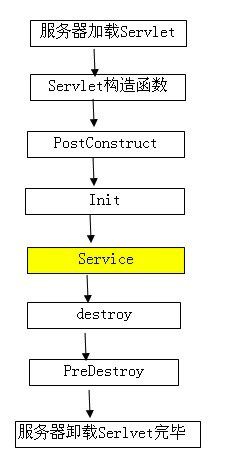

原文链接：

[@PostConstruct详解](https://blog.csdn.net/sunayn/article/details/92840439)

[@Order、@PostConstruct、@DependsOn注解使用](https://blog.csdn.net/java_liuyuan/article/details/107037931?spm=1001.2101.3001.6661.1&utm_medium=distribute.pc_relevant_t0.none-task-blog-2%7Edefault%7ECTRLIST%7ERate-1-107037931-blog-128176915.235%5Ev38%5Epc_relevant_sort_base1&depth_1-utm_source=distribute.pc_relevant_t0.none-task-blog-2%7Edefault%7ECTRLIST%7ERate-1-107037931-blog-128176915.235%5Ev38%5Epc_relevant_sort_base1&utm_relevant_index=1)

## PostConstruct使用

### 介绍

@PostContruct是Java自带的注解，在方法上加该注解会在项目启动的时候执行该方法，也可以理解为在spring容器初始化的时候执行该方法。

从Java EE5规范开始，Servlet中增加了两个影响Servlet生命周期的注解，@PostConstruct和@PreDestroy，这两个注解被用来修饰一个非静态的void（）方法。

### 用法

~~~~java
@PostConstruct
public void someMethod(){}
~~~~
或者

`public @PostConstruct void someMethod(){}`

### 作用

@PostConstruct注解的方法在项目启动的时候执行这个方法，也可以理解为在spring容器启动的时候执行，可作为一些数据的常规化加载，比如数据字典之类的。

### 执行顺序

其实从依赖注入的字面意思就可以知道，要将对象p注入到对象a，那么首先就必须得生成对象a和对象p，才能执行注入。所以，如果一个类A中有个成员变量p被@Autowried注解，那么@Autowired注入是发生在A的构造方法执行完之后的。

如果想在生成对象时完成某些初始化操作，而偏偏这些初始化操作又依赖于依赖注入，那么久无法在构造函数中实现。为此，可以使用@PostConstruct注解一个方法来完成初始化，@PostConstruct注解的方法将会在依赖注入完成后被自动调用。


1. **初始化顺序**：Constructor(构造方法) -> @Autowired(依赖注入) -> @PostConstruct(注释的方法)

## @Order注解

1. **介绍**：注解@Order或者接口Ordered的作用是定义Spring IOC容器中Bean的执行顺序的优先级；

```java
@Retention(RetentionPolicy.RUNTIME)
@Target({ElementType.TYPE, ElementType.METHOD, ElementType.FIELD})
@Documented
public @interface Order {

	/**
	 * 默认是最低优先级,值越小执行顺序优先级越高
	 */
	int value() default Ordered.LOWEST_PRECEDENCE;
}
```

**使用**：通过值控制执行顺序；

````java
@Configuration
@Order(Ordered.HIGHEST_PRECEDENCE) //值越小，执行优先级越高
public class Test {
}
````

## @DependsOn注解

1. **介绍**：控制bean初始化顺序。比如有个场景需要bean B应该被先于bean A被初始化，我们可以在bean A上使用@DependsOn注解，告诉容器bean B应该先被初始化。

```
@Target({ElementType.TYPE, ElementType.METHOD})
@Retention(RetentionPolicy.RUNTIME)
@Documented
public @interface DependsOn {
    String[] value() default {}; // 可以定义多个需要优先初始化的bean
}
```

1. **使用**：标注在带有@Component注解的类上面；或者标注在带有@Bean 注解的方法上面；

```java
@DependsOn({"testB", "testC"})
@Component
public class TestA {
	// Bean TestA的初始化依赖于testB、testC，也就是说testB、testC会先于testA初始化
}
```

```java
@Configuration
public class TestA {

    @Bean
    @DependsOn(value = "testB")
    public Test init() {
    }
```

