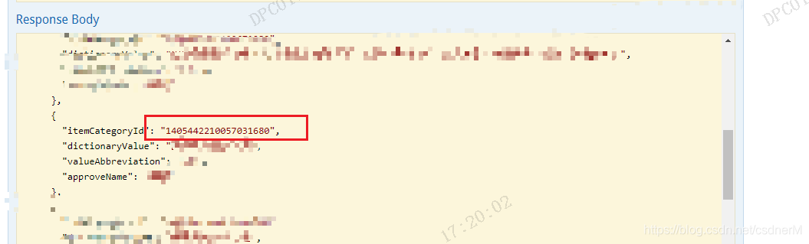
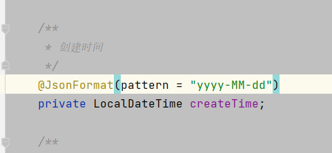

资料来源： <br/>
[Swagger数据失真，显示不全（swagger巨坑！！）](https://blog.csdn.net/csdnerM/article/details/117998055?spm=1001.2101.3001.6650.3&utm_medium=distribute.pc_relevant.none-task-blog-2%7Edefault%7ECTRLIST%7ERate-3.pc_relevant_paycolumn_v3&depth_1-utm_source=distribute.pc_relevant.none-task-blog-2%7Edefault%7ECTRLIST%7ERate-3.pc_relevant_paycolumn_v3&utm_relevant_index=6) <br/>
[Springboot 关于日期时间格式化处理方式总结](https://mp.weixin.qq.com/s/asuP2NsMCVclONkvAM0jDA)<br/>
[SpringBoot:接收date类型的参数方式](https://blog.csdn.net/qq_43842093/article/details/133967766)


## 显示过长

当显示的数据过于厂，会导致失真，这个时候，数据后面全是0，所以我们需要在返回的字段上面加一个注释： `@JsonFormat(shape= JsonFormat.Shape.STRING)`



## 日期格式

项目中使用LocalDateTime系列作为DTO中时间的数据类型，但是SpringMVC收到参数后总报错，为了配置全局时间类型转换，尝试了如下处理方式。

注：本文基于Springboot2.x测试，如果无法生效可能是spring版本较低导致的。

如果你的Controller中的LocalDate类型的参数啥注解（RequestParam、PathVariable等）都没加，也是会出错的，因为默认情况下，解析这种参数是使用`ModelAttributeMethodProcessor`进行处理，而这个处理器要通过反射实例化一个对象出来，然后再对对象中的各个参数进行convert，但是LocalDate类没有构造函数，无法反射实例化因此会报错！！！

在开始之前，我们需要先了解一下 Java 中的日期类型。在 Java 中，有以下几种日期类型：

java.util.Date：表示日期和时间，精确到毫秒级别的（可用于处理某些业务）。
java.util.Calendar：也是用于表示日期时间的类，提供了更加丰富的方法以及时区等相关的操作。但是它的使用比较麻烦，相对而言不太方便。
java.time.LocalDate、java.time.LocalTime、java.time.LocalDateTime：这三个类是 JDK 8 中添加的，分别表示日期、时间以及日期时间，提供了丰富的方法和操作，是目前推荐使用的日期时间类。
在 Spring Boot 中，我们通常会使用 java.util.Date 或者 LocalDateTime 来表示时间。

### 在 Spring Boot 中，接收 Date 类型参数的方式有以下几种：

#### 2.1 使用 @DateTimeFormat

在 Controller 中的[方法参数](https://so.csdn.net/so/search?q=方法参数&spm=1001.2101.3001.7020)上使用 @DateTimeFormat 注解，将字符串类型的日期转换成 Date 类型。示例代码如下：

```java
@PostMapping("/user")
public void addUser(@RequestParam("username") String username,
                    @RequestParam("birthday") @DateTimeFormat(pattern = "yyyy-MM-dd") Date birthday) {
    // TODO: 处理用户添加逻辑
}
```

上述代码中，通过将 birthday 参数的类型指定为 Date，然后在参数上使用 @DateTimeFormat 注解，并指定 pattern 参数值为 yyyy-MM-dd，即可将传入的字符串类型日期转换成 Java 的 Date 类型。

### 使用 Converter
在 Spring Boot 中，可以使用 Converter 将请求参数的字符串类型数据转换为 Java 类型。Converter 接口提供了两个泛型参数：第一个参数表示源类型，第二个参数表示目标类型，具体实现如下：

```java
@Component
public class StringToDateConverter implements Converter<String, Date> {
    private static final SimpleDateFormat sdf = new SimpleDateFormat("yyyy-MM-dd HH:mm:ss");
    @Override
    public Date convert(String source) {
        try {
            return sdf.parse(source);
        } catch (ParseException e) {
            e.printStackTrace();
        }
        return null;
    }
}
```

上述代码中，我们自定义了一个 StringToDateConverter，实现 Converter 接口中的 convert 方法。在 convert 方法中，我们使用 SimpleDateFormat 将字符串类型日期转换成 Date 类型。

在使用时，将 Converter 注入到 Spring Boot 中，并使用 @InitBinder 注解将它注册到 Controller 中。示例代码如下：

```java
@Configuration
public class WebMvcConfig implements WebMvcConfigurer {
    @Autowired
    private StringToDateConverter stringToDateConverter;
    @Override
    public void addFormatters(FormatterRegistry registry) {
        registry.addConverter(stringToDateConverter);
    }
}

@Controller
public class UserController {
    @PostMapping("/user")
    public void addUser(@RequestParam("username") String username,
                        @RequestParam("birthday") Date birthday) {
        // TODO: 处理用户添加逻辑
    }
}
```

### JSON入参及返回值全局处理

- 通过注解的方式




请求类型为:`post,content-type=application/json`， 后台用@RequestBody接收，默认接收及返回值格式为:`yyyy-MM-dd HH:mm:ss`

修改 application.yml 文件

在application.propertities文件中增加如下内容：

```yaml
spring:
	jackson:
		date-format: yyyy-MM-dd HH:mm:ss
		time-zone: GMT+8
```

- 支持（content-type=application/json）请求中格式为 yyyy-MM-dd HH:mm:ss的字符串，后台用@RequestBody接收，及返回值date转为yyyy-MM-dd HH:mm:ss格式string；
- 不支持（content-type=application/json）请求中yyyy-MM-dd等类型的字符串转为date；
- 不支持java8日期api;

利用Jackson的JSON序列化和反序列化

```java
@Configuration
public class JacksonConfig {

    /** 默认日期时间格式 */
    public static final String DEFAULT_DATE_TIME_FORMAT = "yyyy-MM-dd HH:mm:ss";
    /** 默认日期格式 */
    public static final String DEFAULT_DATE_FORMAT = "yyyy-MM-dd";
    /** 默认时间格式 */
    public static final String DEFAULT_TIME_FORMAT = "HH:mm:ss";

    @Bean
    public MappingJackson2HttpMessageConverter mappingJackson2HttpMessageConverter() {
        MappingJackson2HttpMessageConverter converter = new MappingJackson2HttpMessageConverter();
        ObjectMapper objectMapper = new ObjectMapper();

        // 忽略json字符串中不识别的属性
        objectMapper.configure(DeserializationFeature.FAIL_ON_UNKNOWN_PROPERTIES, false);
        // 忽略无法转换的对象 
        objectMapper.configure(SerializationFeature.FAIL_ON_EMPTY_BEANS, false);
        // PrettyPrinter 格式化输出
        objectMapper.configure(SerializationFeature.INDENT_OUTPUT, true);
        // NULL不参与序列化
        objectMapper.setSerializationInclusion(JsonInclude.Include.NON_NULL);

        // 指定时区
        objectMapper.setTimeZone(TimeZone.getTimeZone("GMT+8:00"));
        // 日期类型字符串处理
        objectMapper.setDateFormat(new SimpleDateFormat(DEFAULT_DATE_TIME_FORMAT));

        // java8日期日期处理
        JavaTimeModule javaTimeModule = new JavaTimeModule();
        javaTimeModule.addSerializer(LocalDateTime.class, new LocalDateTimeSerializer(DateTimeFormatter.ofPattern(DEFAULT_DATE_TIME_FORMAT)));
        javaTimeModule.addSerializer(LocalDate.class, new LocalDateSerializer(DateTimeFormatter.ofPattern(DEFAULT_DATE_FORMAT)));
        javaTimeModule.addSerializer(LocalTime.class, new LocalTimeSerializer(DateTimeFormatter.ofPattern(DEFAULT_TIME_FORMAT)));
        javaTimeModule.addDeserializer(LocalDateTime.class, new LocalDateTimeDeserializer(DateTimeFormatter.ofPattern(DEFAULT_DATE_TIME_FORMAT)));
        javaTimeModule.addDeserializer(LocalDate.class, new LocalDateDeserializer(DateTimeFormatter.ofPattern(DEFAULT_DATE_FORMAT)));
        javaTimeModule.addDeserializer(LocalTime.class, new LocalTimeDeserializer(DateTimeFormatter.ofPattern(DEFAULT_TIME_FORMAT)));
        objectMapper.registerModule(javaTimeModule);

        converter.setObjectMapper(objectMapper);
        return converter;
    }
}
```

总结：

- 支持（content-type=application/json）请求中格式为yyyy-MM-dd HH:mm:ss的字符串，后台用@RequestBody接收，及返回值Date转为yyyy-MM-dd HH:mm:ss格式String；
- 支持java8日期api；
- 不支持（content-type=application/json）请求中yyyy-MM-dd等类型的字符串转为Date；

以上两种方式为JSON入参的全局化处理，推荐使用方式二，尤其适合大型项目在基础包中全局设置。

### JSON入参及返回值局部差异化处理

场景：假如全局日期时间处理格式为：yyyy-MM-dd HH:mm:ss，但是某个字段要求接收或返回日期yyyy-MM-dd。

方式一 使用springboot自带的注解@JsonFormat(pattern = "yyyy-MM-dd")，如下所示：

```
@JsonFormat(pattern = "yyyy-MM-dd", timezone="GMT+8")
private Date releaseDate;
```

点评：springboot默认提供，功能强大，满足常见场景使用，并可指定时区。

方式二

自定义日期序列化与反序列化，如下所示：

```java
/**
 * 日期序列化
 */
public class DateJsonSerializer extends JsonSerializer<Date> {
    @Override
    public void serialize(Date date, JsonGenerator jsonGenerator, SerializerProvider serializerProvider) throws IOException {
        SimpleDateFormat dateFormat = new SimpleDateFormat("yyyy-MM-dd");
        jsonGenerator.writeString(dateFormat.format(date));
    }
}

/**
 * 日期反序列化
 */
public class DateJsonDeserializer extends JsonDeserializer<Date> {
    @Override
    public Date deserialize(JsonParser jsonParser, DeserializationContext deserializationContext) throws IOException {
        try {
            SimpleDateFormat dateFormat = new SimpleDateFormat("yyyy-MM-dd");
            return dateFormat.parse(jsonParser.getText());
        } catch (ParseException e) {
            throw new RuntimeException(e);
        }
    }
}

/**
 * 使用方式
 */
@JsonSerialize(using = DateJsonSerializer.class)
@JsonDeserialize(using = DateJsonDeserializer.class)
private Date releaseDate;
复制代码日期时间格式化处理方式完整配置
@Configuration
public class DateHandlerConfig {

    /** 默认日期时间格式 */
    public static final String DEFAULT_DATE_TIME_FORMAT = "yyyy-MM-dd HH:mm:ss";
    /** 默认日期格式 */
    public static final String DEFAULT_DATE_FORMAT = "yyyy-MM-dd";
    /** 默认时间格式 */
    public static final String DEFAULT_TIME_FORMAT = "HH:mm:ss";

    /**
     * LocalDate转换器，用于转换RequestParam和PathVariable参数
     * `@ConditionalOnBean(name = "requestMappingHandlerAdapter")`: 等requestMappingHandlerAdapter bean注册完成之后
     * 再添加自己的`converter`就不会注册到`FormattingConversionService`中
     */
    @Bean
    @ConditionalOnBean(name = "requestMappingHandlerAdapter")
    public Converter<String, LocalDate> localDateConverter() {
        return source -> LocalDate.parse(source, DateTimeFormatter.ofPattern(DEFAULT_DATE_FORMAT));
    }

    /**
     * LocalDateTime转换器，用于转换RequestParam和PathVariable参数
     */
    @Bean
    @ConditionalOnBean(name = "requestMappingHandlerAdapter")
    public Converter<String, LocalDateTime> localDateTimeConverter() {
        return source -> LocalDateTime.parse(source, DateTimeFormatter.ofPattern(DEFAULT_DATE_TIME_FORMAT));
    }

    /**
     * LocalTime转换器，用于转换RequestParam和PathVariable参数
     */
    @Bean
    @ConditionalOnBean(name = "requestMappingHandlerAdapter")
    public Converter<String, LocalTime> localTimeConverter() {
        return source -> LocalTime.parse(source, DateTimeFormatter.ofPattern(DEFAULT_TIME_FORMAT));
    }

    /**
     * Date转换器，用于转换RequestParam和PathVariable参数
     * 这里关于解析各种格式的日期格式采用了 hutool 的日期解析工具类
     */
    @Bean
    public Converter<String, Date> dateConverter() {
        return new Converter<String, Date>() {
            @Override
            public Date convert(String source) {
                return DateUtil.parse(source.trim());
            }
        };
    }

    /**
     * Json序列化和反序列化转换器，用于转换Post请求体中的json以及将我们的对象序列化为返回响应的json
     */
    @Bean
    public ObjectMapper objectMapper(){
        ObjectMapper objectMapper = new ObjectMapper();
        objectMapper.disable(SerializationFeature.WRITE_DATES_AS_TIMESTAMPS);
        objectMapper.disable(DeserializationFeature.ADJUST_DATES_TO_CONTEXT_TIME_ZONE);

        //LocalDateTime系列序列化和反序列化模块，继承自jsr310，我们在这里修改了日期格式
        JavaTimeModule javaTimeModule = new JavaTimeModule();
        javaTimeModule.addSerializer(LocalDateTime.class,new LocalDateTimeSerializer(DateTimeFormatter.ofPattern(DEFAULT_DATE_TIME_FORMAT)));
        javaTimeModule.addSerializer(LocalDate.class,new LocalDateSerializer(DateTimeFormatter.ofPattern(DEFAULT_DATE_FORMAT)));
        javaTimeModule.addSerializer(LocalTime.class,new LocalTimeSerializer(DateTimeFormatter.ofPattern(DEFAULT_TIME_FORMAT)));
        javaTimeModule.addDeserializer(LocalDateTime.class,new LocalDateTimeDeserializer(DateTimeFormatter.ofPattern(DEFAULT_DATE_TIME_FORMAT)));
        javaTimeModule.addDeserializer(LocalDate.class,new LocalDateDeserializer(DateTimeFormatter.ofPattern(DEFAULT_DATE_FORMAT)));
        javaTimeModule.addDeserializer(LocalTime.class,new LocalTimeDeserializer(DateTimeFormatter.ofPattern(DEFAULT_TIME_FORMAT)));


        //Date序列化和反序列化
        javaTimeModule.addSerializer(Date.class, new JsonSerializer<>() {
            @Override
            public void serialize(Date date, JsonGenerator jsonGenerator, SerializerProvider serializerProvider) throws IOException {
                SimpleDateFormat formatter = new SimpleDateFormat(DEFAULT_DATE_TIME_FORMAT);
                String formattedDate = formatter.format(date);
                jsonGenerator.writeString(formattedDate);
            }
        });
        javaTimeModule.addDeserializer(Date.class, new JsonDeserializer<>() {
            @Override
            public Date deserialize(JsonParser jsonParser, DeserializationContext deserializationContext) throws IOException, JsonProcessingException {
                SimpleDateFormat format = new SimpleDateFormat(DEFAULT_DATE_TIME_FORMAT);
                String date = jsonParser.getText();
                try {
                    return format.parse(date);
                } catch (ParseException e) {
                    throw new RuntimeException(e);
                }
            }
        });

        objectMapper.registerModule(javaTimeModule);
        return objectMapper;
    }
}
```

接下来进入debug模式，看看mvc是如何将我们request中的参数绑定到我们controller层方法入参的；