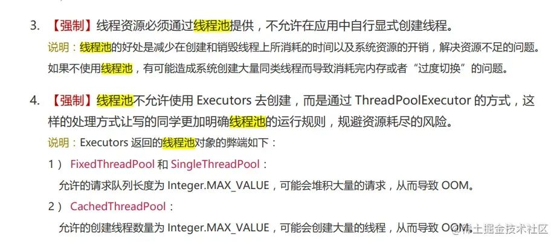

资料来源：<br/>
[扯下@EventListener这个注解的神秘面纱](https://juejin.cn/post/7220251777685602363)<br/>
[spring事件监听（eventListener)](https://juejin.cn/post/6988040622984658958)<br/>
[使用上 Spring 的事件机制，真香！](https://mp.weixin.qq.com/s/fWBldeODiqhbssh95SrRpA)

## EventListener注解方式

**原理：观察者模式**

spring的事件监听有三个部分组成，事件（ApplicationEvent)、监听器(ApplicationListener)和事件发布操作。

### 事件

```java
@Data
public class RegisterSuccessEvent {
    private String userName;

    public RegisterSuccessEvent(String userName) {
        this.userName = userName;
    }
}
```

### 监听器

```java
@Slf4j
@Component
public class RegisterEventListener {
    @EventListener
    public void handleNotifyEvent(RegisterSuccessEvent event){
        log.info("监听到用户注册成功事件：" +
                "{}，你注册成功了哦。记得来玩儿~", event.getUserName());
    }
}
```

可以有多个事件监听器

### 事件发布

采用接口请求触发

```java
@RestController
public class ListenController {

    @Resource
    private ApplicationContext applicationContext;

    @GetMapping("/publishEvent")
    public String start(){
        applicationContext.publishEvent(new RegisterSuccessEvent("歪歪"));
        return "success";
    }
}
```

访问`http://127.0.0.1:8003/publishEvent`可以看到触发成功

## 其他方式

### 事件

事件类需要继承ApplicationEvent，代码如下：

```java
public class HelloEvent extends ApplicationEvent {
    
    private String name;
    
    public HelloEvent(Object source, String name) {
        super(source);
        this.name = name;
    }
    
    public String getName() {
        return name;
    }
}
```

事件类是一种很简单的pojo，除了需要继承ApplicationEvent也没什么了，这个类有一个构造方法需要super。

### 事件监听器

```java
public class HelloEventListener implements ApplicationListener<HelloEvent> {

    private static final Logger logger = LoggerFactory.getLogger(HelloEventListener.class);

    @Override
    public void onApplicationEvent(HelloEvent event) {
        logger.info("receive {} say hello!",event.getName());
    }
}
```

事件监听器需要实现ApplicationListener接口，这是个泛型接口，泛型类类型就是事件类型，其次需要是spring容器托管的bean，所以这里加了@component，只有一个方法，就是onApplicationEvent。

### 事件发布操作

有了事件和监听器，不发布事件也不用，事件发布方式很简单

```java
applicationContext.publishEvent(new HelloEvent(this,"lgb"));
```

## **搭配@Async注解实现异步操作**

监听器默认是同步执行的，如果我们想实现异步执行，可以搭配@Async注解使用，但是**前提条件是你真的懂@Async注解，使用不当会出现问题的。** 后续我会出一篇有关@Async注解使用的文章。这里就不给大家详细的解释了。有想了解的同学可以去网上学习一下有关@Async注解使用。

**使用@Async时，需要配置线程池，否则用的还是默认的线程池也就是主线程池，线程池使用不当会浪费资源，严重的会出现OOM事故。**

下图是阿里巴巴开发手册的强制要求。



简单的演示一下：这里声明一下俺没有使用线程池，只是简单的演示一下。

**1、** 在我们的启动类上添加@EnableAsync开启异步执行配置；

```java
@EnableAsync
@SpringBootApplication
public class SpirngEventApplication {

    public static void main(String[] args) {
        SpringApplication.run(SpirngEventApplication.class, args);
    }

}
```

**2、** 在我们想要异步执行的监听器上添加@Async注解；

```java
/**
 * @Author JiaQIng
 * @Description 事件监听器
 * @ClassName LogListener
 * @Date 2023/3/26 14:22
 **/
@Component
public class ListenerEvent {
    
    @Async
    @EventListener({ UserChangePasswordEvent.class })
    public void logListener(UserChangePasswordEvent event) {
        System.out.println("收到事件:" + event);
        System.out.println("开始执行业务操作生成关键日志。用户userId为：" + event.getUserId());
    }
}
```

这样我们的异步执行监听器的业务操作就完成了。

**Spring的事件机制的应用场景**

**1、** 告警操作，比喻钉钉告警，异常告警，可以通过事件机制进行解耦；
**2、** 关键性日志记录和业务埋点，比喻说我们的关键日志需要入库，记录一下操作时间，操作人，变更内容等等，可以通过事件机制进行解耦；
**3、** 性能监控，比喻说一些接口的时长，性能方便的埋点等可以通过事件机制进行解耦；
**4、** .......一切与主业务无关的操作都可以通过这种方式进行解耦，常用的场景大概就上述提到的，而且很多架构的源码都有使用这种机制，如GateWay，Spring等等；

**Spring的事件机制的注意事项**

**1、** 对于同一个事件，有多个监听器的时候，注意**可以通过@Order注解指定顺序，Order的value值越小，执行的优先级就越高**；
**2、** 如果发布事件的方法处于事务中，那么事务会在监听器方法执行完毕之后才提交事件发布之后就由监听器去处理，而不要影响原有的事务，也就是说希望事务及时提交我们就可以@TransactionalEventListener来定义一个监听器；
**3、** 监听器默认是同步执行的，如果我们想实现异步执行，可以搭配@Async注解使用，但是**前提条件是你真的懂@Async注解，使用不当会出现问题的**；
**4、** 对于同一个事件，有多个监听器的时候，如果出现了异常，后续的监听器就失效了，因为他是把同一个事件的监听器add在一个集合里面循环执行，**如果出现异常，需要注意捕获异常处理异常**；