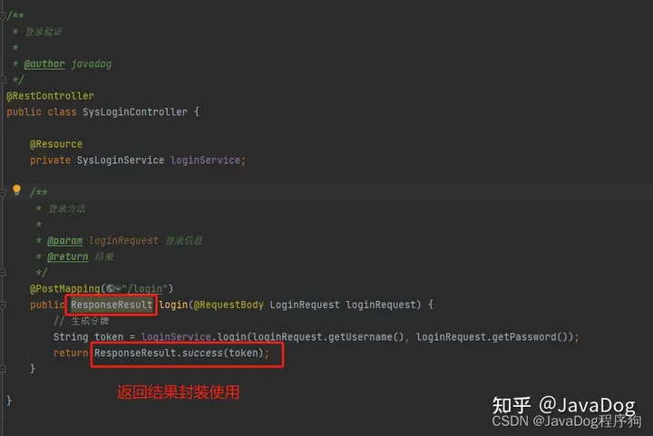
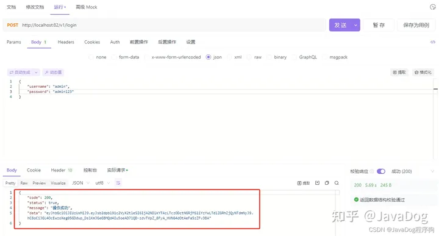
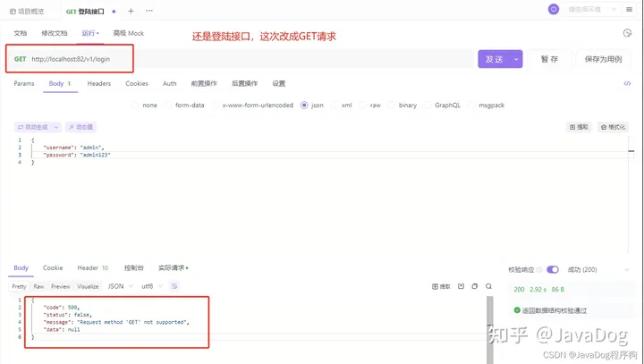
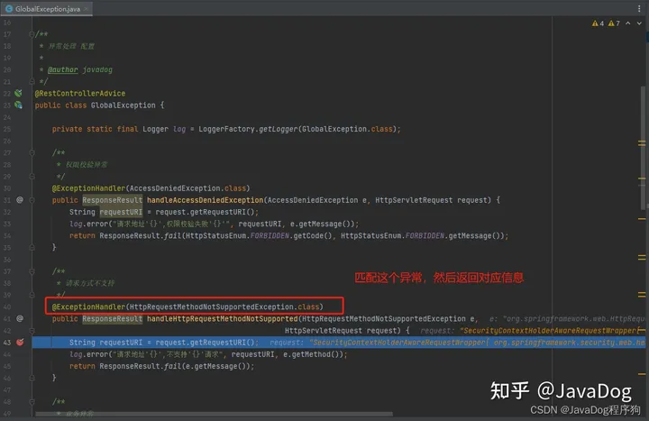

资料来源：<br/>
[【规范】SpringBoot接口返回结果及异常统一处理，这样封装才优雅](https://zhuanlan.zhihu.com/p/656464576)

# SpringBoot接口返回结果及异常统一处理

### **一.统一接口返回结果**

前端接口请求后台端，后端将返回结果**统一封装**。提高交互的**规范性**及**通用性**，也提高了前后端**联调效率**。前端根据规范格式返回结构体进行统一映射处理，就避免一个接口一个返回格式的问题。

### **1.统一封装结果包含如下参数**

- 状态码：code
- 状态信息：status
- 返回信息：message
- 数据：data

### **2.统一封装结果包含如下方法**

- 全参数方法
- 成功返回（无参）
- 成功返回（枚举）
- 成功返回（状态码+返回信息）
- 成功返回（返回信息 + 数据）
- 成功返回（状态码+返回信息+数据）
- 成功返回（数据）
- 成功返回（返回信息）
- 失败返回（无参）
- 失败返回（枚举）
- 失败返回（状态码+返回信息）
- 失败返回（返回信息+数据）
- 失败返回（状态码+返回信息+数据）
- 失败返回（数据）
- 失败返回（返回信息）

### **3.ResponseResult封装返回结果代码**

```text
package net.javadog.common.result;

import io.swagger.annotations.ApiModel;
import io.swagger.annotations.ApiModelProperty;
import lombok.AllArgsConstructor;
import lombok.Data;
import lombok.NoArgsConstructor;
import net.javadog.common.enums.HttpStatusEnum;

/**
 * 返回结果集
 *
 * @author javadog
 **/
@Data
@AllArgsConstructor
@NoArgsConstructor
@ApiModel("统一结果集处理器")
public class ResponseResult<T> {

    /**
     * 状态码
     */
    @ApiModelProperty(value = "状态码")
    private Integer code;

    /**
     * 状态信息
     */
    @ApiModelProperty(value = "状态信息")
    private Boolean status;

    /**
     * 返回信息
     */
    @ApiModelProperty(value = "返回信息")
    private String message;

    /**
     * 数据
     */
    @ApiModelProperty(value = "数据")
    private T data;

    /**
     * 全参数方法
     *
     * @param code    状态码
     * @param status  状态
     * @param message 返回信息
     * @param data    返回数据
     * @param <T>     泛型
     * @return {@link ResponseResult<T>}
     */
    private static <T> ResponseResult<T> response(Integer code, Boolean status, String message, T data) {
        ResponseResult<T> responseResult = new ResponseResult<>();
        responseResult.setCode(code);
        responseResult.setStatus(status);
        responseResult.setMessage(message);
        responseResult.setData(data);
        return responseResult;
    }

    /**
     * 全参数方法
     *
     * @param code    状态码
     * @param status  状态
     * @param message 返回信息
     * @param <T>     泛型
     * @return {@link ResponseResult<T>}
     */
    private static <T> ResponseResult<T> response(Integer code, Boolean status, String message) {
        ResponseResult<T> responseResult = new ResponseResult<>();
        responseResult.setCode(code);
        responseResult.setStatus(status);
        responseResult.setMessage(message);
        return responseResult;
    }

    /**
     * 成功返回（无参）
     *
     * @param <T> 泛型
     * @return {@link ResponseResult<T>}
     */
    public static <T> ResponseResult<T> success() {
        return response(HttpStatusEnum.SUCCESS.getCode(), true, HttpStatusEnum.SUCCESS.getMessage(), null);
    }

    /**
     * 成功返回（枚举参数）
     *
     * @param httpResponseEnum 枚举参数
     * @param <T>              泛型
     * @return {@link ResponseResult<T>}
     */
    public static <T> ResponseResult<T> success(HttpStatusEnum httpResponseEnum) {
        return response(httpResponseEnum.getCode(), true, httpResponseEnum.getMessage());
    }

    /**
     * 成功返回（状态码+返回信息）
     *
     * @param code    状态码
     * @param message 返回信息
     * @param <T>     泛型
     * @return {@link ResponseResult<T>}
     */
    public static <T> ResponseResult<T> success(Integer code, String message) {
        return response(code, true, message);
    }

    /**
     * 成功返回（返回信息 + 数据）
     *
     * @param message 返回信息
     * @param data    数据
     * @param <T>     泛型
     * @return {@link ResponseResult<T>}
     */
    public static <T> ResponseResult<T> success(String message, T data) {
        return response(HttpStatusEnum.SUCCESS.getCode(), true, message, data);
    }

    /**
     * 成功返回（状态码+返回信息+数据）
     *
     * @param code    状态码
     * @param message 返回信息
     * @param data    数据
     * @param <T>     泛型
     * @return {@link ResponseResult<T>}
     */
    public static <T> ResponseResult<T> success(Integer code, String message, T data) {
        return response(code, true, message, data);
    }

    /**
     * 成功返回（数据）
     *
     * @param data 数据
     * @param <T>  泛型
     * @return {@link ResponseResult<T>}
     */
    public static <T> ResponseResult<T> success(T data) {
        return response(HttpStatusEnum.SUCCESS.getCode(), true, HttpStatusEnum.SUCCESS.getMessage(), data);
    }

    /**
     * 成功返回（返回信息）
     *
     * @param message 返回信息
     * @param <T>  泛型
     * @return {@link ResponseResult<T>}
     */
    public static <T> ResponseResult<T> success(String message) {
        return response(HttpStatusEnum.SUCCESS.getCode(), true, message, null);
    }

    /**
     * 失败返回（无参）
     *
     * @param <T> 泛型
     * @return {@link ResponseResult<T>}
     */
    public static <T> ResponseResult<T> fail() {
        return response(HttpStatusEnum.ERROR.getCode(), false, HttpStatusEnum.ERROR.getMessage(), null);
    }

    /**
     * 失败返回（枚举）
     *
     * @param httpResponseEnum 枚举
     * @param <T>              泛型
     * @return {@link ResponseResult<T>}
     */
    public static <T> ResponseResult<T> fail(HttpStatusEnum httpResponseEnum) {
        return response(httpResponseEnum.getCode(), false, httpResponseEnum.getMessage());
    }

    /**
     * 失败返回（状态码+返回信息）
     *
     * @param code    状态码
     * @param message 返回信息
     * @param <T>     泛型
     * @return {@link ResponseResult<T>}
     */
    public static <T> ResponseResult<T> fail(Integer code, String message) {
        return response(code, false, message);
    }

    /**
     * 失败返回（返回信息+数据）
     *
     * @param message 返回信息
     * @param data    数据
     * @param <T>     泛型
     * @return {@link ResponseResult<T>}
     */
    public static <T> ResponseResult<T> fail(String message, T data) {
        return response(HttpStatusEnum.ERROR.getCode(), false, message, data);
    }

    /**
     * 失败返回（状态码+返回信息+数据）
     *
     * @param code    状态码
     * @param message 返回消息
     * @param data    数据
     * @param <T>     泛型
     * @return {@link ResponseResult<T>}
     */
    public static <T> ResponseResult<T> fail(Integer code, String message, T data) {
        return response(code, false, message, data);
    }

    /**
     * 失败返回（数据）
     *
     * @param data 数据
     * @param <T>  泛型
     * @return {@link ResponseResult<T>}
     */
    public static <T> ResponseResult<T> fail(T data) {
        return response(HttpStatusEnum.ERROR.getCode(), false, HttpStatusEnum.ERROR.getMessage(), data);
    }

    /**
     * 失败返回（返回信息）
     *
     * @param message 返回信息
     * @param <T>  泛型
     * @return {@link ResponseResult<T>}
     */
    public static <T> ResponseResult<T> fail(String message) {
        return response(HttpStatusEnum.ERROR.getCode(), false, message, null);
    }
}
```

### **4.HttpStatusEnum返回结果代码**

```java
package net.javadog.common.enums;

import lombok.Getter;

/**
 * Http状态返回枚举
 *
 * @author javadog
 **/
@Getter
public enum HttpStatusEnum {
    /**
     * 操作成功
     */
    SUCCESS(200, "操作成功"),
    /**
     * 对象创建成功
     */
    CREATED(201, "对象创建成功"),
    /**
     * 请求已经被接受
     */
    ACCEPTED(202, "请求已经被接受"),
    /**
     * 操作已经执行成功，但是没有返回数据
     */
    NO_CONTENT(204, "操作已经执行成功，但是没有返回数据"),
    /**
     * 资源已被移除
     */
    MOVED_PERM(301, "资源已被移除"),
    /**
     * 重定向
     */
    SEE_OTHER(303, "重定向"),
    /**
     * 资源没有被修改
     */
    NOT_MODIFIED(304, "资源没有被修改"),
    /**
     * 参数列表错误（缺少，格式不匹配）
     */
    BAD_REQUEST(400, "参数列表错误（缺少，格式不匹配）"),
    /**
     * 未授权
     */
    UNAUTHORIZED(401, "未授权"),
    /**
     * 访问受限，授权过期
     */
    FORBIDDEN(403, "访问受限，授权过期"),
    /**
     * 资源，服务未找到
     */
    NOT_FOUND(404, "资源，服务未找！"),
    /**
     * 不允许的http方法
     */
    BAD_METHOD(405, "不允许的http方法"),
    /**
     * 资源冲突，或者资源被锁
     */
    CONFLICT(409, "资源冲突，或者资源被锁"),
    /**
     * 不支持的数据，媒体类型
     */
    UNSUPPORTED_TYPE(415, "不支持的数据，媒体类型"),
    /**
     * 系统内部错误
     */
    ERROR(500, "系统内部错误"),
    /**
     * 接口未实现
     */
    NOT_IMPLEMENTED(501, "接口未实现"),
    /**
     * 系统警告消息
     */
    WARN(601,"系统警告消息");

    private final Integer code;
    private final String message;

    HttpStatusEnum(Integer code, String message) {
        this.code = code;
        this.message = message;
    }
}
```

### **5.SysLoginController实操调试**

```java
/**
 * 登录验证
 *
 * @author javadog
 */
@RestController
public class SysLoginController {

    @Resource
    private SysLoginService loginService;

    /**
     * 登录方法
     *
     * @param loginRequest 登录信息
     * @return 结果
     */
    @PostMapping("/login")
    public ResponseResult login(@RequestBody LoginRequest loginRequest) {
        // 生成令牌
        String token = loginService.login(loginRequest.getUsername(), loginRequest.getPassword());
        return ResponseResult.success(token);
    }

}
```





------

### **二.配置全局异常处理**

**在使用上方统一返回结果的加持下，规范的同时也不可避免程序异常情况**。因此我们必须提前定义一个统一全局异常来捕获这些异常信息，并将其当作一种结果返回给控制层，友好的处理异常信息。

### **1.全局异常处理注解**

**@RestControllerAdvice**

@RestControllerAdvice什么是？

- **@RestControllerAdvice注解**是Spring MVC和Spring Boot应用程序中用于定义**全局异常处理类的注解**，它是@ControllerAdvice注解的特殊版本，是一个组合注解，**由@ControllerAdvice、@ResponseBody组成**。
- **@ControllerAdvice继承了@Component**，因此@RestControllerAdvice本质上是个组件，用于**定义@ExceptionHandler，@InitBinder和@ModelAttribute方法，适用于所有使用@RequestMapping方法**。

@RestControllerAdvice有什么特点？

- 注解@RestControllerAdvice的类的方法可以**使用@ExceptionHandler、@InitBinder、@ModelAttribute注解到方法上**。
- @RestControllerAdvice注解将作用于所有**注解了@RequestMapping的控制器的方法上**。
- @ExceptionHandler：用于指定异常处理方法，**与@RestControllerAdvice配合使用时，用于全局处理控制器里的异常**。
- @InitBinder：用来设置WebDataBinder，用于自动绑定前台请求参数到Model中。
- @ModelAttribute：本来作用是绑定键值对到Model中，当与@ControllerAdvice配合使用时，可以让全局的@RequestMapping都能获得在此处设置的键值对

### **2.@ExceptionHandler常用异常拦截**

- 权限校验异常：AccessDeniedException（spring-security中异常）
- 请求方式不支持：HttpRequestMethodNotSupportedException
- 业务异常：ServiceException（自己业务定义异常）
- 拦截未知的运行时异常：RuntimeException
- 系统异常：Exception
- 自定义验证异常：BindException
- 自定义验证异常：MethodArgumentNotValidException

### **3.全局异常处理代码**

```java
package net.javadog.common.exception;

import cn.hutool.core.util.ObjectUtil;
import net.javadog.common.enums.HttpStatusEnum;
import net.javadog.common.result.ResponseResult;
import org.slf4j.Logger;
import org.slf4j.LoggerFactory;
import org.springframework.security.access.AccessDeniedException;
import org.springframework.validation.BindException;
import org.springframework.web.HttpRequestMethodNotSupportedException;
import org.springframework.web.bind.MethodArgumentNotValidException;
import org.springframework.web.bind.annotation.ExceptionHandler;
import org.springframework.web.bind.annotation.RestControllerAdvice;

import javax.servlet.http.HttpServletRequest;

/**
 * 异常处理 配置
 *
 * @author javadog
 */
@RestControllerAdvice
public class GlobalException {

    private static final Logger log = LoggerFactory.getLogger(GlobalException.class);

    /**
     * 权限校验异常
     */
    @ExceptionHandler(AccessDeniedException.class)
    public ResponseResult handleAccessDeniedException(AccessDeniedException e, HttpServletRequest request) {
        String requestURI = request.getRequestURI();
        log.error("请求地址'{}',权限校验失败'{}'", requestURI, e.getMessage());
        return ResponseResult.fail(HttpStatusEnum.FORBIDDEN.getCode(), HttpStatusEnum.FORBIDDEN.getMessage());
    }

    /**
     * 请求方式不支持
     */
    @ExceptionHandler(HttpRequestMethodNotSupportedException.class)
    public ResponseResult handleHttpRequestMethodNotSupported(HttpRequestMethodNotSupportedException e,
                                                          HttpServletRequest request) {
        String requestURI = request.getRequestURI();
        log.error("请求地址'{}',不支持'{}'请求", requestURI, e.getMethod());
        return ResponseResult.fail(e.getMessage());
    }

    /**
     * 业务异常
     */
    @ExceptionHandler(ServiceException.class)
    public ResponseResult handleServiceException(ServiceException e) {
        log.error(e.getMessage(), e);
        Integer code = e.getCode();
        return ObjectUtil.isNotNull(code) ? ResponseResult.fail(code, e.getMessage()) : ResponseResult.fail(e.getMessage());
    }

    /**
     * 拦截未知的运行时异常
     */
    @ExceptionHandler(RuntimeException.class)
    public ResponseResult handleRuntimeException(RuntimeException e, HttpServletRequest request) {
        String requestURI = request.getRequestURI();
        log.error("请求地址'{}',发生未知异常.", requestURI, e);
        return ResponseResult.fail(e.getMessage());
    }

    /**
     * 系统异常
     */
    @ExceptionHandler(Exception.class)
    public ResponseResult handleException(Exception e, HttpServletRequest request) {
        String requestURI = request.getRequestURI();
        log.error("请求地址'{}',发生系统异常.", requestURI, e);
        return ResponseResult.fail(e.getMessage());
    }

    /**
     * 自定义验证异常
     */
    @ExceptionHandler(BindException.class)
    public ResponseResult handleBindException(BindException e) {
        log.error(e.getMessage(), e);
        String message = e.getAllErrors().get(0).getDefaultMessage();
        return ResponseResult.fail(message);
    }

    /**
     * 自定义验证异常
     */
    @ExceptionHandler(MethodArgumentNotValidException.class)
    public Object handleMethodArgumentNotValidException(MethodArgumentNotValidException e) {
        log.error(e.getMessage(), e);
        String message = e.getBindingResult().getFieldError().getDefaultMessage();
        return ResponseResult.fail(message);
    }

}
```

### **4.全局异常处理实操调试**





## **总结**

本文通过多个SpringBoot实际项目进行归纳整理，从**统一接口返回结果**和**配置全局异常处理**两个方面出发，介绍**如何优雅的封装规范后端接口输出**，详细**刨析@RestControllerAdvice和@ExceptionHandler注解**及使用方式，增加后端**服务健壮性**和与**前端对接规范性**，希望由此化繁为简，能够帮到博友分毫。