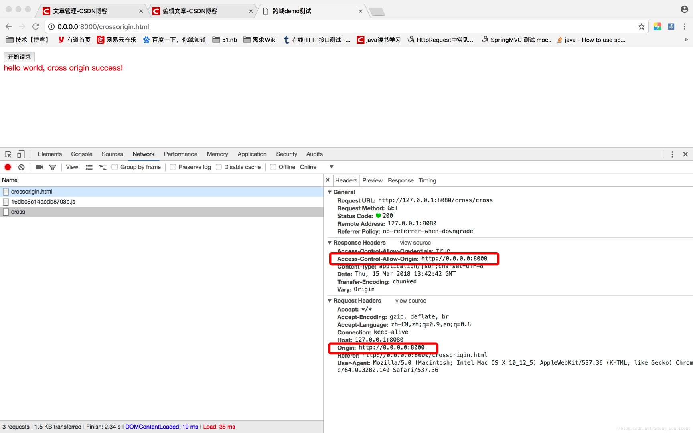

## 跨域问题

### 跨域的原因

浏览器的[同源策略](https://so.csdn.net/so/search?q=%E5%90%8C%E6%BA%90%E7%AD%96%E7%95%A5&spm=1001.2101.3001.7020)是浏览器上为安全性考虑实施的非常重要的安全策略。

### 解决方法

但很多请求下我们不得不进行跨域请求，克服跨域限制的常见的方法有：

- (1)通过jsonp跨域
  JSONP实现跨域请求的原理简单的说，就是动态创建< script>标签，然后利用< script>的src不受同源策略约束来跨域获取数据。
  JSONP 由两部分组成：回调函数和数据。回调函数是当响应到来时应该在页面中调用的函数。回调函数的名字一般是在请求中指定的。而数据就是传入回调函数中的 JSON 数据。
  具体见:jsonp原理

- (2)使用代理服务器
  使用代理方式跨域更加直接，因为同源限制是浏览器实现的。如果请求不是从浏览器发起的，就不存在跨域问题了。

- (3)CORS，即跨域资源共享
  需要浏览器和服务器同时支持，目前，所有浏览器都支持该功能。因此，实现CORS通信的关键是服务器。只要服务器实现了CORS接口，就可以跨源通信。重点关注header中的Origin和Access-Control-Allow-Origin两个字段。

  [资料来源](https://blog.csdn.net/Stony_Confident/article/details/7946108)

### 方法一（全局变量）

前端页面通过不同域名或IP访问微服务的后台 
例如前端人员会在本地起HttpServer 直连后台开发本地起的服务，此时，如果不加任何配置，前端页面的请求会被浏览器跨域限制拦截，所以，业务服务常常会添加如下代码设置全局跨域：

~~~~
@Bean
public CorsFilter corsFilter() {
    logger.debug("CORS限制打开");
    CorsConfiguration config = new CorsConfiguration();
    # 仅在开发环境设置为*
    config.addAllowedOrigin("*");
    config.addAllowedHeader("*");
    config.addAllowedMethod("*");
    config.setAllowCredentials(true);
    UrlBasedCorsConfigurationSource configSource = new UrlBasedCorsConfigurationSource();
    configSource.registerCorsConfiguration("/**", config);
    return new CorsFilter(configSource);
}
~~~~

### 方法二(@CrossOrigin)

上诉服务端解决跨域请求，采用的是spring框架的@CrossOrigin，在进行源码分析前，先来回顾一下一次http请求中SpringMVC的执行流程。

重点介绍：
springmvc一种响应/请求框架。
1.DispatcherServlet有一个关键方法doDispatch(HttpServletRequest request, HttpServletResponse response)。
2.根据request中的url，请求处理器映射RequestMappingHandlerMapping。
关注它的启动初始化过程，收集的RequestMappingInfo映射信息。
3.处理器映射返回一个HandlerExecutionChain。策略模式
里面封装了具体的处理器(HandlerMethod)，以及若干个HandlerInterceptor拦截器。
4.根据处理器(HandlerMethod)生成支持的适配器HandlerAdapter。适配器模式
5.HandlerAdapter执行具体的功能处理，返回ModelAndView。对于前后端分离的框架，ModelAndView为null，返回信息为response的body中的json字符串。

原文链接：https://blog.csdn.net/Stony_Confident/article/details/79461089

#### 使用方法

- 放在方法上

~~~~
@RestController
@RequestMapping("/account") public class AccountController {

 @CrossOrigin
 @GetMapping("/{id}") 
 public Account retrieve(@PathVariable Long id) { // ...
 }

 @DeleteMapping("/{id}") 
 public void remove(@PathVariable Long id) { // ...
 }
}

~~~~

其中@CrossOrigin中的2个参数：

origins ： 允许可访问的域列表

maxAge：准备响应前的缓存持续的最大时间（以秒为单位）。

- 整个controller启用@CrossOrigin
~~~~
@CrossOrigin(origins = "http://domain2.com", maxAge = 3600)
@RestController
@RequestMapping("/account") public class AccountController {

 @GetMapping("/{id}") public Account retrieve(@PathVariable Long id) { // ...
 }

 @DeleteMapping("/{id}") public void remove(@PathVariable Long id) { // ...
 }
}
~~~~

在这个例子中，对于retrieve()和remove()处理方法都启用了跨域支持，还可以看到如何使用@CrossOrigin属性定制CORS配置。