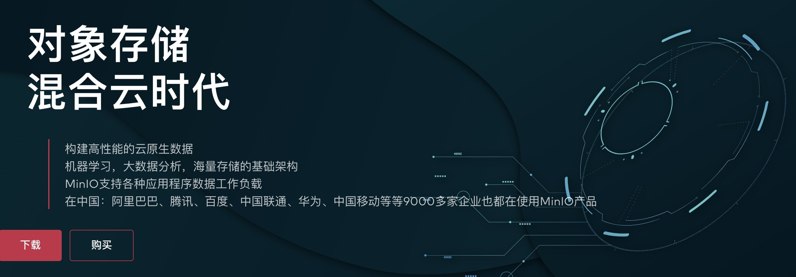
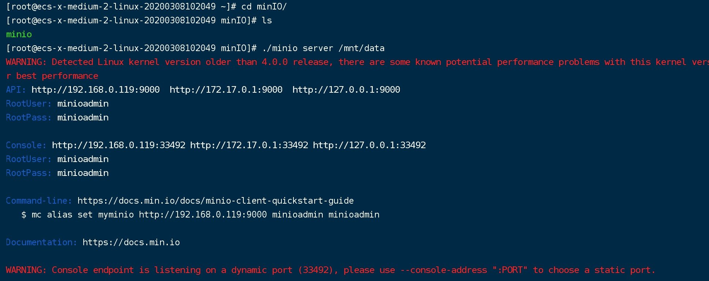
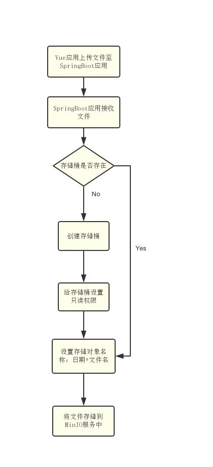
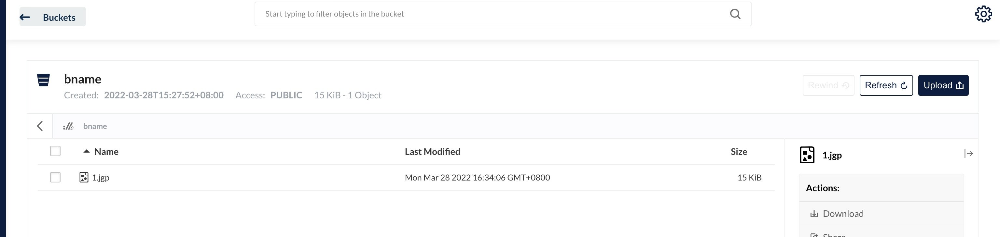
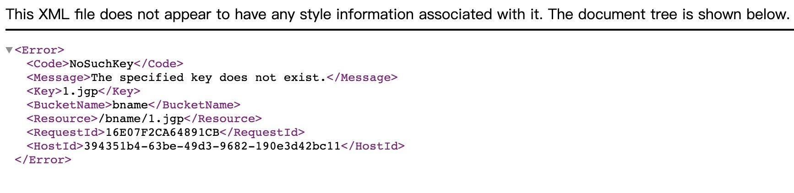

资料来源：https://mp.weixin.qq.com/s/kvLZRqgm1lEITm1j6rzJ0A

## 介绍

**对象存储**

> 对象存储服务OSS（Object Storage Service）是一种海量、安全、低成本、高可靠的云存储服务，**适合存放任意类型的文件**。容量和处理能力弹性扩展，多种存储类型供选择，全面优化存储成本。

**为什么使用minio**

[中文官网](http://www.minio.org.cn/)是这样介绍




### 安装

安装过程使用官网教程

~~~~shell
wget   http://dl.minio.org.cn/server/minio/release/linux-amd64/minio
chmod +x minio
./minio server /mnt/data
~~~~

[官网](https://min.io/)

[中文官网](http://www.minio.org.cn/)

> 因为中文官网无法下载安装包，所以需要使用官网的安装包
> 中文的官网有问题，还是推荐使用官网



安装后访问

http://ip:9000

### 上传文件



## 项目中使用

### properties配置

在项目中创建一个文件minio.properties放在resource中

```Java
# MinIO对象存储相关配置
minio.endpoint=http://121.36.8.180:9000
#存储桶名称
minio.bucketName=bname
#访问的key
minio.accessKey=minioadmin
#访问的秘钥
minio.secretKey=minioadmin
```

### 参数封装

~~~~java
@Data
@Component
@PropertySource("classpath:minio.properties")
@ConfigurationProperties(prefix="minio")
public class MinioConf {

    /**
     * 存储桶名称
     */
    private String endpoint;
    /**
     * 访问的key
     */
    private String bucketName;
    /**
     * 访问的key
     */
    private String accessKey;
    /**
     * 访问的秘钥
     */
    private String secretKey;

}
~~~~

### 封装工具类

```Java
@Component
public class MinioClientConf {

    @Autowired
    private MinioConf minioConf;

    // minio操作对象
    MinioClient minioClient;

    /**
     * 创建对象
     * @throws InvalidPortException
     * @throws InvalidEndpointException
     */
    @PostConstruct
    public void MinioClientConf() throws InvalidPortException, InvalidEndpointException {
//        minioClient = new MinioClient(ENDPOINT, ACCESS_KEY, SECRET_KEY);
        minioClient = new MinioClient(minioConf.getEndpoint(), minioConf.getAccessKey(), minioConf.getSecretKey());
    }

    /**
     * 获取对象
     * @return
     */
    public MinioClient getMinioClient() {
        return minioClient;
    }

    /**
     * 上传一个文件
     * @return
     */
    public String putObject(String objectName, InputStream in, String contentType) throws Exception {
        return putObject(minioConf.getBucketName(), objectName, in, contentType);
    }

    /**
     * 上传一个文件
     * @param bucketName
     * @param objectName
     * @param in
     * @param contentType
     * @return
     * @throws Exception
     */
    public String putObject(String bucketName, String objectName, InputStream in, String contentType) throws Exception {
        minioClient.putObject(bucketName, objectName, in, contentType);
        return minioConf.getEndpoint() + "/" + bucketName + "/" + objectName;
    }

    /**
     * 删除一条记录
     * @param bucketName
     * @param objectName
     */
    public void removeObject(String bucketName,String objectName) throws  Exception{
        minioClient.removeObject(bucketName, objectName);
    }

    /**
     * 创建bucket
     * @param bucketName
     */
    public void makeBucket(String bucketName) throws  Exception{
        minioClient.makeBucket(bucketName);
        minioClient.setBucketPolicy(bucketName, "*.*", PolicyType.READ_ONLY);
    }
    
}
```

### 实现测试方法

```
@RunWith(SpringRunner.class)
@SpringBootTest(classes = ProjectApplication.class, webEnvironment = SpringBootTest.WebEnvironment.RANDOM_PORT)
public class MinioDemo {

    @Autowired
    private MinioClientConf minioClientConf;

    @Test
    public void test01() throws Exception{
        String objectName = "1.jgp";
        InputStream in = new FileInputStream("/Users/liuwei/Downloads/1.jpg");
        String contentType= "jgp";
        String url = minioClientConf.putObject(objectName, in, contentType);
        System.out.println(url);
    }

    @Test
    public void test02() throws Exception{
        String bucketName = "liuweib2";
        minioClientConf.makeBucket(bucketName);
    }

    @Test
    public void del03() throws  Exception{
        minioClientConf.removeObject("bname", "1.jgp");
    }

    @Test
    public void test04() throws Exception{
        String objectName = "1.jpg";
        InputStream in = new FileInputStream("/Users/liuwei/Downloads/1.jpg");
        String contentType= "jpg";
        String url = minioClientConf.putObject("liuweib2", objectName, in, contentType);
        System.out.println(url);
    }
}
```

- bucket 列表



- 上传后的文件


- 文件不存在



文件不存在情况，和oss是一样的。我推测阿里的oss是使用minio技术

参考代码：https://gitee.com/L10052108/springboot_project/tree/simple/
