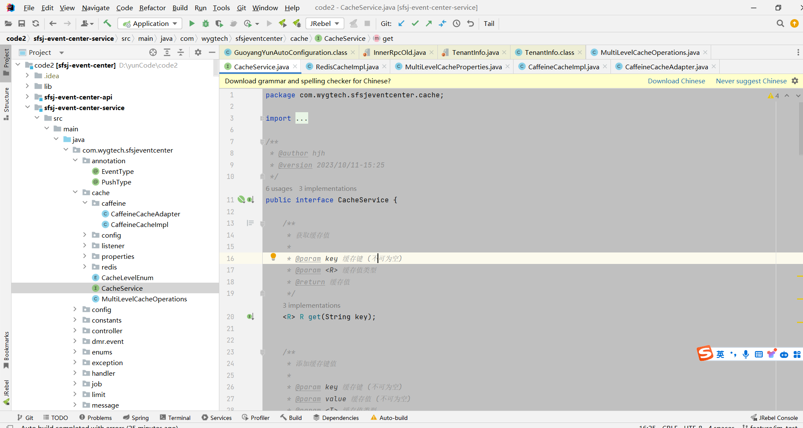
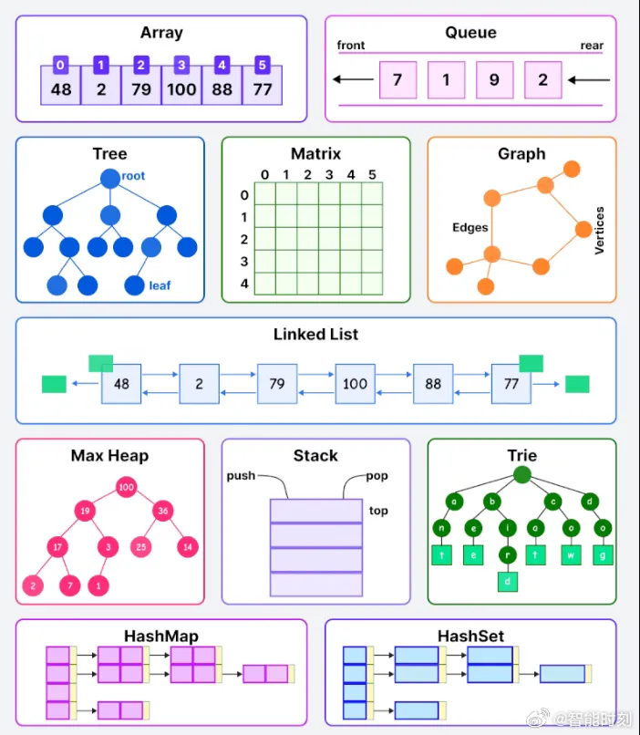

[SpringBoot自定义注解+异步+观察者模式实现业务日志保存](https://www.toutiao.com/article/7159396762061390372/?app=news_article&timestamp=1666957328&use_new_style=1&req_id=20221028194208010209157026093A7510&group_id=7159396762061390372&share_token=8917AC16-A019-4853-893F-9F9288713788&tt_from=weixin&utm_source=weixin&utm_medium=toutiao_ios&utm_campaign=client_share&wxshare_count=1&source=m_redirect)


 [socks5代理ip几种工具](https://www.cnblogs.com/edeny/p/16530270.html)

   

SpringBoot进阶：一键集成GrayLog，那叫一个丝滑
https://www.toutiao.com/article/7153427109799576075/?app=news_article&timestamp=1666913194&use_new_style=1&req_id=202210280726330102040230361E1C7907&group_id=7153427109799576075&share_token=C984A98C-DEE4-43E9-8D07-80F4DC8AC2BA&tt_from=weixin&utm_source=weixin&utm_medium=toutiao_ios&utm_campaign=client_share&wxshare_count=1&source=m_redirect


 SpringBoot自定义注解+异步+观察者模式实现业务日志保存
 https://www.toutiao.com/article/7159396762061390372/?app=news_article&timestamp=1666957328&use_new_style=1&req_id=20221028194208010209157026093A7510&group_id=7159396762061390372&share_token=8917AC16-A019-4853-893F-9F9288713788&tt_from=weixin&utm_source=weixin&utm_medium=toutiao_ios&utm_campaign=client_share&wxshare_count=1&source=m_redirect


oracle 数据库操作：https://blog.csdn.net/qq_38667427/article/details/119323495


[ MySQL性能分析神器—Profiling](https://www.toutiao.com/article/7166909357652017679/?app=news_article&timestamp=1668904068&use_new_style=1&req_id=20221120082747010208097097003A0A65&group_id=7166909357652017679&share_token=069EE728-6C6D-4047-A727-11D1C7B529A5&tt_from=weixin&utm_source=weixin&utm_medium=toutiao_ios&utm_campaign=client_share&wxshare_count=1&source=m_redirect)


[一个轻量级的分布式日志标记追踪神器，十分钟接入，非常好用！](https://mp.weixin.qq.com/s/_GEMjO-7eILEID0-M5fBFw)

[SpringBoot 还在用 if 校验参数？那你真的太low了，老司机都是这么玩的！](https://mp.weixin.qq.com/s/Sm9VcUktodOts-arOdQ7oA)


[java 中set删除](https://www.techiedelight.com/zh/remove-elements-from-set-java/)


[史上最全面的Neo4j使用指南](https://blog.csdn.net/weixin_34314962/article/details/89655551?spm=1001.2101.3001.6650.2&utm_medium=distribute.pc_relevant.none-task-blog-2%7Edefault%7ECTRLIST%7Edefault-2-89655551-blog-103318347.pc_relevant_aa&depth_1-utm_source=distribute.pc_relevant.none-task-blog-2%7Edefault%7ECTRLIST%7Edefault-2-89655551-blog-103318347.pc_relevant_aa&utm_relevant_index=5)


再见丑陋的 SwaggerUI，这款API文档生成神器界面更炫酷，逼格更高！
https://mp.weixin.qq.com/s/qWfdhx-b28NP6--xeTePSg


mysql之自定义函数
https://www.cnblogs.com/progor/p/8871480.html 

mysql 递归函数
https://blog.csdn.net/weixin_33896726/article/details/92236104


[Springboot过滤器和拦截器详解及使用场景](https://www.toutiao.com/i6892269785032327684/?tt_from=weixin&utm_campaign=client_share&wxshare_count=1×tamp=1647226031&app=news_article&utm_source=weixin&utm_medium=toutiao_android&use_new_style=1&req_id=202203141047110101501630311ABBED8E&share_token=c6035892-bee0-4aea-97a2-0c4430bc3641&group_id=6892269785032327684)


[SpringBoot接入轻量级分布式日志框架（GrayLog）](https://www.toutiao.com/i7074754656219808287/?tt_from=weixin&utm_campaign=client_share&wxshare_count=1×tamp=1647225790&app=news_article&utm_source=weixin&utm_medium=toutiao_android&use_new_style=1&req_id=202203141043100101501030481FB707FD&share_token=45a5bf16-3b98-49a9-ace5-4e6dc442bb55&group_id=7074754656219808287)

[ElasticJob.3.0.0-beta安装与使用](https://my.oschina.net/u/437309/blog/4719406)

springcloud
https://blog.csdn.net/forezp/article/details/70148833

[狂神说笔记之ElasticSearch](https://blog.csdn.net/gouzhengju1454/article/details/117707976)

ES
https://www.yuque.com/fengwenyi/pvaq8o/ftop4l


读写分离
https://mp.weixin.qq.com/s/2_YTsOwyEByYj0K01QIYVA


[mysql数据同步到elasticsearch数据解决方案](https://www.toutiao.com/article/7176838363440398852/?app=news_article&timestamp=1671076798&use_new_style=1&req_id=20221215115958E446858BC8318E495254&group_id=7176838363440398852&share_token=9BD630F9-926F-42FC-BA9C-1043A442DAB9&tt_from=weixin&utm_source=weixin&utm_medium=toutiao_ios&utm_campaign=client_share&wxshare_count=1&source=m_redirect)


[SpringBoot+ElasticSearch 实现模糊查询，批量CRUD，排序，分页，高亮！](https://mp.weixin.qq.com/s/qoK_OlUTVnN9fPSWsUF6uw)


[SpringBoot集成kettle实现对接oracle数据](https://www.toutiao.com/article/7175357672575959586/?app=news_article&timestamp=1670687517&use_new_style=1&req_id=202212102351574B0A7436F0AA94505E19&group_id=7175357672575959586&share_token=625FCBB3-E435-4BE0-8AE0-62E72542C876&tt_from=weixin&utm_source=weixin&utm_medium=toutiao_ios&utm_campaign=client_share&wxshare_count=1&source=m_redirect)


[SpringBoot中统一日志管理](https://www.toutiao.com/article/7174784709573198376/?app=news_article&timestamp=1670686318&use_new_style=1&req_id=202212102331589D26B075A0C58F4D3893&group_id=7174784709573198376&share_token=1E2798B4-9CAC-40DC-A7FC-7F326D30F890&tt_from=weixin&utm_source=weixin&utm_medium=toutiao_ios&utm_campaign=client_share&wxshare_count=1&source=m_redirect)


[SpringBoot 过滤器、拦截器、监听器对比及使用场景](https://www.toutiao.com/article/7179777247111627321/?app=news_article&timestamp=1671684529&use_new_style=1&req_id=20221222124848BCBA5BB2781D070CA196&group_id=7179777247111627321&share_token=49349541-C358-4553-9EC1-F47D9C9F6C5F&tt_from=weixin&utm_source=weixin&utm_medium=toutiao_ios&utm_campaign=client_share&wxshare_count=1&source=m_redirect)

[阿里面试必问Spring Security进阶学习](https://www.toutiao.com/article/7174967275160961576/?app=news_article&timestamp=1671639173&use_new_style=1&req_id=20221222001252275D9AA5B4A6DD2A4E85&group_id=7174967275160961576&share_token=83C05213-EAFF-48BC-9ECC-C9AD8DE66666&tt_from=weixin&utm_source=weixin&utm_medium=toutiao_ios&utm_campaign=client_share&wxshare_count=1&source=m_redirect)

[SpringBoot进阶-SpringBoot整合Redis实现发布订阅功能](https://www.toutiao.com/article/7179527015451116091/?app=news_article&timestamp=1671638402&use_new_style=1&req_id=202212220000021F004E46959E2B2944CD&group_id=7179527015451116091&share_token=80107BEF-910D-4DA5-8DFC-DECAD9809740&tt_from=weixin&utm_source=weixin&utm_medium=toutiao_ios&utm_campaign=client_share&wxshare_count=1&source=m_redirect)


[illa-builder 是一款开源的 #低代码# 平台](https://www.toutiao.com/w/1752716652642311/?app=news_article&timestamp=1671585472&use_new_style=1&share_token=D3F63ABB-E85F-453E-97E9-726EEB7C8E71&tt_from=weixin&utm_source=weixin&utm_medium=toutiao_ios&utm_campaign=client_share&wxshare_count=1&source=m_redirect)

[GitHub中文排行榜](https://github.com/GrowingGit/GitHub-Chinese-Top-Charts) 


 confluence介绍

https://blog.csdn.net/yangbindxj/article/details/128232675

https://www.cnblogs.com/hujinzhong/p/11955880.html


v2ray免费节点

https://github.com/Pawdroid/Free-servers 


 [不灭的焱](https://php-note.com/)

 革命尚未成功，同志仍须

https://php-note.com/1572.html


idea集成japi

https://www.jianshu.com/p/cd915908cb96 


[Spring高级之注解@DependsOn详解（超详细）](https://blog.csdn.net/qq_40837310/article/details/106557588)


[学过这么一遍，Spring循环依赖问题难不倒我](https://www.toutiao.com/article/7202414607967797797/?app=news_article&timestamp=1677309779&use_new_style=1&req_id=20230225152258722986A84AD7935BB356&group_id=7202414607967797797&share_token=62BCD2D1-9047-40E6-95FF-BAC08E8223B9&tt_from=weixin&utm_source=weixin&utm_medium=toutiao_ios&utm_campaign=client_share&wxshare_count=1&source=m_redirect)

[SpringBoot进阶-SpringBoot如何实现配置文件脱敏？](https://www.toutiao.com/article/7193965484314903074/?app=news_article&timestamp=1675054122&use_new_style=1&req_id=202301301248411557B3506967C58E6B93&group_id=7193965484314903074&share_token=1919C290-124A-4A3B-88C7-E48B64681CCB&tt_from=weixin&utm_source=weixin&utm_medium=toutiao_ios&utm_campaign=client_share&wxshare_count=1&source=m_redirect)


[如何使用IntelliJ IDEA远程调试Spring Boot程序](https://www.toutiao.com/article/7202847959141204518/?app=news_article&timestamp=1677300028&use_new_style=1&req_id=202302251240275E85844C72A2635441D2&group_id=7202847959141204518&share_token=B6C63BF3-3DAA-43A8-9EF5-991163DA327C&tt_from=weixin&utm_source=weixin&utm_medium=toutiao_ios&utm_campaign=client_share&wxshare_count=1&source=m_redirect)


[Springboot 多模块项目搭建](https://www.toutiao.com/article/7194754280837136952/?app=news_article&timestamp=1677312089&use_new_style=1&req_id=20230225160129F5EC5136F313145AFDD2&group_id=7194754280837136952&share_token=D911315E-DF1F-48B6-BB2C-5E72EDD81FC9&tt_from=weixin&utm_source=weixin&utm_medium=toutiao_ios&utm_campaign=client_share&wxshare_count=1&source=m_redirect)


免费节点及订阅地址：
https://github.com/Pawdroid/Free-servers

镜像网站/浏览器插件/机场推荐/直连网站/工具下载/Clash/SS/SSR/V2ray使用教程
https://github.com/selierlin/Share-SSR-V2ray


[【实践篇】教你玩转JWT认证---从一个优惠券聊起](https://www.toutiao.com/article/7234699843615097400/?app=news_article&timestamp=1685401424&use_new_style=1&req_id=202305300703448B8BE027BEE0B535FA3B&group_id=7234699843615097400&wxshare_count=1&tt_from=weixin&utm_source=weixin&utm_medium=toutiao_android&utm_campaign=client_share&share_token=b9b8c368-9b4b-4958-a25b-126529cfb8ab&source=m_redirect)‘

[使用JWT生成token实现权限验证](https://blog.csdn.net/m0_59359926/article/details/123809705?ops_request_misc=%257B%2522request%255Fid%2522%253A%2522168578457416800188583181%2522%252C%2522scm%2522%253A%252220140713.130102334..%2522%257D&request_id=168578457416800188583181&biz_id=0&utm_medium=distribute.pc_search_result.none-task-blog-2~all~top_positive~default-1-123809705-null-null.142^v88^control,239^v2^insert_chatgpt&utm_term=jwt%20token&spm=1018.2226.3001.4187)


[Netty服务端开发及性能优化](https://www.toutiao.com/article/7227022004753482300/?app=news_article&timestamp=1685403739&use_new_style=1&req_id=202305300742192689551D38D07237E60D&group_id=7227022004753482300&wxshare_count=1&tt_from=weixin&utm_source=weixin&utm_medium=toutiao_android&utm_campaign=client_share&share_token=9cd66856-4719-422e-8be0-9f291fa8f5e2&source=m_redirect)


[Netty 组件介绍](https://www.toutiao.com/article/7203517335574086177/?app=news_article&timestamp=1685406318&use_new_style=1&req_id=2023053008251804897A44FA2E2A3BD065&group_id=7203517335574086177&wxshare_count=1&tt_from=weixin&utm_source=weixin&utm_medium=toutiao_android&utm_campaign=client_share&share_token=a52a5071-7cd7-4e86-93cc-87043f619999&source=m_redirect)

[Mockito使用](https://www.toutiao.com/article/7202775681682457140/?app=news_article&timestamp=1685408239&use_new_style=1&req_id=20230530085718400D2AC29C9DD93E4C5C&group_id=7202775681682457140&wxshare_count=1&tt_from=weixin&utm_source=weixin&utm_medium=toutiao_android&utm_campaign=client_share&share_token=4f3a9473-ae83-4b3e-a623-9502ae1dff67&source=m_redirect)

java -> idea ->idea插件


ZincSearch，一个Go写的搜索引擎，可以看作是 Elasticsearch 的轻量级实现与 Elasticsearch 相比，更简单易用、自带UI

一款轻量稳定，可编排的组件式流程引擎项目：liteFlow
https://www.toutiao.com/article/7233037404448473640/?app=news_article&timestamp=1685929924&use_new_style=1&req_id=2023060509520318AA4486CD25612E37AE&group_id=7233037404448473640&wxshare_count=1&tt_from=weixin&utm_source=weixin&utm_medium=toutiao_android&utm_campaign=client_share&share_token=d7f73e94-50a5-4601-800c-f875ee88823c&source=m_redirect


登录

[使用JWT生成token实现权限验证](https://blog.csdn.net/m0_59359926/article/details/123809705?ops_request_misc=%257B%2522request%255Fid%2522%253A%2522168578457416800188583181%2522%252C%2522scm%2522%253A%252220140713.130102334..%2522%257D&request_id=168578457416800188583181&biz_id=0&utm_medium=distribute.pc_search_result.none-task-blog-2~all~top_positive~default-1-123809705-null-null.142^v88^control,239^v2^insert_chatgpt&utm_term=jwt%20token&spm=1018.2226.3001.4187)

[认证与授权之Cookie、Session、Token、JWT](https://juejin.cn/post/7173833497830752286/)


正式上市 || Spring 官方认证服务器 SAS 使用
https://mp.weixin.qq.com/s/CzvmsuQHtSASdhjnpItNPw


SpringBootJWTShiro
https://gitee.com/mrzhouy/SpringBootJWTShiro/tree/master

[基于jib插件，实现Docker部署springboot项目](https://www.toutiao.com/article/7246198514475385403/?app=news_article&timestamp=1687325911&use_new_style=1&req_id=20230621133830DD1864835FB10ABA1CB3&group_id=7246198514475385403&wxshare_count=1&tt_from=weixin&utm_source=weixin&utm_medium=toutiao_android&utm_campaign=client_share&share_token=32b9fe50-ecc3-4d1d-85e9-510fffca9e2f&source=m_redirect)

[使用 ProcessBuilder API 优化你的流程](https://www.toutiao.com/article/7244779303471333925/?app=news_article&timestamp=1687575853&use_new_style=1&req_id=20230624110412C47E7B59E912C12C09BE&group_id=7244779303471333925&wxshare_count=1&tt_from=weixin&utm_source=weixin&utm_medium=toutiao_android&utm_campaign=client_share&share_token=ee45796e-a816-49dc-a319-ed4b75b3bf29&source=m_redirect)


【Gradle-3】Gradle中的DSL，Groovy & Kotlin
https://blog.csdn.net/yechaoa/article/details/130257106

MP
https://blog.csdn.net/weixin_45529338/article/details/130448579


https://www.yuucn.com/a/73234.html

docker安装confluence全套教程
https://developer.aliyun.com/article/1038121

https://blog.csdn.net/ethnicitybeta/article/details/122595939


IDEA、JDK17、OpenJFX(javaFX)快速开发桌面应用，并打包成exe可执行文件
https://blog.csdn.net/weixin_42286276/article/details/127860167?utm_medium=distribute.pc_relevant.none-task-blog-2~default~baidujs_baidulandingword~default-0-127860167-blog-129977741.235^v38^pc_relevant_sort_base1&spm=1001.2101.3001.4242.1&utm_relevant_index=3


 jdk14——独立打包工具jpackage

https://blog.csdn.net/FlyLikeButterfly/article/details/130888197?utm_medium=distribute.pc_relevant.none-task-blog-2~default~baidujs_baidulandingword~default-0-130888197-blog-104897288.235^v38^pc_relevant_sort_base1&spm=1001.2101.3001.4242.1&utm_relevant_index=3


25000 字详解 23 种设计模式，建议收藏
https://mp.weixin.qq.com/s/tX0bRm1ZnsTNdVWbAD1N5g


JAVA开发利器之Arthas，快速定位线上问题
https://mp.weixin.qq.com/s/6MPQJJZEfSLbFg-grvk5VA


pdf 添加水印
https://mp.weixin.qq.com/s/TvU0Ny64NvmJL4-GKSaPpA


视频转码
https://www.cnblogs.com/lidabo/p/14763192.html


why技术
https://juejin.cn/user/3702810893364350/posts


再见，Guava！再见，Ehcache！这才是 Java 本地缓存之王！
https://mp.weixin.qq.com/s/nHB2HvBaZdx4BQywRQfG7Q


## 定时任务

[SpringBoot 实现定时任务动态管理，太爽了！](https://mp.weixin.qq.com/s/btk5LZLHYNKj4HsYIZjBmw)

[Springboot 整合 xxljob 动态API调度任务(进阶篇)](https://blog.csdn.net/qq_35387940/article/details/125410895)

SpringBoot官方支持任务调度框架，轻量级用起来也挺香！
https://juejin.cn/post/6885869364180942862

 Openjob 重磅来袭，高性能任务调度框架
 https://mp.weixin.qq.com/s/lGjr6eEYo8YXQLT2hrcciw

 SpringBoot结合XXL-JOB实现定时任务
https://juejin.cn/post/7172325382320816165

[只会用 xxl-job？更强大的新一代分布式任务调度框架来了！](https://mp.weixin.qq.com/s/homQEY9um9FadGXcAhzg5g)


## mysql

[全解MySQL：一条SQL语句从诞生至结束的多姿多彩历程！](https://www.toutiao.com/article/7221477015071982138/?log_from=7ca5c2422d4b_1690786274768)

[阿里一面:在日常工作中怎么做MySQL优化的？](https://www.toutiao.com/article/7215845464631968268/?log_from=f38f01eac4652_1690786541672)

[看完这篇还不懂MySQL的MVCC机制算我输](https://www.toutiao.com/article/7251879185865245239/?log_from=222839b60344c_1690786715622)

MySQL优化详解
https://blog.csdn.net/zls986992484/article/details/52860496


## Spring Security入门学习
https://juejin.cn/post/7174576646635126814#heading-0

Spring Security结合JWT实现认证与授权

https://juejin.cn/post/7176803095525982269

 Spring Security进阶学习
https://juejin.cn/post/7174943829655552059

Spring Security结合Redis实现缓存功能
https://juejin.cn/post/7177188004677550141


Spring Security自定义认证逻辑实现图片验证码登录
https://juejin.cn/post/7176057114006126653

[前后端分离 springboot shiro+jwt token认证 权限校验](https://blog.csdn.net/weixin_44912855/article/details/121319260?spm=1001.2014.3001.5501)


极光推送
https://blog.csdn.net/weixin_39255905/article/details/132181104


git 工具
SourceTree
https://blog.csdn.net/weixin_43335226/article/details/107091568


MP中id生成策略
https://blog.csdn.net/Drifter_Galaxy/article/details/130786432


springCache 使用 ？

MQ延迟插件 ？
组件中有定义钩子函数优雅关闭可以触发收尾工作。

日志文件查看的常用技巧
https://blog.csdn.net/weixin_41905047/article/details/129109221


IM消息
https://www.oschina.net/project/awesome?columnId=57


RabbitMQ入门
https://blog.csdn.net/yzq102873/article/details/128304566

- 测试提交任务

- seate 分布任务
https://www.toutiao.com/article/7281647302065603124/?app=news_article&timestamp=1695855367&use_new_style=1&req_id=2023092806560616F011B59EAD4E33E27C&group_id=7281647302065603124&wxshare_count=1&tt_from=weixin&utm_source=weixin&utm_medium=toutiao_android&utm_campaign=client_share&share_token=7e91ed45-6769-4999-98e9-5c7912d1f3d5&source=m_redirect


https://www.toutiao.com/article/7281613145850937910/?app=news_article&timestamp=1696167855&use_new_style=1&req_id=20231001214414B8BE7874029DABD0C372&group_id=7281613145850937910&wxshare_count=1&tt_from=weixin&utm_source=weixin&utm_medium=toutiao_android&utm_campaign=client_share&share_token=24d83fe5-534f-4b1b-969c-4cdacaa6cecd&source=m_redirect


日志

https://zhuanlan.zhihu.com/p/611653538


自实现分布式链路追踪 方案&实践
https://zhuanlan.zhihu.com/p/611653538


《见「微」知「著」系列——<分布式流量防护>篇》介绍常见的限流算法：固定时间窗口算法、滑动时间窗口算法、 漏桶算法、令牌桶算法
https://zhuanlan.zhihu.com/p/627507543


## ES
https://zhuanlan.zhihu.com/p/624297206

5000字详说Elasticsearch入门(一)

https://www.toutiao.com/article/7292967410637095474/?app=news_article&timestamp=1698242510&use_new_style=1&req_id=20231025220150202F7C87085E851F8E0F&group_id=7292967410637095474&wxshare_count=1&tt_from=weixin&utm_source=weixin&utm_medium=toutiao_android&utm_campaign=client_share&share_token=b0030b77-fcc2-4d10-b55a-233f3042b407&source=m_redirect

巧记Elasticsearch常用DSL语法

https://mp.weixin.qq.com/s?__biz=MzI3OTA2MDQyOQ==&mid=2247484941&idx=1&sn=c7ae496b1f97d276d441413274833dbc&chksm=eb4cccafdc3b45b98abd487c1ab216832b299944913329cc52b6f53f19f49947dc5686e37d92&scene=132&exptype=timeline_recommend_article_extendread_samebiz#wechat_redirect


https://www.toutiao.com/article/7292967410637095474/?app=news_article&timestamp=1698242510&use_new_style=1&req_id=20231025220150202F7C87085E851F8E0F&group_id=7292967410637095474&wxshare_count=1&tt_from=weixin&utm_source=weixin&utm_medium=toutiao_android&utm_campaign=client_share&share_token=b0030b77-fcc2-4d10-b55a-233f3042b407&source=m_redirect

限流
https://github.com/lizhifuabc/spring-learn/blob/main/spring-boot-redis-limit/src/main/java/com/redis/limit/algorithm/AbstractRedisRateLimitAlgorithm.java

springboot学习
  练习
  https://github.com/lizhifuabc/spring-learn
  springbotot3

  https://github.com/hb0730/boot-admin


  Dynamic Thread Pool


____ ____    ___ ____ _  _ ____ _  _
[__  |__| __  |  |  | |_/  |___ |\ | 
___] |  |     |  |__| | \_ |___ | \| 


```xml
  <!--动态线程池-->
            <dependency>
                <groupId>cn.dynamictp</groupId>
                <artifactId>dynamic-tp-spring-boot-starter-nacos</artifactId>
                <version>1.1.0</version>
            </dependency>
              <dependency>
                <groupId>com.github.ben-manes.caffeine</groupId>
                <artifactId>caffeine</artifactId>
                <version>2.9.3</version>
            </dependency>
```


SpringBoot 整合 Sa-Token 让鉴权更简单
https://mp.weixin.qq.com/s/pY2T_49rTkrKAfBZLO3vYQ


Springboot + Wsocket + RabbitMQ + Thymeleaf + Bootstrap 实现聊天互动功能
https://mp.weixin.qq.com/s/ispOj37a30WgVnMgg7Ao2Q


Springboot+WebSocket 实现IM及时通讯
https://mp.weixin.qq.com/s/23eZm-mdtj7J_Pg9TUUKNA


让我们回顾一些慈善的开源项目，它们养活了许多人：
https://www.toutiao.com/w/1779448256684045/?app=news_article&timestamp=1698087191&use_new_style=1&wxshare_count=1&tt_from=weixin&utm_source=weixin&utm_medium=toutiao_android&utm_campaign=client_share&share_token=0db213f7-f969-47c0-bf49-ad85be9f0e88&source=m_redirect


前后端分离必备的接口规范，十分接地气！
https://mp.weixin.qq.com/s?__biz=Mzg3NzU0MDQzOQ==&mid=2247506021&idx=1&sn=88ff7bbaca6637c0dcbf825fc003327b&chksm=cf23fd5df854744bcf2dc7f55fa2e390d8923e78d9acfadc4c553ad1d05ec560ab2626aa1c41&scene=178&cur_album_id=1832215597854621698#rd


9个维度全面解析：如何确保RocketMQ不丢失消息？
https://www.toutiao.com/article/7297062388674019867

SpringBoot 3.0整合OpenAPI使用教程
https://mp.weixin.qq.com/s/lX-tpZzXEV-vJ-l3xjRNNQ

一款IT团队都在用的私有化知识库，技术开放，还开源了！
https://www.toutiao.com/article/7301120615451460108

Springboot+WebSocket 实现IM及时通讯
http://www.mangod.top/articles/2023/08/27/1693094046480.html?share_token=e2a6583c-9906-4a73-bf23-8ffd7774490d


像mysql一样查询ES,一看就会，爽歪歪
https://juejin.cn/post/7302308448581812258

请查收这份 6.3k Star 的 Java 攻城狮学习指南！
https://www.toutiao.com/article/7299646024938127872/

123云盘
https://www.123pan.com/
下载速度还是很快的


快速搭建Docker环境  
https://blog.csdn.net/sanduo112/article/details/118765838


让我看完直呼“哇塞”的分布式ID生成器，现在是你的了~
https://www.toutiao.com/article/7293028624780018226/?app=news_article&timestamp=1703896165&use_new_style=1&req_id=20231230082925CFB0774A3750C80E5449&group_id=7293028624780018226&wxshare_count=1&tt_from=weixin&utm_source=weixin&utm_medium=toutiao_android&utm_campaign=client_share&share_token=4f34b7b6-bcb2-46dd-b927-596c893f941b&source=m_redirect

Spring SSE 技术实现：实时股市数据推送
https://mp.weixin.qq.com/s/vcVhGfIx-axxAv8T_Fmr-A


会用RabbitMQ延迟插件，代码量直接降一半？

https://mp.weixin.qq.com/s/Mh914S6nU0qjeijTRhEkOQ


我们放弃了Nacos作为配置中心，转而选择了这款神器~
https://mp.weixin.qq.com/s/EBFV8_7Syyh4_rcX-Be47g

SpringBoot3 GraalVM 原生镜像打包 

https://blog.csdn.net/qq_32740973/article/details/131799510





```java
# jaeger ui: tjaeger.zhaotx.cn/search
opentracing:
  jaeger:
    udp-sender:
      host: ${JAEGER_AGENT_HOST:192.168.0.244}
      port: 6831   
```


K8s

https://www.toutiao.com/article/7338032078044512777/


https://www.toutiao.com/article/7338420313174573578/


https://www.toutiao.com/article/7338252518356435471/


Spring事务失效十种原因


https://blog.csdn.net/m0_64830897/article/details/131353364


MyBatis Plus轻松实现数据读写分离

https://www.toutiao.com/article/7338252518356435471/?


MySQL中，21个写SQL的好习惯
https://mp.weixin.qq.com/s/l7kh5yL6UHZrX7oqp-0Ubg

MySQL的20条军规

https://mp.weixin.qq.com/s/PkPvl-WowynIeCCluxw3bw


动态线程池
https://mp.weixin.qq.com/s/30jRulffvr9Zfsa2JfNGCA


一键搭建一套K8S集群+K8S可视化操作平台
https://mp.weixin.qq.com/s/N4wzsBkPD3bxj_IKaLPJyg


JustAuth - 史上最全的第三方登录开源库
https://mp.weixin.qq.com/s/UkGlUNAbVqx7hEuiU1p6iA


CentOS下搭建yum仓库内网私服
https://mp.weixin.qq.com/s/UkGlUNAbVqx7hEuiU1p6iA

[Mysql 将一个表的某个字段的值 更新到 另外一个表的 某个字段的值](https://blog.csdn.net/qq_35387940/article/details/129681190)
https://blog.csdn.net/qq_35387940/article/details/129681190


SpringBoot 使用Junit单元测试的时候插入数据，单元测试跑成功了，但是数据没插入进去

https://www.jianshu.com/p/82d446b36f31


https://gitee.com/xiaofu.wqdian.cn/Springboot-Notebook 


三大Git版本控制分支策略详细介绍
https://www.toutiao.com/article/7342338308019765812/?


构建第一个GraalVM应用镜像，体验毫秒级极速启动！
https://www.toutiao.com/article/7287571837767402043


详解@AsyncExceptionHandler：处理Spring Boot异步方法中的异常
https://www.toutiao.com/article/7342481020719235594/

正则表达式
https://blog.csdn.net/weixin_46063418/article/details/115894268

https://www.jyshare.com/front-end/854/

https://zhuanlan.zhihu.com/p/469973110

Solon 在 jdk 各版本反射权限问题的处理指南

原文链接：https://blog.csdn.net/cwzb/article/details/128936015

互联网公司常用框架源码赏析
https://github.com/doocs/source-code-hunter


```
1.阵列
2.排队
3.树
4.矩阵
5.图表
6.链表
7.最大堆数
8.堆叠
9.Trie
10.HashMap
11.哈希集
```




小余知识库-- 高质量编程百万字笔记之路--前后端 
地址：github.com/2002XiaoYu/Latest-front-end-Notes
在线阅读：http://t.cn/A6YBgD8z ​​​#我来唠家常# #记录我的2024#


https://mp.weixin.qq.com/s/MvoEs8B-tVH9ig2--Jh_wA
你好，这个是完整版PDF
链接：https://pan.baidu.com/s/1I50ow8KOQghMhxOeqvPTgA?pwd=1024 提取码：1024
如需更多资料，可以添加我微信领取，后期整理的资料都会在微信分享


https://rspress.dev/zh/guide/start/getting-started.html


fiddler教程
https://blog.csdn.net/weixin_44143876/article/details/133675627

神仙级缓存框架 jetcache
https://blog.csdn.net/AlibabaTech1024/article/details/130076828


HTML+CSS实现带按钮的弹出框
https://blog.csdn.net/qq_35727582/article/details/114868023


Java服务优雅上下线
[toutiao.com/article/7349530429277422080/](https://www.toutiao.com/article/7349530429277422080/)


三个良心网站让你实现Mac软件自由。
https://www.toutiao.com/w/1794327735575620/


Spring Boot如何优雅实现数据加密存储、模糊匹配和脱敏
https://www.toutiao.com/article/7347886154802332212/


SpringCache是什么？如何使用SpringCache？
https://www.toutiao.com/article/7349441005869826570/


1.5k star！一个小而美的实用的服务器、NAS导航面板!
https://www.toutiao.com/article/7349919334795346468/?


trojan 客户端

https://github.com/V2RaySSR/Trojan_panel_web/releases

https://v2rayssr.com/vpn-client.html


notepad--

https://gitee.com/cxasm/notepad--/releases/tag/v2.14