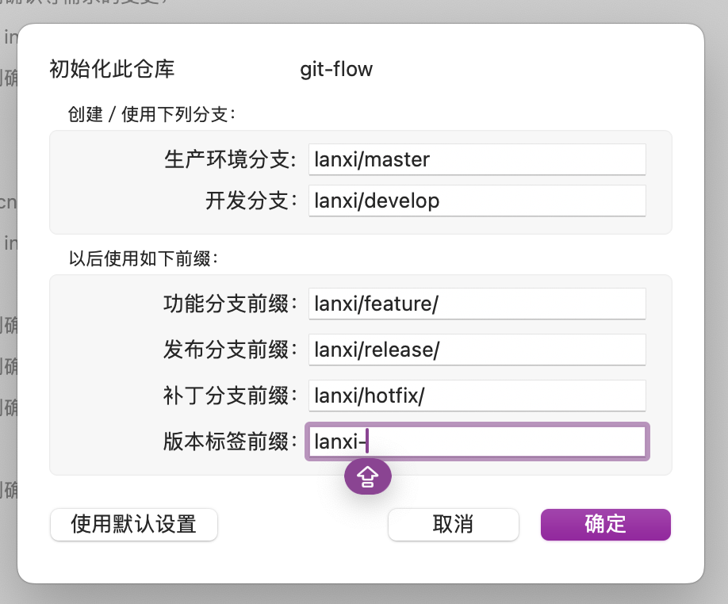
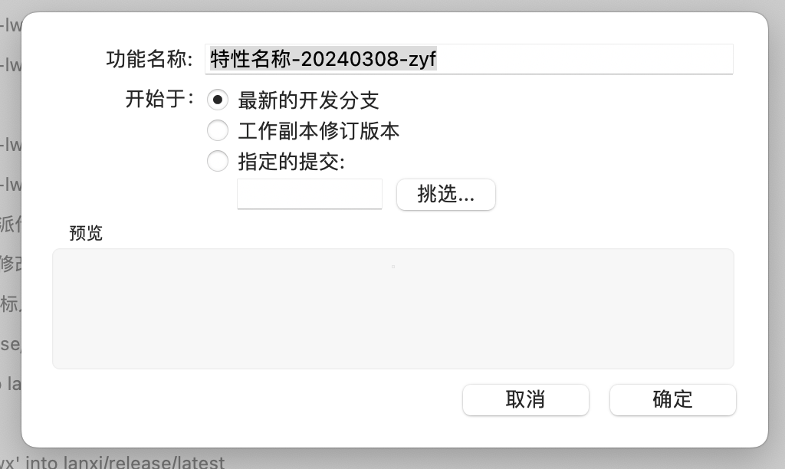

# 1.GIT流程管理及docker版本发布文档

# 修订历史

[请至钉钉文档查看「应用表格」](https://alidocs.dingtalk.com/i/nodes/mExel2BLV54bEavXfQg9Bq49Wgk9rpMq?doc_type=wiki_doc&iframeQuery=anchorId%253DX02ltidoa2bhubxygjb41c)

# 一、概述

为规范git研发和发布流程， 对GIT在研发各阶段的使用进行规范，主要流程参照gitflow流程。IDE可以安装gitflow插件,也可以直接使用SourceTree。

# 二、规范内容

## 2.1 项目分支规范

1.  各项目组目前使用同一个仓库的， 项目分支创建规范为
    

1)特性分支  {项目}/feature/特性名称-{创建日期}-{创建人}

2)补丁分支  {项目}/hotfix/补订名称-{创建日期}-{创建人}

3) 开发分支 {项目}/develop

4)产品分支 {项目}/master

5)测试分支 {项目}/release/latest

6)发布分支 {项目}/release/{版本号}

例如： lanxi/release/v2.0.0

1.  本部分支
    

1)特性分支  feature/特性名称-{创建日期}-{创建人}

2)补丁分支  hotfix/补订名称-{创建日期}-{创建人}

3) 开发分支 develop

4)产品分支 master

5)测试分支 release/latest

6)发布分支 release/{版本号}

注： 使用GITFLOW插件的，拉到代码后先使用GITFLOW初始化,如下图以兰溪项目所示：



1.  docker镜像版本规范
    

```java
{项目}-版本号，   本部可以不加项目前缀
```

例如： lanxi-bid-v2.5.0

## 2.2 研发新功能-创建特性分支

在接到需求后，首先要建立特性分支， 特性分支从{项目}/master拉取, 规范为：

```java
{项目}/feature/特性名称-{创建日期}-{创建人}
```

sourcetree功能操作如下：菜单在  仓库/git-flow/建立新功能



特性分支建完后及时将docker镜像版本改为 {项目}-latest(本部是latest)。一般在pom.xml中的image.tag

## 2.3 修复线上BUG-创建hotfix分支 

修复线上问题时，从{项目}/master拉出hotfix分支, 规范如下：

```java
{项目}/hotfix/补订名称-{创建日期}-{创建人}
```

sourcetree操作同上， 菜单在  仓库/git-flow/建立新的修复补丁

## 2.4 提测-合并到latest分支

步骤:

1.  代码写完自测，单元测试通过， 可以提测
    
2.  将feature或hotfix分支合并到{项目}/release/latest ，多个功能特性需要同时测试可以全都合并到latest分支。
    
3.  使用jenkins构建选择latest分支，构建出latest镜像
    
4.  使用laster镜像发布到测试服
    

## 2.5 发布生产-创建release

测试人员确认集成测试通过，可以确定发布时间， 需要创建发布分支，版本号不能和线上重复， 镜像版本号与分支版本号保持一致。

发布分支规范:

```java
{项目}/release/{版本号},    本部可以不用项目前缀
```

步骤：

1.  创建带版本号的release， sourcetree功能菜单（仓库/git-flow/建立新的发布版本）
    
2.  再次将master合并到release
    
3.  与团队成员沟通是否需要一起发布，一起发布可以合并到同一个release
    
4.  修改镜像版本号，与分支版本号保持一致。 参考2.1镜像版本号规范
    
5.  jenkins构建当前版本号，生成docker镜像
    
6.  做好其他发布前准备工作，如发布数据库脚本，配置服务器（一般由运维完成）
    
7.  通知运维镜像版本号，布署生产环境， 一般只需要k8s修改镜像版本号（运维完成）
    
8.  通知测试线上验证
    

## 2.6 完成发布，在gitlab系统提交合并申请

线上验证通过后

步骤：

1）gitlab上提交合并申请给小组负责人或上级进行代码评审

1.  小组负责人或上级进行代码评审，没有权限合并的评审完后指派给小组负责人
    
2.  合并到{项目}/develop, 或使用sourcetree功能菜单（仓库/git-flow/完成发布版本）
    
3.  删除不用的特性或hotfix分支