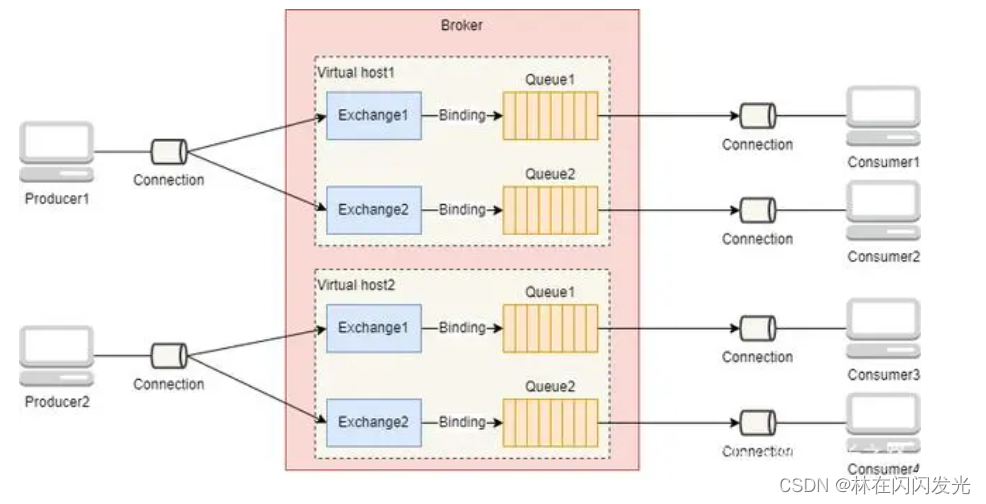
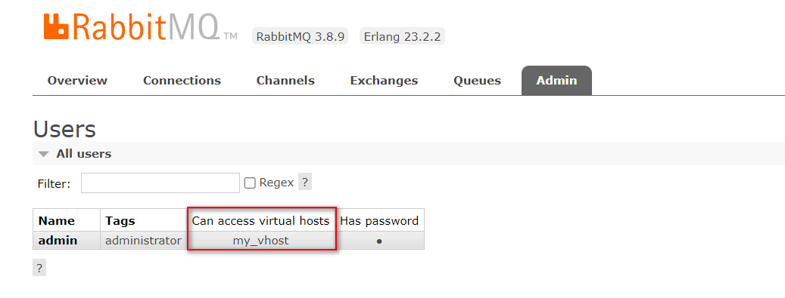
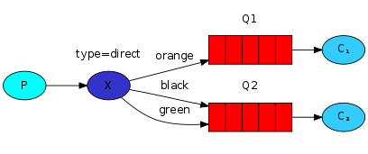
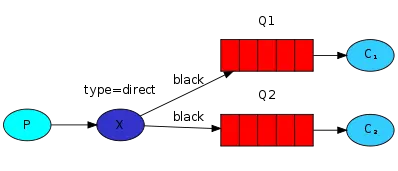
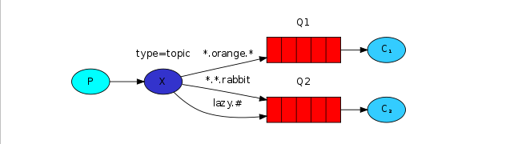
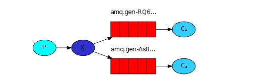
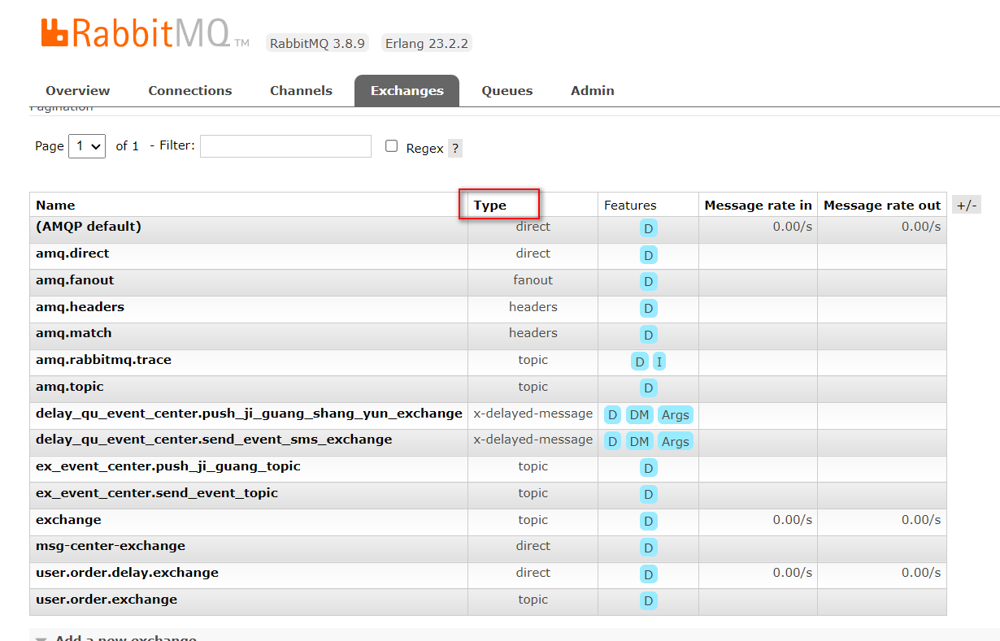

资料来源：<br/>
[Spring Boot(八)：RabbitMQ 详解](http://www.ityouknow.com/springboot/2016/11/30/spring-boot-rabbitMQ.html)<br/>
[#method＜connection.close＞(reply-code=530, reply-text=NOT_ALLOWED - vhost /my_vhost not found](https://blog.csdn.net/Myselfh/article/details/111288235)<br/>
[RabbitMQ的工作模式及原理](https://blog.csdn.net/weixin_68829137/article/details/127070686)


## RabbitMQ 介绍

RabbitMQ 是实现 AMQP（高级消息队列协议）的消息中间件的一种，最初起源于金融系统，用于在分布式系统中存储转发消息，在易用性、扩展性、高可用性等方面表现不俗。 RabbitMQ 主要是为了实现系统之间的双向解耦而实现的。当生产者大量产生数据时，消费者无法快速消费，那么需要一个中间层。保存这个数据。

AMQP，即 Advanced Message Queuing Protocol，高级消息队列协议，是应用层协议的一个开放标准，为面向消息的中间件设计。消息中间件主要用于组件之间的解耦，消息的发送者无需知道消息使用者的存在，反之亦然。AMQP 的主要特征是面向消息、队列、路由（包括点对点和发布/订阅）、可靠性、安全。

RabbitMQ 是一个开源的 AMQP 实现，服务器端用Erlang语言编写，支持多种客户端，如：Python、Ruby、.NET、Java、JMS、C、PHP、ActionScript、XMPP、STOMP 等，支持 AJAX。用于在分布式系统中存储转发消息，在易用性、扩展性、高可用性等方面表现不俗。

### 相关概念

通常我们谈到队列服务, 会有三个概念： 发消息者、队列、收消息者，RabbitMQ 在这个基本概念之上, 多做了一层抽象, 在发消息者和 队列之间, 加入了交换器 (Exchange). 这样发消息者和队列就没有直接联系, 转而变成发消息者把消息给交换器, 交换器根据调度策略再把消息再给队列。


- 左侧 P 代表 生产者，也就是往 RabbitMQ 发消息的程序。
- 中间即是 RabbitMQ，*其中包括了 交换机 和 队列。*
- 右侧 C 代表 消费者，也就是往 RabbitMQ 拿消息的程序。

那么，*其中比较重要的概念有 4 个，分别为：虚拟主机，交换机，队列，和绑定。*

- 虚拟主机：一个虚拟主机持有一组交换机、队列和绑定。为什么需要多个虚拟主机呢？很简单， RabbitMQ 当中，*用户只能在虚拟主机的粒度进行权限控制。* 因此，如果需要禁止A组访问B组的交换机/队列/绑定，必须为A和B分别创建一个虚拟主机。每一个 RabbitMQ 服务器都有一个默认的虚拟主机“/”。

  Virtual host是一个虚拟主机的概念，一个Broker中可以有多个Virtual host，每个Virtual host都有一套自己的Exchange和Queue，同一个Virtual host中的Exchange和Queue不能重名，不同的Virtual host中的Exchange和Queue名字可以一样。这样，不同的用户在访问同一个RabbitMQ Broker时，可以创建自己单独的Virtual host，然后在自己的Virtual host中创建Exchange和Queue，很好地做到了不同用户之间相互隔离的效果。

  

- 交换机：*Exchange 用于转发消息，但是它不会做存储* ，如果没有 Queue bind 到 Exchange 的话，它会直接丢弃掉 Producer 发送过来的消息。 这里有一个比较重要的概念：**路由键** 。消息到交换机的时候，交互机会转发到对应的队列中，那么究竟转发到哪个队列，就要根据该路由键。

- 绑定：也就是交换机需要和队列相绑定，这其中如上图所示，是多对多的关系。



#### Connection（连接）

每个producer（生产者）或者consumer（消费者）要通过RabbitMQ发送与消费消息，首先就要与RabbitMQ建立连接，这个连接就是Connection。Connection是一个TCP长连接。

#### Channel（信道）

Channel是在Connection的基础上建立的虚拟连接，RabbitMQ中大部分的操作都是使用Channel完成的，比如：声明Queue、声明Exchange、发布消息、消费消息等。

看到此处，你是否有这样一个疑问：既然已经有了Connection，我们完全可以使用Connection完成Channel的工作，为什么还要引入Channel这样一个虚拟连接的概念呢？因为现在的程序都是支持多线程的，如果没有Channel，那么每个线程在访问RabbitMQ时都要建立一个Connection这样的TCP连接，对于操作系统来说，建立和销毁TCP连接是非常大的开销，在系统访问流量高峰时，会严重影响系统性能。

Channel就是为了解决这种问题，通常情况下，每个线程创建单独的Channel进行通讯，每个Channel都有自己的channel id帮助Broker和客户端识别Channel，所以Channel之间是完全隔离的。

Connection与Channel之间的关系可以比作光纤电缆，如果把Connection比作一条光纤电缆，那么Channel就相当于是电缆中的一束光纤。


#### Queue（队列）

Queue是一个用来存放消息的队列，生产者发送的消息会被放到Queue中，消费者消费消息时也是从Queue中取走消息。

Exchange（交换机）
Exchange是一个比较重要的概念，它是消息到达RabbitMQ的第一站，主要负责根据不同的分发规则将消息分发到不同的Queue，供订阅了相关Queue的消费者消费到指定的消息。那Exchange有哪些分发消息的规则呢？这就要说到Exchange的4种类型了：direct、fanout、topic、headers。

在介绍这4种类型的Exchange之前，我们先来了解一下另外一个比较重要的概念：Routing key，翻译成中文就是路由键。当我们创建好Exchange和Queue之后，需要使用Routing key（通常叫作Binding key）将它们绑定起来，producer在向Exchange发送一条消息的时候，必须指定一个Routing key，然后Exchange接收到这条消息之后，会解析Routing key，然后根据Exchange和Queue的绑定规则，将消息分发到符合规则的Queue中


### 交换机(Exchange)

交换机的功能主要是接收消息并且转发到绑定的队列，交换机不存储消息，在启用ack模式后，交换机找不到队列会返回错误。交换机有四种类型：Direct, topic, Headers and Fanout

- Direct：direct 类型的行为是”先匹配, 再投送”. 即在绑定时设定一个 **routing_key**, 消息的**routing_key** 匹配时, 才会被交换器投送到绑定的队列中去.
- Topic：按规则转发消息（最灵活）
- Headers：设置 header attribute 参数类型的交换机
- Fanout：转发消息到所有绑定队列

#### **Direct Exchange**

DirectExchange是将消息和对应的DirectExchange绑定，当消息到达DirectExchange时，DirectExchange会根据路由分配到指定的Queue中进行消费，对应的Queue可以是单个或者多个

**消息和Queue一对一绑定**




说明：Q1的绑定key是orange，Q2的绑定key是black，green，如果消息发送时指定的key是orange，那么消息将发送给Q1，如果指定的key是black，green，那么消息将发送给Q2

**消息和Queue一对多绑定**



说明：Q1的绑定key是black，Q2的绑定key也是black，如果消息发送时指定的key是black，那么消息将发送给Q1，Q2，如果指定的key是其他，那么消息将丢失

#### Topic Exchange

*Topic Exchange 转发消息主要是根据通配符。* 在这种交换机下，队列和交换机的绑定会定义一种路由模式，那么，通配符就要在这种路由模式和路由键之间匹配后交换机才能转发消息。

在这种交换机模式下：

- 路由键必须是一串字符，用句号（`.`） 隔开，比如说 agreements.us，或者 agreements.eu.stockholm 等。
- 路由模式必须包含一个 星号（`*`），主要用于匹配路由键指定位置的一个单词，比如说，一个路由模式是这样子：agreements..b.*，那么就只能匹配路由键是这样子的：第一个单词是 agreements，第四个单词是 b。 井号（#）就表示相当于一个或者多个单词，例如一个匹配模式是 agreements.eu.berlin.#，那么，以agreements.eu.berlin 开头的路由键都是可以的。

具体代码发送的时候还是一样，第一个参数表示交换机，第二个参数表示 routing key，第三个参数即消息。如下：

```
rabbitTemplate.convertAndSend("testTopicExchange","key1.a.c.key2", " this is  RabbitMQ!");
```

topic 和 direct 类似, 只是匹配上支持了”模式”, 在”点分”的 routing_key 形式中, 可以使用两个通配符:

- `*`表示一个词.
- `#`表示零个或多个词.




TopicExchange可以看做是DirectExchange的高级版，在Direct的基础上增加了通配符匹配路由的方式

TopicExchange中，Queue通过routingKey绑定在TopicExchange策略上，当消息到达TopicExchange后，根据routingKey将消息路由到一个或者多个Queue队列上，比较灵活。

#### **Headers Exchange**

headers 也是根据规则匹配, 相较于 direct 和 topic 固定地使用 routing_key , headers 则是一个自定义匹配规则的类型. 在队列与交换器绑定时, 会设定一组键值对规则, 消息中也包括一组键值对( headers 属性), 当这些键值对有一对, 或全部匹配时, 消息被投送到对应队列.

#### **Fanout Exchange**

Fanout Exchange 消息广播的模式，不管路由键或者是路由模式，*会把消息发给绑定给它的全部队列*，如果配置了 routing_key 会被忽略。

FanoutExchange策略是把所有到达的消息转发给你所有与它绑定的Queue，在这种策略中，routingKey将不起作用，因此，也称为广播模式。



**管理后台的查看**可以看到上面有使用的交换机

