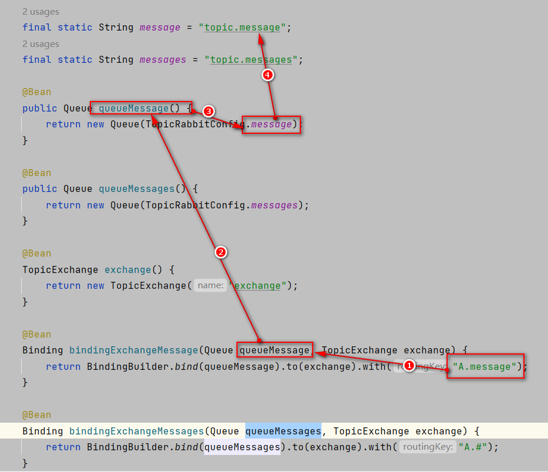

资料来源：<br/>
[Spring Boot(八)：RabbitMQ 详解](http://www.ityouknow.com/springboot/2016/11/30/spring-boot-rabbitMQ.html)<br/>
[#method＜connection.close＞(reply-code=530, reply-text=NOT_ALLOWED - vhost /my_vhost not found](https://blog.csdn.net/Myselfh/article/details/111288235)


## 使用案例

### 基本配置

1、配置 Pom 包，主要是添加 `spring-boot-starter-amqp` 的支持

```
<dependency>
	<groupId>org.springframework.boot</groupId>
	<artifactId>spring-boot-starter-amqp</artifactId>
</dependency>
```

2、配置文件

配置 RabbitMQ 的安装地址、端口以及账户信息

```yaml
spring:
  application:
    name: Spring-boot-rabbitmq
  rabbitmq:
    host: 124.221.127.60
    port: 5672
    username: admin
    password: admin
    virtual-host: my_vhost
```

`spring.rabbitmq.virtual-host=/my_vhost`的值是在主机上看到的


如果是上面的的，写法就是

```
	spring.rabbitmq.virtual-host=my_vhost
```

如果是my_vhost


```
	spring.rabbitmq.virtual-host=my_vhost
```

### 简答使用

**队列配置**

```java
@Configuration
public class RabbitConfig {

    @Bean
    public Queue Queue() {
        return new Queue("hello");
    }

}
```

**发送者**

rabbitTemplate 是 Spring Boot 提供的默认实现

```java
@component
public class HelloSender {

	@Autowired
	private AmqpTemplate rabbitTemplate;

	public void send() {
		String context = "hello " + new Date();
		System.out.println("Sender : " + context);
		this.rabbitTemplate.convertAndSend("hello", context);
	}

}
```

**接收者**

```java
@Component
@RabbitListener(queues = "hello")
public class HelloReceiver {

    @RabbitHandler
    public void process(String hello) {
        System.out.println("Receiver  : " + hello);
    }

}
```

5、测试

```java
@RunWith(SpringRunner.class)
@SpringBootTest
public class RabbitMqHelloTest {

	@Autowired
	private HelloSender helloSender;

	@Test
	public void hello() throws Exception {
		helloSender.send();
         Thread.currentThread().join(); // 防止程序结束
	}

}
```

> 注意，发送者和接收者的 queue name 必须一致，不然不能接收

### 多对多使用

一个发送者，N 个接收者或者 N 个发送者和 N 个接收者会出现什么情况呢？

**一对多发送**

对上面的代码进行了小改造，接收端注册了两个 Receiver,Receiver1 和 Receiver2，发送端加入参数计数，接收端打印接收到的参数，下面是测试代码，发送一百条消息，来观察两个接收端的执行效果

```java
@Test
public void oneToMany() throws Exception {
	for (int i=0;i<100;i++){
		neoSender.send(i);
	}
	 Thread.currentThread().join(); // 防止程序结束
}
```

结果如下：

```
Receiver 1: Spring boot neo queue ****** 11
Receiver 2: Spring boot neo queue ****** 12
Receiver 2: Spring boot neo queue ****** 14
Receiver 1: Spring boot neo queue ****** 13
Receiver 2: Spring boot neo queue ****** 15
Receiver 1: Spring boot neo queue ****** 16
Receiver 1: Spring boot neo queue ****** 18
Receiver 2: Spring boot neo queue ****** 17
Receiver 2: Spring boot neo queue ****** 19
Receiver 1: Spring boot neo queue ****** 20
```

根据返回结果得到以下结论

> 一个发送者，N个接受者,经过测试会均匀的将消息发送到N个接收者中

**多对多发送**

复制了一份发送者，加入标记，在一百个循环中相互交替发送

```java
@Test
	public void manyToMany() throws Exception {
		for (int i=0;i<100;i++){
			neoSender.send(i);
			neoSender2.send(i);
		}
		 Thread.currentThread().join(); // 防止程序结束
}
```

结果如下：

```
Receiver 1: Spring boot neo queue ****** 20
Receiver 2: Spring boot neo queue ****** 20
Receiver 1: Spring boot neo queue ****** 21
Receiver 2: Spring boot neo queue ****** 21
Receiver 1: Spring boot neo queue ****** 22
Receiver 2: Spring boot neo queue ****** 22
Receiver 1: Spring boot neo queue ****** 23
Receiver 2: Spring boot neo queue ****** 23
Receiver 1: Spring boot neo queue ****** 24
Receiver 2: Spring boot neo queue ****** 24
Receiver 1: Spring boot neo queue ****** 25
Receiver 2: Spring boot neo queue ****** 25
```

> 结论：和一对多一样，接收端仍然会均匀接收到消息


## 高级使用

### 对象的支持

Spring Boot 以及完美的支持对象的发送和接收，不需要格外的配置。

```java
//发送者
public void send(User user) {
	System.out.println("Sender object: " + user.toString());
	this.rabbitTemplate.convertAndSend("object", user);
}

...

//接收者
@RabbitHandler
public void process(User user) {
    System.out.println("Receiver object : " + user);
}
```

结果如下：

```shell
Sender object: User{name='neo', pass='123456'}
Receiver object : User{name='neo', pass='123456'}
```

### Topic Exchange

topic 是 RabbitMQ 中最灵活的一种方式，可以根据 routing_key 自由的绑定不同的队列

首先对 topic 规则配置，这里使用两个队列来测试

```java
@Configuration
public class TopicRabbitConfig {

    final static String message = "topic.message";
    final static String messages = "topic.messages";

    @Bean
    public Queue queueMessage() {
        return new Queue(TopicRabbitConfig.message);
    }

    @Bean
    public Queue queueMessages() {
        return new Queue(TopicRabbitConfig.messages);
    }

    @Bean
    TopicExchange exchange() {
        return new TopicExchange("exchange");
    }

    @Bean
    Binding bindingExchangeMessage(Queue queueMessage, TopicExchange exchange) {
        return BindingBuilder.bind(queueMessage).to(exchange).with("A.message");
    }

    @Bean
    Binding bindingExchangeMessages(Queue queueMessages, TopicExchange exchange) {
        return BindingBuilder.bind(queueMessages).to(exchange).with("A.#");
    }
}
```

**发送**

使用 queueMessages 同时匹配两个队列，queueMessage 只匹配 “topic.message” 队列

```java
import org.springframework.amqp.core.AmqpTemplate;
import org.springframework.beans.factory.annotation.Autowired;
import org.springframework.stereotype.Component;

@Component
public class HelloSender {

    @Autowired
    private AmqpTemplate rabbitTemplate;

    public void send1() {
        String context = "hi, i am message 1";
        System.out.println("Sender : " + context);
        this.rabbitTemplate.convertAndSend("exchange", "A.message", context);
    }

    public void send2() {
        String context = "hi, i am messages 2";
        System.out.println("Sender : " + context);
        this.rabbitTemplate.convertAndSend("exchange", "A.messages", context);
    }

}
```

发送send1会匹配到topic.#和topic.message 两个Receiver都可以收到消息，发送send2只有topic.#可以匹配所有只有Receiver2监听到消息

**接收**

两个接收到者

```java
import org.springframework.amqp.rabbit.annotation.RabbitHandler;
import org.springframework.amqp.rabbit.annotation.RabbitListener;
import org.springframework.stereotype.Component;

@Component
@RabbitListener(queues = TopicRabbitConfig.message)
public class TopicReceiver {

    @RabbitHandler
    public void process(String message) {
        System.out.println("Topic Receiver1  : " + message);
    }

}
```

```java
import org.springframework.amqp.rabbit.annotation.RabbitHandler;
import org.springframework.amqp.rabbit.annotation.RabbitListener;
import org.springframework.stereotype.Component;

@Component
@RabbitListener(queues = TopicRabbitConfig.messages)
public class TopicReceiver2 {

    @RabbitHandler
    public void process(String message) {
        System.out.println("Topic Receiver2  : " + message);
    }

}
```

测试方法

```java
@RunWith(SpringRunner.class)
@SpringBootTest
public class Rabbit2MqHelloTest {

    @Autowired
    private HelloSender helloSender;

    @SneakyThrows
    @Test
    public void test01(){
        helloSender.send1();
       // helloSender.send1();
        Thread.currentThread().join();

    }
}
```


send1结果


send2结果


解释：

TopicExchange的值是`exchange`

发送1 内容是`"topic.message"`而2的内容是`topic.messages`



test1 中发送的内容是`A.message` 是完全匹配第一个的，但是`A#`也匹配，根据这个路线找到两个消费者


### Fanout Exchange

Fanout 就是我们熟悉的广播模式或者订阅模式，给 Fanout 交换机发送消息，绑定了这个交换机的所有队列都收到这个消息。

Fanout 相关配置

**路由配置**

```java
@Configuration
public class FanoutRabbitConfig {

    @Bean
    public Queue AMessage() {
        return new Queue("fanout.A");
    }

    @Bean
    public Queue BMessage() {
        return new Queue("fanout.B");
    }

    @Bean
    public Queue CMessage() {
        return new Queue("fanout.C");
    }

    @Bean
    FanoutExchange fanoutExchange() {
        return new FanoutExchange("fanoutExchange");
    }

    @Bean
    Binding bindingExchangeA(Queue AMessage,FanoutExchange fanoutExchange) {
        return BindingBuilder.bind(AMessage).to(fanoutExchange);
    }

    @Bean
    Binding bindingExchangeB(Queue BMessage, FanoutExchange fanoutExchange) {
        return BindingBuilder.bind(BMessage).to(fanoutExchange);
    }

    @Bean
    Binding bindingExchangeC(Queue CMessage, FanoutExchange fanoutExchange) {
        return BindingBuilder.bind(CMessage).to(fanoutExchange);
    }

}
```

备注：之前是


接收

```java
import org.springframework.amqp.rabbit.annotation.RabbitHandler;
import org.springframework.amqp.rabbit.annotation.RabbitListener;
import org.springframework.stereotype.Component;

@Component
@RabbitListener(queues = "fanout.A")
public class FanoutReceiverA {

    @RabbitHandler
    public void process(String message) {
        System.out.println("fanout Receiver A  : " + message);
    }

}
```

```java
import org.springframework.amqp.rabbit.annotation.RabbitHandler;
import org.springframework.amqp.rabbit.annotation.RabbitListener;
import org.springframework.stereotype.Component;

@Component
@RabbitListener(queues = "fanout.B")
public class FanoutReceiverB {

    @RabbitHandler
    public void process(String message) {
        System.out.println("fanout Receiver B: " + message);
    }

}
```

```java
import org.springframework.amqp.rabbit.annotation.RabbitHandler;
import org.springframework.amqp.rabbit.annotation.RabbitListener;
import org.springframework.stereotype.Component;

@Component
@RabbitListener(queues = "fanout.C")
public class FanoutReceiverC {

    @RabbitHandler
    public void process(String message) {
        System.out.println("fanout Receiver C: " + message);
    }

}
```

这里使用了 A、B、C 三个队列绑定到 Fanout 交换机上面，发送端的 routing_key 写任何字符都会被忽略：

```java
public void send() {
	String context = "hi, fanout msg ";
	System.out.println("Sender : " + context);
	this.rabbitTemplate.convertAndSend("fanoutExchange","", context);
}
```

结果如下：

```shell
Sender : hi, fanout msg 
...
fanout Receiver B: hi, fanout msg 
fanout Receiver A  : hi, fanout msg 
fanout Receiver C: hi, fanout msg 
```

结果说明，绑定到 fanout 交换机上面的队列都收到了消息

**[示例代码-github](https://github.com/ityouknow/spring-boot-examples/tree/master/spring-boot-rabbitmq)**

**[示例代码-码云](https://gitee.com/ityouknow/spring-boot-examples/tree/master/spring-boot-rabbitmq)**

### 参考

[RabbitMQ 使用参考](https://www.zouyesheng.com/rabbitmq.html)

[RabbitMQ：Spring 集成 RabbitMQ 与其概念，消息持久化，ACK机制](https://github.com/401Studio/WeekLearn/issues/2)