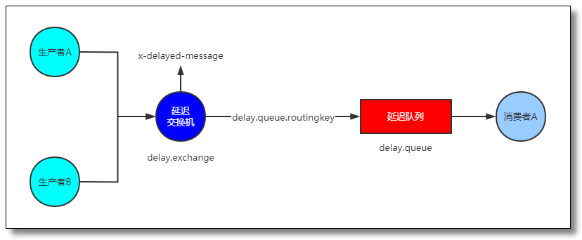
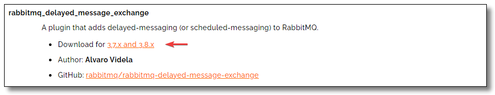
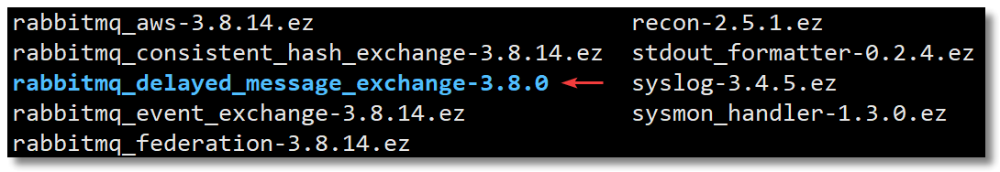
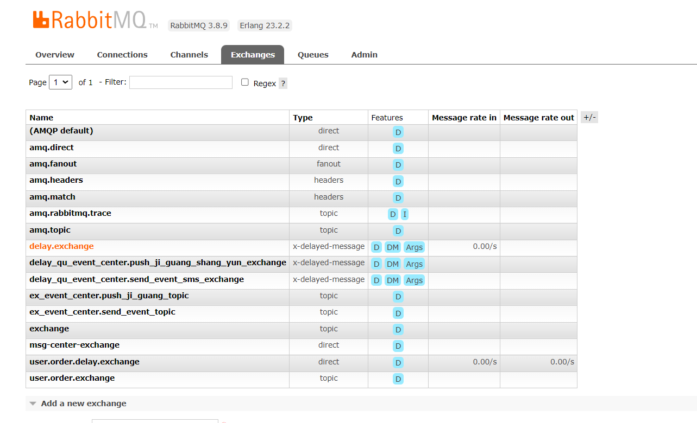
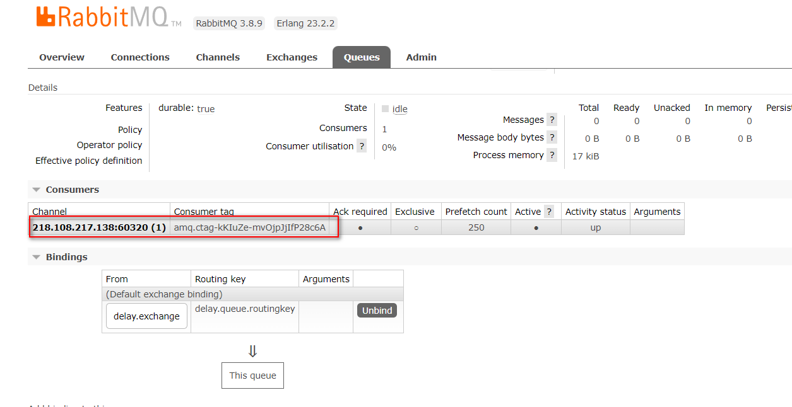
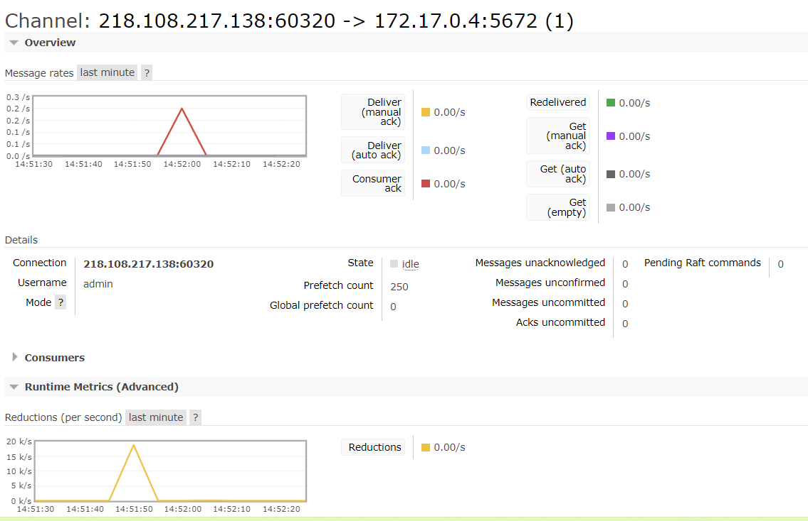

资料来源：<br/>
[为什么我推荐你使用 RabbitMQ 实现订单超时处理（一）](https://www.mrhelloworld.com/rabbitmq-delay-message/)<br/>


## RabbitMQ插件版

### 介绍

　方案二的问题可以通过安装 RabbitMQ 的社区插件 `rabbitmq_delayed_message_exchange` 来解决。

　　安装插件后会生成新的 Exchange 类型 `x-delayed-message`，该类型消息支持延迟投递机制，接收到消息后并未立即将消息投递至目标队列，而是存储在 `mnesia`(一个分布式数据库) 中，随后监测消息延迟时间，如达到可投递时间时将其通过 `x-delayed-type` 类型标记的交换机投递至目标队列。

　　最终效果如下图：



### 安装插件

访问：https://www.rabbitmq.com/community-plugins.html 下载插件。

插件 Github 地址：https://github.com/rabbitmq/rabbitmq-delayed-message-exchange

插件下载地址：https://github.com/rabbitmq/rabbitmq-delayed-message-exchange/releases



下载以后得到一个 `rabbitmq_delayed_message_exchange-3.8.0.ez` 压缩文件，将解压的文件上传到 RabbitMQ 安装目录下的 `plugins` 目录中。

　这里顺便教大家如何在 Linux 系统中根据软件包查找安装文件。

查看已安装的 rabbitmq 的包名 `rpm -qa | grep rabbitmq`：

```shell
[root@localhost ~]# rpm -qa | grep rabbitmq
rabbitmq-server-3.8.14-1.el7.noarch
```

　　查看 rabbitmq 软件包安装了哪些文件 `rpm -ql rabbitmq-server-3.8.14-1.el7.noarch`：

```shell
[root@localhost ~]# rpm -ql rabbitmq-server-3.8.14-1.el7.noarch
/etc/logrotate.d/rabbitmq-server
/etc/profile.d/rabbitmqctl-autocomplete.sh
/etc/rabbitmq
...
...
/usr/lib/rabbitmq/lib/rabbitmq_server-3.8.14/plugins/README
/usr/lib/rabbitmq/lib/rabbitmq_server-3.8.14/plugins/accept-0.3.5.ez
...
...

```

　`...` 表示查询结果中我省略的部分，相信大家已经知道 `plugins` 目录在哪里了，现在将解压的文件上传到 RabbitMQ 安装目录下的 `plugins` 目录中。

　　查看：`ls /usr/lib/rabbitmq/lib/rabbitmq_server-3.8.14/plugins`



**启动插件**

　　重启 RabbitMQ，输入以下命令加载 rabbitmq_delayed_message_exchange 插件：

```shell
# 重启 RabbitMQ
systemctl restart rabbitmq-server.service
# 启动插件
rabbitmq-plugins enable rabbitmq_delayed_message_exchange
```

### 代码实现

引用jar包和application.yml配置和之前一样，这里省略

#### RabbitMQ 配置类

```java
package store.liuwei.mq.simple.chajian;

import org.springframework.amqp.core.Binding;
import org.springframework.amqp.core.BindingBuilder;
import org.springframework.amqp.core.CustomExchange;
import org.springframework.amqp.core.Queue;
import org.springframework.beans.factory.annotation.Qualifier;
import org.springframework.context.annotation.Bean;
import org.springframework.context.annotation.Configuration;

import java.util.HashMap;
import java.util.Map;

/**
 * @author 哈喽沃德先生
 * @微信公众号 哈喽沃德先生
 * @website https://mrhelloworld.com
 * @wechat 124059770
 */
@Configuration
public class RabbitMQConfiguration {

    // 延迟交换机
    public static final String DELAY_EXCHANGE = "delay.exchange";
    // 延迟队列
    public static final String DELAY_QUEUE = "delay.queue";
    // 延迟队列路由Key
    public static final String DELAY_QUEUE_ROUTING_KEY = "delay.queue.routingkey";

    // 声明延迟队列
    @Bean("delayQueue")
    public Queue delayQueue() {
        return new Queue(DELAY_QUEUE);
    }

    // 声明延迟交换机，延迟消息由 rabbitmq_delayed_message_exchange 插件实现
    /*
        安装插件后会生成新的 Exchange 类型 x-delayed-message，
        该类型消息支持延迟投递机制，接收到消息后并未立即将消息投递至目标队列，
        而是存储在 mnesia(一个分布式数据库) 中，
        随后监测消息延迟时间，如达到可投递时间时将其通过 x-delayed-type 类型标记的交换机投递至目标队列。
     */
    @Bean("delayExchange")
    public CustomExchange delayExchange() {
        Map<String, Object> args = new HashMap<>();
        args.put("x-delayed-type", "direct");
        return new CustomExchange(DELAY_EXCHANGE, "x-delayed-message", true, false, args);
    }

    // 声明延迟队列的绑定关系
    @Bean
    public Binding delayBinding(@Qualifier("delayQueue") Queue queue,
                                @Qualifier("delayExchange") CustomExchange delayExchange) {
        return BindingBuilder.bind(queue).to(delayExchange).with(DELAY_QUEUE_ROUTING_KEY).noargs();
    }

}
```

可以看出代码和之前的一样，一样的。只是在`delayExchange`指定了为`x-delayed-message`

#### 消息生产者

```java
package store.liuwei.mq.simple.chajian;

import lombok.extern.slf4j.Slf4j;
import org.springframework.amqp.rabbit.core.RabbitTemplate;
import org.springframework.stereotype.Component;

import javax.annotation.Resource;
import java.time.LocalDateTime;

/**
 * @author 哈喽沃德先生
 * @微信公众号 哈喽沃德先生
 * @website https://mrhelloworld.com
 * @wechat 124059770
 */
@Slf4j
@Component
public class DelayMessageProducer {

    @Resource
    private RabbitTemplate rabbitTemplate;

    public void send(String message, Integer delayTime) {
        log.info("当前时间：{}，消息：{}，延迟时间：{}", LocalDateTime.now(), message, delayTime);

        rabbitTemplate.convertAndSend(RabbitMQConfiguration.DELAY_EXCHANGE, RabbitMQConfiguration.DELAY_QUEUE_ROUTING_KEY, message, msg -> {
            // 设置消息的延迟时间
            msg.getMessageProperties().setDelay(delayTime);
            return msg;
        });
    }

}

```

#### 消息消费者

```java
package store.liuwei.mq.simple.chajian;

import com.rabbitmq.client.Channel;
import lombok.extern.slf4j.Slf4j;
import org.springframework.amqp.core.Message;
import org.springframework.amqp.rabbit.annotation.RabbitListener;
import org.springframework.stereotype.Component;

import java.time.LocalDateTime;

/**
 * @author 哈喽沃德先生
 * @微信公众号 哈喽沃德先生
 * @website https://mrhelloworld.com
 * @wechat 124059770
 */
@Slf4j
@Component
public class DelayQueueConsumer {

    // 监听延迟队列
    @RabbitListener(queues = RabbitMQConfiguration.DELAY_QUEUE)
    public void receive(Message message, Channel channel) {
        String msg = new String(message.getBody());
        log.info("当前时间：{}，延迟队列收到消息：{}", LocalDateTime.now(), msg);
    }

}
```

#### 测试方法

```java
package store.liuwei.mq.simple.spring;

import lombok.SneakyThrows;
import org.junit.Test;
import org.junit.runner.RunWith;
import org.springframework.beans.factory.annotation.Autowired;
import org.springframework.boot.test.context.SpringBootTest;
import org.springframework.test.context.junit4.SpringRunner;
import store.liuwei.mq.simple.chajian.DelayMessageProducer;

@RunWith(SpringRunner.class)
@SpringBootTest
public class ChaJianDemo {


    @Autowired
    private DelayMessageProducer delayMessageProducer;

    @SneakyThrows
    @Test
    public void test01(){
        delayMessageProducer.send("你好",10*1000);

        int i = 0;
        for(;;){
            Thread.sleep(1000*1);
            System.out.println("i:" + (i++));
        }
    }
}
```

#### mq后台查看

　　队列信息如下：



消费者列表



（点击上面的可以进入）生产者和消费的记录

