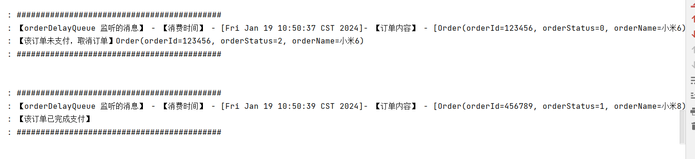

资料来源：<br/>
[SpringBoot使用RabbitMQ延时队列](https://blog.csdn.net/lizc_lizc/article/details/80722763)<br/>


## 延时队列

### 延时队列

延时队列的使用场景：

1.订单业务：在电商中，用户下单后30分钟后未付款则取消订单。

2.短信通知：用户下单并付款后，1分钟后发短信给用户。

延时队列实现思路
AMQP协议和RabbitMQ队列本身没有直接支持延迟队列功能，但是我们可以通过RabbitMQ的两个特性来曲线实现延迟队列：


**特性一：Time To Live(TTL)**

RabbitMQ可以针对Queue设置x-expires 或者 针对Message设置 x-message-ttl，来控制消息的生存时间，如果超时(两者同时设置以最先到期的时间为准)，则消息变为dead letter(死信)
RabbitMQ针对队列中的消息过期时间有两种方法可以设置。
>A: 通过队列属性设置，队列中所有消息都有相同的过期时间。<br/>
>B: 对消息进行单独设置，每条消息TTL可以不同。<br/>

如果同时使用，则消息的过期时间以两者之间TTL较小的那个数值为准。消息在队列的生存时间一旦超过设置的TTL值，就成为dead letter

**特性二：Dead Letter Exchanges（DLX）**

RabbitMQ的Queue可以配置x-dead-letter-exchange 和x-dead-letter-routing-key（可选）两个参数，如果队列内出现了dead letter，则按照这两个参数重新路由转发到指定的队列。<br/>
x-dead-letter-exchange：出现dead letter之后将dead letter重新发送到指定exchange<br/>
x-dead-letter-routing-key：出现dead letter之后将dead letter重新按照指定的routing-key发送<br/>
队列出现dead letter的情况有：<br/>
消息或者队列的TTL过期<br/>
队列达到最大长度<br/>

消息被消费端拒绝（basic.reject or basic.nack）并且requeue=false<br/>

**总结**

> 1.这个消息，有发送者，没有接收者<br/>
> 2.设置消息的过期时间，超时以后，就成了死信<br/>
> 3.成为死信以后，指定死信的接收者<br/>

### 代码举例

#### pojo

```java
package com.lzc.rabbitmq.dataobject;
 
import lombok.Data;
 
import java.io.Serializable;
 
@Data
public class Order implements Serializable {
 
 
    private static final long serialVersionUID = -2221214252163879885L;
    
    private String orderId; // 订单id
 
    private Integer orderStatus; // 订单状态 0：未支付，1：已支付，2：订单已取消
 
    private String orderName; // 订单名字
}
```

#### 配置对象

```java
package com.lzc.rabbitmq.config;
 
import lombok.extern.slf4j.Slf4j;
import org.springframework.amqp.core.*;
import org.springframework.context.annotation.Bean;
import org.springframework.context.annotation.Configuration;
 
import java.util.HashMap;
import java.util.Map;
 
@Configuration
@Slf4j
public class DelayRabbitConfig {
 
 
    /**
     * 延迟队列 TTL 名称
     */
    private static final String ORDER_DELAY_QUEUE = "user.order.delay.queue";
    /**
     * DLX，dead letter发送到的 exchange
     * 延时消息就是发送到该交换机的
     */
    public static final String ORDER_DELAY_EXCHANGE = "user.order.delay.exchange";
    /**
     * routing key 名称
     * 具体消息发送在该 routingKey 的
     */
    public static final String ORDER_DELAY_ROUTING_KEY = "order_delay";
 
    public static final String ORDER_QUEUE_NAME = "user.order.queue";
    public static final String ORDER_EXCHANGE_NAME = "user.order.exchange";
    public static final String ORDER_ROUTING_KEY = "order";
 
    /**
     * 延迟队列配置
     * <p>
     * 1、params.put("x-message-ttl", 5 * 1000);
     * 第一种方式是直接设置 Queue 延迟时间 但如果直接给队列设置过期时间,这种做法不是很灵活,（当然二者是兼容的,默认是时间小的优先）
     * 2、rabbitTemplate.convertAndSend(book, message -> {
     * message.getMessageProperties().setExpiration(2 * 1000 + "");
     * return message;
     * });
     * 第二种就是每次发送消息动态设置延迟时间,这样我们可以灵活控制
     **/
    @Bean
    public Queue delayOrderQueue() {
        Map<String, Object> params = new HashMap<>();
        // x-dead-letter-exchange 声明了队列里的死信转发到的DLX名称，
        params.put("x-dead-letter-exchange", ORDER_EXCHANGE_NAME);
        // x-dead-letter-routing-key 声明了这些死信在转发时携带的 routing-key 名称。
        params.put("x-dead-letter-routing-key", ORDER_ROUTING_KEY);
        return new Queue(ORDER_DELAY_QUEUE, true, false, false, params);
    }
    /**
     * 需要将一个队列绑定到交换机上，要求该消息与一个特定的路由键完全匹配。
     * 这是一个完整的匹配。如果一个队列绑定到该交换机上要求路由键 “dog”，则只有被标记为“dog”的消息才被转发，
     * 不会转发dog.puppy，也不会转发dog.guard，只会转发dog。
     * @return DirectExchange
     */
    @Bean
    public DirectExchange orderDelayExchange() {
        return new DirectExchange(ORDER_DELAY_EXCHANGE);
    }
    @Bean
    public Binding dlxBinding() {
        return BindingBuilder.bind(delayOrderQueue()).to(orderDelayExchange()).with(ORDER_DELAY_ROUTING_KEY);
    }
 
    @Bean
    public Queue orderQueue() {
        return new Queue(ORDER_QUEUE_NAME, true);
    }
    /**
     * 将路由键和某模式进行匹配。此时队列需要绑定要一个模式上。
     * 符号“#”匹配一个或多个词，符号“*”匹配不多不少一个词。因此“audit.#”能够匹配到“audit.irs.corporate”，但是“audit.*” 只会匹配到“audit.irs”。
     **/
    @Bean
    public TopicExchange orderTopicExchange() {
        return new TopicExchange(ORDER_EXCHANGE_NAME);
    }
 
    @Bean
    public Binding orderBinding() {
        // TODO 如果要让延迟队列之间有关联,这里的 routingKey 和 绑定的交换机很关键
        return BindingBuilder.bind(orderQueue()).to(orderTopicExchange()).with(ORDER_ROUTING_KEY);
    }
 
}
```

#### 死信后的接收者

```java
package com.lzc.rabbitmq.config;
 
import com.lzc.rabbitmq.dataobject.Order;
import com.rabbitmq.client.Channel;
import lombok.extern.slf4j.Slf4j;
import org.springframework.amqp.core.Message;
import org.springframework.amqp.rabbit.annotation.RabbitListener;
import org.springframework.stereotype.Component;
 
import java.util.Date;
 
@Component
@Slf4j
public class DelayReceiver {
 
    @RabbitListener(queues = {DelayRabbitConfig.ORDER_QUEUE_NAME})
    public void orderDelayQueue(Order order, Message message, Channel channel) {
        log.info("###########################################");
        log.info("【orderDelayQueue 监听的消息】 - 【消费时间】 - [{}]- 【订单内容】 - [{}]",  new Date(), order.toString());
        if(order.getOrderStatus() == 0) {
            order.setOrderStatus(2);
            log.info("【该订单未支付，取消订单】" + order.toString());
        } else if(order.getOrderStatus() == 1) {
            log.info("【该订单已完成支付】");
        } else if(order.getOrderStatus() == 2) {
            log.info("【该订单已取消】");
        }
        log.info("###########################################");
    }
}
```

#### 发送者

```java
package com.lzc.rabbitmq.config;
 
import com.lzc.rabbitmq.dataobject.Order;
import lombok.extern.slf4j.Slf4j;
import org.springframework.amqp.core.AmqpTemplate;
import org.springframework.beans.factory.annotation.Autowired;
import org.springframework.stereotype.Component;
 
import java.util.Date;
 
@Component
@Slf4j
public class DelaySender {
 
    @Autowired
    private AmqpTemplate amqpTemplate;
 
    public void sendDelay(Order order) {
        log.info("【订单生成时间】" + new Date().toString() +"【1分钟后检查订单是否已经支付】" + order.toString() );
        this.amqpTemplate.convertAndSend(DelayRabbitConfig.ORDER_DELAY_EXCHANGE, DelayRabbitConfig.ORDER_DELAY_ROUTING_KEY, order, message -> {
            // 如果配置了 params.put("x-message-ttl", 5 * 1000); 那么这一句也可以省略,具体根据业务需要是声明 Queue 的时候就指定好延迟时间还是在发送自己控制时间
            message.getMessageProperties().setExpiration(1 * 1000 * 10 + "");
            return message;
        });
    }
}
```

#### 测试

```java

import lombok.SneakyThrows;
import org.junit.Test;
import org.junit.runner.RunWith;
import org.springframework.beans.factory.annotation.Autowired;
import org.springframework.boot.test.context.SpringBootTest;
import org.springframework.test.context.junit4.SpringRunner;
import store.liuwei.mq.simple.dead.DelaySender;
import store.liuwei.mq.simple.dead.Order;

@RunWith(SpringRunner.class)
@SpringBootTest
public class DelayDemo {

    @Autowired
    private DelaySender delaySender;


    @SneakyThrows
    @Test
    public void sendDelay() {
        Order order1 = new Order();
        order1.setOrderStatus(0);
        order1.setOrderId("123456");
        order1.setOrderName("小米6");
        delaySender.sendDelay(order1);

        Thread.sleep(1000*2);
        Order order2 = new Order();
        order2.setOrderStatus(1);
        order2.setOrderId("456789");
        order2.setOrderName("小米8");
        delaySender.sendDelay(order2);

        int i = 0;
        for(;;){
            Thread.sleep(1000*1);
            System.out.println("i:" + (i++));
        }
    }


}

```

直接运行的结果

