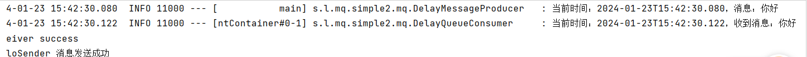
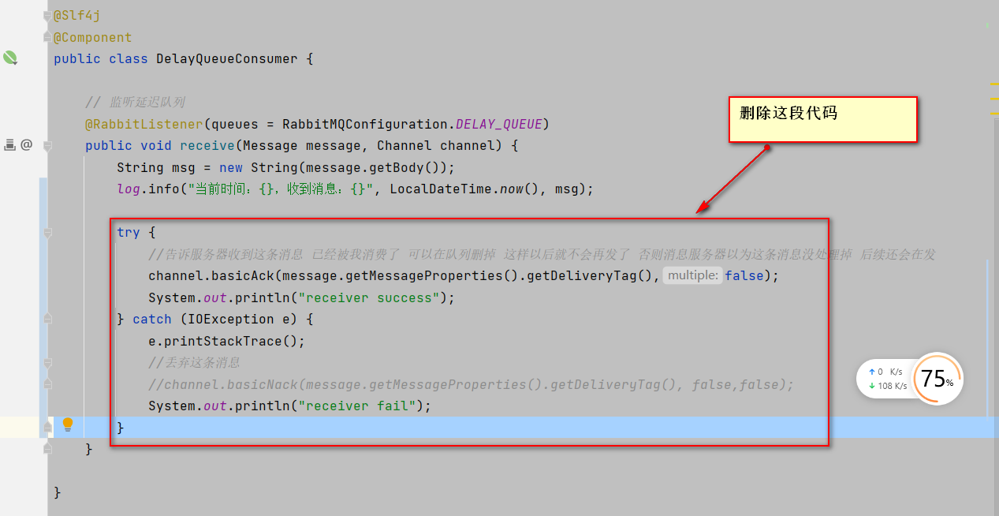
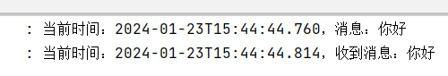
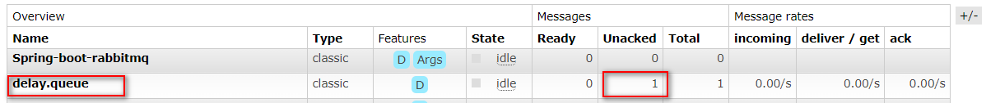

资料来源：<br/>
[SpringBoot集成RabbitMQ消息队列搭建与ACK消息确认入门](https://blog.csdn.net/linpeng_1/article/details/80505828)<br/>
[springBoot集成rabbitmq 之消息确认模式(ACK)](https://blog.csdn.net/weixin_45730866/article/details/129010611)<br/>

## 消息确认

Spring AMQP提供了一个发送和接收消息的操作模板类AmqpTemplate。 AmqpTemplate它定义包含了发送和接收消息等的一些基本的操作功能。RabbitTemplate是AmqpTemplate的一个实现。

RabbitTemplate支持消息的确认与返回，为了返回消息，RabbitTemplate 需要设置mandatory 属性为true,并且CachingConnectionFactory 的publisherReturns属性也需要设置为true。返回的消息会根据它注册的RabbitTemplate.ReturnCallback setReturnCallback 回调发送到给客户端，

一个RabbitTemplate仅能支持一个ReturnCallback 。

为了确认Confirms消息, CachingConnectionFactory 的publisherConfirms 属性也需要设置为true，确认的消息会根据它注册的RabbitTemplate.ConfirmCallback setConfirmCallback回调发送到给客户端。一个RabbitTemplate也仅能支持一个ConfirmCallback.

## springboot 集成

### 配置文件

```yaml
spring:
  application:
    name: Spring-boot-rabbitmq
  rabbitmq:
    host: 124.221.127.60
    port: 5672
    username: admin
    password: admin
    virtual-host: my_vhost
    publisher-confirms: true    # 开启发送确认
    publisher-returns: true     # 开启发送失败退回
    listener:
      # 开启ACK
      direct:
        acknowledge-mode: manual
      simple:
        acknowledge-mode: manual
```

自动配置信息  这里我开启ACK消息确认

### 配置文件

```java
package store.liuwei.mq.simple2.mq;

import org.springframework.amqp.core.Binding;
import org.springframework.amqp.core.BindingBuilder;
import org.springframework.amqp.core.CustomExchange;
import org.springframework.amqp.core.Queue;
import org.springframework.beans.factory.annotation.Qualifier;
import org.springframework.context.annotation.Bean;
import org.springframework.context.annotation.Configuration;

import java.util.HashMap;
import java.util.Map;

/**
 * @author 哈喽沃德先生
 * @微信公众号 哈喽沃德先生
 * @website https://mrhelloworld.com
 * @wechat 124059770
 */
@Configuration
public class RabbitMQConfiguration {

    // 延迟交换机
    public static final String DELAY_EXCHANGE = "delay.exchange";
    // 延迟队列
    public static final String DELAY_QUEUE = "delay.queue";
    // 延迟队列路由Key
    public static final String DELAY_QUEUE_ROUTING_KEY = "delay.queue.routingkey";

    // 声明延迟队列
    @Bean("delayQueue")
    public Queue delayQueue() {
        return new Queue(DELAY_QUEUE);
    }

    // 声明延迟交换机
    @Bean("delayExchange")
    public CustomExchange delayExchange() {
        Map<String, Object> args = new HashMap<>();
        args.put("x-delayed-type", "direct");
        return new CustomExchange(DELAY_EXCHANGE, "x-delayed-message", true, false, args);
    }

    // 声明延迟队列的绑定关系
    @Bean
    public Binding delayBinding(@Qualifier("delayQueue") Queue queue,
                                @Qualifier("delayExchange") CustomExchange delayExchange) {
        return BindingBuilder.bind(queue).to(delayExchange).with(DELAY_QUEUE_ROUTING_KEY).noargs();
    }

}
```

配置文件和普通是一样的

### 生产者

```java
package store.liuwei.mq.simple2.mq;

import lombok.extern.slf4j.Slf4j;
import org.springframework.amqp.core.Message;
import org.springframework.amqp.rabbit.connection.CorrelationData;
import org.springframework.amqp.rabbit.core.RabbitTemplate;
import org.springframework.stereotype.Component;

import javax.annotation.Resource;
import java.time.LocalDateTime;

/**
 * @author 哈喽沃德先生
 * @微信公众号 哈喽沃德先生
 * @website https://mrhelloworld.com
 * @wechat 124059770
 */
@Slf4j
@Component
public class DelayMessageProducer  implements   RabbitTemplate.ConfirmCallback ,RabbitTemplate.ReturnCallback {

    @Resource
    private RabbitTemplate rabbitTemplate;

    public void send(String message) {
        log.info("当前时间：{}，消息：{}", LocalDateTime.now(), message);

        rabbitTemplate.convertAndSend(RabbitMQConfiguration.DELAY_EXCHANGE, RabbitMQConfiguration.DELAY_QUEUE_ROUTING_KEY, message);
//        this.rabbitTemplate.setConfirmCallback((correlationData, ack, cause) -> {
//            if (!ack) {
//                System.out.println("HelloSender消息发送失败" + cause + correlationData.toString());
//            } else {
//                System.out.println("HelloSender 消息发送成功 ");
//            }
//        });
    }

    /**
     * 消息回调确认方法
     * 如果消息没有到exchange,则confirm回调,ack=false
     * 如果消息到达exchange,则confirm回调,ack=true
     * @param
     */
    @Override
    public void confirm(CorrelationData correlationData, boolean isSendSuccess, String s) {
        System.out.println("confirm--message:回调消息ID为: " + correlationData.getId());
        if (isSendSuccess) {
            System.out.println("confirm--message:消息发送成功");
        } else {
            System.out.println("确认--消息:消息发送失败" + s);
        }
    }
    /**
     * exchange到queue成功,则不回调return
     * exchange到queue失败,则回调return(需设置mandatory=true,否则不回回调,消息就丢了)
     */
    @Override
    public void returnedMessage(Message message, int replyCode, String replyText, String exchange, String routingKey) {
        System.out.println("返回消息:" + new String(message.getBody()) + ",replyCode:" + replyCode
                + ",replyText:" + replyText + ",exchange:" + exchange + ",routingKey:" + routingKey);
    }

}

```

### 消费者

```java
package store.liuwei.mq.simple2.mq;

import com.rabbitmq.client.Channel;
import lombok.extern.slf4j.Slf4j;
import org.springframework.amqp.core.Message;
import org.springframework.amqp.rabbit.annotation.RabbitListener;
import org.springframework.stereotype.Component;

import java.io.IOException;
import java.time.LocalDateTime;

/**
 * @author 哈喽沃德先生
 * @微信公众号 哈喽沃德先生
 * @website https://mrhelloworld.com
 * @wechat 124059770
 */
@Slf4j
@Component
public class DelayQueueConsumer {

    // 监听延迟队列
    @RabbitListener(queues = RabbitMQConfiguration.DELAY_QUEUE)
    public void receive(Message message, Channel channel) {
        String msg = new String(message.getBody());
        log.info("当前时间：{}，收到消息：{}", LocalDateTime.now(), msg);

        try {
            //告诉服务器收到这条消息 已经被我消费了 可以在队列删掉 这样以后就不会再发了 否则消息服务器以为这条消息没处理掉 后续还会在发
            channel.basicAck(message.getMessageProperties().getDeliveryTag(),false);
            System.out.println("receiver success");
        } catch (IOException e) {
            e.printStackTrace();
            //丢弃这条消息
            //channel.basicNack(message.getMessageProperties().getDeliveryTag(), false,false);
            System.out.println("receiver fail");
        }
    }

}

```

代码

> channel.basicAck(message.getMessageProperties().getDeliveryTag(),false);
>
> 消息的标识，false只确认当前一个消息收到，true确认所有consumer获得的消息

拒绝消息

> channel.basicNack(message.getMessageProperties().getDeliveryTag(), false, true);   //ack返回false,并重新回到队列
>
> channel.basicReject(message.getMessageProperties().getDeliveryTag(), true);   // 拒绝为true


### 测试方法

我们把HelloReceiver的ACK确认代码注释掉 那消息就算程序收到了 但是未确认ACK导致消息服务器以为他是未成功消费的 后续还会再发

```java
package store.liuwei.mq.simple2.spring;

import lombok.SneakyThrows;
import org.junit.Test;
import org.junit.runner.RunWith;
import org.springframework.beans.factory.annotation.Autowired;
import org.springframework.boot.test.context.SpringBootTest;
import org.springframework.test.context.junit4.SpringRunner;
import store.liuwei.mq.simple2.mq.DelayMessageProducer;

@RunWith(SpringRunner.class)
@SpringBootTest
public class ChaJianDemo {


    @Autowired
    private DelayMessageProducer delayMessageProducer;

    @SneakyThrows
    @Test
    public void test01(){
        delayMessageProducer.send("你好");

        int i = 0;
        for(;;);
    }

    @SneakyThrows
    @Test
    public void test02(){
//        delayMessageProducer.send("你好");

        int i = 0;
        for(;;);
    }
}

```

- 运行效果test01




- 如果我把确认收到注释掉




先运行test1，在运行test2。发现test2 还可以收到消息

test1结果



后台，可以看到没有消费掉，执行test2还可以继续收到

