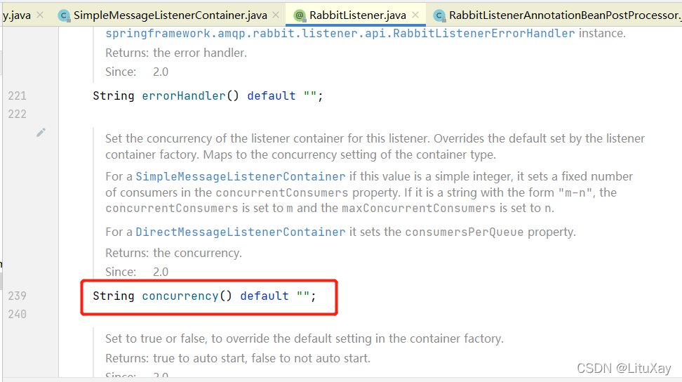
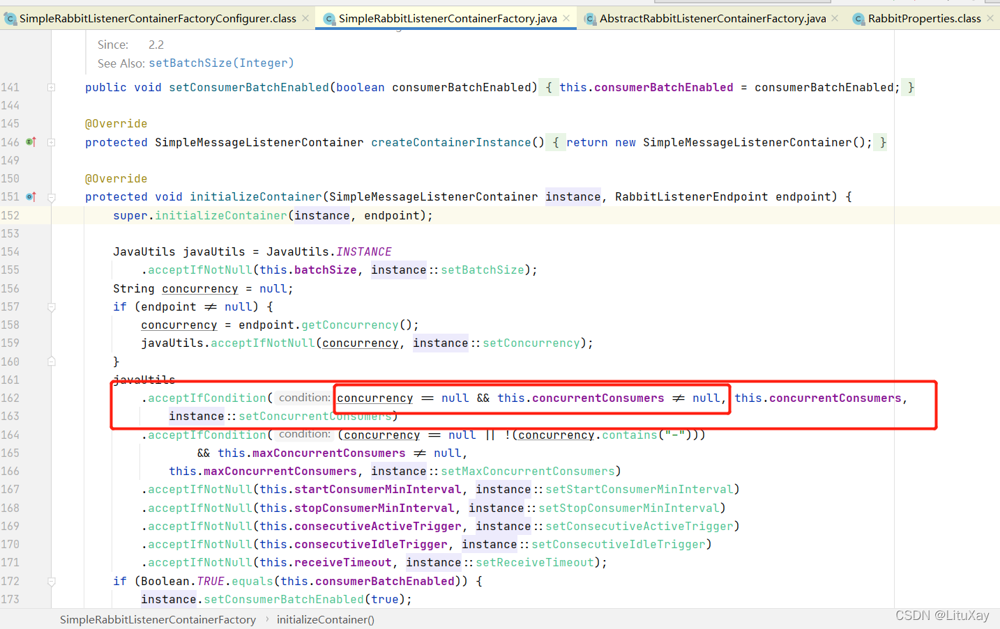
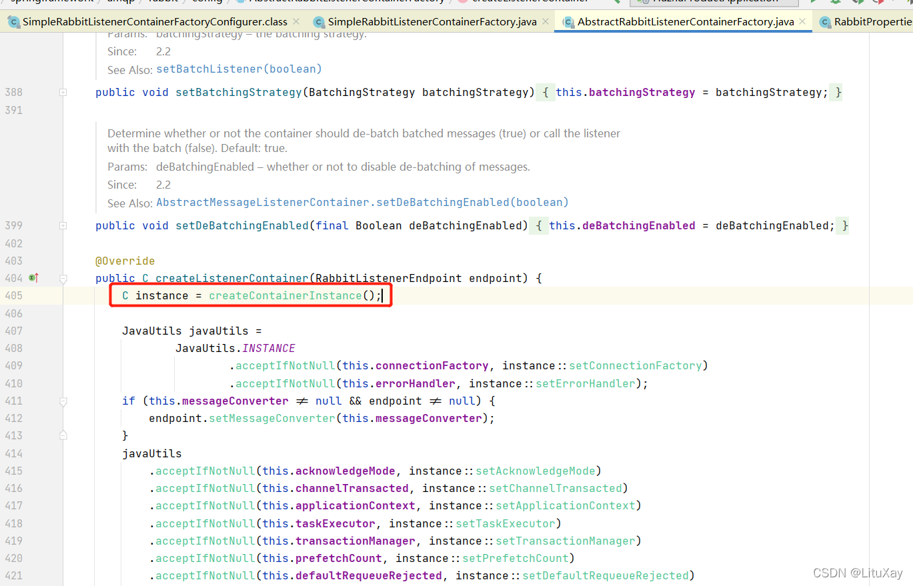
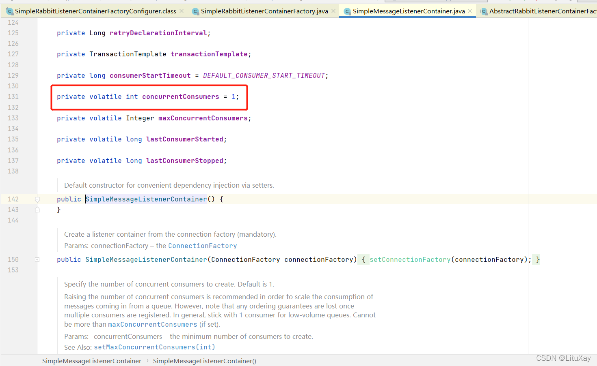

资料来源：<br/>
[RabbitMQ配置多线程消费](https://blog.csdn.net/qq_29752857/article/details/129944754)<br/>
[Spring RabbitMQ默认concurrency数量](https://blog.csdn.net/LituXay/article/details/121652381)


## 消费者数量

首先说一下concurrency配置，这个配置是设置listener初始化时的线程数，即消费者的数量，即消费者同时消费消息的数量。
那么如果没有显性设置concurrency时，默认的线程数是多少呢，答案是1。
这里先看一下RabbitListener注解里面是否有默认值：



可以看到并没有默认值，那就只能追踪一下源码。沿着源码一步一步的走进来： 



可以看到如果未通过注解设置线程数的情况，判断有没有在配置文件设置同一个线程数，如果还没有，则不修改instance的默认线程数，那么instance的默认线程数是多少呢，我们往回看一下：



instance是这个时候创建的，再点进去看一下：



 可以看到默认的消费者数量是1

## 修改成多线程消费

配置消费监听器

```java
import org.springframework.amqp.rabbit.config.SimpleRabbitListenerContainerFactory;
import org.springframework.amqp.rabbit.connection.ConnectionFactory;
import org.springframework.boot.autoconfigure.amqp.SimpleRabbitListenerContainerFactoryConfigurer;
  
 
  //并发数量:根据实际的服务器性能进行配置，计算型可以参考下边代码。
    public static final int DEFAULT_CONCURRENT = Runtime.getRuntime().availableProcessors() + 1;
 
    @Bean("customContainerFactory")
    public SimpleRabbitListenerContainerFactory containerFactory(SimpleRabbitListenerContainerFactoryConfigurer configurer,
                                                                 ConnectionFactory connectionFactory) {
        SimpleRabbitListenerContainerFactory factory = new SimpleRabbitListenerContainerFactory();
        factory.setConcurrentConsumers(DEFAULT_CONCURRENT);
        factory.setMaxConcurrentConsumers(DEFAULT_CONCURRENT);
        configurer.configure(factory, connectionFactory);
        return factory;
    }
```

使用多线程消费

```java
  @RabbitListener(queues = "test", containerFactory = "customContainerFactory")
```

