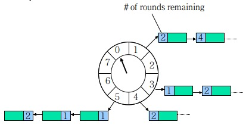

资料来源：

[史上最全的延迟任务实现方式汇总！附代码（强烈推荐）](史上最全的延迟任务实现方式汇总！附代码（强烈推荐）)

[延迟任务的实现总结](https://blog.51cto.com/u_3044148/3353924)

[请勿过度依赖Redis的过期监听](https://cloud.tencent.com/developer/article/1781454)

## 延时任务

### 什么是延迟任务？

顾明思议，我们把需要延迟执行的任务叫做延迟任务。

延迟任务的使用场景有以下这些：

> 1.红包 24 小时未被查收，需要延迟执退还业务；
> 2.每个月账单日，需要给用户发送当月的对账单；
> 3.订单下单之后 30 分钟后，用户如果没有付钱，系统需要自动取消订单。

### 延时任务的实现

我从网上查找了很多资料，最终总结了四种方案

- 数据库轮询
- 延时任务
- Redis
- mq

### 数据库轮询

- 以订单为例

这是比较常见的一种方式，所有的订单或者所有的命令一般都会存储在数据库中。我们会起一个线程去扫数据库或者一个数据库定时Job，找到那些超时的数据，直接更新状态，或者拿出来执行一些操作。这种方式很简单，不会引入其他的技术，开发周期短。

如果数据量比较大，千万级甚至更多，插入频率很高的话，上面的方式在性能上会出现一些问题，查找和更新对会占用很多时间，轮询频率高的话甚至会影响数据入库。一种可以尝试的方式就是使用类似TBSchedule或Elastic-Job这样的分布式的任务调度加上数据分片功能，把需要判断的数据分到不同的机器上执行。

如果数据量进一步增大，那扫数据库肯定就不行了。另一方面，对于订单这类数据，我们也许会遇到分库分表，那上述方案就会变得过于复杂，得不偿失。

### 延时定时任务

#### jdk延时队列

ava中的DelayQueue位于java.util.concurrent包下，作为单机实现，它很好的实现了延迟一段时间后触发事件的需求。由于是线程安全的它可以有多个消费者和多个生产者，从而在某些情况下可以提升性能。DelayQueue本质是封装了一个PriorityQueue，使之线程安全，加上Delay功能，也就是说，消费者线程只能在队列中的消息“过期”之后才能返回数据获取到消息，不然只能获取到null。

之所以要用到PriorityQueue，主要是需要排序。也许后插入的消息需要比队列中的其他消息提前触发，那么这个后插入的消息就需要最先被消费者获取，这就需要排序功能。PriorityQueue内部使用最小堆来实现排序队列。队首的，最先被消费者拿到的就是最小的那个。使用最小堆让队列在数据量较大的时候比较有优势。使用最小堆来实现优先级队列主要是因为最小堆在插入和获取时，时间复杂度相对都比较好，都是O(logN)。

下面例子实现了未来某个时间要触发的消息。我把这些消息放在DelayQueue中，当消息的触发时间到，消费者就能拿到消息，并且消费，实现处理方法。示例代码：

- 举例

~~~~java
public class DelayTest {
    public static void main(String[] args) throws InterruptedException {
        DelayQueue delayQueue = new DelayQueue();
        // 添加延迟任务
        delayQueue.put(new DelayElement(1000));
        delayQueue.put(new DelayElement(3000));
        delayQueue.put(new DelayElement(5000));
        System.out.println("开始时间：" + DateFormat.getDateTimeInstance().format(new Date()));
        while (!delayQueue.isEmpty()) {
            // 执行延迟任务
            System.out.println(delayQueue.take());
        }
        System.out.println("结束时间：" + DateFormat.getDateTimeInstance().format(new Date()));
    }

    static class DelayElement implements Delayed {
        // 延迟截止时间（单面：毫秒）
        long delayTime = System.currentTimeMillis();

        public DelayElement(long delayTime) {
            this.delayTime = (this.delayTime + delayTime);
        }

        @Override
        // 获取剩余时间
        public long getDelay(TimeUnit unit) {
            return unit.convert(delayTime - System.currentTimeMillis(), TimeUnit.MILLISECONDS);
        }

        @Override
        // 队列里元素的排序依据
        public int compareTo(Delayed o) {
            if (this.getDelay(TimeUnit.MILLISECONDS) > o.getDelay(TimeUnit.MILLISECONDS)) {
                return 1;
            } else if (this.getDelay(TimeUnit.MILLISECONDS) < o.getDelay(TimeUnit.MILLISECONDS)) {
                return -1;
            } else {
                return 0;
            }
        }

        @Override
        public String toString() {
            return DateFormat.getDateTimeInstance().format(new Date(delayTime));
        }
    }
}
~~~~

#### 定时任务

定时任务有很多种

**JDK ScheduledExecutorService**

JDK自带的一种线程池，它能调度一些命令在一段时间之后执行，或者周期性的执行。文章开头的一些业务场景主要使用第一种方式，即，在一段时间之后执行某个操作。代码例子如下：

~~~~java
public static void main(String[] args) {

        // TODO Auto-generated method stub
        ScheduledExecutorService executor = Executors.newScheduledThreadPool(100);
    
        for (int i = 10; i > 0; i--) {
            executor.schedule(new Runnable() {
    
                public void run() {
                    // TODO Auto-generated method stub
                    System.out.println(
                            "Work start, thread id:" + Thread.currentThread().getId() + " " + sdf.format(new Date()));
                }
    
            }, i, TimeUnit.SECONDS);
        }
    }
~~~~

**Quartz** 

quartz是一个企业级的开源的任务调度框架，quartz内部使用TreeSet来保存Trigger，如下图。Java中的TreeSet是使用TreeMap实现，TreeMap是一个红黑树实现。红黑树的插入和删除复杂度都是logN。和最小堆相比各有千秋。最小堆插入比红黑树快，删除顶层节点比红黑树慢。
相比上述的三种轻量级的实现功能丰富很多。有专门的任务调度线程，和任务执行线程池。quartz功能强大，主要是用来执行周期性的任务，当然也可以用来实现延迟任务。但是如果只是实现一个简单的基于内存的延时任务的话，quartz就稍显庞大。

**Spring 定时任务**

如果你使用的是 Spring 或 SpringBoot 的项目的话，可以使用借助 Scheduled 来实现，本文将使用 SpringBoot 项目来演示 Scheduled 的实现，实现我们需要声明开启 Scheduled，实现代码如下：

~~~~
@SpringBootApplication
@EnableScheduling
public class Application {
    public static void main(String[] args) {
        SpringApplication.run(Application.class, args);
    }
}
~~~~

添加任务

~~~~java
@Component
public class ScheduleJobs {
    @Scheduled(fixedDelay = 2 * 1000)
    public void fixedDelayJob() throws InterruptedException {
        System.out.println("任务执行，时间：" + LocalDateTime.now());
    }
}
~~~~

此时当我们启动项目之后就可以看到任务以延迟了 2s 的形式一直循环执行，结果如下：

> 任务执行，时间：2020-04-13T14:07:53.349
>
> 任务执行，时间：2020-04-13T14:07:55.350
>
> 任务执行，时间：2020-04-13T14:07:57.351
>
> ...

**实现延迟任务** 

Netty 是由 JBOSS 提供的一个 Java 开源框架，它是一个基于 NIO 的客户、服务器端的编程框架，使用 Netty 可以确保你快速和简单的开发出一个网络应用，例如实现了某种协议的客户、服务端应用。Netty 相当于简化和流线化了网络应用的编程开发过程，例如：基于 TCP 和 UDP 的 socket 服务开发。**HashedWheelTimer 是使用定时轮实现的，定时轮其实就是一种环型的数据结构**，可以把它想象成一个时钟，分成了许多格子，每个格子代表一定的时间，在这个格子上用一个链表来保存要执行的超时任务，同时有一个指针一格一格的走，走到那个格子时就执行格子对应的延迟任务，如下图所示：

以上的图片可以理解为，时间轮大小为 8，某个时间转一格（例如 1s），每格指向一个链表，保存着待执行的任务。

可以使用 Netty 提供的工具类 HashedWheelTimer 来实现延迟任务，实现代码如下。

~~~~xml
<!-- https://mvnrepository.com/artifact/io.netty/netty-common -->
<dependency>
    <groupId>io.netty</groupId>
    <artifactId>netty-common</artifactId>
    <version>4.1.48.Final</version>
</dependency>
~~~~

Netty 实现的完整代码如下：

~~~~java
public class DelayTaskExample {
    public static void main(String[] args) {
        System.out.println("程序启动时间：" + LocalDateTime.now());
        NettyTask();
    }

    /**
     * 基于 Netty 的延迟任务
     */
    private static void NettyTask() {
        // 创建延迟任务实例
        HashedWheelTimer timer = new HashedWheelTimer(3, // 时间间隔
                TimeUnit.SECONDS,
                100); // 时间轮中的槽数
        // 创建一个任务
        TimerTask task = new TimerTask() {
            @Override
            public void run(Timeout timeout) throws Exception {
                System.out.println("执行任务" +
                        " ，执行时间：" + LocalDateTime.now());
            }
        };
        // 将任务添加到延迟队列中
        timer.newTimeout(task, 0, TimeUnit.SECONDS);

    }
}
~~~~

#### MQ 实现延迟任务

如果专门开启一个 MQ 中间件来执行延迟任务，就有点杀鸡用宰牛刀般的奢侈了，不过已经有了 MQ 环境的话，用它来实现延迟任务的话，还是可取的。

几乎所有的 MQ 中间件都可以实现延迟任务，在这里更准确的叫法应该叫延队列。本文就使用 RabbitMQ 为例，来看它是如何实现延迟任务的。

RabbitMQ 实现延迟队列的方式有两种：

- 通过消息过期后进入死信交换器，再由交换器转发到延迟消费队列，实现延迟功能；
- 使用 rabbitmq-delayed-message-exchange 插件实现延迟功能。

> 注意： 延迟插件 rabbitmq-delayed-message-exchange 是在 RabbitMQ 3.5.7 及以上的版本才支持的，依赖 Erlang/OPT 18.0 及以上运行环境。

由于使用死信交换器比较麻烦，所以推荐使用第二种实现方式 rabbitmq-delayed-message-exchange 插件的方式实现延迟队列的功能。

首先，我们需要下载并安装 rabbitmq-delayed-message-exchange 插件，下载地址：http://www.rabbitmq.com/community-plugins.html

选择相应的对应的版本进行下载，然后拷贝到 RabbitMQ 服务器目录，使用命令 `rabbitmq-plugins enable` `rabbitmq_delayed_message_exchange` 开启插件，在使用命令 `rabbitmq-plugins list` 查询安装的所有插件，安装成功如下图所示：

最后重启 RabbitMQ 服务，使插件生效。

首先，我们先要配置消息队列，实现代码如下：

~~~~java
import com.example.rabbitmq.mq.DirectConfig;
import org.springframework.amqp.core.*;
import org.springframework.context.annotation.Bean;
import org.springframework.context.annotation.Configuration;
import java.util.HashMap;
import java.util.Map;

@Configuration
public class DelayedConfig {
    final static String QUEUE_NAME = "delayed.goods.order";
    final static String EXCHANGE_NAME = "delayedec";
    @Bean
    public Queue queue() {
        return new Queue(DelayedConfig.QUEUE_NAME);
    }

    // 配置默认的交换机
    @Bean
    CustomExchange customExchange() {
        Map<String, Object> args = new HashMap<>();
        args.put("x-delayed-type", "direct");
        //参数二为类型：必须是x-delayed-message
        return new CustomExchange(DelayedConfig.EXCHANGE_NAME, "x-delayed-message", true, false, args);
    }
    // 绑定队列到交换器
    @Bean
    Binding binding(Queue queue, CustomExchange exchange) {
        return BindingBuilder.bind(queue).to(exchange).with(DelayedConfig.QUEUE_NAME).noargs();
    }
}
~~~~

然后添加增加消息的代码，具体实现如下：

~~~~java
import org.springframework.amqp.AmqpException;
import org.springframework.amqp.core.AmqpTemplate;
import org.springframework.amqp.core.Message;
import org.springframework.amqp.core.MessagePostProcessor;
import org.springframework.beans.factory.annotation.Autowired;
import org.springframework.stereotype.Component;
import java.text.SimpleDateFormat;
import java.util.Date;

@Component
public class DelayedSender {
    @Autowired
    private AmqpTemplate rabbitTemplate;

    public void send(String msg) {
        SimpleDateFormat sf = new SimpleDateFormat("yyyy-MM-dd HH:mm:ss");
        System.out.println("发送时间：" + sf.format(new Date()));

        rabbitTemplate.convertAndSend(DelayedConfig.EXCHANGE_NAME, DelayedConfig.QUEUE_NAME, msg, new MessagePostProcessor() {
            @Override
            public Message postProcessMessage(Message message) throws AmqpException {
                message.getMessageProperties().setHeader("x-delay", 3000);
                return message;
            }
        });
    }
}
~~~~

再添加消费消息的代码：

~~~~java
import org.springframework.amqp.rabbit.annotation.RabbitHandler;
import org.springframework.amqp.rabbit.annotation.RabbitListener;
import org.springframework.stereotype.Component;
import java.text.SimpleDateFormat;
import java.util.Date;

@Component
@RabbitListener(queues = "delayed.goods.order")
public class DelayedReceiver {
    @RabbitHandler
    public void process(String msg) {
        SimpleDateFormat sdf = new SimpleDateFormat("yyyy-MM-dd HH:mm:ss");
        System.out.println("接收时间:" + sdf.format(new Date()));
        System.out.println("消息内容：" + msg);
    }
}
~~~~

最后，我们使用代码测试一下：

~~~~java
import com.example.rabbitmq.RabbitmqApplication;
import com.example.rabbitmq.mq.delayed.DelayedSender;
import org.junit.Test;
import org.junit.runner.RunWith;
import org.springframework.beans.factory.annotation.Autowired;
import org.springframework.boot.test.context.SpringBootTest;
import org.springframework.test.context.junit4.SpringRunner;

import java.text.SimpleDateFormat;
import java.util.Date;

@RunWith(SpringRunner.class)
@SpringBootTest
public class DelayedTest {

    @Autowired
    private DelayedSender sender;

    @Test
    public void Test() throws InterruptedException {
        SimpleDateFormat sf = new SimpleDateFormat("yyyy-MM-dd");
        sender.send("Hi Admin.");
        Thread.sleep(5 * 1000); //等待接收程序执行之后，再退出测试
    }
}
~~~~

以上程序的执行结果如下：

> 发送时间：2020-04-13 20:47:51
>
> 接收时间:2020-04-13 20:47:54
>
> 消息内容：Hi Admin.

从结果可以看出，以上程序执行符合延迟任务的实现预期。

#### Redis过期通知

默认情况下 Redis 服务器端是不开启键过期通知的，需要我们通过 config set notify-keyspace-events Ex 的命令手动开启，开启键过期通知后，我们就可以拿到每个键值过期的事件，我们利用这个机制实现了给每个人开启一个定时任务的功能，实现代码如下：

~~~~java
import redis.clients.jedis.Jedis;
import redis.clients.jedis.JedisPubSub;
import utils.JedisUtils;

public class TaskExample {
    public static final String _TOPIC = "__keyevent@0__:expired"; // 订阅频道名称
    public static void main(String[] args) {
        Jedis jedis = JedisUtils.getJedis();
        // 执行定时任务
        doTask(jedis);
    }

    /**
     * 订阅过期消息，执行定时任务
     * @param jedis Redis 客户端
     */
    public static void doTask(Jedis jedis) {
        // 订阅过期消息
        jedis.psubscribe(new JedisPubSub() {
            @Override
            public void onPMessage(String pattern, String channel, String message) {
                // 接收到消息，执行定时任务
                System.out.println("收到消息：" + message);
            }
        }, _TOPIC);
    }
}
~~~~

使用 Redis 可以将数据持久化到磁盘，规避了数据丢失的风险，并且支持分布式，避免了单点故障。

[测试结果](https://cloud.tencent.com/developer/article/1781454)最后的测试结果是当 key 
数量小于 1 万的时候 , 基本上都可以在 10s 内完成过期通知 ,  
但是如果数量到 3 万 , 就有部分 key 会延迟 120s . 顺便贴一下我最新的日志 
可以看到 , 当数量到达 5 万的时候 , 大部分都已经滞后了两分钟 , 对于业务方来说已经完全无法忍受了 

