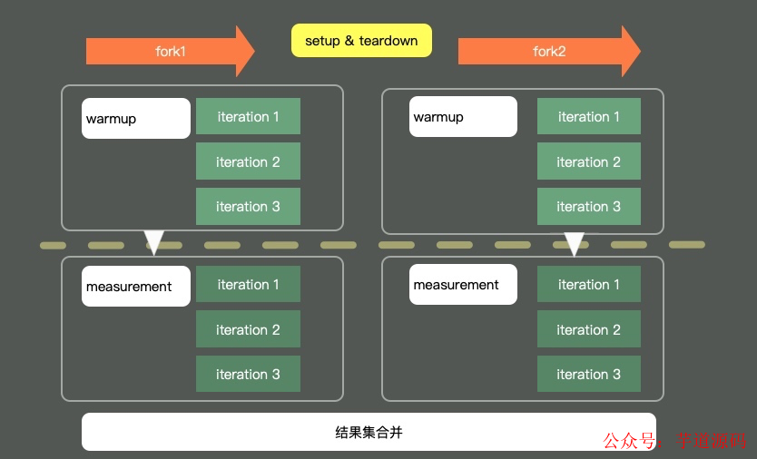
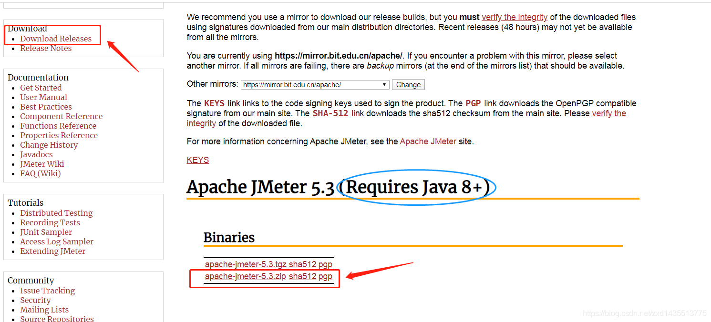
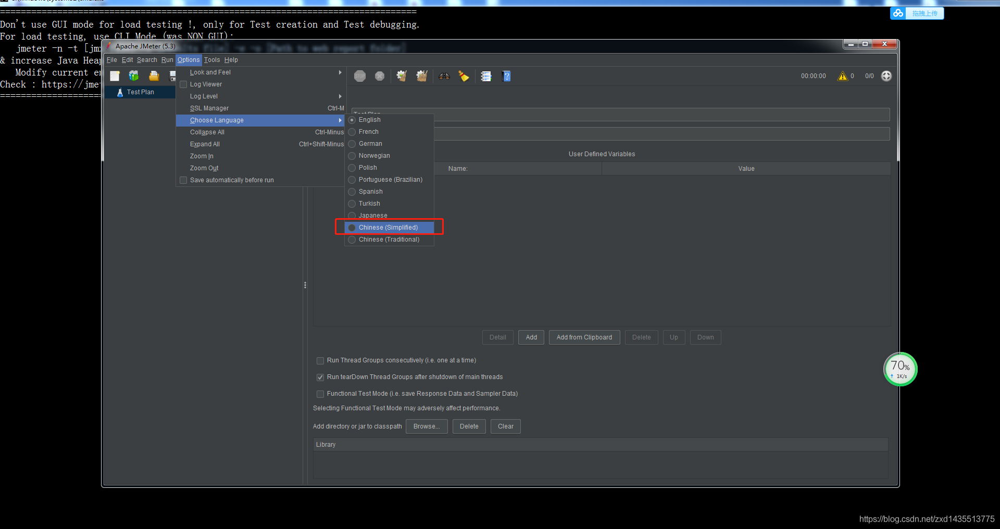
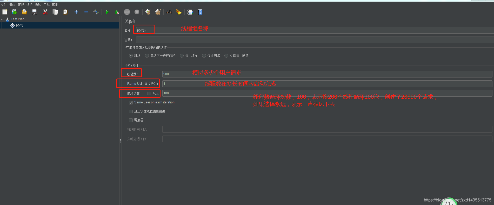
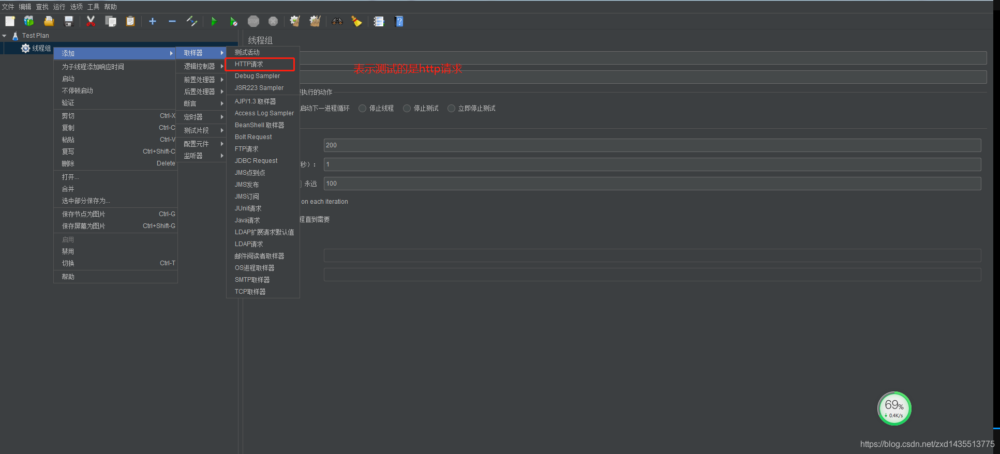
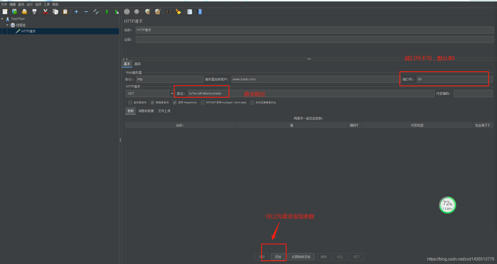
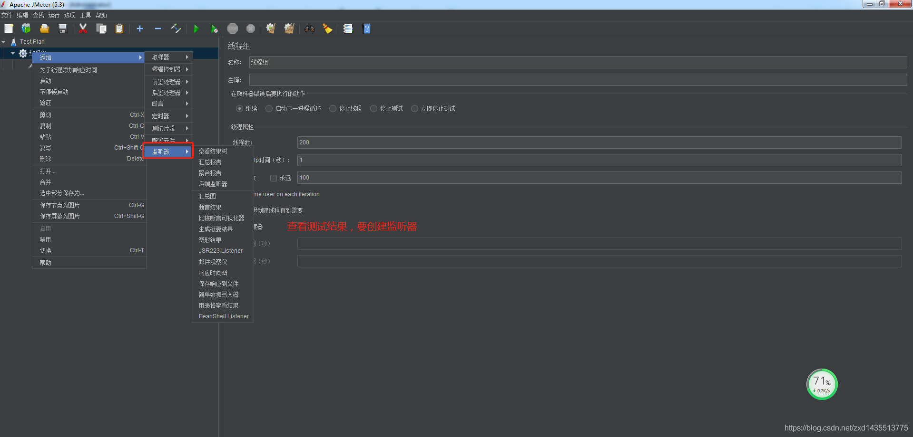
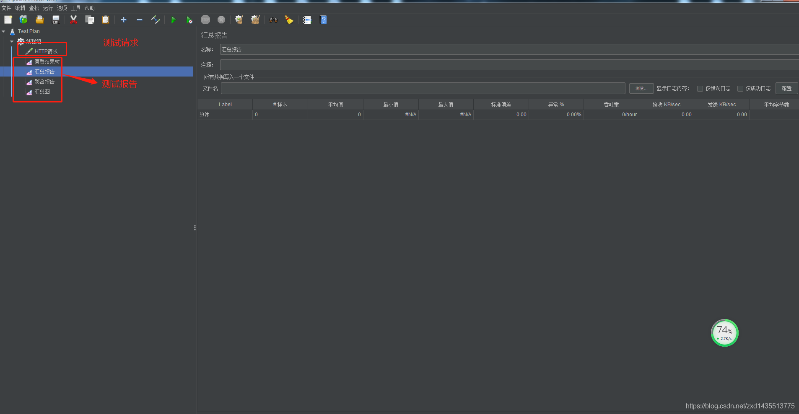
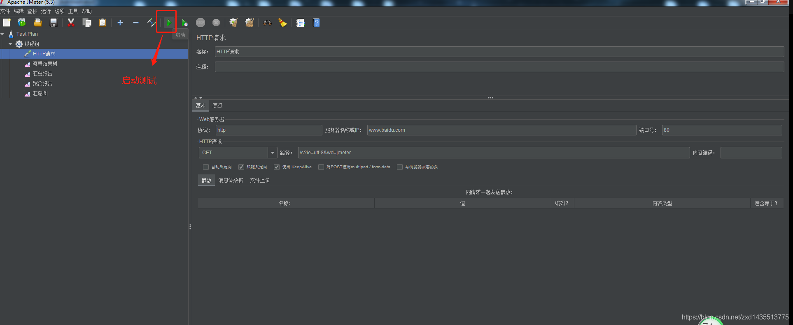

资料来源：<br/>
[ObjectMapper，别再像个二货一样一直new了！](https://mp.weixin.qq.com/s/Ul6P8wwlfnlvePBbc4rhYw)

[使用JMeter进行压力测试](https://blog.csdn.net/zxd1435513775/article/details/106372446)


## JMH

JMH（the Java Microbenchmark Harness）就是这样一个能够做基准测试的工具。

如果你通过我们一系列的工具，定位到了热点代码，要测试它的性能数据，评估改善情况，就可以交给 JMH。它的测量精度非常高，最高可达到纳秒的级别。

JMH 是一个 jar 包，它和单元测试框架 JUnit 非常的像，可以通过注解进行一些基础配置。这部分配置有很多是可以通过 main 方法的 OptionsBuilder 进行设置的。



上图是一个典型的 JMH 程序执行的内容。通过开启多个进程，多个线程，首先执行预热，然后执行迭代，最后汇总所有的测试数据进行分析。在执行前后，还可以根据粒度处理一些前置和后置操作。

### JMH 测试结果

为了测试上面的场景，我们创造了下面的基准测试类。

分为三个测试场景：

- 直接在方法里 new ObjectMapper
- 在全局共享一个 ObjectMapper
- 使用 ThreadLocal，每个线程一个 ObjectMapper

这样的测试属于 CPU 密集型的。我的 CPU 有 10 核，直接就分配了 10 个线程的并发，CPU 在测试期间跑的满满的。

```java
@BenchmarkMode({Mode.Throughput})
@OutputTimeUnit(TimeUnit.SECONDS)
@State(Scope.Thread)
@Warmup(iterations = 5, time = 1, timeUnit = TimeUnit.SECONDS)
@Measurement(iterations = 5, time = 1, timeUnit = TimeUnit.SECONDS)
@Fork(1)
@Threads(10)
public class ObjectMapperTest {
    String json = "{ \"color\" : \"Black\", \"type\" : \"BMW\" }";

    @State(Scope.Benchmark)
    public static class BenchmarkState {
        ObjectMapper GLOBAL_MAP = new ObjectMapper();
        ThreadLocal<ObjectMapper> GLOBAL_MAP_THREAD = new ThreadLocal<>();
    }

    @Benchmark
    public Map globalTest(BenchmarkState state) throws Exception{
        Map map = state.GLOBAL_MAP.readValue(json, Map.class);
        return map;
    }


    @Benchmark
    public Map globalTestThreadLocal(BenchmarkState state) throws Exception{
        if(null == state.GLOBAL_MAP_THREAD.get()){
            state.GLOBAL_MAP_THREAD.set(new ObjectMapper());
        }
        Map map = state.GLOBAL_MAP_THREAD.get().readValue(json, Map.class);
        return map;
    }

    @Benchmark
    public Map localTest() throws Exception{
        ObjectMapper objectMapper = new ObjectMapper();
        Map map = objectMapper.readValue(json, Map.class);
        return map;
    }

    public static void main(String[] args) throws Exception {
        Options opts = new OptionsBuilder()
                .include(ObjectMapperTest.class.getSimpleName())
                .resultFormat(ResultFormatType.CSV)
                .build();

        new Runner(opts).run();
    }
}
```

测试结果如下：

>Benchmark                Mode Cnt     Score     Error Units
>ObjectMapperTest.globalTest       thrpt  5 25125094.559 ± 1754308.010 ops/s
>ObjectMapperTest.globalTestThreadLocal thrpt  5 31780573.549 ± 7779240.155 ops/s
>ObjectMapperTest.localTest       thrpt  5  2131394.345 ± 216974.682 ops/s

从测试结果可以看出，如果我们每次调用都 new 一个 ObjectMapper，每秒可以执行 200 万次 JSON 解析；如果全局使用一个 ObjectMapper，则每秒可以执行 2000 多万次，速度足足快了 10 倍。

如果使用 ThreadLocal 的方式，每个线程给它分配一个解析器，则性能会有少许上升，但也没有达到非常夸张的地步。

所以在项目中写代码的时候，我们只需要保证有一个全局的 ObjectMapper 就可以了。

当然，由于 ObjectMapper 有很多的特性需要配置，你可能会为不同的应用场景分配一个单独使用的 ObjectMapper。总之，它的数量不需要太多，因为它是线程安全的。

## Jmeter

在日常开发中，当完成一个接口开发时，需要对接口进行准确性测试，比如PostMan、Swagger等，但在接口上线运行前对其进行性能测试是很有必要的，就是所谓的接口压力测试。

压力测试就是考察当前软硬件环境下系统所能承受的最大负荷，并借助结果找出系统瓶颈所在。使用压力测试可以找到更难发现的问题，比如：内存泄漏，并发和同步。

有效的压力测试系统将应用一下这些关键条件：重复、并发、量级、随机变化。


### 性能指标
- 响应时间（Response Time : RT）

响应时间指用户从客户端发起一个请求开始，到客户端接收到从服务器端返回的响应结束，整个过程所耗费的时间，下面熟悉一下结果名词：

- HPS（Hits Per Second）：每秒点击次数，单位是次/秒

- TPS（Transaction Per Second）：系统每秒处理交易数，单位是笔/秒

- QPS（Query Per Second）：系统每秒处理查询次数，单位是次/秒

对于互联网业务，某些业务有且仅有一个请求连接，那么TPS=QPS=HPS，一般情况下，用TPS来衡量整个业务流程，用QPS来衡量接口查询次数，用HPS来表示对服务器单击请求。无论TPS、QPS、HPS，此指标是衡量系统处理能力非常重要的指标，越大越好。

一般情况下：

> 金融行业：1000TPS~50000TPS，不包括互联网化的活动<br/>
> 保险行业：100TPS~1000000TPS，不包括互联网化的活动<br/>
> 制造业：10TPS~5000TPS<br/>
> 互联网电子商务：10000TPS~10000000TPS<br/>
> 互联网中型网站：1000TPS~50000TPS<br/>
> 互联网小型网站：500TPS~10000TPS

- 最大响应时间（Max Response Time）：指用户发出请求或者指令到系统做出反应（响应）的最大时间

- 最少响应时间（Mininum Response Time）：指用户发出请求或者指令到系统做出反应（响应）的最少时间

- 90%响应时间（90% Response Time）：是指所有用户的响应时间进行排序，第90%的响应时间。

性能测试主要关注如下三个指标

- 吞吐量：每秒钟系统能够处理的请求数、任务数，该值越大越好
- 响应时间：服务处理一个请求或一个任务的耗时
- 错误率：一批请求中结果出错的请求所占比例
  
###  JMeter安装

> 官网： https://jmeter.apache.org/



需要注意的是：JMeter5.3版本要求Java8以上版本

### 压力测试

将下载的压缩包解压后，进入到`bin`目录中，双击执行` jmeter.bat`，会进入到下面这个页面。

###  切换成中文

选项 > 选择语言 > 中文



### 添加线程组

添加线程组，创建模拟多少个并发用户



### 添加HTTP请求

创建完线程组后，再添加http请求，表示要对哪个接口进行测试





### 添加监听器

为需要压测的http请求添加监听器，用户生成测试结果





### 自动压测



### 查看结果

可以自行查看压测的结果

### JMeter Address Already in use 错误解决

这个问题是`Windows`本身提供的端口访问机制引发的，Windows提供给TCP/IP链接的端口为`1024-5000`，并且要四分钟来循环回收它们，这样会导致我们在较短时间内跑大量的请求时将端口占满了。

解决方法：

`cmd`中，用`regedit`命令打开注册表

在`HKEY_LOCAL_MACHINE\SYSTEM\CurrentControlSet\Tcpip\Parameters`下

> （1）右击parameters，添加一个新的DWORD，名字为MaxUserPort
> （2）然后双击MaxUserPort，输入数值数据为65534，基数选择十进制，
> 如果是分布式运行的话，控制机器和负载机器都需要这样操作

修改配置完毕之后，记得重启机器才会生效
`TCPTimedWaitDelay:30`，表示把端口回收时间从4分钟，改为30秒
