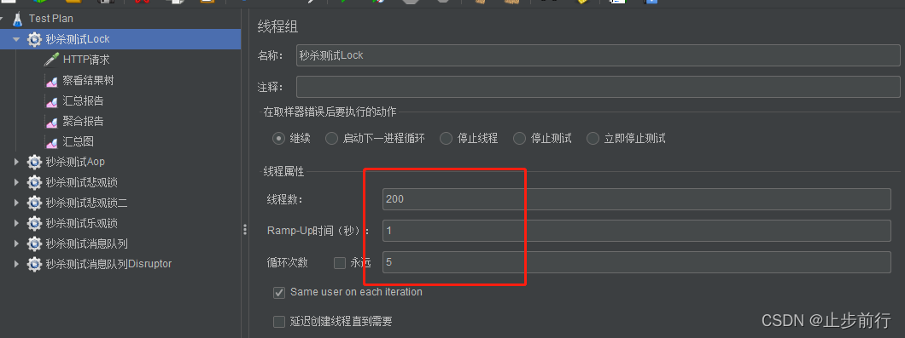
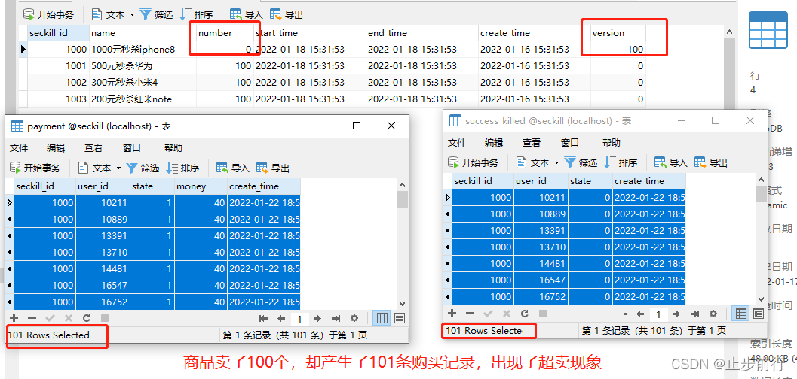
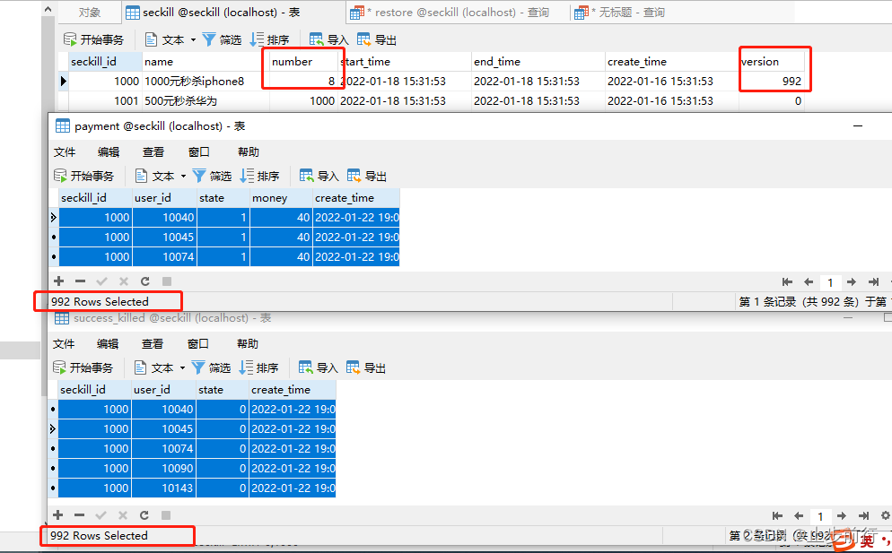
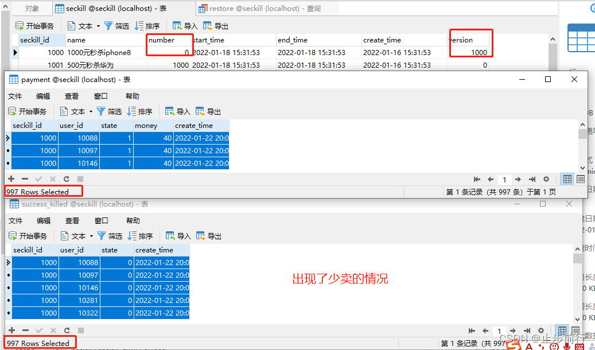

资料来源：<br/>
[大厂防止超卖的7种实现，很受用！](https://mp.weixin.qq.com/s/S11TgAvZQ2bh14FI9LTbzQ)

## 防止超卖


高并发场景在现场的日常工作中很常见，特别是在互联网公司中，这篇文章就来通过秒杀商品来模拟高并发的场景。文章末尾会附上文章的所有代码、脚本和测试用例。

本文环境：SpringBoot 2.5.7 + MySQL 8.0 X + MybatisPlus + Swagger2.9.2

模拟工具：Jmeter

模拟场景：减库存->创建订单->模拟支付


### 商品秒杀-超卖

在开发中，对于下面的代码，可能很熟悉：在`Service`里面加上`@Transactional`事务注解和`Lock`锁

控制层：`Controller`

```java
@ApiOperation(value="秒杀实现方式——Lock加锁")
@PostMapping("/start/lock")
public Result startLock(long skgId){
    try {
        log.info("开始秒杀方式一...");
        final long userId = (int) (new Random().nextDouble() * (99999 - 10000 + 1)) + 10000;
        Result result = secondKillService.startSecondKillByLock(skgId, userId);
        if(result != null){
            log.info("用户:{}--{}", userId, result.get("msg"));
        }else{
            log.info("用户:{}--{}", userId, "哎呦喂，人也太多了，请稍后！");
        }
    } catch (Exception e) {
        e.printStackTrace();
    } finally {

    }
    return Result.ok();
}

```

业务层：`Service`

```java
@Override
@Transactional(rollbackFor = Exception.class)
public Result startSecondKillByLock(long skgId, long userId) {
    lock.lock();
    try {
        // 校验库存
        SecondKill secondKill = secondKillMapper.selectById(skgId);
        Integer number = secondKill.getNumber();
        if (number > 0) {
            // 扣库存
            secondKill.setNumber(number - 1);
            secondKillMapper.updateById(secondKill);
            // 创建订单
            SuccessKilled killed = new SuccessKilled();
            killed.setSeckillId(skgId);
            killed.setUserId(userId);
            killed.setState((short) 0);
            killed.setCreateTime(new Timestamp(System.currentTimeMillis()));
            successKilledMapper.insert(killed);

            // 模拟支付
            Payment payment = new Payment();
            payment.setSeckillId(skgId);
            payment.setSeckillId(skgId);
            payment.setUserId(userId);
            payment.setMoney(40);
            payment.setState((short) 1);
            payment.setCreateTime(new Timestamp(System.currentTimeMillis()));
            paymentMapper.insert(payment);
        } else {
            return Result.error(SecondKillStateEnum.END);
        }
    } catch (Exception e) {
        throw new ScorpiosException("异常了个乖乖");
    } finally {
        lock.unlock();
    }
    return Result.ok(SecondKillStateEnum.SUCCESS);
}

```

对于上面的代码应该没啥问题吧，业务方法上加事务，在处理业务的时候加锁。

但上面这样写法是有问题的，会出现超卖的情况，看下测试结果：模拟`1000`个并发，抢`100`商品





这里在业务方法开始加了锁，在业务方法结束后释放了锁。但这里的事务提交却不是这样的，有可能在事务提交之前，就已经把锁释放了，这样会导致商品超卖现象。所以加锁的时机很重要！

###  解决商品超卖

对于上面超卖现象，主要问题出现在事务中锁释放的时机，事务未提交之前，锁已经释放。（事务提交是在整个方法执行完）。如何解决这个问题呢，就是把加锁步骤提前

- 可以在`controller`层进行加锁
- 可以使用`Aop`在业务方法执行之前进行加锁

####  方式一（改进版加锁）

~~~~java
@ApiOperation(value="秒杀实现方式——Lock加锁")
@PostMapping("/start/lock")
public Result startLock(long skgId){
    // 在此处加锁
    lock.lock();
    try {
        log.info("开始秒杀方式一...");
        final long userId = (int) (new Random().nextDouble() * (99999 - 10000 + 1)) + 10000;
        Result result = secondKillService.startSecondKillByLock(skgId, userId);
        if(result != null){
            log.info("用户:{}--{}", userId, result.get("msg"));
        }else{
            log.info("用户:{}--{}", userId, "哎呦喂，人也太多了，请稍后！");
        }
    } catch (Exception e) {
        e.printStackTrace();
    } finally {
        // 在此处释放锁
        lock.unlock();
    }
    return Result.ok();
}

~~~~

上面这样的加锁就可以解决事务未提交之前，锁释放的问题，可以分三种情况进行压力测试：

并发数1000，商品100
并发数1000，商品1000
并发数2000，商品1000
对于并发量大于商品数的情况，商品秒杀一般不会出现少卖的请况，但对于并发数小于等于商品数的时候可能会出现商品少卖情况，这也很好理解。




#### 方式二（AOP版加锁）

对于上面在控制层进行加锁的方式，可能显得不优雅，那就还有另一种方式进行在事务之前加锁，那就是`AOP`

自定义`AOP`注解

```java
@Target({ElementType.PARAMETER, ElementType.METHOD})
@Retention(RetentionPolicy.RUNTIME)
@Documented
public  @interface ServiceLock {
    String description()  default "";
}
```

定义切面类

```java
@Slf4j
@Component
@Scope
@Aspect
@Order(1) //order越小越是最先执行，但更重要的是最先执行的最后结束
public class LockAspect {
    /**
     * 思考：为什么不用synchronized
     * service 默认是单例的，并发下lock只有一个实例
     */
    private static  Lock lock = new ReentrantLock(true); // 互斥锁 参数默认false，不公平锁

    // Service层切点     用于记录错误日志
    @Pointcut("@annotation(com.scorpios.secondkill.aop.ServiceLock)")
    public void lockAspect() {

    }

    @Around("lockAspect()")
    public  Object around(ProceedingJoinPoint joinPoint) {
        lock.lock();
        Object obj = null;
        try {
            obj = joinPoint.proceed();
        } catch (Throwable e) {
            e.printStackTrace();
			throw new RuntimeException();
        } finally{
            lock.unlock();
        }
        return obj;
    }
}
```

在业务方法上添加`AOP`注解

```java
@Override
@ServiceLock // 使用Aop进行加锁
@Transactional(rollbackFor = Exception.class)
public Result startSecondKillByAop(long skgId, long userId) {

    try {
        // 校验库存
        SecondKill secondKill = secondKillMapper.selectById(skgId);
        Integer number = secondKill.getNumber();
        if (number > 0) {
            //扣库存
            secondKill.setNumber(number - 1);
            secondKillMapper.updateById(secondKill);
            //创建订单
            SuccessKilled killed = new SuccessKilled();
            killed.setSeckillId(skgId);
            killed.setUserId(userId);
            killed.setState((short) 0);
            killed.setCreateTime(new Timestamp(System.currentTimeMillis()));
            successKilledMapper.insert(killed);

            //支付
            Payment payment = new Payment();
            payment.setSeckillId(skgId);
            payment.setSeckillId(skgId);
            payment.setUserId(userId);
            payment.setMoney(40);
            payment.setState((short) 1);
            payment.setCreateTime(new Timestamp(System.currentTimeMillis()));
            paymentMapper.insert(payment);
        } else {
            return Result.error(SecondKillStateEnum.END);
        }
    } catch (Exception e) {
        throw new ScorpiosException("异常了个乖乖");
    }
    return Result.ok(SecondKillStateEnum.SUCCESS);
}

```

控制层：

```java
@ApiOperation(value="秒杀实现方式二——Aop加锁")
@PostMapping("/start/aop")
public Result startAop(long skgId){
    try {
        log.info("开始秒杀方式二...");
        final long userId = (int) (new Random().nextDouble() * (99999 - 10000 + 1)) + 10000;
        Result result = secondKillService.startSecondKillByAop(skgId, userId);
        if(result != null){
            log.info("用户:{}--{}", userId, result.get("msg"));
        }else{
            log.info("用户:{}--{}", userId, "哎呦喂，人也太多了，请稍后！");
        }
    } catch (Exception e) {
        e.printStackTrace();
    }
    return Result.ok();
}

```

这种方式在对锁的使用上，更高阶、更美观！

#### 方式三(悲观锁)

除了上面在业务代码层面加锁外，还可以使用数据库自带的锁进行并发控制。

悲观锁，什么是悲观锁呢？通俗的说，在做任何事情之前，都要进行加锁确认。这种数据库级加锁操作效率较低。

使用for update一定要加上事务，当事务处理完后，for update才会将行级锁解除

如果请求数和秒杀商品数量一致，会出现少卖

```java
@ApiOperation(value="秒杀实现方式三——悲观锁")
@PostMapping("/start/pes/lock/one")
public Result startPesLockOne(long skgId){
    try {
        log.info("开始秒杀方式三...");
        final long userId = (int) (new Random().nextDouble() * (99999 - 10000 + 1)) + 10000;
        Result result = secondKillService.startSecondKillByUpdate(skgId, userId);
        if(result != null){
            log.info("用户:{}--{}", userId, result.get("msg"));
        }else{
            log.info("用户:{}--{}", userId, "哎呦喂，人也太多了，请稍后！");
        }
    } catch (Exception e) {
        e.printStackTrace();
    }
    return Result.ok();
}
```

业务逻辑

```java
@Override
@Transactional(rollbackFor = Exception.class)
public Result startSecondKillByUpdate(long skgId, long userId) {
    try {
        // 校验库存-悲观锁
        SecondKill secondKill = secondKillMapper.querySecondKillForUpdate(skgId);
        Integer number = secondKill.getNumber();
        if (number > 0) {
            //扣库存
            secondKill.setNumber(number - 1);
            secondKillMapper.updateById(secondKill);
            //创建订单
            SuccessKilled killed = new SuccessKilled();
            killed.setSeckillId(skgId);
            killed.setUserId(userId);
            killed.setState((short) 0);
            killed.setCreateTime(new Timestamp(System.currentTimeMillis()));
            successKilledMapper.insert(killed);

            //支付
            Payment payment = new Payment();
            payment.setSeckillId(skgId);
            payment.setSeckillId(skgId);
            payment.setUserId(userId);
            payment.setMoney(40);
            payment.setState((short) 1);
            payment.setCreateTime(new Timestamp(System.currentTimeMillis()));
            paymentMapper.insert(payment);
        } else {
            return Result.error(SecondKillStateEnum.END);
        }
    } catch (Exception e) {
        throw new ScorpiosException("异常了个乖乖");
    } finally {
    }
    return Result.ok(SecondKillStateEnum.SUCCESS);
}
```

Dao层

```java
@Repository
public interface SecondKillMapper extends BaseMapper<SecondKill> {

    /**
     * 将此行数据进行加锁，当整个方法将事务提交后，才会解锁
     * @param skgId
     * @return
     */
    @Select(value = "SELECT * FROM seckill WHERE seckill_id=#{skgId} FOR UPDATE")
    SecondKill querySecondKillForUpdate(@Param("skgId") Long skgId);

}
```

上面是利用`for update`进行对查询数据加锁，加的是行锁

####  方式四（悲观锁二）

悲观锁的第二种方式就是利用`update`更新命令来加表锁

```java
/**
 * UPDATE锁表
 * @param skgId  商品id
 * @param userId    用户id
 * @return
 */
@Override
@Transactional(rollbackFor = Exception.class)
public Result startSecondKillByUpdateTwo(long skgId, long userId) {
    try {

        // 不校验，直接扣库存更新
        int result = secondKillMapper.updateSecondKillById(skgId);
        if (result > 0) {
            //创建订单
            SuccessKilled killed = new SuccessKilled();
            killed.setSeckillId(skgId);
            killed.setUserId(userId);
            killed.setState((short) 0);
            killed.setCreateTime(new Timestamp(System.currentTimeMillis()));
            successKilledMapper.insert(killed);

            //支付
            Payment payment = new Payment();
            payment.setSeckillId(skgId);
            payment.setSeckillId(skgId);
            payment.setUserId(userId);
            payment.setMoney(40);
            payment.setState((short) 1);
            payment.setCreateTime(new Timestamp(System.currentTimeMillis()));
            paymentMapper.insert(payment);
        } else {
            return Result.error(SecondKillStateEnum.END);
        }
    } catch (Exception e) {
        throw new ScorpiosException("异常了个乖乖");
    } finally {
    }
    return Result.ok(SecondKillStateEnum.SUCCESS);
}

```

Dao层

```java
@Repository
public interface SecondKillMapper extends BaseMapper<SecondKill> {

    /**
     * 将此行数据进行加锁，当整个方法将事务提交后，才会解锁
     * @param skgId
     * @return
     */
    @Select(value = "SELECT * FROM seckill WHERE seckill_id=#{skgId} FOR UPDATE")
    SecondKill querySecondKillForUpdate(@Param("skgId") Long skgId);

    @Update(value = "UPDATE seckill SET number=number-1 WHERE seckill_id=#{skgId} AND number > 0")
    int updateSecondKillById(@Param("skgId") long skgId);
}

```

#### 方式五（乐观锁)

乐观锁，顾名思义，就是对操作结果很乐观，通过利用version字段来判断数据是否被修改

乐观锁，不进行库存数量的校验，直接做库存扣减

> 这里使用的乐观锁会出现大量的数据更新异常（抛异常就会导致购买失败）、如果配置的抢购人数比较少、比如120:100(人数:商品) 会出现少买的情况，不推荐使用乐观锁。

```java
@ApiOperation(value="秒杀实现方式五——乐观锁")
@PostMapping("/start/opt/lock")
public Result startOptLock(long skgId){
    try {
        log.info("开始秒杀方式五...");
        final long userId = (int) (new Random().nextDouble() * (99999 - 10000 + 1)) + 10000;
        // 参数添加了购买数量
        Result result = secondKillService.startSecondKillByPesLock(skgId, userId,1);
        if(result != null){
            log.info("用户:{}--{}", userId, result.get("msg"));
        }else{
            log.info("用户:{}--{}", userId, "哎呦喂，人也太多了，请稍后！");
        }
    } catch (Exception e) {
        e.printStackTrace();
    }
    return Result.ok();
}

```

```java
@Override
@Transactional(rollbackFor = Exception.class)
public Result startSecondKillByPesLock(long skgId, long userId, int number) {

    // 乐观锁，不进行库存数量的校验，直接
    try {
        SecondKill kill = secondKillMapper.selectById(skgId);
        // 剩余的数量应该要大于等于秒杀的数量
        if(kill.getNumber() >= number) {
            int result = secondKillMapper.updateSecondKillByVersion(number,skgId,kill.getVersion());
            if (result > 0) {
                //创建订单
                SuccessKilled killed = new SuccessKilled();
                killed.setSeckillId(skgId);
                killed.setUserId(userId);
                killed.setState((short) 0);
                killed.setCreateTime(new Timestamp(System.currentTimeMillis()));
                successKilledMapper.insert(killed);

                //支付
                Payment payment = new Payment();
                payment.setSeckillId(skgId);
                payment.setSeckillId(skgId);
                payment.setUserId(userId);
                payment.setMoney(40);
                payment.setState((short) 1);
                payment.setCreateTime(new Timestamp(System.currentTimeMillis()));
                paymentMapper.insert(payment);
            } else {
                return Result.error(SecondKillStateEnum.END);
            }
        }
    } catch (Exception e) {
        throw new ScorpiosException("异常了个乖乖");
    } finally {
    }
    return Result.ok(SecondKillStateEnum.SUCCESS);
}
```

```java
@Repository
public interface SecondKillMapper extends BaseMapper<SecondKill> {

    /**
     * 将此行数据进行加锁，当整个方法将事务提交后，才会解锁
     * @param skgId
     * @return
     */
    @Select(value = "SELECT * FROM seckill WHERE seckill_id=#{skgId} FOR UPDATE")
    SecondKill querySecondKillForUpdate(@Param("skgId") Long skgId);

    @Update(value = "UPDATE seckill SET number=number-1 WHERE seckill_id=#{skgId} AND number > 0")
    int updateSecondKillById(@Param("skgId") long skgId);

    @Update(value = "UPDATE seckill  SET number=number-#{number},version=version+1 WHERE seckill_id=#{skgId} AND version = #{version}")
    int updateSecondKillByVersion(@Param("number") int number, @Param("skgId") long skgId, @Param("version")int version);
}
```

乐观锁会出现大量的数据更新异常（抛异常就会导致购买失败），会出现少买的情况，不推荐使用乐观锁

#### 方式六（阻塞队列）

利用阻塞队类，也可以解决高并发问题。其思想就是把接收到的请求按顺序存放到队列中，消费者线程逐一从队列里取数据进行处理，看下具体代码。

阻塞队列：这里使用静态内部类的方式来实现单例模式，在并发条件下不会出现问题。

```java
// 秒杀队列(固定长度为100)
public class SecondKillQueue {

    // 队列大小
    static final int QUEUE_MAX_SIZE = 100;

    // 用于多线程间下单的队列
    static BlockingQueue<SuccessKilled> blockingQueue = new LinkedBlockingQueue<SuccessKilled>(QUEUE_MAX_SIZE);

    // 使用静态内部类，实现单例模式
    private SecondKillQueue(){};

    private static class SingletonHolder{
        // 静态初始化器，由JVM来保证线程安全
        private  static SecondKillQueue queue = new SecondKillQueue();
    }

    /**
     * 单例队列
     * @return
     */
    public static SecondKillQueue getSkillQueue(){
        return SingletonHolder.queue;
    }

    /**
     * 生产入队
     * @param kill
     * @throws InterruptedException
     * add(e) 队列未满时，返回true；队列满则抛出IllegalStateException(“Queue full”)异常——AbstractQueue
     * put(e) 队列未满时，直接插入没有返回值；队列满时会阻塞等待，一直等到队列未满时再插入。
     * offer(e) 队列未满时，返回true；队列满时返回false。非阻塞立即返回。
     * offer(e, time, unit) 设定等待的时间，如果在指定时间内还不能往队列中插入数据则返回false，插入成功返回true。
     */
    public  Boolean  produce(SuccessKilled kill) {
        return blockingQueue.offer(kill);
    }
    /**
     * 消费出队
     * poll() 获取并移除队首元素，在指定的时间内去轮询队列看有没有首元素有则返回，否者超时后返回null
     * take() 与带超时时间的poll类似不同在于take时候如果当前队列空了它会一直等待其他线程调用notEmpty.signal()才会被唤醒
     */
    public  SuccessKilled consume() throws InterruptedException {
        return blockingQueue.take();
    }

    /**
     * 获取队列大小
     * @return
     */
    public int size() {
        return blockingQueue.size();
    }
}
```

消费秒杀队列：实现`ApplicationRunner`接口

```java
// 消费秒杀队列
@Slf4j
@Component
public class TaskRunner implements ApplicationRunner{

    @Autowired
    private SecondKillService seckillService;

    @Override
    public void run(ApplicationArguments var){
        new Thread(() -> {
            log.info("队列启动成功");
            while(true){
                try {
                    // 进程内队列
                    SuccessKilled kill = SecondKillQueue.getSkillQueue().consume();
                    if(kill != null){
                        Result result = seckillService.startSecondKillByAop(kill.getSeckillId(), kill.getUserId());
                        if(result != null && result.equals(Result.ok(SecondKillStateEnum.SUCCESS))){
                            log.info("TaskRunner,result:{}",result);
                            log.info("TaskRunner从消息队列取出用户，用户:{}{}",kill.getUserId(),"秒杀成功");
                        }
                    }
                } catch (InterruptedException e) {
                    e.printStackTrace();
                }
            }
        }).start();
    }
}

```

```java
@ApiOperation(value="秒杀实现方式六——消息队列")
@PostMapping("/start/queue")
public Result startQueue(long skgId){
    try {
        log.info("开始秒杀方式六...");
        final long userId = (int) (new Random().nextDouble() * (99999 - 10000 + 1)) + 10000;
        SuccessKilled kill = new SuccessKilled();
        kill.setSeckillId(skgId);
        kill.setUserId(userId);
        Boolean flag = SecondKillQueue.getSkillQueue().produce(kill);
        // 虽然进入了队列，但是不一定能秒杀成功 进队出队有时间间隙
        if(flag){
            log.info("用户:{}{}",kill.getUserId(),"秒杀成功");
        }else{
            log.info("用户:{}{}",userId,"秒杀失败");
        }
    } catch (Exception e) {
        e.printStackTrace();
    }
    return Result.ok();
}

```

注意：在业务层和AOP方法中，不能抛出任何异常， throw new RuntimeException()这些抛异常代码要注释掉。因为一旦程序抛出异常就会停止，导致消费秒杀队列进程终止！

使用阻塞队列来实现秒杀，有几点要注意：

消费秒杀队列中调用业务方法加锁与不加锁情况一样，也就是seckillService.startSecondKillByAop()、seckillService.startSecondKillByLock()方法结果一样，这也很好理解
当队列长度与商品数量一致时，会出现少卖的现象，可以调大数值
下面是队列长度1000，商品数量1000，并发数2000情况下出现的少卖



#### 方式七（Disruptor队列）

`Disruptor`是个高性能队列，研发的初衷是解决内存队列的延迟问题，在性能测试中发现竟然与`I/O`操作处于同样的数量级，基于`Disruptor`开发的系统单线程能支撑每秒`600`万订单。

```java
// 事件生成工厂（用来初始化预分配事件对象）
public class SecondKillEventFactory implements EventFactory<SecondKillEvent> {

    @Override
    public SecondKillEvent newInstance() {
        return new SecondKillEvent();
    }
}
```

```java
// 事件对象（秒杀事件）
public class SecondKillEvent implements Serializable {
    private static final long serialVersionUID = 1L;
    private long seckillId;
    private long userId;

	// set/get方法略

}
```

```java
// 使用translator方式生产者
public class SecondKillEventProducer {

    private final static EventTranslatorVararg<SecondKillEvent> translator = (seckillEvent, seq, objs) -> {
        seckillEvent.setSeckillId((Long) objs[0]);
        seckillEvent.setUserId((Long) objs[1]);
    };

    private final RingBuffer<SecondKillEvent> ringBuffer;

    public SecondKillEventProducer(RingBuffer<SecondKillEvent> ringBuffer){
        this.ringBuffer = ringBuffer;
    }

    public void secondKill(long seckillId, long userId){
        this.ringBuffer.publishEvent(translator, seckillId, userId);
    }
}
```

```java
// 消费者(秒杀处理器)
@Slf4j
public class SecondKillEventConsumer implements EventHandler<SecondKillEvent> {


    private SecondKillService secondKillService = (SecondKillService) SpringUtil.getBean("secondKillService");

    @Override
    public void onEvent(SecondKillEvent seckillEvent, long seq, boolean bool) {
        Result result = secondKillService.startSecondKillByAop(seckillEvent.getSeckillId(), seckillEvent.getUserId());
        if(result.equals(Result.ok(SecondKillStateEnum.SUCCESS))){
            log.info("用户:{}{}",seckillEvent.getUserId(),"秒杀成功");
        }
    }
}

```

```java
public class DisruptorUtil {

    static Disruptor<SecondKillEvent> disruptor;

    static{
        SecondKillEventFactory factory = new SecondKillEventFactory();
        int ringBufferSize = 1024;
        ThreadFactory threadFactory = runnable -> new Thread(runnable);
        disruptor = new Disruptor<>(factory, ringBufferSize, threadFactory);
        disruptor.handleEventsWith(new SecondKillEventConsumer());
        disruptor.start();
    }

    public static void producer(SecondKillEvent kill){
        RingBuffer<SecondKillEvent> ringBuffer = disruptor.getRingBuffer();
        SecondKillEventProducer producer = new SecondKillEventProducer(ringBuffer);
        producer.secondKill(kill.getSeckillId(),kill.getUserId());
    }
}
```

```java
@ApiOperation(value="秒杀实现方式七——Disruptor队列")
@PostMapping("/start/disruptor")
public Result startDisruptor(long skgId){
    try {
        log.info("开始秒杀方式七...");
        final long userId = (int) (new Random().nextDouble() * (99999 - 10000 + 1)) + 10000;
        SecondKillEvent kill = new SecondKillEvent();
        kill.setSeckillId(skgId);
        kill.setUserId(userId);
        DisruptorUtil.producer(kill);
    } catch (Exception e) {
        e.printStackTrace();
    }
    return Result.ok();
}
```

经过测试，发现使用`Disruptor`队列队列，与自定义队列有着同样的问题，也会出现超卖的情况，但效率有所提高。

### 总结

对于上面七种实现并发的方式，做一下总结：

一、二方式是在代码中利用锁和事务的方式解决了并发问题，主要解决的是锁要加载事务之前
三、四、五方式主要是数据库的锁来解决并发问题，方式三是利用for upate对表加行锁，方式四是利用update来对表加锁，方式五是通过增加version字段来控制数据库的更新操作，方式五的效果最差
六、七方式是通过队列来解决并发问题，这里需要特别注意的是，在代码中不能通过throw抛异常，否则消费线程会终止，而且由于进队和出队存在时间间隙，会导致商品少卖
上面所有的情况都经过代码测试，测试分一下三种情况：

并发数1000，商品数100
并发数1000，商品数1000
并发数2000，商品数1000
思考：分布式情况下如何解决并发问题呢？下次继续试验。

源码地址：https://github.com/Hofanking/springboot-second-skill-example
