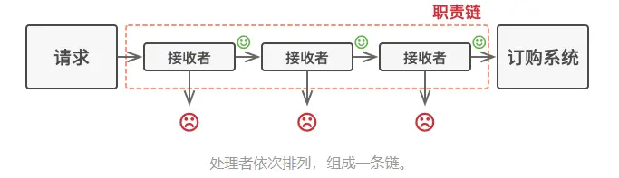
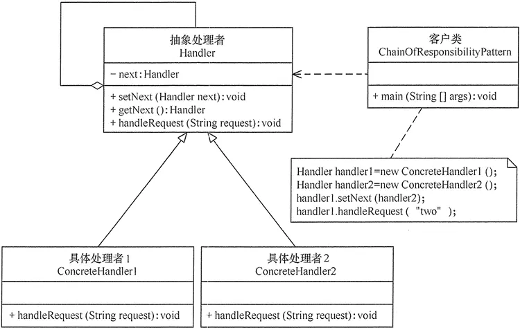
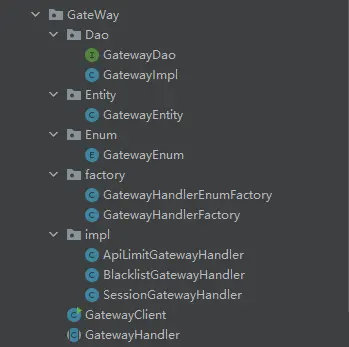

资料来源:<br/>
[代码精简10倍，责任链模式yyds](https://mp.weixin.qq.com/s/-bmjGnmFsS5_8_WyppeqEA)


## 责任链模式

### 什么是责任链模式

**介绍**

责任链模式是一种行为设计模式， 允许你将请求沿着处理者链进行发送。收到请求后， 每个处理者均可对请求进行处理， 或将其传递给链上的下个处理者。



**使用场景**

责任链的使用场景还是比较多的：

- 多条件流程判断：权限控制
- ERP 系统流程审批：总经理、人事经理、项目经理
- Java 过滤器的底层实现 Filter

如果不使用该设计模式，那么当需求有所改变时，就会使得代码臃肿或者难以维护，例如下面的例子。

### 反例

假设现在有一个闯关游戏，进入下一关的条件是上一关的分数要高于 xx：

- 游戏一共 3 个关卡
- 进入第二关需要第一关的游戏得分大于等于 80
- 进入第三关需要第二关的游戏得分大于等于 90

那么代码可以这样写：

```java
//第一关
public class FirstPassHandler {
    public int handler(){
        System.out.println("第一关-->FirstPassHandler");
        return 80;
    }
}

//第二关
public class SecondPassHandler {
    public int handler(){
        System.out.println("第二关-->SecondPassHandler");
        return 90;
    }
}


//第三关
public class ThirdPassHandler {
    public int handler(){
        System.out.println("第三关-->ThirdPassHandler，这是最后一关啦");
        return 95;
    }
}


//客户端
public class HandlerClient {
    public static void main(String[] args) {

        FirstPassHandler firstPassHandler = new FirstPassHandler();//第一关
        SecondPassHandler secondPassHandler = new SecondPassHandler();//第二关
        ThirdPassHandler thirdPassHandler = new ThirdPassHandler();//第三关

        int firstScore = firstPassHandler.handler();
        //第一关的分数大于等于80则进入第二关
        if(firstScore >= 80){
            int secondScore = secondPassHandler.handler();
            //第二关的分数大于等于90则进入第二关
            if(secondScore >= 90){
                thirdPassHandler.handler();
            }
        }
    }
}
```

那么如果这个游戏有 100 关，我们的代码很可能就会写成这个样子：

```java
if(第1关通过){
    // 第2关 游戏
    if(第2关通过){
        // 第3关 游戏
        if(第3关通过){
           // 第4关 游戏
            if(第4关通过){
                // 第5关 游戏
                if(第5关通过){
                    // 第6关 游戏
                    if(第6关通过){
                        //...
                    }
                }
            } 
        }
    }
}
```

这种代码不仅冗余，并且当我们要将某两关进行调整时会对代码非常大的改动，这种操作的风险是很高的，因此，该写法非常糟糕。

### 责任链

既然每个关卡中都有下一关的成员变量并且是不一样的，那么我们可以在关卡上抽象出一个父类或者接口，然后每个具体的关卡去继承或者实现。

有了思路，我们先来简单介绍一下责任链设计模式的基本组成：

- **抽象处理者（Handler）角色：** 定义一个处理请求的接口，包含抽象处理方法和一个后继连接。
- **具体处理者（Concrete Handler）角色：** 实现抽象处理者的处理方法，判断能否处理本次请求，如果可以处理请求则处理，否则将该请求转给它的后继者。
- **客户类（Client）角色：** 创建处理链，并向链头的具体处理者对象提交请求，它不关心处理细节和请求的传递过程。



```java
public abstract class AbstractHandler {

    /**
     * 下一关用当前抽象类来接收
     */
    protected AbstractHandler next;

    public void setNext(AbstractHandler next) {
        this.next = next;
    }

    public abstract int handler();
}

public class FirstPassHandler extends AbstractHandler{

    private int play(){
        return 80;
    }

    @Override
    public int handler(){
        System.out.println("第一关-->FirstPassHandler");
        int score = play();
        if(score >= 80){
            //分数>=80 并且存在下一关才进入下一关
            if(this.next != null){
                return this.next.handler();
            }
        }
        return score;
    }
}

public class SecondPassHandler extends AbstractHandler{

    private int play(){
        return 90;
    }

    public int handler(){
        System.out.println("第二关-->SecondPassHandler");

        int score = play();
        if(score >= 90){
            //分数>=90 并且存在下一关才进入下一关
            if(this.next != null){
                return this.next.handler();
            }
        }

        return score;
    }
}

public class ThirdPassHandler extends AbstractHandler{

    private int play(){
        return 95;
    }

    public int handler(){
        System.out.println("第三关-->ThirdPassHandler");
        int score = play();
        if(score >= 95){
            //分数>=95 并且存在下一关才进入下一关
            if(this.next != null){
                return this.next.handler();
            }
        }
        return score;
    }
}

public class HandlerClient {
    public static void main(String[] args) {

        FirstPassHandler firstPassHandler = new FirstPassHandler();//第一关
        SecondPassHandler secondPassHandler = new SecondPassHandler();//第二关
        ThirdPassHandler thirdPassHandler = new ThirdPassHandler();//第三关

        // 和上面没有更改的客户端代码相比，只有这里的set方法发生变化，其他都是一样的
        firstPassHandler.setNext(secondPassHandler);//第一关的下一关是第二关
        secondPassHandler.setNext(thirdPassHandler);//第二关的下一关是第三关

        //说明：因为第三关是最后一关，因此没有下一关

        //从第一个关卡开始
        firstPassHandler.handler();

    }
}
```

**责任链改造**

对于上面的请求链，我们也可以把这个关系维护到配置文件中或者一个枚举中。我将使用枚举来教会大家怎么动态的配置请求链并且将每个请求者形成一条调用链。



```java
public enum GatewayEnum {
    // handlerId, 拦截者名称，全限定类名，preHandlerId，nextHandlerId
    API_HANDLER(new GatewayEntity(1, "api接口限流", "cn.dgut.design.chain_of_responsibility.GateWay.impl.ApiLimitGatewayHandler", null, 2)),
    BLACKLIST_HANDLER(new GatewayEntity(2, "黑名单拦截", "cn.dgut.design.chain_of_responsibility.GateWay.impl.BlacklistGatewayHandler", 1, 3)),
    SESSION_HANDLER(new GatewayEntity(3, "用户会话拦截", "cn.dgut.design.chain_of_responsibility.GateWay.impl.SessionGatewayHandler", 2, null)),
    ;

    GatewayEntity gatewayEntity;

    public GatewayEntity getGatewayEntity() {
        return gatewayEntity;
    }

    GatewayEnum(GatewayEntity gatewayEntity) {
        this.gatewayEntity = gatewayEntity;
    }
}

public class GatewayEntity {

    private String name;

    private String conference;

    private Integer handlerId;

    private Integer preHandlerId;

    private Integer nextHandlerId;
}


public interface GatewayDao {

    /**
     * 根据 handlerId 获取配置项
     * @param handlerId
     * @return
     */
    GatewayEntity getGatewayEntity(Integer handlerId);

    /**
     * 获取第一个处理者
     * @return
     */
    GatewayEntity getFirstGatewayEntity();
}

public class GatewayImpl implements GatewayDao {

    /**
     * 初始化，将枚举中配置的handler初始化到map中，方便获取
     */
    private static Map<Integer, GatewayEntity> gatewayEntityMap = new HashMap<>();

    static {
        GatewayEnum[] values = GatewayEnum.values();
        for (GatewayEnum value : values) {
            GatewayEntity gatewayEntity = value.getGatewayEntity();
            gatewayEntityMap.put(gatewayEntity.getHandlerId(), gatewayEntity);
        }
    }

    @Override
    public GatewayEntity getGatewayEntity(Integer handlerId) {
        return gatewayEntityMap.get(handlerId);
    }

    @Override
    public GatewayEntity getFirstGatewayEntity() {
        for (Map.Entry<Integer, GatewayEntity> entry : gatewayEntityMap.entrySet()) {
            GatewayEntity value = entry.getValue();
            //  没有上一个handler的就是第一个
            if (value.getPreHandlerId() == null) {
                return value;
            }
        }
        return null;
    }
}

public class GatewayHandlerEnumFactory {

    private static GatewayDao gatewayDao = new GatewayImpl();

    // 提供静态方法，获取第一个handler
    public static GatewayHandler getFirstGatewayHandler() {

        GatewayEntity firstGatewayEntity = gatewayDao.getFirstGatewayEntity();
        GatewayHandler firstGatewayHandler = newGatewayHandler(firstGatewayEntity);
        if (firstGatewayHandler == null) {
            return null;
        }

        GatewayEntity tempGatewayEntity = firstGatewayEntity;
        Integer nextHandlerId = null;
        GatewayHandler tempGatewayHandler = firstGatewayHandler;
        // 迭代遍历所有handler，以及将它们链接起来
        while ((nextHandlerId = tempGatewayEntity.getNextHandlerId()) != null) {
            GatewayEntity gatewayEntity = gatewayDao.getGatewayEntity(nextHandlerId);
            GatewayHandler gatewayHandler = newGatewayHandler(gatewayEntity);
            tempGatewayHandler.setNext(gatewayHandler);
            tempGatewayHandler = gatewayHandler;
            tempGatewayEntity = gatewayEntity;
        }
    // 返回第一个handler
        return firstGatewayHandler;
    }

    /**
     * 反射实体化具体的处理者
     * @param firstGatewayEntity
     * @return
     */
    private static GatewayHandler newGatewayHandler(GatewayEntity firstGatewayEntity) {
        // 获取全限定类名
        String className = firstGatewayEntity.getConference(); 
        try {
            // 根据全限定类名，加载并初始化该类，即会初始化该类的静态段
            Class<?> clazz = Class.forName(className);
            return (GatewayHandler) clazz.newInstance();
        } catch (ClassNotFoundException | IllegalAccessException | InstantiationException e) {
            e.printStackTrace();
        }
        return null;
    }


}

public class GetewayClient {
    public static void main(String[] args) {
        GetewayHandler firstGetewayHandler = GetewayHandlerEnumFactory.getFirstGetewayHandler();
        firstGetewayHandler.service();
    }
}
```

设计模式有很多，责任链只是其中的一种，我觉得很有意思，非常值得一学。设计模式确实是一门艺术，仍需努力呀！