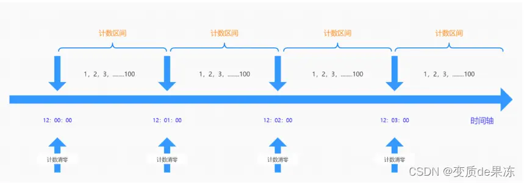
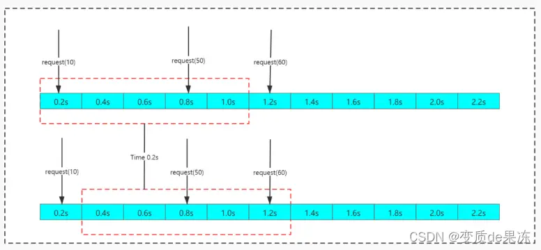
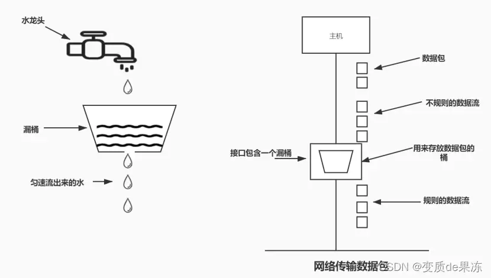
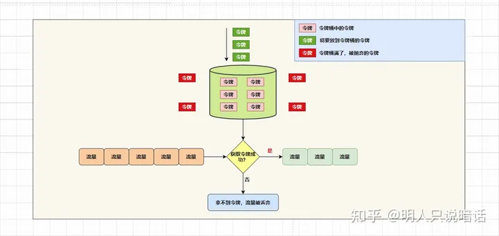

资料来源：<br/>
[《见「微」知「著」系列——<分布式流量防护>篇》介绍常见的限流算法：固定时间窗口算法、滑动时间窗口算法、 漏桶算法、令牌桶算法](https://zhuanlan.zhihu.com/p/627507543)

本文介绍几种常见的限流算法：固定时间窗口算法、滑动时间窗口算法、滑动日志算法、 漏桶算法和令牌桶算法。


## 固定时间窗口算法

所谓「时间窗口」指的是**一段时间**，可以是一秒、500毫秒、一分钟等等。

因此，固定时间窗口算法其实就是**在单位时间内，限制的请求数量**。




如上图所示。

我们将限流阈值设置为每秒钟最多运行4个请求访问系统。

在08:00:03到08:00:04、08:00:04到08:00:05和08:00:07到08:00:08这3个固定时间窗口内，都出现了单位流量超过限流阈值的情况，对于超过限流阈值的流量，根据事先指定的限流策略进行处理即可。

在其他固定时间窗口内，流量没有超过限流阈值，可以正常访问。

从上面的描述可以知道，在固定时间窗口算法中，我们需要维护一个计算器，用于计算单位时间内（上图中是1秒）有多少流量请求。

**每有一个请求访问系统，计数器就加一**，一旦计数器超过限流阈值，在这个固定时间窗口内的后续请求就直接拒绝了。

还有一个关键的地方，**当前的时间窗口过去之后，需要将计数器清零**。

固定时间窗口算法伪代码如下。

```java
/**
     * 计数器
     */
    private static final AtomicLong COUNTER = new AtomicLong(0);
    /**
     * 固定时间窗口(单位：毫秒)
     */
    private static final long TIME_WINDOWS_IN_MILLS = 1000L;
    /**
     * 限流阈值
     */
    private static final long TRAFFIC_THRESHOLD = 4;
    /**
     * 上次请求时间对应的毫秒数
     */
    private static final AtomicLong LAST_REQUEST_TIME_IN_MILLS = new AtomicLong(0);

    boolean whetherOrNotAccessByFixedTimeWindows() {
        // 当前系统时间
        long currentTime = System.currentTimeMillis();
        // 当前请求不在当前时间窗口内
        if (currentTime - LAST_REQUEST_TIME_IN_MILLS.get() > TIME_WINDOWS_IN_MILLS) {
            // 计数器清零
            COUNTER.set(0);
            // 将当前时间作为上次请求的时间，开启一个新的时间窗口
            LAST_REQUEST_TIME_IN_MILLS.set(currentTime);
        }

        // 当前请求在当前时间窗口内，且流量没有达到限流阈值
        if (COUNTER.get() < TRAFFIC_THRESHOLD) {
            // 计算器加一
            COUNTER.addAndGet(1);
            return true;
        }

        return false;
    }
```

固定时间窗口算法实现简单，但是也有问题——它无法处理跨时间窗口的问题。

> **举个例子**


如上图所示。

在0-1.0这个时间窗口内有4个流量，没有找过限流阈值，因此都可以访问系统；在1.0到2.0这个时间窗口内也有4个流量，没有找过限流阈值，同样可以访问系统；2.0到3.0这个时间窗口内有3个流量，都可以访问系统。

这样看来貌似没有什么问题。

但是，如果我们跨时间窗口来分析的话，就会出现下面这个情况：

在0.8到1.2这0.4秒内居然有6个请求，超过了我们指定的限流阈值（4个），应该有2个流量被限制的，结果并没有限制这2个流量访问系统。

因此，固定窗口限流算法不完美，在某些场景下，并没有起到限流的作用。而我们的目标是**在任何一个固定时间段内，超过限流阈值的流量都会被限制住**。

## 滑动时间窗口算法

滑动时间窗口算法恰好可以解决固时间窗口算法的临界问题。

滑动时间窗口算法**将单位时间周期分为N个小周期**，分别记录每个小周期内流量的请求次数，并且根据时间来滑动删除过期的小周期。


如上图所示。



单位时间是1秒，滑动窗口算法把它划分为10个小周期，每个小周期表示0.1秒。

每过0.1秒，时间窗口就会往右滑动一格。

另外，每个小周期都有自己独立的计数器，用于统计当前小周期内的请求数量。

> **举个例子**

假设，流量阈值为4。

在0.9到1.0这0.1秒内来了4个流量，在1.0到1.1这0.1秒内又来了4个流量。

如果按照上面的固定时间窗口算法，所有这些流量都是不会被限制访问的，因为每秒钟内的流量数量都没有超过限流阈值。

但在滑动窗口场景下，每经过一个小周期（0.1秒），滑动窗口都会向右移动一个小周期。

也就是说，当时间从0.9到1.0这0.1秒过渡到1.0到1.1这0.1秒时，滑动窗口也会移动，移动到了0.1秒到1.1秒这个时间段内，在这个时间段内就有4+4共8个流量，超出了我们设置的限流阈值（4）。

因此，1.0到1.1这0.1秒内的4个流量请求会被拒绝掉。

这样就完美解决了固时间窗口算法的临界问题。

从上面的分析可以看出，**当滑动窗口的小周期划分的越多，滑动窗口的滚动就越平滑，限流的统计就会越精确，但是算法所需的空间容量就越大**。

滑动时间窗口算法虽然可以解决临界问题，但是流量一旦到达限流阈值，超出限流阈值的请求都会直接被拒绝 。

## 漏桶算法

在漏桶算法中，我们将每个流量请求视作一个水滴，客户端请求访问就好比向漏桶中注水，注水的速率是变化的。

但是漏桶漏水的速率是固定的，这就就能保证系统可以以一个固定的速率处理流量请求。




如上图所示。

所有访问系统的流量（上图蓝色流量）都要先进入漏桶之中，然后以固定的速率漏出，以此来控制系统处理流量的速率。

如果流量太大，超出了漏桶的容量，那么多余的流量（上图红色圆形）就会被丢弃。

漏桶算法也不是完美的。

当流量比较平缓时，系统按照固定的速率处理流量，这是我们想要的结果。

但是，在面对流量洪峰（各种大促、秒杀、双十一、618等活动）时，我们希望处理流量的速率要更快，而不是按照固定的速率处理。

因为在这种情况下，如果还按照固定速率处理请求的话，由于桶很快就满了，会有大量的流量被丢弃，大大影响用户体验度。

## 令牌桶算法

令牌桶算法可以解决漏桶算法无法解决的流量洪峰的问题。




令牌桶算法原理如下：

1、定期往令牌桶里放入一定数量的令牌。

2、如果令牌桶的容量满了，超过令牌桶容量的令牌会被丢弃。

3、系统在接到一个客户端请求时，首先从令牌桶获取一个令牌。如果能拿到令牌，那么就可以处理这个流量；如果拿不到令牌，那就抛弃这个流量。

令牌桶算法的关键在于令牌发放的策略。

如果令牌发放的策略正确、合适，系统就不会被拖垮，而且还可以提高机器的利用率；如果令牌发放的太少，就会导致大量的流量因为获取不到令牌而被抛弃，极大影响用户体验。

Guava的RateLimiter限流组件，就是基于令牌桶算法实现的。