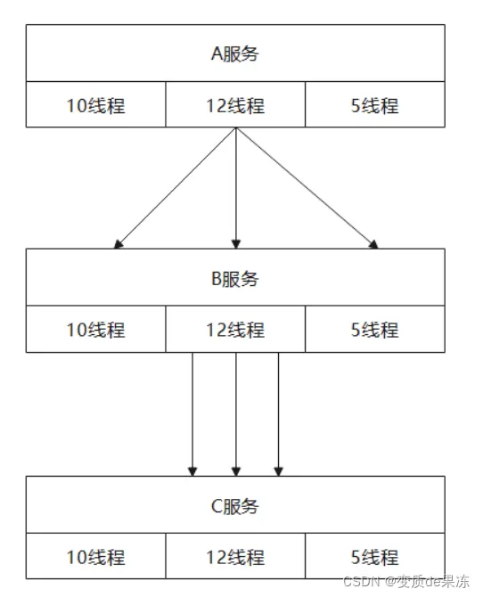

资料来源：<br/>
[微服务容错Resilience4j](https://www.jianshu.com/p/e9dc669592ad)

## 一、微服务容错简介

在⾼并发访问下，⽐如天猫双11，流量持续不断的涌⼊，服务之间的相互调⽤频率突然增加，引发系统负载过⾼，这时系统所依赖的服务的稳定性对系统的影响⾮常⼤，⽽且还有很多不确定因素引起雪崩，如⽹络连接中断，服务宕机等。⼀般微服务容错组件提供了限流、隔离、降级、熔断等⼿段，可以有效保护我们的微服务系统。

### 1.1 隔离

微服务系统A调⽤B，⽽B调⽤C，这时如果C出现故障，则此时调⽤B的⼤量线程资源阻塞，慢慢的B的线程数量持续增加直到CPU耗尽到100%，整体微服务不可⽤，这时就需要对不可⽤的服务进⾏隔离。

- 1.线程池隔离
   线程池隔离就是通过Java的线程池进⾏隔离，B服务调⽤C服务给予固定的线程数量⽐如12个线程，如果此时C服务宕机了就算⼤量的请求过来，调⽤C服务的接⼝只会占⽤12个线程不会占⽤其他⼯作线程资源，因此B服务就不会出现级联故障。线程池隔离原理，如图所示。

  

- 2.信号量隔离
   隔离信号量隔离是使⽤Semaphore来实现的，当拿不到信号量的时候直接拒接因此不会出现超时占⽤其他⼯作线程的情况。代码如下。


```cpp
Semaphore semaphore = new Semaphore(10,true); 
//获取信号量 
semaphore.acquire(); 
//do something here 
//释放信号量 
semaphore.release();
```

- 3.线程池隔离和信号量隔离的区别
   线程池隔离针对不同的资源分别创建不同的线程池，不同服务调⽤都发⽣在不同的线程池中，在线程池排队、超时等阻塞情况时可以快速失败。线程池隔离的好处是隔离度⽐较⾼，可以针对某个资源的线程池去进⾏处理⽽不影响其它资源，但是代价就是线程上下⽂切换的 overhead ⽐较⼤，特别是对低延时的调⽤有⽐较⼤的影响。⽽信号量隔离⾮常轻量级，仅限制对某个资源调⽤的并发数，⽽不是显式地去创建线程池，所以 overhead ⽐较⼩，但是效果不错，也⽀持超时失败。

| 类别         | 线程池隔离                               | 信号量隔离             |
| ------------ | ---------------------------------------- | ---------------------- |
| 线程         | 与调⽤线程不同，使⽤的是线程池创建的线程 | 与调⽤线程相同         |
| 开销         | 排队，切换，调度等开销                   | ⽆线程切换性能更⾼     |
| 是否支持异步 | ⽀持                                     | 不支持                 |
| 是否支持超时 | ⽀持                                     | 支持                   |
| 并发支持     | ⽀持通过线程池大小控制                   | ⽀持通过最⼤信号量控制 |

### 1.2 熔断

当下游的服务因为某种原因突然变得不可⽤或响应过慢，上游服务为了保证⾃⼰整体服务的可⽤性，不再继续调⽤⽬标服务，直接返回，快速释放资源。如果⽬标服务情况好转则恢复调⽤。熔断器模型，如图所示。


#### 熔断器模型的状态机有3个状态：

- **Closed**：关闭状态（断路器关闭），所有请求都正常访问。
- **Open**：打开状态（断路器打开），所有请求都会被降级。熔断器会对请求情况计数，当⼀定时间内失败请求百分⽐达到阈值，则触发熔断，断路器会完全打开。
- **Half Open**：半开状态，不是永久的，断路器打开后会进⼊休眠时间。随后断路器会⾃动进⼊半开状态。此时会释放部分请求通过，若这些请求都是健康的，则会关闭断路器，否则继续保持打开，再次进⾏休眠计时。

### 1.3 降级

降级是指当⾃身服务压⼒增⼤时，系统将某些不重要的业务或接⼝的功能降低，可以只提供部分功能，也可以完全停⽌所有不重要的功能。⽐如，下线⾮核⼼服务以保证核⼼服务的稳定、降低实时性、降低数据⼀致性，降级的思想是丢⻋保帅。

举个例⼦，⽐如，⽬前很多⼈想要下订单，但是我的服务器除了处理下订单业务之外，还有⼀些其他的服务在运⾏，⽐如，搜索、定时任务、⽀付、商品详情、⽇志等等服务。然⽽这些不重要的服务占⽤了JVM的不少内存和CPU资源，为了应对很多⼈要下订单的需求，设计了⼀个动态开关，把这些不重要的服务直接在最外层拒绝掉。这样就有跟多的资源来处理下订单服务（下订单速度更快了）

### 1.4 限流

限流，就是限制最⼤流量。系统能提供的最⼤并发有限，同时来的请求⼜太多，就需要限流，⽐如商城秒杀业务，瞬时⼤量请求涌⼊，服务器服务不过来，就只好排队限流了，就跟去景点排队买票和去银⾏办理业务排队等号道理相同。下⾯介绍下四种常⻅的限流算法。

#### 1.漏桶算法

漏桶算法的思路，⼀个固定容量的漏桶，按照常量固定速率流出⽔滴。如果桶是空的，则不需流出⽔滴。可以以任意速率流⼊⽔滴到漏桶。如果流⼊⽔滴超出了桶的容量，则流⼊的⽔滴溢出了（被丢弃），而漏桶容量是不变的。


#### 2.令牌桶算法

令牌桶算法：假设限制2r/s，则按照500毫秒的固定速率往桶中添加令牌。桶中最多存放b个令牌，当桶满时，新添加的令牌被丢弃或拒绝。当⼀个n个字节⼤⼩的数据包到达，将从桶中删除n个令牌，接着数据包被发送到⽹络上。如果桶中的令牌不⾜n个，则不会删除令牌，且该数据包将被限流（要么丢弃，要么缓冲区等待）。令牌桶限流原理，如图所示。


令牌桶限流服务器端可以根据实际服务性能和时间段改变⽣成令牌的速度和⽔桶的容量。 ⼀旦需要提⾼速率,则按需提⾼放⼊桶中的令牌的速率。

生成令牌的速度是恒定的，⽽请求去拿令牌是没有速度限制的。这意味着当⾯对瞬时⼤流量，该算法可以在短时间内请求拿到⼤量令牌，⽽且拿令牌的过程并不是消耗很⼤。

#### 3.固定时间窗⼝算法

在固定的时间窗⼝内，可以允许固定数量的请求进⼊。超过数量就拒绝或者排队，等下⼀个时间段进⼊。这种实现计数器限流⽅式由于是在⼀个时间间隔内进⾏限制，如果⽤户在上个时间间隔结束前请求（但没有超过限制），同时在当前时间间隔刚开始请求（同样没超过限制），在各⾃的时间间隔内，这些请求都是正常的，但是将间隔临界的⼀段时间内的请求就会超过系统限制，可能导致系统被压垮。


由于计数器算法存在时间临界点缺陷，因此在时间临界点左右的极短时间段内容易遭到攻击。⽐如设定每分钟最多可以请求100次某个接⼝，如12:00:00-12:00:59时间段内没有数据请求，⽽12:00:59-12:01:00时间段内突然并发100次请求，⽽紧接着跨⼊下⼀个计数周期，计数器清零，在12:01:00-12:01:01内⼜有100次请求。那么也就是说在时间临界点左右可能同时有2倍的阀值进⾏请求，从⽽造成后台处理请求过载的情况，导致系统运营能⼒不⾜，甚⾄导致系统崩溃。

4.滑动时间窗⼝算法
 滑动窗⼝算法是把固定时间⽚进⾏划分，并且随着时间移动，移动⽅式为开始时间点变为时间列表中的第⼆时间点，结束时间点增加⼀个时间点，不断重复，通过这种⽅式可以巧妙的避开计数器的临界点的问题。

滑动窗⼝算法可以有效的规避计数器算法中时间临界点的问题，但是仍然存在时间⽚段的概念。同时滑动窗⼝算法计数运算也相对固定时间窗⼝算法⽐较耗时。


## 二、Resilience4j简介

### 2.1 Resilience4j简介

Netflix的Hystrix微服务容错库已经停⽌更新，官⽅推荐使⽤Resilience4j代替Hystrix，或者使⽤Spring Cloud Alibaba的Sentinel组件。

Resilience4j是受到Netflix Hystrix的启发，为Java8和函数式编程所设计的轻量级容错框架。整个框架只是使⽤了Varr的库，不需要引⼊其他的外部依赖。与此相⽐，Netflix Hystrix对Archaius具有编译依赖，⽽Archaius需要更多的外部依赖，例如Guava和Apache Commons Configuration。

Resilience4j提供了提供了⼀组⾼阶函数（装饰器），包括断路器，限流器，重试机制，隔离机制。你可以使⽤其中的⼀个或多个装饰器对函数式接⼝，lambda表达式或⽅法引⽤进⾏装饰。这么做的优点是你可以选择所需要的装饰器进⾏装饰。

在使⽤Resilience4j的过程中，不需要引⼊所有的依赖，只引⼊需要的依赖即可。

### 2.2 核心组件

- resilience4j-circuitbreaker：熔断
- resilience4j-ratelimiter：限流(频率控制)
- resilience4j-bulkhead：依赖隔离&负载保护
- resilience4j-retry：自动重试
- resilience4j-cache：应答缓存
- resilience4j-timelimiter：超时控制

Resilience4j是一个轻量级、易于使用的容错库，其灵感来自Netflix Hystrix，但专为Java 8和函数式编程设计。

Resilience4j提供高阶函数（decorators）来增强任何功能接口、lambda表达式或方法引用，包括断路器、速率限制器、重试或舱壁。可以在任何函数接口、lambda表达式或方法引用上使用多个装饰器。

circuitbreaker组件实现了断路器功能，是基于内存的断路器，采用ConcurrentHashMap来实现。

### 2.3 舱壁（Bulkhead）

Resilience4j提供了两种舱壁模式的实现，可用于限制并发执行的次数：

SemaphoreBulkhead（信号量舱壁，默认），基于Java并发库中的Semaphore实现。
 FixedThreadPoolBulkhead（固定线程池舱壁），它使用一个有界队列和一个固定线程池。
 SemaphoreBulkhead应该在各种线程和I / O模型上都能很好地工作。它基于信号量，与Hystrix不同，它不提供“影子”线程池选项。取决于客户端，以确保正确的线程池大小将与舱壁配置保持一致。

### 2.4 信号量舱壁（SemaphoreBulkhead）

当信号量存在剩余时进入系统的请求会直接获取信号量并开始业务处理。当信号量全被占用时，接下来的请求将会进入阻塞状态，SemaphoreBulkhead提供了一个阻塞计时器，如果阻塞状态的请求在阻塞计时内无法获取到信号量则系统会拒绝这些请求。若请求在阻塞计时内获取到了信号量，那将直接获取信号量并执行相应的业务处理。

### 2.5 固定线程池舱壁（FixedThreadPoolBulkhead）

FixedThreadPoolBulkhead的功能与SemaphoreBulkhead一样也是用于限制并发执行的次数的，但是二者的实现原理存在差别而且表现效果也存在细微的差别。FixedThreadPoolBulkhead使用一个固定线程池和一个等待队列来实现舱壁。当线程池中存在空闲时，则此时进入系统的请求将直接进入线程池开启新线程或使用空闲线程来处理请求。当线程池无空闲时接下来的请求将进入等待队列，若等待队列仍然无剩余空间时接下来的请求将直接被拒绝。在队列中的请求等待线程池出现空闲时，将进入线程池进行业务处理。

可以看到FixedThreadPoolBulkhead和SemaphoreBulkhead一个明显的差别是FixedThreadPoolBulkhead没有阻塞的概念，而SemaphoreBulkhead没有一个队列容量的限制。

### 2.6 限速器（RateLimiter）

限速器（RateLimiter）的功能是防止突然的过量请求导致系统不堪重负，RateLimiter使用一个刷新周期的概念，限定在一个固定刷新周期内可处理的最大请求数量。若在某一个刷新周期内的请求数量已经达到最大，则本周期内接下来的请求将进入阻塞状态，如果在最大阻塞计时内新的刷新周期开启，则阻塞状态的请求将进入新的周期内进行处理。如最大的阻塞计时内新的刷新周期并未开启，则此时超出阻塞计时的那些请求将被直接拒绝。

### 2.7 断路器（CircuitBreaker）

断路器（CircuitBreaker）相对于前面几个熔断机制更复杂，CircuitBreaker通常存在三种状态（CLOSE、OPEN、HALF_OPEN），并通过一个时间或数量窗口来记录当前的请求成功率或慢速率，从而根据这些指标来作出正确的容错响应。

当CircuitBreaker为CLOSE状态时客户端发起的请求将正常进入服务端系统，CircuitBreaker会计算出当前请求前的一个窗口里所有请求的异常率（失败率或慢速率），若异常率低于预期配置值，则系统将继续正常处理接下来的请求。当异常率不低于预期配置值时，此时服务端会进入OPEN状态，此时服务端将会暂时性的拒绝所有请求。在一段冷却时间（自定义配置）之后，服务端将自动进入HALF_OPEN状态，在半开状态服务端将尝试接受一定数量的请求（自定义配置），若这一定数量的请求的异常率低于预期，则此时服务端将再次恢复CLOSE状态，正常处理请求。而如果异常率还是高于预期则会继续退回到OPEN状态。

### 2.8 重试（Retry）

重试机制比较简单，当服务端处理客户端请求异常时，服务端将会开启重试机制，重试期间内，服务端将每隔一段时间重试业务逻辑处理。 如果最大重试次数内成功处理业务，则停止重试，视为处理成功。如果在最大重试次数内处理业务逻辑依然异常，则此时系统将拒绝该请求。

### 2.9 circuitbreaker源码


### 2.10 Resilience4j和Hystrix的异同

- Hystrix使⽤HystrixCommand来调⽤外部的系统，⽽R4j提供了⼀些⾼阶函数，例如断路器、限流器、隔离机制等，这些函数作为装饰器对函数式接⼝、lambda表达式、函数引⽤进⾏装饰。此外，R4j库还提供了失败重试和缓存调⽤结果的装饰器。你可以在函数式接⼝、
- lambda表达式、函数引⽤上叠加地使⽤⼀个或多个装饰器，这意味着隔离机制、限流器、重试机制等能够进⾏组合使⽤。这么做的优点在于，你可以根据需要选择特定的装饰器。任何被装饰的⽅法都可以同步或异步执⾏，异步执⾏可以采⽤ CompletableFuture 或RxJava。
- 当有很多超过规定响应时间的请求时，在远程系统没有响应和引发异常之前，断路器将会开启。
- 当Hystrix处于半开状态时，Hystrix根据只执⾏⼀次请求的结果来决定是否关闭断路器。⽽R4j允许执⾏可配置次数的请求，将请求的结果和配置的阈值进⾏⽐较来决定是否关闭断路器。
- R4j提供了⾃定义的Reactor和Rx Java操作符对断路器、隔离机制、限流器中任何的反应式类型进⾏装饰。
- Hystrix和R4j都发出⼀个事件流，系统可以对发出的事件进⾏监听，得到相关的执⾏结果和延迟的时间统计数据都是⼗分有⽤的。

## 三、Resilence4j最佳实践

下⾯分三⽅⾯讲解Resilence4j对于微服务容错的处理，分别为熔断，隔离，限流。

### 3.1 断路器(CircuitBreaker)

- 1.CircuitBreaker简介

断路器通过有限状态机实现，有三个普通状态：关闭（CLOSED）、开启（OPEN）、半开 (HALF_OPEN)，还有两个特殊状态：禁⽤(DISABLED)、强制开启(FORCED_OPEN)。

当熔断器关闭时，所有的请求都会通过熔断器。如果失败率超过设定的阈值，熔断器就会从关闭状态转换到打开状态，这时所有的请求都会被拒绝。当经过⼀段时间后，熔断器会从打开状态转换到半开状态，这时仅有⼀定数量的请求会被放⼊，并重新计算失败率，如果失败率超过阈值，则变为打开状态，如果失败率低于阈值，则变为关闭状态。

断路器使⽤滑动窗⼝来存储和统计调⽤的结果。你可以选择基于调⽤数量的滑动窗⼝或者基于时间的滑动窗⼝。基于访问数量的滑动窗⼝统计了最近N次调⽤的返回结果。居于时间的滑动窗⼝统计了最近N秒的调⽤返回结果。

除此以外，熔断器还会有两种特殊状态：DISABLED（始终允许访问）和FORCED_OPEN（始终拒绝访问）。这两个状态不会⽣成熔断器事件（除状态装换外），并且不会记录事件的成功或者失败。退出这两个状态的唯⼀⽅法是触发状态转换或者重置熔断器。

- 2.添加依赖


```xml
<dependency> 
    <groupId>org.springframework.cloud</groupId> 
    <artifactId>spring-cloud-starter-circuitbreaker-resilience4j</artifactId> 
</dependency>
```

- 3.CircuitBreaker配置

| 配置属性                                      | 默认值                                                       | 描述                                                         |
| --------------------------------------------- | ------------------------------------------------------------ | ------------------------------------------------------------ |
| failureRateThreshold                          | 50                                                           | 以百分⽐配置失败率阈值。当失败率等于或⼤于阈值时，断路器状态并关闭变为开启，并进⾏服务降级。 |
| slowCallRateThreshold                         | 100                                                          | 以百分⽐的⽅式配置，断路器把调⽤时间⼤于slowCallDurationThreshold的调⽤视为慢调⽤，当慢调⽤⽐例⼤于等于阈值时，断路器开启，并进⾏服务降级。 |
| slowCallDurationThreshold                     | 60000[ms]                                                    | 配置调⽤时间的阈值，⾼于该阈值的呼叫视为慢调⽤，并增加慢调⽤⽐例。 |
| permittedNumberOfCallsInHalfOpenState         | 10                                                           | 断路器在半开状态下允许通过的调⽤次数。                       |
| maxWaitDurationInHalfOpenState                | 0                                                            | 断路器在半开状态下的最⻓等待时间，超过该配置值的话，断路器会从半开状态恢复为开启状态。配置是0时表示断路器会⼀直处于半开状态，直到所有允许通过的访问结束。 |
| slidingWindowType                             | COUNT_BASED                                                  | 配置滑动窗⼝的类型，当断路器关闭时，将调⽤的结果记录在滑动窗⼝中。滑动窗⼝的类型可以是count-based或time-based。如果滑动窗⼝类型是COUNT_BASED，将会统计记录最近slidingWindowSize次调⽤的结果。如果是TIME_BASED，将会统计记录最近 slidingWindowSize秒的调⽤结果。 |
| slidingWindowSize                             | 100                                                          | 配置滑动窗⼝的⼤⼩。                                         |
| minimumNumberOfCalls                          | 100                                                          | 断路器计算失败率或慢调⽤率之前所需的最⼩调⽤数（每个滑动窗⼝周期）。例如，如果minimumNumberOfCalls为10，则必须⾄少记录10个调⽤，然后才能计算13失败率。如果只记录了9次调⽤，即使所有9次调⽤都失败，断路器也不会开启。 |
| waitDurationInOpenState                       | 60000 [ms]                                                   | 断路器从开启过渡到半开应等待的时间。                         |
| automaticTransition FromOpenToHalfOpenEnabled | false                                                        | 如果设置为true，则意味着断路器将⾃动从开启状态过渡到半开状态，并且不需要调⽤来触发转换。创建⼀个线程来监视断路器的所有实例，以便在WaitDurationInOpenstate之后将它们转换为半开状态。但是，如果设置为false，则只有在发出调⽤时才会转换到半开，即使 在waitDurationInOpenState之后也是如此。这⾥的优点是没有线程监视所有断路器的状态。 |
| recordExceptions                              | empty                                                        | 记录为失败并因此增加失败率的异常列表。除⾮通过ignoreExceptions显式忽略，否则与列表中某个匹配或继承的异常都将被视为失败。 如果指定异常列表，则所有其他异常均视为成功，除⾮它们被ignoreExceptions显式忽略。 |
| ignoreExceptions                              | empty                                                        | 被忽略且既不算失败也不算成功的异常列表。任何与列表之⼀匹配或继承的异常都不会被视为失败或成功，即使异常是 recordExceptions的⼀部分。 |
| recordException                               | throwable -> true By default all exceptions are recored as failures. | ⼀个⾃定义断⾔，⽤于评估异常是否应记录为失败。 如果异常应计为失败，则断⾔必须返回true。如果出断⾔返回false，应算作成功，除⾮ignoreExceptions显式忽略异常。 |
| ignoreException                               | throwable -> false By default no exceptions is ignored.      | ⾃定义断⾔来判断⼀个异常是否应该被忽略异常，则谓词必须返回 true。如果异常应算作失败，则断⾔必须返回 false |

参考表属性，在订单项⽬中配置断路器，代码如下。


```php
resilience4j: 
    circuitbreaker: 
        configs: 
            default: 
                failureRateThreshold: 30 #失败请求百分⽐，超过这个⽐例，CircuitBreaker变为OPEN状态 
                slidingWindowSize: 10 #滑动窗⼝的⼤⼩，配置COUNT_BASED,表示10个请求，配置TIME_BASED表示10秒 
                minimumNumberOfCalls: 5 #最⼩请求个数，只有在滑动窗⼝内，请求个数达到这个个数，才会触发CircuitBreader对于断路器的判断 
                slidingWindowType: TIME_BASED #滑动窗⼝的类型 
                permittedNumberOfCallsInHalfOpenState: 3 #当CircuitBreaker处于HALF_OPEN状态的时候，允许通过的请求个数 
                automaticTransitionFromOpenToHalfOpenEnabled: true #设置true，表示⾃动从OPEN变成HALF_OPEN，即使没有请求过来 
                waitDurationInOpenState: 2s #从OPEN到HALF_OPEN状态需要等待的时间 
                recordExceptions: #异常名单 
                  - java.lang.Exception 
        instances: 
            backendA: 
                baseConfig: default #熔断器backendA，继承默认配置default 
            backendB: 
                failureRateThreshold: 50 
                slowCallDurationThreshold: 2s #慢调⽤时间阈值，⾼于这个阈值的呼叫视为慢调⽤，并增加慢调⽤⽐例。 
                slowCallRateThreshold: 30 #慢调⽤百分⽐阈值，断路器把调⽤时间⼤于 
                slowCallDurationThreshold，视为慢调⽤，当慢调⽤⽐例⼤于阈值，断路器打开，并进⾏服务降级 
                slidingWindowSize: 10 
                slidingWindowType: TIME_BASED 
                minimumNumberOfCalls: 2 
                permittedNumberOfCallsInHalfOpenState: 2 
                waitDurationInOpenState: 2s #从OPEN到HALF_OPEN状态需要等待的时间 
```

上⾯配置了2个断路器"backendA"，和"backendB"，其中backendA断路器配置基于default配置，"backendB"断路器配置了慢调⽤⽐例熔断，"backendA"熔断器配置了异常⽐例熔断

- 4.OrderController
   修改OrderController代码，以测试异常⽐例熔断和慢调⽤⽐例熔断效果，代码如下。


```kotlin
@GetMapping("/payment/{id}") 
@CircuitBreaker(name = "backendD", fallbackMethod = "fallback") 
public ResponseEntity<Payment> getPaymentById(@PathVariable("id") Integer id) throws InterruptedException, ExecutionException { 

    log.info("now i enter the method!!!"); 
    Thread.sleep(10000L); //阻塞10秒，已测试慢调⽤⽐例熔断 
    String url = "http://cloud-payment-service/payment/" + id; 
    Payment payment = restTemplate.getForObject(url, Payment.class); 
    log.info("now i exist the method!!!"); 
    return ResponseEntity.ok(payment); 

}

public ResponseEntity<Payment> fallback(Integer id, Throwable e) { 

    e.printStackTrace(); 
    Payment payment = new Payment(); 
    payment.setId(id); 
    payment.setMessage("fallback..."); 
    return new ResponseEntity<>(payment, HttpStatus.BAD_REQUEST); 

}
```

注意：name="backendA"和name="backendD"效果相同，当找不到配置的backendD熔断器，使⽤默认熔断器配置，即为"default"。

- 5.启动并测试

分别启动Eureka，⽀付服务，订单服务。
 \* 1、使⽤JMeter并发测试，创建线程组。
 \* 2、创建HTTP请求、查看结果数，HTTP请求配置。
 \* 3、正常执⾏。

此时关闭⽀付微服务，这时订单服务⽆法调⽤，所有请求报错，这时第⼀次并发发送20次请求，触发异常⽐例熔断，断路器进⼊打开状态，2s后（waitDurationInOpenState: 2s），断路器⾃动进⼊半开状态（automaticTransitionFromOpenToHalfOpenEnabled: true），再次发送请求断路器处于半开状态，允许3次请求通过（permittedNumberOfCallsInHalfOpenState: 3），注意此时控制台打印3次⽇志信息，说明半开状态，进⼊了3次请求调⽤，接着断路器继续进⼊打开状态。

> 注意：name="backendA"和name="backendD"，效果相同。

接下来测试慢⽐例调⽤熔断，修改OrderController代码，使⽤"backendB"熔断器，因为backendB 熔断器，配置了慢⽐例调⽤熔断，然后启动Eureka，订单微服务和⽀付微服务。第⼀次发送并发发送了20个请求，触发了慢⽐例熔断，但是因为没有配置 （automaticTransitionFromOpenToHalfOpenEnabled: true），⽆法⾃动从打开状态转为半开状态，需要浏览器中执⾏⼀次请求，这时，断路器才能从打开状态进⼊半开状态，接下来进⼊半开状态，根据配置，允许2次请求在半开状态通过（permittedNumberOfCallsInHalfOpenState: 2）。

### 3.2 隔离(Builkhead)

Resilience4j提供了两种隔离的实现⽅式，可以限制并发执⾏的数量。

- SemaphoreBulkhead使⽤了信号量
- FixedThreadPoolBulkhead使⽤了有界队列和固定⼤⼩线程池
- 1.添加依赖


```xml
<dependency> 
    <groupId>io.github.resilience4j</groupId> 
    <artifactId>resilience4j-bulkhead</artifactId> 
    <version>1.7.0</version> 
</dependency>
```

- 2.信号量隔离
   SemaphoreBulkhead使⽤了信号量，配置属性。

| 配置属性           | 默认值 | 描述                                                         |
| ------------------ | ------ | ------------------------------------------------------------ |
| maxConcurrentCalls | 25     | 隔离允许线程并发执⾏的最⼤数量                               |
| maxWaitDuration    | 0      | 当达到并发调⽤数量时，新的线程执⾏时将被阻塞，这个属性表示最⻓的等待时间。 |

在订单⼯程application.yml配置如下。


```csharp
resilience4j: 
    bulkhead: 
        configs: 
            default: 
                maxConcurrentCalls: 5 # 隔离允许并发线程执⾏的最⼤数量 
                maxWaitDuration: 20ms # 当达到并发调⽤数量时，新的线程的阻塞时间 
        instances: 
            backendA: 
                baseConfig: default 
            backendB: 
                maxWaitDuration: 10ms 
                maxConcurrentCalls: 20
```

修改OrderController代码如下。


```kotlin
@GetMapping("/payment/{id}") 
@Bulkhead(name = "backendA", fallbackMethod = "fallback", type = Bulkhead.Type.SEMAPHORE) 
public ResponseEntity<Payment> getPaymentById(@PathVariable("id") Integer id) throws InterruptedException, ExecutionException { 

    log.info("now i enter the method!!!"); 
    Thread.sleep(10000L); //阻塞10秒，已测试慢调⽤⽐例熔断 
    String url = "http://cloud-payment-service/payment/" + id; 
    Payment payment = restTemplate.getForObject(url, Payment.class); 
    log.info("now i exist the method!!!"); 
    return ResponseEntity.ok(payment); 

} 
```

> 注意：type默认为Bulkhead.Type.SEMAPHORE，表示信号量隔离。

执行并测试，可以看到因为并发线程数为5（maxConcurrentCalls: 5），只有5个线程进⼊执⾏，其他请求降直接降级。

- 3.线程池隔离
   FixedThreadPoolBulkhead配置如下，如下表所示。

| 配置名称           | 默认值                                         | 含义                                                         |
| ------------------ | ---------------------------------------------- | ------------------------------------------------------------ |
| maxThreadPoolSize  | Runtime.getRuntime().availableProcessors()     | 配置最⼤线程池⼤⼩                                           |
| coreThreadPoolSize | Runtime.getRuntime().availableProcessors() - 1 | 配置核⼼线程池⼤⼩                                           |
| queueCapacity      | 100                                            | 配置队列的容量                                               |
| keepAliveDuration  | 20ms                                           | 当线程数⼤于核⼼时，这是多余空闲线程在终⽌前等待新任务的最⻓时间 |

⽀付⼯程的application.yml，配置如下。


```csharp
resilience4j: 
    thread-pool-bulkhead: 
        configs: 
            default: 
                maxThreadPoolSize: 4 # 最⼤线程池⼤⼩ 
                coreThreadPoolSize: 2 # 核⼼线程池⼤⼩ 
                queueCapacity: 2 # 队列容量 
        instances: 
            backendA: 
                baseConfig: default 
            backendB: 
                maxThreadPoolSize: 1 
                coreThreadPoolSize: 1 
                queueCapacity: 1 
```

增加OrderService，注意，FixedThreadPoolBulkhead只对CompletableFuture⽅法有效，所以我们必创建返回CompletableFuture类型的⽅法。代码如下。


```java
@Service 
@Slf4j 
public class OrderService { 
 
    @Bulkhead(name = "backendA", type = Bulkhead.Type.THREADPOOL) 
    public CompletableFuture<Payment> getPaymet() throws InterruptedException { 
 
        log.info("now i enter the method!!!"); 
        Thread.sleep(10000L); 
        log.info("now i exist the method!!!"); 
        return CompletableFuture.supplyAsync(() -> new Payment(123, "线程池隔离回退。。。")); 
 
    } 
}
```

修改OrderController代码如下。


```kotlin
@Autowired 
private OrderService orderService; 
 
@GetMapping("/payment/{id}") 
public ResponseEntity<Payment> getPaymentById(@PathVariable("id") Integer id) throws InterruptedException, ExecutionException { 
    return ResponseEntity.ok(orderService.getPaymet().get()); 
}
```

线程隔离配置如图所示，4个请求进⼊线程执⾏（maxThreadPoolSize: 4 ），2个请求（queueCapacity: 2）进⼊有界队列等待，等待10秒后有线程执⾏结束，队列中的线程开始执⾏。


### 3.3 限流(RateLimiter)

- 1.添加依赖


```xml
<dependency> 
    <groupId>io.github.resilience4j</groupId> 
    <artifactId>resilience4j-ratelimiter</artifactId> 
    <version>1.7.0</version> 
</dependency>
```

- 2.配置⽂件

R4j的限流模块RateLimter基于滑动窗⼝，和令牌桶限流算法，配置如下。

| 属性               | 默认值  | 描述                                                         |
| ------------------ | ------- | ------------------------------------------------------------ |
| timeoutDuration    | 5秒     | 线程等待权限的默认等待时间                                   |
| limitRefreshPeriod | 500纳秒 | 限流器每隔limitRefreshPeriod刷新⼀次，将允许处理的最⼤请求数量重置为limitForPeriod。 |
| limitForPeriod     | 50      | 在⼀次刷新周期内，允许执⾏的最⼤请求数                       |

在订单⼯程的application.yml中配置如下。


```csharp
resilience4j: 
    ratelimiter: 
        configs: 
            default: 
                timeoutDuration: 5 # 线程等待权限的默认等待时间 
                limitRefreshPeriod: 1s # 限流器每隔1s刷新⼀次，将允许处理的最⼤请求重置为2 
                limitForPeriod: 2 #在⼀个刷新周期内，允许执⾏的最⼤请求数 
        instances: 
            backendA: 
                baseConfig: default 
            backendB: 
                timeoutDuration: 5 
                limitRefreshPeriod: 1s 
                limitForPeriod: 5
```

修改OrderController代码如下。


```kotlin
@GetMapping("/payment/{id}") 
@RateLimiter(name = "backendA", fallbackMethod = "fallback") 
public ResponseEntity<Payment> getPaymentById(@PathVariable("id") Integer id) throws InterruptedException, ExecutionException { 
 
    log.info("now i enter the method!!!"); 
    Thread.sleep(10000L); //阻塞10秒，已测试慢调⽤⽐例熔断 
    String url = "http://cloud-payment-service/payment/" + id; 
    Payment payment = restTemplate.getForObject(url, Payment.class); 
    log.info("now i exist the method!!!"); 
    return ResponseEntity.ok(payment); 
 
}
```

启动并测试，因为在⼀个刷新周期1s（limitRefreshPeriod: 1s）允许执⾏的最⼤请求数为 2（limitForPeriod: 2），等待令牌时间5s（timeoutDuration: 5 ），限流逻辑如图4-17所示。并发发送20个请求后，只有2个请求拿到令牌执⾏，另外2个请求等5秒后拿到令牌，其他16个请求直接降级。


作者：小波同学<br/>
链接：https://www.jianshu.com/p/e9dc669592ad<br/>
来源：简书<br/>
著作权归作者所有。商业转载请联系作者获得授权，非商业转载请注明出处。<br/>