]资料来源：<br/>
[1.2K Stars 国产开源文档生成工具，零侵入！](https://www.toutiao.com/article/7316460667652244006/)<br/>
[图文详解：接口文档生成工具—smart-doc](https://zhuanlan.zhihu.com/p/608697109)<br/>
[smart-doc maven插件](https://www.jianshu.com/p/b0a4bb457bd1)<br/>


## 简介

smart-doc 是一款同时支持 Java Rest Api 和 Apache Dubbo RPC 接口文档生成的工具，在业内率先提出基于 Java 泛型定义推导的理念，完全基于注释生成文档，做到零侵入。

只需要按照Javadoc标准编写注释， smart-doc 就能帮你生成一个简易明了的Markdown、HTML5、Postman Collection2.0+、OpenAPI 3.0+ 的文档。


## ️ 最新版功能

- 零注解、零学习成本、只需要写标准JAVA注释。
- 基于源代码接口定义自动推导，强大的返回结构推导。
- 支持Spring MVC、Spring Boot、Spring Boot Web Flux(Controller书写方式)、Feign。
- 支持Callable、Future、CompletableFuture等异步接口返回的推导。
- 支持JavaBean上的JSR303参数校验规范，包括分组验证。
- 对JSON请求参数的接口能够自动生成模拟JSON参数。
- 对一些常用字段定义能够生成有效的模拟值。
- 支持生成JSON返回值示例。
- 支持从项目外部加载源代码来生成字段注释(包括标准规范发布的jar包)。
- 支持生成多种格式文档：Markdown、HTML5、Word、Asciidoctor、Postman Collection、OpenAPI 3.0。开放文档数据，可自由实现接入文档管理系统。
- 支持导出错误码和定义在代码中的各种字典码到接口文档。
- 支持生成Jmeter性能测试脚本。
- 支持Maven、Gradle插件式轻松集成。
- 支持Apache Dubbo RPC接口文档生成。
- 支持基于Git管理项目的变更增量文档生成。
- debug接口调试html5页面完全支持文件上传，下载(@download tag标记下载方法)测试。

##  最佳实践方案

smart-doc + Torna 组成行业领先的文档生成和管理解决方案，使用smart-doc无侵入完成Java源代码分析和提取注释生成API文档， 自动将文档推送到 Torna 企业级接口文档管理平台。

Torna 是由 smart-doc 官方独家推动联合研发的企业级文档管理系统， 集成 torna 需要使用 smart-doc 2.0.9 版本及以上，目前也是主推 smart-doc+Torna 的这套方案。

如下图所示：

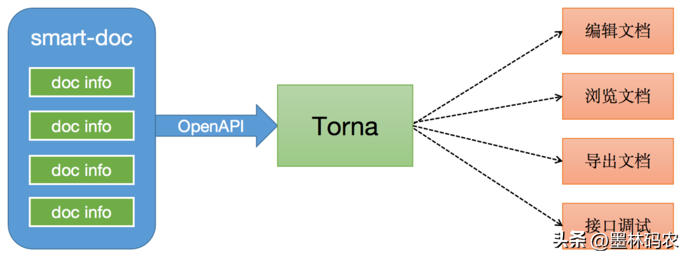


## smart-doc和swagger对比

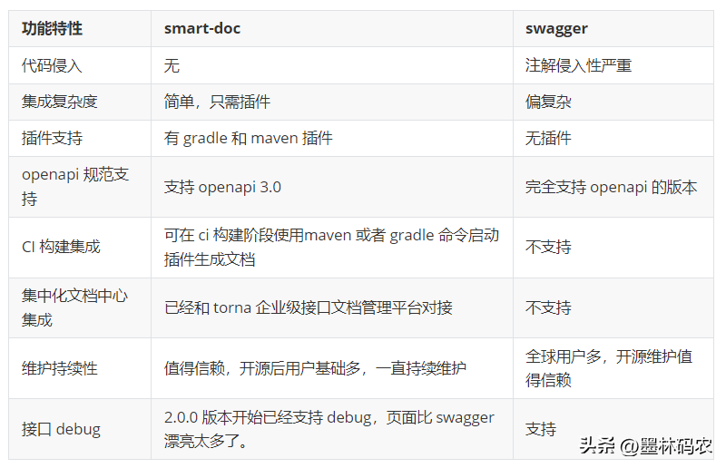


## 快速体验

smart-doc官方目前已经开发完成 Maven 插件和 Gradle 插件，小编这里使用 Maven 插件按最小化配置举例。

**环境版本：**

- Maven 3.3.9+
- JDK1.8+

1、在项目启动类所在模块的resources目录下创建 smart-doc.json 文件，内容如下：

```
{
  "serverUrl": "http://localhost:8080",   // 服务器地址，非必须
  "pathPrefix": "",                       // 上下文路径
  "allInOne": true,                       // 是否将文档合并到一个文件中，一般推荐为true
  "outPath": "D://md2",                   // 指定文档的输出路径
  "style": "xt256",                       // 基于highlight.js的代码高亮设置
  "createDebugPage": false,               // 创建一个可调试接口的文档页面
  "revisionLogs": [                       // 文档变更记录，非必须
    {
      "version": "1.0",                   // 文档版本号
      "revisionTime": "2023-01-31 10:30", // 文档修订时间
      "status": "创建",                   // 变更操作状态，一般为：创建、更新等
      "author": "renr",                   // 文档变更作者
      "remarks": "员工管理系统"            // 变更描述
    }
  ]
}
```

outPath 可以使用相对路径，如：

./src/main/resources/static/doc

2、在项目启动类所在模块的pom.xml文件配置 Maven 插件

注意：需要 includes 依赖的源码包

```
<plugin>
    <groupId>com.ly.smart-doc</groupId>
    <artifactId>smart-doc-maven-plugin</artifactId>
    <version>[最新版本]</version>
    <configuration> 
        <configFile>./src/main/resources/smart-doc.json</configFile>  
        <projectName>${project.description}</projectName>  
        <includes>  
            <!-- 使用了mybatis-plus的Page分页需要include所使用的源码包 -->
            <include>com.baomidou:mybatis-plus-extension</include>
            <!-- 使用了mybatis-plus的IPage分页需要include mybatis-plus-core-->
            <include>com.baomidou:mybatis-plus-core</include>
            <!-- 使用了jpa的分页需要include所使用的源码包 -->
            <include>org.springframework.data:spring-data-commons</include>             
        </includes> 
    </configuration>
    <executions>
        <execution>
            <!--如果不需要在执行编译时启动smart-doc，则将phase注释掉-->
            <phase>compile</phase>
            <goals>
                <!--smart-doc提供了html、openapi、markdown等goal，可按需配置-->
                <goal>html</goal>
            </goals>
        </execution>
    </executions>
</plugin>
```

3、在 IDEA 中直接使用 Maven 插件目录下的 smart-doc 模块

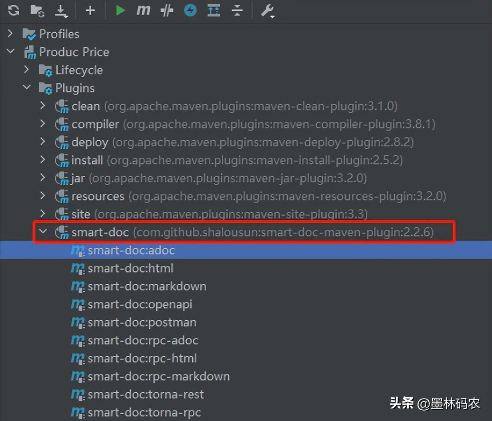


或者在命令行中执行

```
mvn -Dfile.encoding=UTF-8 smart-doc:html
mvn -Dfile.encoding=UTF-8 smart-doc:markdown
mvn -Dfile.encoding=UTF-8 smart-doc:torna-rest
...
```

**完善项目中的注释**

给实体类添加相关的注释，如下图所示：

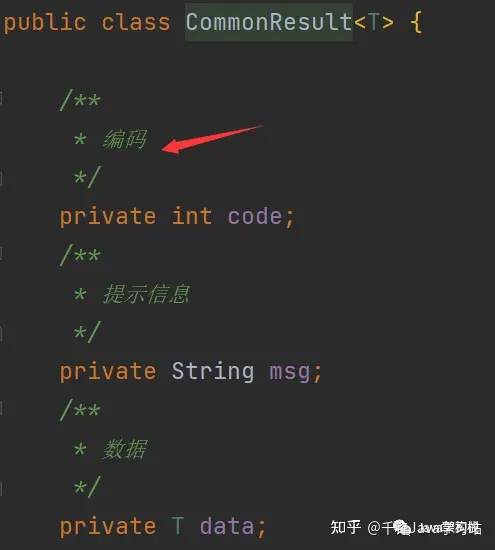

我们在控制器上也添加应有的注释。

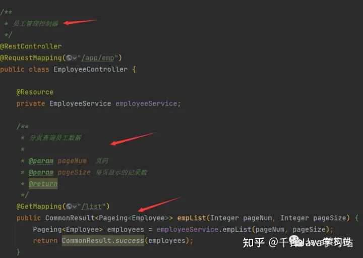

注意：我们项目中的类、方法、属性，都必须使用文档注释！

作为开发人员，一定要养成规范编写注释的好习惯。

在idea中，我们可以直接通过插件生成smart各种格式的文档，如下图所示：

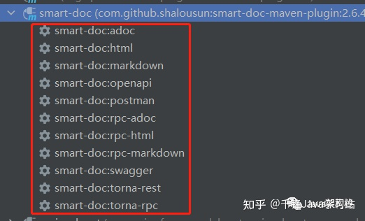

在本例中，我们双击smart-doc:html就可以生成html格式的接口文档。

生成文档后，所在目录中的内容如下：


4、文档效果演示：

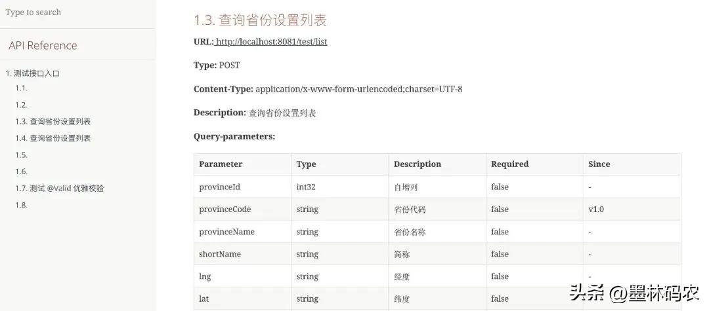

**1.1 生成文档**

根据上文的配置，默认情况下，仅是生成接口文档，配置"createDebugPage": true，双击插件的smart-doc:html选项，即可生成带接口调用功能的接口文档。怎么样，这个功能是不是相当强大？

生成带调试功能的接口文件，如下所示：


**1.2 运行测试**

此时双击debug-all.html，运行测试文档后，页面如下：

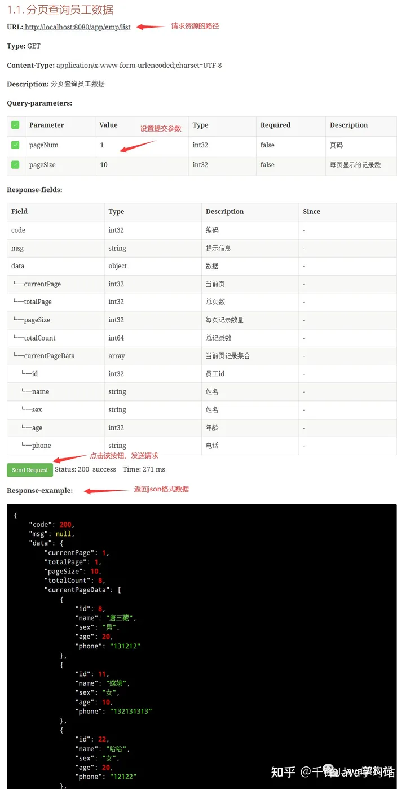

### **2. 导入ApiPost进行测试**

**2.1 生成postman格式文档**

接着我们再双击smart-doc:postman，生成一个postman格式的文档：

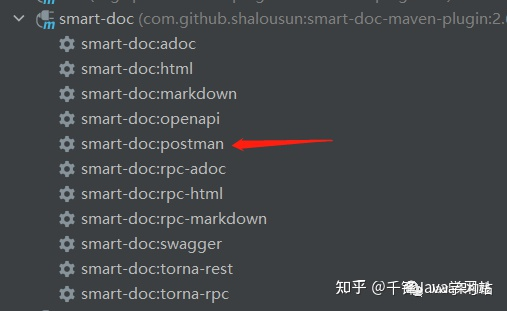

生成的postman格式文档如下所示：

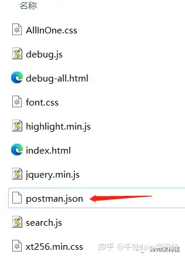

**2.2 导入文档**

我们还可以在ApiPost中导入该文档，其步骤如下：

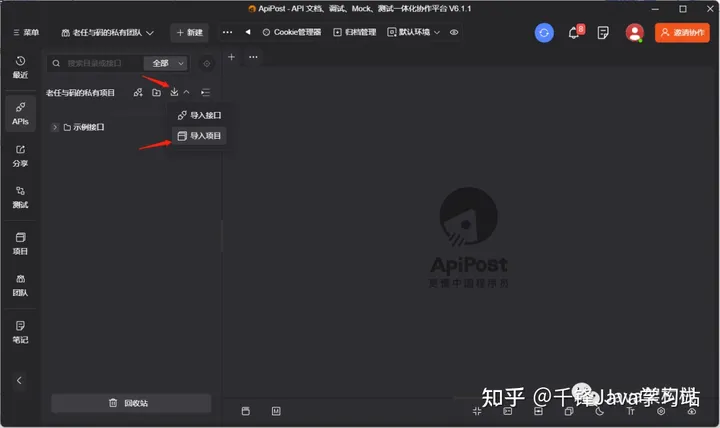

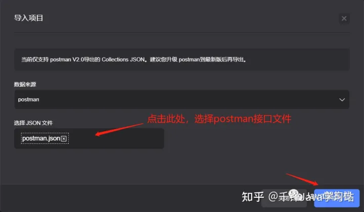

**2.3 测试接口**

导入后，我们可以切换到导入的项目，这样就可以进行接口测试了。


### 复恒科技（专家库）的配置

pom 文件的配置

```xml
   <build>
        <finalName>${image.name}</finalName>
        <plugins>
            <plugin>
                <groupId>org.springframework.boot</groupId>
                <artifactId>spring-boot-maven-plugin</artifactId>
                <configuration>
                    <excludes>
                        <exclude>
                            <groupId>org.projectlombok</groupId>
                            <artifactId>lombok</artifactId>
                        </exclude>
                    </excludes>
                </configuration>
            </plugin>

            <plugin>
                <groupId>org.apache.maven.plugins</groupId>
                <artifactId>maven-resources-plugin</artifactId>
                <executions>
                    <execution>
                        <id>copy-resources</id>
                        <phase>package</phase>
                        <goals>
                            <goal>copy-resources</goal>
                        </goals>
                        <configuration>
                            <outputDirectory>../target</outputDirectory>
                            <resources>
                                <resource>
                                    <directory>./target/</directory>
                                    <includes>
                                        <include>*.jar</include>
                                        <include>*.war</include>
                                    </includes>
                                    <filtering>false</filtering>
                                </resource>
                            </resources>
                        </configuration>
                    </execution>
                </executions>
            </plugin>

            <plugin>
                <groupId>com.github.shalousun</groupId>
                <artifactId>smart-doc-maven-plugin</artifactId>
                <version>2.6.7</version>
                <configuration>
                    <!--指定生成文档的使用的配置文件,配置文件放在自己的项目中 -->
                    <configFile>./src/main/resources/smart-doc.json</configFile>
                    <!--指定项目名称 -->
                    <projectName>专家服务</projectName>
                    <!--smart-doc实现自动分析依赖树加载第三方依赖的源码，如果一些框架依赖库加载不到导致报错，这时请使用excludes排除掉 -->
                    <excludes>
                        <!--格式为：groupId:artifactId;参考如下 -->
                        <exclude>com.alibaba:fastjson</exclude>
                    </excludes>
                    <!--自1.0.8版本开始，插件提供includes支持 -->
                    <!--smart-doc能自动分析依赖树加载所有依赖源码，原则上会影响文档构建效率，因此你可以使用includes来让插件加载你配置的组件 -->
                    <!-- <includes> 格式为：groupId:artifactId;参考如下 <include>com.alibaba:fastjson</include>
                        </includes> -->
                </configuration>
            </plugin>

            <plugin>
                <groupId>com.spotify</groupId>
                <artifactId>dockerfile-maven-plugin</artifactId>
                <version>1.4.13</version>
                <configuration>
                    <repository>registry.cn-hangzhou.aliyuncs.com/zhaotx/${project.build.finalName}</repository>
                    <tag>${image.tag}</tag>
                    <username>2490519602@qq.com</username>
                    <password>ztx@2020</password>
                    <useMavenSettingsForAuth>false</useMavenSettingsForAuth>
                    <buildArgs>
                        <JAR_FILE>${project.build.finalName}.jar</JAR_FILE>
                        <SERVICE_NAME>${project.build.finalName}</SERVICE_NAME>
                    </buildArgs>
                </configuration>
            </plugin>
        </plugins>
    </build>
```

smart-doc.json

```yaml
{
  "isStrict": false,
  "allInOne": true,
  "outPath": "./src/main/resources/static/doc",
  "coverOld": true,
  "packageFilters": "cn.zhaotx.specialist.web.controller.*",
  "md5EncryptedHtmlName": false,
  "projectName": "招采天下-专家服务API",
  "showAuthor": true,
  "requestFieldToUnderline": false,
  "responseFieldToUnderline": false,
  "inlineEnum": true,
  "recursionLimit": 5,
  "displayActualType": true,
  "ignoreRequestParams": [
    "org.springframework.ui.ModelMap"
  ],
  "openUrl": "http://192.168.1.241:30011/api",
  "appToken": "c7f91e3af4fa43c88990b910e2fed269",
  "debugEnvName": "本地环境",
  "debugEnvUrl": "http://localhost:8024",
  "tornaDebug": true,
  "replace": true,
  "revisionLogs": [
    {
      "version": "1.0",
      "status": "update",
      "author": "杨金智",
      "remarks": "专家服务API"
    }
  ],
  "dataDictionaries": [
  	{
  		"enumClassName": "cn.zhaotx.specialist.common.enums.IIntEnum",	
  		"codeField": "code",
  		"descField": "desc"
  	}
  
  ],
  "customResponseFields": [
    {
      "name": "code",
      "desc": "响应代码",
      "ownerClassName": "org.springframework.data.domain.Pageable",
      "value": "00000"
    }
  ],
  "requestHeaders": [
    {
      "name": "token",
      "type": "string",
      "desc": "token, 登录时返回",
      "required": false,
      "value": "55",
      "since": "-"
    }
  ]
}
```


## 结语

目前市面上的文档工具有很多，如 swagger、knife4j、apidoc，在功能体验和实际使用中都各有千秋。

相比较来说 smart-doc 以其最小的代码侵入性、与代码实时同步更新、前期工作量最低、可单独生成单独部署等优点，在众多文档工具中脱颖而出，目前很多大厂也都在使用，如小米、科大讯飞等，无论你是有经验的大佬、还是刚入行的萌新，都能轻松上手。有需要的宝子不要错过~

