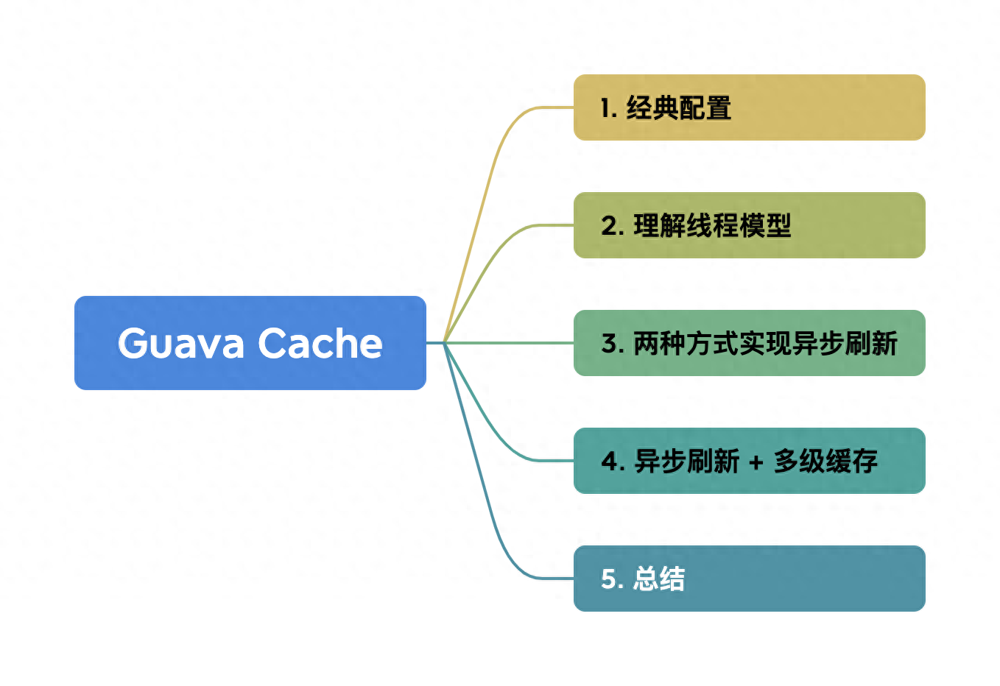
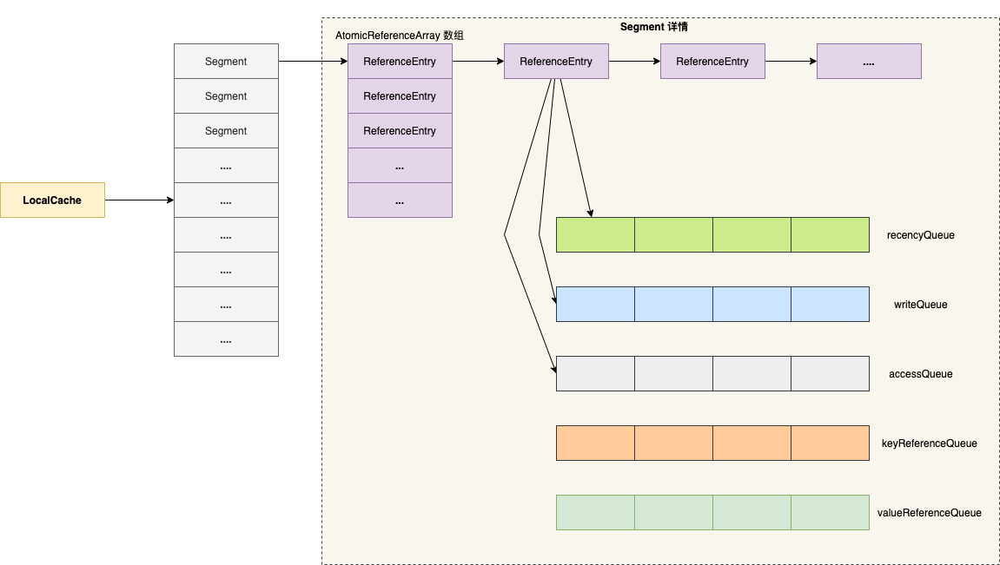
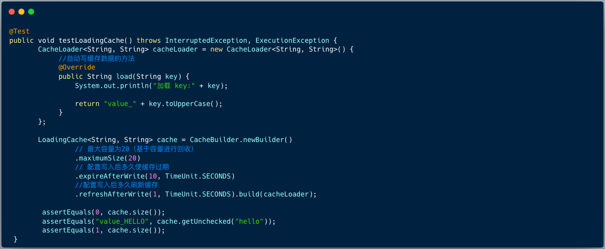
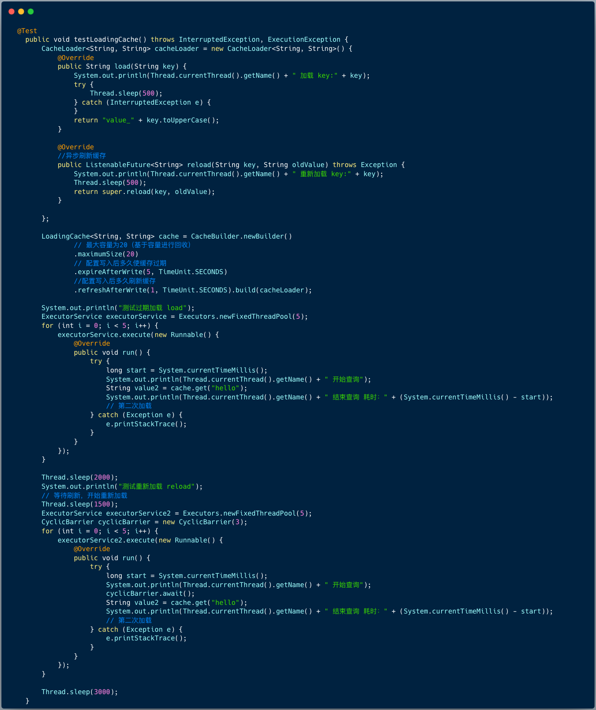
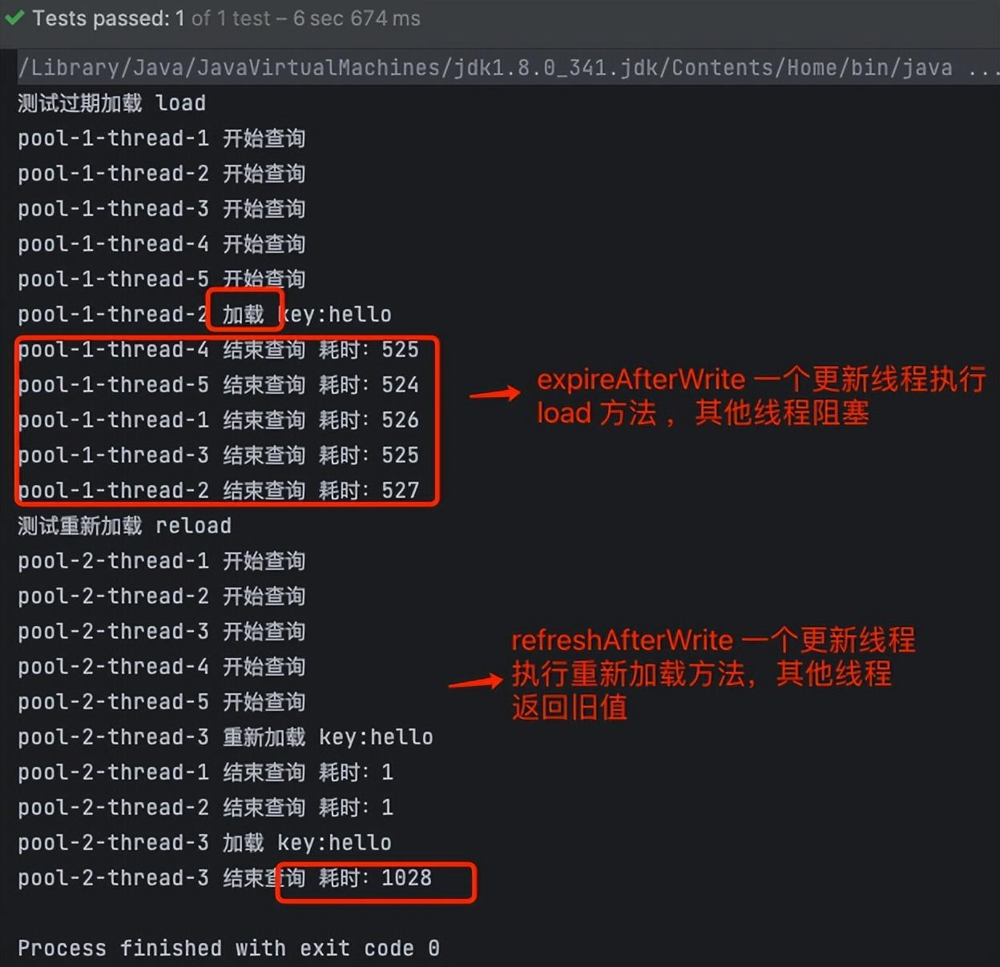
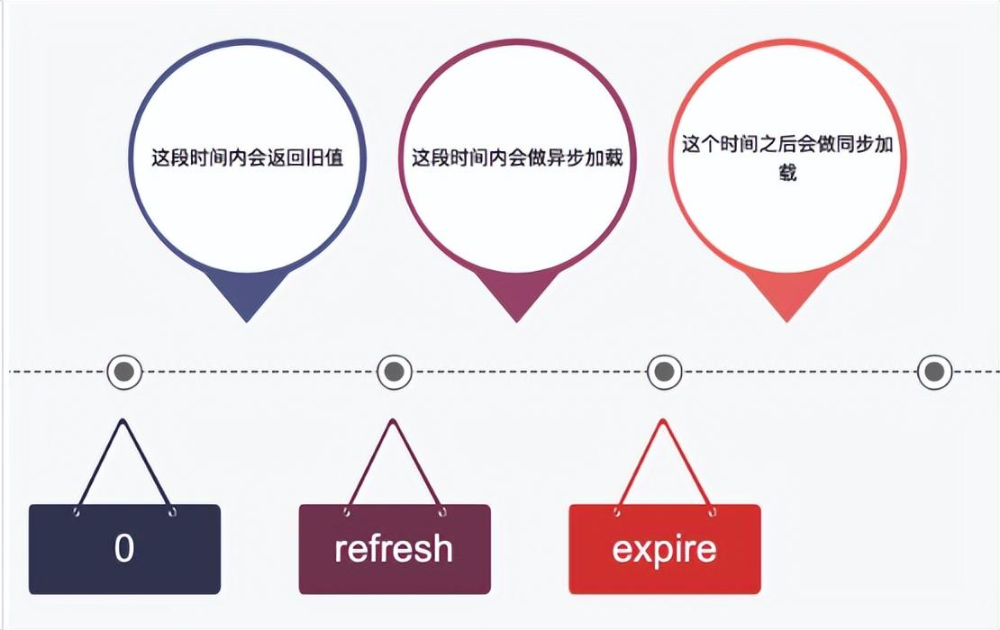
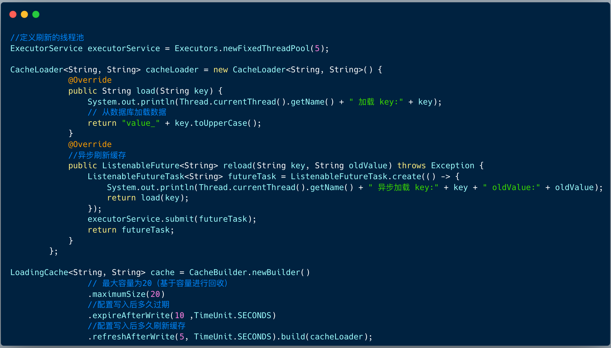
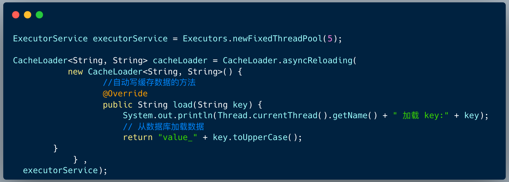

资料来源： 
[Guava Cache 异步刷新技巧，你值得拥有!](https://www.toutiao.com/article/7320068289441432127/?app=news_article&timestamp=1704372872&use_new_style=1&req_id=20240104205432ACC675F93BB3F30D6C23&group_id=7320068289441432127&wxshare_count=1&tt_from=weixin&utm_source=weixin&utm_medium=toutiao_android&utm_campaign=client_share&share_token=eab95dbc-6751-431f-ad2b-e871605333bf&source=m_redirect) 

## 异步刷新技巧，你值得拥有!

Guava Cache是一款非常优秀的本地缓存框架。

这篇文章，我们聊聊如何使用 Guava Cache **异步刷新技巧**带飞系统性能 。

### 1 经典配置

Guava Cache 的数据结构跟 JDK1.7 的 ConcurrentHashMap 类似，提供了基于时间、容量、引用三种回收策略，以及自动加载、访问统计等功能。

首先，我们温习下 Gauva Cache 的经典配置 。

例子中，缓存最大容量设置为 100 （**基于容量进行回收**），配置了**失效策略**和**刷新策略**。

**1、失效策略**

配置 expireAfterWrite 后，缓存项在被创建或最后一次更新后的指定时间内会过期。

**2、刷新策略**

配置 refreshAfterWrite 设置刷新时间，当缓存项过期的同时可以重新加载新值 。

这个例子里，有的同学可能会有疑问：**为什么需要配置刷新策略，只配置失效策略不就可以吗**？

当然是可以的，但在高并发场景下，配置刷新策略会有奇效，接下来，我们会写一个测试用例，方便大家理解 Gauva Cache 的线程模型。

### 2 理解线程模型

我们模拟在多线程场景下，「缓存过期执行 load 方法」和「刷新执行 reload 方法」两者的运行情况。

执行结果见下图：

执行结果表明：**Guava Cache 并没有后台任务线程异步的执行 load 或者 reload 方法。**

1. **失效策略**：expireAfterWrite 允许一个线程执行 load 方法，其他线程阻塞等待 。
2. 当大量线程用相同的 key 获取缓存值时，只会有一个线程进入 load 方法，而其他线程则等待，直到缓存值被生成。这样也就避免了缓存击穿的危险。高并发场景下 ，这样还是会阻塞大量线程。
3. **刷新策略**：refreshAfterWrite 允许一个线程执行 load 方法，其他线程返回旧的值。
4. 单个 key 并发下，使用 refreshAfterWrite ，虽然不会阻塞了，但是如果恰巧同时多个 key 同时过期，还是会给数据库造成压力。

为了提升系统性能，我们可以从如下两个方面来优化 ：

1. 配置 refresh < expire ，减少大量线程阻塞的概率；
2. 采用**异步刷新**的策略，也就是**线程异步加载数据，期间所有请求返回旧的缓存值**，防止缓存雪崩。

下图展示优化方案的时间轴 ：

### 3 两种方式实现异步刷新

#### 3.1 重写 reload 方法

#### 3.2 实现 asyncReloading 方法

不管使用哪种方案， 都需要定义单独的线程池来执行刷新任务 。

#### 4 异步刷新 + 多级缓存

2018 年，笔者服务的一家电商公司需要进行 app 首页接口的性能优化。笔者花了大概两天的时间完成了整个方案，采取的是两级缓存模式，同时采用了 Guava 的异步刷新机制。

整体架构如下图所示：

缓存读取流程如下 ：

1、业务网关刚启动时，本地缓存没有数据，读取 Redis 缓存，如果 Redis 缓存也没数据，则通过 RPC 调用导购服务读取数据，然后再将数据写入本地缓存和 Redis 中；若 Redis 缓存不为空，则将缓存数据写入本地缓存中。

2、由于步骤1已经对本地缓存预热，后续请求直接读取本地缓存，返回给用户端。

3、Guava 配置了 refresh 机制，每隔一段时间会调用自定义 LoadingCache 线程池（5个最大线程，5个核心线程）去导购服务同步数据到本地缓存和 Redis 中。

优化后，性能表现很好，平均耗时在 5ms 左右，同时大幅度的减少应用 GC 的频率。

该方案依然有瑕疵，一天晚上我们发现 app 端首页显示的数据时而相同，时而不同。

也就是说： 虽然 LoadingCache 线程一直在调用接口更新缓存信息，但是各个服务器本地缓存中的数据并非完成一致。

这说明了两个很重要的点：

1、惰性加载仍然可能造成多台机器的数据不一致；

2、LoadingCache 线程池数量配置的不太合理, 导致了任务堆积。

最终，我们的解决方案是：

1、异步刷新结合消息机制来更新缓存数据，也就是：当导购服务的配置发生变化时，通知业务网关重新拉取数据，更新缓存。

2、适当调大 LoadingCache 的线程池参数，并在线程池埋点，监控线程池的使用情况，当线程繁忙时能发出告警，然后动态修改线程池参数。

### 5 总结

Guava Cache 非常强大，它并没有后台任务线程异步的执行 load 或者 reload 方法，而是通过请求线程来执行相关操作。

为了提升系统性能，我们可以从如下两个方面来处理 ：

1. 配置 refresh < expire，减少大量线程阻塞的概率。
2. 采用**异步刷新**的策略，也就是**线程异步加载数据，期间所有请求返回旧的缓存值**。

笔者曾经优化过某电商网站的首页接口，使用的方案是： Guava 的异步刷新机制 + 多级缓存 ，取得了非常好的优化效果。

尽管如此，我们在使用这种方式时，依然需要考虑缓存和数据库的一致性问题。

------

参考资料：

> https://albenw.github.io/posts/df42dc84/