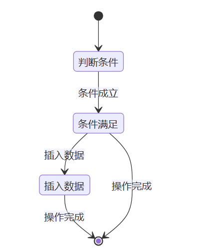
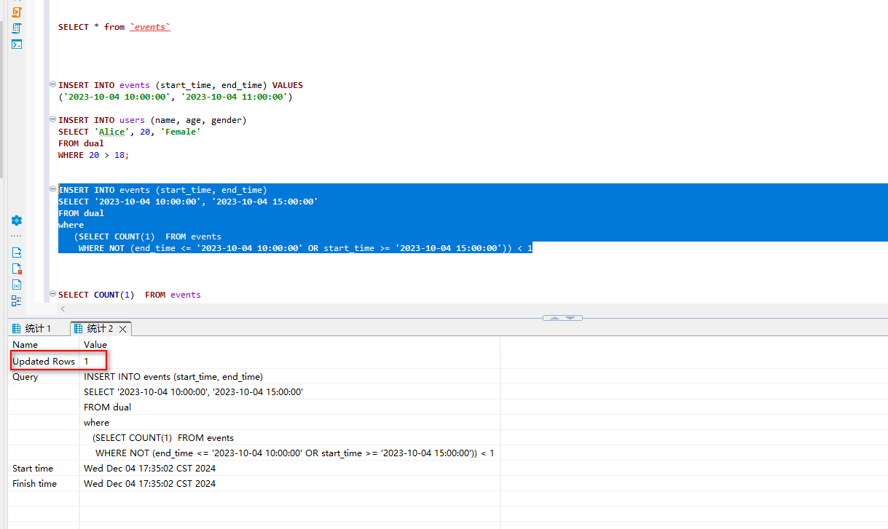
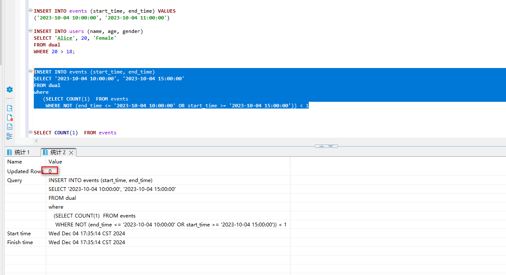

资料来源：<br/>
[MySQL起始时间与结束时间不交集](https://blog.51cto.com/u_16175468/11689094)<br/>
[mysql 根据条件插入](https://blog.51cto.com/u_16175468/10575376)<br/>

## MySQL起始时间与结束时间不交集

说明

> 在开发中遇到了一个问题，在选择一个专家以后，需要判断这个专家是否在这个时间段内有空闲。如果是空闲的，写入一条数据。由于存在并发问题，如何保证同一个时间段不能出现重复的数据

流程概述
下面是实现该功能的步骤：

| 步骤 | 描述                         |
| ---- | ---------------------------- |
| 1    | 创建一个时间表               |
| 2    | 使用 SELECT 语句查询重叠数据 |
| 3    | 检查是否有重叠，避免数据插入 |
| 4    | 检查是否有重叠，避免数据插入 |

详细步骤
**步骤 1: 创建时间表**
首先，我们需要创建一个表来存储时间区间。假设我们需要记录事件的开始和结束时间。

```sql
CREATE TABLE events (
    id INT AUTO_INCREMENT PRIMARY KEY,
    start_time DATETIME NOT NULL,
    end_time DATETIME NOT NULL,
    CHECK (start_time < end_time)  -- 确保开始时间小于结束时间
);
```

在这段代码中：

>CREATE TABLE events 是创建表的标准 SQL 语法。
>start_time 和 end_time 是我们的时间字段，使用 DATETIME 类型来存储时间数据。
>CHECK 约束确保开始时间必须早于结束时间，这样可以避免逻辑错误。

**步骤 2: 插入测试数据**

每条 INSERT 语句向 events 表中插入一条新记录。

```
INSERT INTO events (start_time, end_time) VALUES
('2023-10-01 10:00:00', '2023-10-01 11:00:00'),
('2023-10-01 11:30:00', '2023-10-01 12:30:00'),
('2023-10-01 13:00:00', '2023-10-01 14:00:00');
```

**步骤 3: 查询重叠数据**

为了演示如何检查时间不重叠，我们可以插入一些测试数据。

```sql
SELECT *
FROM events
WHERE (start_time, end_time) OVERLAPS (NEW_START_TIME, NEW_END_TIME);
```

在这里：

NEW_START_TIME 和 NEW_END_TIME 是我们想要检查的新时间区间。
OVERLAPS 关键字用于检查两个时间区间是否有重叠。
注意：上面的 SQL 语法在某些版本的 MySQL 中可能不直接支持。可以使用逻辑条件代替，示例如下：

```sql
SELECT *
FROM events
WHERE NOT (end_time <= NEW_START_TIME OR start_time >= NEW_END_TIME);
```

**步骤 4: 检查是否有重叠，避免数据插入**

```sql
INSERT INTO events (start_time, end_time) 
SELECT '2023-10-04 10:00:00', '2023-10-04 15:00:00'
FROM dual
where 
   (SELECT COUNT(1)  FROM events
    WHERE NOT (end_time <= '2023-10-04 10:00:00' OR start_time >= '2023-10-04 15:00:00')) < 1
	
```

这段代码的逻辑是：

如果查询结果的计数为 0，表示没有重叠，可以插入新事件；



在状态图中，我们首先对条件进行判断，如果条件成立，则插入数据并操作完成；如果条件不成立，则直接操作完成。




第二次运行



**总结**

在本文中，我们详细讨论了如何在 MySQL 中实现时间区间不重叠。通过创建表、插入数据、查询重叠情况以及条件插入，我们能确保在存储事件时不发生时间重叠的问题。

这套流程既简单又有效，可以帮助新手开发者快速掌握时间管理的技巧。在实际应用中，多加练习，将会培养出敏锐的观察力与判断力，使得你在未来的开发中更加得心应手！